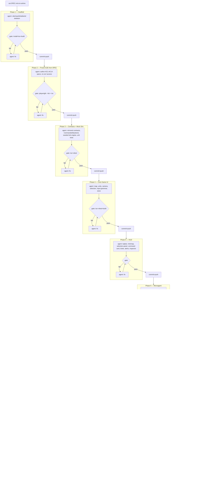

# agent-commander-rts — flow

```mermaid
flowchart TD
    SPEC[cat SPEC.md at runtime] --> P1

    subgraph P1[Phase 1 — Scaffold]
      A1[agent: vite/react/ts/tailwind skeleton] --> G1{gate: install+tsc+build}
      G1 -- fail --> F1[agent: fix] --> G1
    end
    G1 -- pass --> C1[commit+push] --> P2

    subgraph P2[Phase 2 — Frozen E2E from SPEC]
      A2[agent: author AC1-AC14 specs, no src/ access] --> G2{gate: playwright --list + tsc}
      G2 -- fail --> F2[agent: fix] --> G2
    end
    G2 -- pass --> C2[commit+push] --> P3

    subgraph P3[Phase 3 — Contracts + Mock Sim]
      A3[agent: mirrored contracts, CommanderBackend, seeded tick engine, unit tests] --> G3{gate: tsc+vitest}
      G3 -- fail --> F3[agent: fix] --> G3
    end
    G3 -- pass --> C3[commit+push] --> P4

    subgraph P4[Phase 4 — Core Game UI]
      A4[agent: map, units, camera, selection, input grammar, store] --> G4{gate: tsc+vitest+build}
      G4 -- fail --> F4[agent: fix] --> G4
    end
    G4 -- pass --> C4[commit+push] --> P5

    subgraph P5[Phase 5 — HUD]
      A5[agent: topbar, minimap, selection panel, command card, ticker, alerts, inspector] --> G5{gate}
      G5 -- fail --> F5[agent: fix] --> G5
    end
    G5 -- pass --> C5[commit+push] --> P6

    subgraph P6[Phase 6 — Microagent]
      A6[agent: contextual commands + procedural friendly icons + tests] --> G6{gate}
      G6 -- fail --> F6[agent: fix] --> G6
    end
    G6 -- pass --> C6[commit+push] --> P7

    subgraph P7[Phase 7 — E2E Convergence ≤5]
      E7{playwright test} -- fail --> X7[agent: fix app to frozen specs] --> E7
    end
    E7 -- pass --> C7[commit+push] --> P8

    subgraph P8[Phase 8 — Design Polish ≤3]
      R8[agent: screenshot + score vs rubric] --> D8{score ≥ 85?}
      D8 -- no --> Z8[agent: apply findings] --> RG8{regression gate} --> R8
    end
    D8 -- yes --> C8[commit+push] --> P9

    subgraph P9[Phase 9 — Docs + Final]
      A9[agent: README + integration guide] --> G9{final full gate}
      G9 -- fail --> F9[agent: fix] --> G9
    end
    G9 -- pass --> C9[commit+push] --> DONE([RUN_COMPLETED])
```
