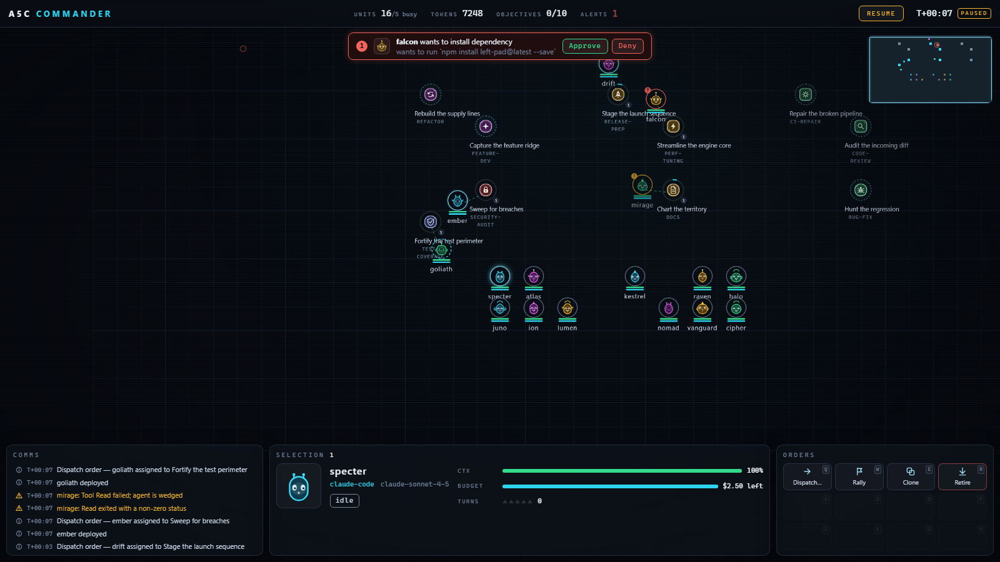

# A5C Commander

An RTS-style command deck for orchestrating fleets of AI agents. Agent sessions are **units** on a living battlefield; tasks are **objectives** they capture. You select units with click/marquee, issue orders by right-clicking objectives, read the fleet's pulse from a StarCraft-grade HUD (resource bar, minimap, event ticker, selection panel, contextual command card), and answer approval requests like incoming-attack alerts. v1 runs entirely on a fully mocked, seeded, deterministic backend — but every frame it speaks is a faithful mirror of the real `@a5c-ai/adapters-gateway` WebSocket protocol, so the mock swaps for the real gateway without touching a single UI component.



## Quickstart

```bash
cd apps/commander
npm install
npm run dev          # Vite dev server on http://localhost:5199 (strictPort)
```

| Command | What it does |
|---|---|
| `npm run dev` | Dev server on port 5199 |
| `npm run build` | `tsc --noEmit` + `vite build` |
| `npm run preview` | Serve the production build (also port 5199) |
| `npm run typecheck` | TypeScript strict check, no emit |
| `npm run test` | Vitest unit tests (`src/**/*.test.{ts,tsx}`) |
| `npm run test:e2e` | Playwright e2e (chromium; auto-starts the dev server) |

One-time before e2e: `npx playwright install chromium`.

URL param: `?seed=<n>` seeds the simulation PRNG (mulberry32). Default seed is `42`. Same seed, same world.

## Concept mapping

| RTS concept | Orchestration concept | Backing contract |
|---|---|---|
| Unit | Agent session (live or idle) | `SessionEntry` + `RunEntry` (gateway) |
| Unit class / faction | Agent adapter (claude-code, codex, gemini-cli, pi, ...) | `agent: AgentName` |
| Health bar | Context-window headroom % | token usage aggregate (200k window assumed) |
| Energy / mana | Token budget remaining (USD) | `cost: CostRecord` |
| XP / rank chevrons | Turn count | `turnCount` |
| Objective (map node) | Task / dispatch | `CommanderTask` (kradle `AgentDispatchRun`-shaped) |
| Move / attack order | Dispatching a session to a task | `session.start` / `session.message` `ClientFrame` |
| "Under attack" alert | Pending approval / hook request | `hook.request` frame |
| Minimap | Workspace overview | client-side layout |
| Resources (top bar) | active/busy units, tokens burned, tasks done/total, pending alerts | derived |
| Control groups (Ctrl+1-9) | Saved selections | UI state |
| Game clock | Sim time | sim state |

Unit visual states: `idle`, `dispatching`, `thinking`, `tool_running`, `awaiting_approval`, `blocked`, `completed`, `failed`. Task states: `queued → assigned → in_progress → review → done | failed`.

## Controls

### Mouse

| Input | Action |
|---|---|
| Left-click unit/task | Select (clears previous selection) |
| Shift+click | Add/remove from selection |
| Drag on empty ground | Marquee-select units inside the rect |
| Right-click task node (units selected) | Dispatch order — units move to the objective |
| Right-click empty ground (units selected) | Rally / reposition |
| Double-click unit | Open the Inspector (live transcript) |
| Mouse wheel | Zoom toward cursor (clamped) |
| Middle-drag or Space+drag | Pan the camera |
| Minimap click | Jump camera |

### Keyboard

| Input | Action |
|---|---|
| `W A S D` / arrow keys | Pan camera (arrows always pan; WASD pans when nothing is selected) |
| `Esc` | Cascade: close steer modal → close inspector → cancel targeting mode → clear selection |
| `Space` (tap) | Jump camera to the most recent alert |
| `F` | Cycle through idle units |
| `Ctrl+1..9` | Assign control group |
| `1..9` | Recall control group; recalling the already-active group centers the camera on it |
| `Q W E R / A S D F / Z X C V` | Command card hotkeys, row-major onto the 3x4 grid |

Hotkey collisions (`W/A/S/D` pan, `F` idle-cycle vs. command cells) are settled by a pure mode arbiter in `src/game/commands.ts`: with a non-empty selection the command card wins the letter; with an empty selection the camera/idle duties keep it. Arrow keys always pan, so keyboard-only operation never loses the camera.

## Architecture

```
src/
  contracts/    Mirrored wire types — adapter-events.ts (@a5c-ai/comm-adapter events),
                gateway-protocol.ts (gateway WS protocol v1 + REST entries),
                kradle-resources.ts (kradle CRDs; CommanderTask = AgentDispatchRun shape)
  backend/      CommanderBackend interface (types.ts) + mock/ — seeded PRNG,
                scenario seeding, tick-driven Simulation, MockBackend transport
  microagent/   Microagent interface (contextual CommandSpecs + deterministic
                procedural IconSpecs) + rule-based mock implementation
  game/         Zustand store (single store, slices), camera math, world layout,
                input grammar (input.ts), command/hotkey arbiter (commands.ts)
  components/   WarRoom shell, map/ (viewport, sprites, task nodes, links, marquee,
                pings), hud/ (top bar, minimap, selection panel, command card,
                ticker, alert banner), panels/ (inspector, steer modal)
```

Data flow: the `MockBackend` wraps a deterministic `Simulation` ticking every 250 ms. Each tick emits `ServerFrame`s (`run.event` frames carrying mirrored adapter events — `session_start`, `text_delta`, `tool_call_start`, `turn_end`, ... — plus `hook.request` approvals). `bindBackendToStore` buffers the frames and flushes them together with the sim views in **one store commit per tick batch**; React re-renders from that single commit. No `Date.now()`, no `Math.random()` — the sim clock and one seeded PRNG are the only sources of time and chance.

### Swapping the mock for the real adapter-gateway

The UI talks only to the `CommanderBackend` interface (`src/backend/types.ts`). To go live: implement it over a WebSocket speaking gateway protocol v1 — the `ClientFrame`/`ServerFrame` unions in `src/contracts/gateway-protocol.ts` mirror `@a5c-ai/adapters-gateway` `protocol/v1.ts` exactly, and `listAgents/listSessions/listRuns` map to the gateway REST surface (`GET /api/v1/agents|sessions|runs`). Point the `Microagent` interface (`src/microagent/types.ts`) at a real LLM-backed generator for commands and icons. UI code does not change.

Mock command conventions (what the sim understands today):

- **Dispatch**: `session.start` with the `sessionId` of an idle unit and a prompt containing `task:<taskId>`. Without `sessionId`, it clones a fresh unit for `agent`.
- **Abort**: `session.message` whose prompt is `/abort` (or `/stop`) — protocol v1 has no WS abort frame; the real gateway aborts via REST.
- **Steer**: any other `session.message` prompt (resumes a blocked unit, starts a run on an idle one).
- **Approvals**: `hook.decision` with `allow`/`deny` resolves the matching `hook.request`.

## Test hooks API

Exposed on `window.__commander` (before `connect()`, so a pause-on-boot poller can halt the sim ahead of the first auto-tick):

```ts
window.__commander = {
  sim: { pause(), resume(), tick(n), seed },  // drive sim time manually
  store,                                       // the Zustand store (getState())
  version,                                     // COMMANDER_VERSION
};
```

`data-testid` contract: `unit-<id>`, `task-<id>`, `cmd-<commandId>`, `minimap`, `ticker-item`, `selection-panel`, `alert-banner`, `topbar-*` (`units`, `tokens`, `tasks`, `alerts`, `sim-toggle`, `clock`), `inspector` — plus `map-viewport`, `event-ticker`, `command-card`, `steer-modal`, `link-layer`, `selection-box`, `war-room`.

Determinism guarantees (unit-tested in `src/backend/mock/__tests__/determinism.test.ts`): same seed ⇒ identical scenario, identical frame streams, deep-equal snapshots after 200 ticks; same seed + same command sequence ⇒ identical state; `tick(20)` twice equals `tick(40)` once; pause blocks auto-ticking while manual `tick()` still advances. E2E tests ride this: boot `/?seed=42`, pause, advance with `tick(n)` — no timing-based waits.

## Workspace note

This app lives in `apps/` and is deliberately **not** part of the root npm workspaces (the root glob is `packages/*`). It carries its own `package-lock.json` so the root `npm ci` is untouched. Run all npm commands from `apps/commander/`; never run `npm install` at the repo root. When the real gateway backend is wired in (and this stops being a standalone mock), the graduation path is a move into `packages/*` as a proper workspace member importing `@a5c-ai/adapters-gateway` by name.
