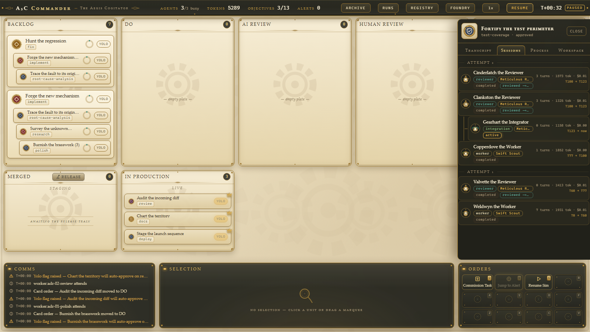

# A5C Commander — The Aegis Cogitator

A steampunk **kanban board** for orchestrating fleets of AI agents. Tasks are brass-framed parchment cards moving across seven lanes — **Backlog → Do → AI Review → Human Review → Approved → Merged → In Production** — with subtask stacks fanned beneath their parents. You drag a card into DO and a clockwork-creature worker agent materializes on it (agents spawn on demand and despawn when their card moves on; there is no idle fleet). Work completes and the card **auto-glides** to AI Review with a FLIP-style animation; reviewers spawn, render a verdict, and the card either bounces back to DO with feedback, lands in HUMAN REVIEW for you, or — if its **yolo toggle** is on — skips you entirely and routes straight to APPROVED, where an integration agent visibly rebases and merges it. Integration done, the card auto-moves to **MERGED** (the change is live on **staging**) and the **release rail** takes over: the brass **Release lever** in the Merged lane header ships every merged card to **IN PRODUCTION** as one release train; `Revert` sends a merged card back to DO for another iteration, `Rollback` pulls an in-production card back to staging. Agents ask questions through the **Inquiry Dock**, a chat-like stack of multi-option breakpoint bubbles (each option an engraved icon + caption). Human review happens in a side **diff panel** (changed files, verdigris/garnet inline diffs, reviewer notes, Approve All / Request Changes) — or in a full **web IDE** overlay. An **Archive** overlay visualizes the shared memory graph the agents query and write back to, now with zoom, pan, and search. Since v5, despawn no longer erases anything: every agent session's transcript **persists** (the Inspector's **Sessions** tab is the forensics surface), and a **Registry** ledger separates the entity kinds kradle-style — stack templates vs the sessions, tasks, and workspaces that execute against them. v5 runs entirely on a mocked, seeded, deterministic backend — but every frame mirrors the real gateway/kradle/babysitter contracts, so the mock swaps for a live backend without touching UI code. (The free-roam RTS map of v1 is gone; the board superseded it.)



## Quickstart

```bash
cd apps/commander
npm install
npm run dev          # Vite dev server on http://localhost:5199 (strictPort)
```

| Command | What it does |
|---|---|
| `npm run dev` | Dev server on port 5199 |
| `npm run build` | `tsc --noEmit` + `vite build` |
| `npm run preview` | Serve the production build |
| `npm run typecheck` | TypeScript strict check, no emit |
| `npm run test` | Vitest unit tests (`vitest run`) |
| `npm run test:e2e` | Playwright e2e (chromium; auto-starts the dev server) |

One-time before e2e: `npx playwright install chromium`.

URL param: `?seed=<n>` seeds the simulation PRNG (mulberry32). Default seed is `42`. Same seed, same board.

## Concept mapping

| Kanban concept | Orchestration concept | Backing contract |
|---|---|---|
| Card | Task / dispatch | `CommanderTask` (kradle `AgentDispatchRun`-shaped, `src/contracts/kradle-resources.ts`) |
| Subtask stack | Task hierarchy | `metadata.labels['kradle.a5c.ai/parent-task']` linkage |
| Column | Task lifecycle stage | board column ids `backlog`/`do`/`ai-review`/`human-review`/`approved`/`merged`/`in-production` (`src/game/board.ts`) |
| Merged / In Production lanes | **Staging / production write-back targets** | kradle `AgentStack.spec.writeBackPolicy` — `WriteBackPolicy.allowedTargets` (`src/contracts/kradle-workspace.ts`) |
| Agent avatar on a card | Agent session, spawned on demand | `SessionEntry` + `RunEntry`, `session.start` / `session.message` `ClientFrame`s (gateway protocol v1) |
| Agent stack (Foundry Stacks tab) | Kradle agent template with a personality | `AgentStack` spec — `baseAgent`/`adapter`/`model`/`approvalMode` + `prompt.system` personality (`src/contracts/kradle-stack.ts`) |
| Card auto-move | Run lifecycle transition | sim-driven; rendered via FLIP animation with `is-moving` class |
| Release lever / Revert / Rollback | Release-train promotion, staging revert, production rollback | sim verbs `release` / `revertCard` / `rollbackCard` (sim-local; see protocol gaps below) |
| Yolo toggle | Skip-human-review routing | sim verb `setYolo` (sim-local; see protocol gaps below) |
| Inquiry Dock bubble | Breakpoint / hook request with options | `hook.request` frame with `InquiryPayload` (question + 2–5 options); answered via `hook.decision` + `optionId` |
| Human-review panel / web IDE | Write-back change approval | `AgentApproval` + patch artifact (`PatchArtifact` shapes, `src/contracts/kradle-workspace.ts`) |
| Archive overlay (`M`) | Shared agent memory ("the Company Brain") | kradle memory resources: `AgentMemoryRepository`/`AgentMemorySource`/`AgentMemoryQuery`/`AgentMemoryUpdate` + ontology graph records (`src/contracts/kradle-memory.ts`) |
| Runs ledger / Inspector Process tab | Babysitter run observation | `JournalEvent` envelope, event-type union, `ObservedRunState`, `pendingEffectsByKind` (`src/contracts/babysitter-run.ts`) |
| Process template (Processes tab) | Babysitter process definition with revisions | per-taskKind phase pipeline `commander/<kind>@vN`; each run pins its `processRevision` |
| Persistent session (Sessions tab) | Durable agent-session execution record + transcript, surviving despawn | adapters `SessionEntry`/session family (gateway protocol v1, `src/contracts/gateway-protocol.ts`) / kradle `AgentSession`; mirrored as `SimSessionView`/`SimSessionDetailView` (`src/backend/mock/simulation.ts`) |
| Registry overlay | kradle config-vs-execution resource split | config: `AgentStack` (`src/contracts/kradle-stack.ts`) — execution: `AgentSession` (sessions) + `AgentDispatchRun` (tasks, `src/contracts/kradle-resources.ts`) + workspaces |

Task kinds map to worker **stacks** (one per adapter family): implement/fix/migrate → claude-code, review → codex, root-cause-analysis/test-coverage → pi, docs/research → gemini-cli, polish/deploy → codex. Reviewer agents always use a different adapter than the worker. A card's `stackRef` (editable in the card editor) overrides the kind mapping.

## v4 features

### Release rail (Merged / In Production)

Approved is no longer terminal: when integration completes, the card auto-moves to **Merged** carrying its seal — the change is live on staging. The Merged lane header holds the **Release lever** (`col-release`, enabled when the lane is non-empty): pulling it ships ALL merged cards to **In Production** as one staggered release train with a deterministic release id (`rel-NN`). A merged card offers **Revert** (back to DO with a `reverted` feedback event and a fresh worker); an in-production card offers **Rollback** (back to Merged/staging). In-production cards are otherwise terminal and compact to slim crown-sealed rows after 30 ticks.

### Card editor + agent stacks

**Edit Card** (contextual command on any non-merged/non-in-production card, or the edit affordance in the SelectionPanel) opens a parchment form (`card-editor`): title, kind, description, yolo, parent task (legal only in backlog), workspace, and **agent stack**. Saving applies via sim verb `updateTask` (`task_updated` event). The Foundry gains a **Stacks** tab (`foundry-stacks`): 4 seeded stacks (one per adapter family, each with a distinct `prompt.system` personality — kradle `AgentStack` mirrors) plus your forged ones. **Forge From** clones any stack as a template ("create agents from agents"); edit name/adapter/model/approvalMode and the system/developer personality prompts, save via `upsertStack` (`stack_forged` event, deterministic `stk-cNN` ids). New stacks appear in the card editor's stack select and are honored on the next spawn; agent portraits derive from stack identity.

### Runs ledger + process template editor

The TopBar **Runs** button (`topbar-runs`) opens a full-screen parchment ledger (`runs-overlay`): every run (one per card attempt) with runId, card, kind, processId, `ObservedRunState` badge, phase progress, pending effects, tokens/cost, timestamps. Clicking a row opens **run detail** (`run-detail`): phase pipeline, `pendingEffectsByKind`, and the auto-following journal — the Inspector Process tab, promoted and shared. The **Processes** tab (`process-library`) lists the per-taskKind phase templates (`commander/<kind>@vN`); the editor (`process-editor`) renames/adds/removes/reorders phases (≥2 enforced). Saving bumps the template revision (`process_updated`) and **binds future runs only** — running runs keep their pinned `processRevision`.

### Terminal tab

The **Terminal** contextual command opens a new Inspector tab (`inspector-tab-terminal`): a cogitator terminal plate (dark slate, amber mono, block cursor) bound to the card's workspace. A deterministic shell over sim state — no real exec: `help`, `pwd`, `ls [dir]`, `cat <path>`, `git status`, `git diff [path]`, `git log`, `npm test` (replays test evidence), `clear`; ArrowUp history. Unknown commands answer in character ("the cogitator does not know this incantation"). Testids: `terminal-input`, `terminal-output`.

### Memory I/O tab

Inspector tab (`inspector-tab-memory`) for agents/cards: two ledger sections — **Read** (pieces obtained via memory queries: record id, kind badge, silo, tick) and **Written** (memory-update proposals: changes, target silo, phase) — each a mini graph strip (nodes + `<path>` edges, reusing archive visuals) plus rows. Clicking a piece deep-links into the Archive focused on that node.

### Archive navigation

The Archive overlay (`M`) is now navigable: **wheel zoom** (clamped 0.5–2.5, toward the cursor) + **drag pan** on the canvas, a **search box** (`memory-search`) filtering/highlighting nodes by title/id with a match count, silo-clustered layout with on-canvas captions, node labels at zoom ≥1 (always on hover), edge decluttering at low zoom, and a reset-view button. Layout stays seed-deterministic; zoom/pan are view-only.

### Web IDE

**Open in IDE** (`review-open-ide` in the review panel, or a contextual command on human-review/do cards) opens a full-screen IDE overlay (`ide-overlay`): a collapsible **explorer** (`ide-explorer`) over the workspace tree with A/M/D change badges, a **multi-tab editor** (`ide-tab-<sanitized-path>`, close buttons, dirty dots), hand-rolled regex **syntax highlighting** for ts/tsx/js/json/css/md (token spans behind a transparent textarea — no new deps), engraved line numbers, current-line tint. **Ghost completion**: after ~400 ms idle with the caret at line end, the mock microagent's `Microagent.suggestCompletion(context)` renders inline ghost text (`ide-ghost`); **Tab accepts** (writes through `writeFile`, diff plates update), Esc dismisses, typing re-triggers. Edits are session-local.

### Sim speed control

Default auto-tick interval is **800 ms** (slowed from v3's 250 ms; lifecycle phases roughly doubled so a card takes ~1.5–3 sim-minutes through DO). The TopBar **speed control** (`topbar-speed`) cycles **0.5× / 1× / 2×** (interval 1600/800/400 ms, label shows current). Speed affects real-time pacing only — `tick(n)` semantics and determinism are untouched, and `setSpeed` is deliberately not journaled.

## Session forensics (v5)

Before v5 an agent's transcript died with its despawn. Now every spawned agent mints a **session record that persists** (mirroring the adapters `SessionEntry` family and kradle's `AgentSession`): id (= the agent's unitId), title (creature name + role), adapter/model, stack ref + name, role (worker/reviewer/integration), task, attempt, run, status (`active`/`completed`/`aborted`), started/ended ticks, turn/message counts, tokens, cost — plus the full transcript (messages, thinking, tool calls; the active agent streams straight into the persistent ring, capped at 200 entries per session, `SESSION_TRANSCRIPT_CAP`). Despawn merely flips the status.

**Sessions are nested.** Three deterministic subsession links: (a) a stack parent card records a lightweight **coordination session** per attempt (titled "&lt;name&gt; the Coordinator") that logs child assignment/completion, and each child-card worker session carries `parentSessionId` pointing at it; (b) reviewer sessions carry `reviewOfSessionId` — the worker session they judged; (c) integration sessions carry `parentSessionId` = the approving review session when one exists (else the worker session).

The Inspector gains a **Sessions** tab (`inspector-tab-sessions`), available for every card in every column — and it is the **default tab for agent-less cards in AI Review / Human Review / Approved / Merged / In Production** (review-rail forensics; backlog/do cards keep the v3 Process default, and a card with an attending agent still opens on the live Transcript). The tab lists the card's sessions (including its child cards') grouped by attempt: role badge, creature portrait, stack name, status chip, turns/tokens/cost, started→ended ticks. Subsessions render nested (indented under their parent); reviewer rows wear a "reviewed ⟶" link chip. Clicking a row (`session-row-<sessionId>`) opens the **read-only transcript view** (`session-transcript`) — the same bubble components as the live Transcript tab, with resolved-inquiry bubbles — with a back link to the list; the reviewed/parent chips navigate **between sessions** without leaving the tab. The review panel header carries a small **Sessions** chip that deep-links here.

## The Registry (v5)

The TopBar **Registry** button (`topbar-registry`) opens a full-screen ledger overlay (`registry-overlay`, same parchment family as the Runs ledger) that separates entity kinds the way kradle separates resources — **config vs execution** — one tab per kind (`registry-tab-<kind>`):

- **Stacks** (config, mirrors `AgentStack`): every stack — seeded + forged — with adapter, model, approvalMode, personality excerpt, phase badge. Detail view shows the full spec (system/developer prompts as verbatim plates), the sessions it spawned (cross-links), and an "open in Foundry" affordance.
- **Agents** (execution, mirrors `AgentSession`): ALL sessions ever — active highlighted, completed inked, aborted garnet — with portrait+name, role, stack (link), task (link), status, turns, tokens, cost. Detail view is the same session-transcript component as the Sessions tab, plus link chips to its task, run, workspace, stack, and parent/reviewed sessions.
- **Tasks** (execution, mirrors `AgentDispatchRun`): every card with kind, column, attempt count, yolo, stack, workspace. Detail view: hierarchy (parent/children links), its sessions (nested), its runs, workspace summary.
- **Workspaces** (`listWorkspaces()` view): each workspace with gitStatus (branch/sha/dirty), phase, its cards and active sessions; detail view: per-card git lines + link chips.

Navigation is a breadcrumb back stack: every cross-link navigates **within** the registry (`registry-back` pops one level; row testids `registry-row-<id>` where id = stackRef | sessionId | taskId | workspaceId). The one exception: **run links exit to the Runs overlay** detail, which renders above the registry — Esc unwinds the runs ledger first and returns to the registry where you left it.

**Entity separation on the board**: the SelectionPanel's attending-agent line splits into two affordances — the **session** (creature name, "view session" → opens the Sessions tab; `sel-session-link`) and its **stack** ("view stack" → opens the Registry directly on that stack's detail; `sel-stack-link`) — making *instance vs template* explicit. Agent avatar tooltips read "&lt;creature&gt; — session of &lt;stack&gt;", and the Inspector agent header's stack chip links to the Registry stack detail too.

## Controls

### Pointer

| Input | Action |
|---|---|
| Click card | Select (SelectionPanel + contextual CommandCard) |
| Double-click card / agent avatar | Open the Inspector (Transcript / Sessions / Process / Workspace / Memory / Terminal tabs); if already open, it **retargets** to the new entity, preserving the selected tab when valid. Agent-less cards in AI Review and beyond open on **Sessions**; other cards on Process |
| Drag card (pointer-based, no DnD library) | Legal user moves only: **backlog → do** (start work), **backlog reorder**, **human-review → do / ai-review / approved** (verdict by drag). All other movement is automatic — the release rail moves via commands, not drags. Legal drop lanes glow amber; invalid drops snap back. The dragged card renders topmost (portal layer above all lanes and HUD). Parent cards drag their whole stack; child mini-cards, merged, and in-production cards are not draggable. |
| Click card in HUMAN REVIEW | Opens the review side panel |
| TopBar `Runs` (`topbar-runs`) | Opens the runs ledger overlay |
| TopBar `Registry` (`topbar-registry`) | Opens the Registry overlay (Stacks / Agents / Tasks / Workspaces) |
| TopBar speed (`topbar-speed`) | Cycles sim speed 0.5× / 1× / 2× |
| SelectionPanel `view session` / `view stack` (`sel-session-link` / `sel-stack-link`) | Session instance → the card's Sessions tab; stack template → the Registry stack detail |
| Review panel `Sessions` chip | Deep-links to the card's Sessions tab |
| Archive canvas | Wheel zoom (toward cursor), drag pan, `memory-search` box, reset-view button |

Contextual commands (CommandCard, per selection): the v3 set plus **`Edit Card`** (any non-merged/non-in-production card), **`Terminal`** (cards with a workspace), **`Open in IDE`** (human-review/do cards), **`Revert`** (merged), **`Release`** (merged), **`Rollback`** (in-production). At most 12 specs per context (`src/microagent/mock/commandGen.ts`).

### Keyboard (`src/game/input.ts`)

| Input | Action |
|---|---|
| `Esc` | Cascade: IDE → card editor → runs ledger → **Registry** → foundry → archive → review panel → steer modal → inspector → clear selection (modals close without clearing the selection; the review panel survives the IDE's Esc; the registry sits below runs so a registry run link unwinds back to the registry) |
| `Space` (tap) | Jump to the latest alert's card and pulse the Inquiry Dock |
| `M` | Toggle the Archive overlay (only when no other modal is open) |
| `N` | Toggle the Foundry — Commission Task + Stacks tabs; agents are never created manually |
| `Q W E R / A S D F / Z X C V` | Command card hotkeys, row-major onto the 3×4 grid (suppressed while the foundry, archive, steer modal, card editor, or IDE is open; modified letters stay with the browser) |
| `Ctrl+Enter` (in the steer modal) | Transmit; `Esc` closes without clearing the draft |
| `ArrowUp` (in the terminal) | Command history |
| `Tab` (in the IDE editor) | Accept the ghost completion |

All keys are inert while typing in an input. Digits and the v1 camera/marquee/control-group grammar are unbound — the map era is retired.

## Architecture

```
src/
  contracts/    Mirrored wire types — adapter-events.ts (@a5c-ai/comm-adapter events),
                gateway-protocol.ts (gateway WS protocol v1 + REST entries),
                kradle-resources.ts (kradle CRDs; CommanderTask = AgentDispatchRun shape),
                kradle-stack.ts (AgentStack spec: adapter/model/prompt personalities),
                kradle-memory.ts (memory CRDs + ontology graph, queryGraph results),
                kradle-workspace.ts (workspace status, patch artifacts, AgentApproval,
                WriteBackPolicy), babysitter-run.ts (journal events, ObservedRunState)
  backend/      CommanderBackend interface (types.ts) + mock/ — seeded PRNG,
                scenario seeding, tick-driven kanban Simulation (release rail, stacks,
                process templates, workspace file model), MockBackend transport
  microagent/   Microagent interface (contextual CommandSpecs, deterministic procedural
                IconSpecs, suggestCompletion ghost text) + rule-based mock — commandGen,
                iconGen, optionIconGen, completionGen
  game/         Zustand store (single store), board logic + drag legality (board.ts),
                input grammar (input.ts), command/hotkey arbiter (commands.ts),
                inquiries, review, diff, memory layout + memory I/O, alert queue, views,
                cogitatorShell (terminal), cardEditor, stackForge, processEditor,
                sessions (forensics: default-tab policy, attempt grouping, subsession
                nesting), registry (tab/breadcrumb navigation state machine)
  components/   WarRoom shell, board/ (KanbanBoard: 7 lanes, cards, stacks, pointer DnD,
                FLIP moves, release lever), hud/ (top bar with runs + registry + speed,
                selection panel incl. session/stack links, command card, ticker,
                ChatDock = inquiry dock), panels/ (inspector incl. sessions + terminal +
                memory tabs, review panel, foundry incl. stacks tab, card editor, runs
                overlay + process editor, registry overlay, IDE overlay, memory overlay,
                steer modal, workspace view)
```

Data flow: the `MockBackend` wraps a deterministic `Simulation` ticking every 800 ms by default (the speed control rescales to 1600/400 ms). Each tick emits `ServerFrame`s (`run.event` frames carrying mirrored adapter events plus `hook.request` inquiries); `bindBackendToStore` buffers the frames and flushes them together with the sim views in **one store commit per tick batch**; React re-renders from that single commit. No `Date.now()`, no `Math.random()` — the sim clock and one seeded PRNG are the only sources of time and chance.

### Swapping the mock for the real backend

The UI talks only to the `CommanderBackend` interface (`src/backend/types.ts`), so the backend swaps without touching UI code. As of the live-backend cut **both implementations exist** and are chosen at the App boot seam: `src/App.tsx` constructs `createBackend(resolveBackendConfig(import.meta.env, window.location.search))` — `resolveBackendConfig` (`src/backend/config.ts`) reads the config, `createBackend` (`src/backend/factory.ts`) returns the matching `CommanderBackend`.

`RealBackend implements CommanderBackend` (`src/backend/real/realBackend.ts`) over **gateway protocol v1**: a WebSocket carrying the `ClientFrame`/`ServerFrame` unions (`src/contracts/gateway-protocol.ts`, mirroring `@a5c-ai/adapters-gateway` `protocol/v1.ts`) plus a REST list surface where `listAgents`/`listSessionEntries`/`listRuns` hit `GET /api/v1/{agents,sessions,runs}` with a `Bearer` token. (The gateway mirror was **renamed** `listSessions` → `listSessionEntries` in v5: `GET /api/v1/sessions` returns `SessionEntry`s for ACTIVE agents only, while `listSessions(taskId?)`/`getSession` are the persistent-session forensics views on the sim.) Transport details: post-`hello` handshake asserting `protocolVersions` includes `'1'`, ping/pong keepalive, bounded-backoff reconnect with `sinceSeq` re-subscription, and a bounded outbound buffer — see `SPEC-LIVE-BACKEND.md`.

**Enabling the real backend.** Set `VITE_BACKEND=real` with `VITE_GATEWAY_URL` (ws/wss) and `VITE_GATEWAY_TOKEN`, and/or pass `?backend=real&gateway=<ws-url>&token=<token>` on the URL. URL params win over env (so a real-default deploy can be forced back to the mock with `?backend=mock`). **The mock stays the default**: with no `VITE_BACKEND`/`?backend=`, an unrecognized value, or a real mode missing its `gatewayUrl`/`token`, `resolveBackendConfig` resolves to `mode: 'mock'` (fail-safe — a misconfigured real deploy degrades to the deterministic sim, never a dead socket).

**Scope of this first cut — transport only.** The real path streams the live frame stream (`run.event` / `hook.request`) into the store and can send session/hook `ClientFrame`s (abort/steer/decide/answerInquiry → `session.message` / `hook.decision`). It does **not** yet populate the board from those frames: `src/backend/real/realBoot.ts` wires a frame-only boot (`bootReal`) plus a `SimViews` stub (`realViewsStub`) that returns empty/null for every sim-derived view, so in real mode the board views and the board-mutation verbs are **documented v1-protocol gaps that degrade to safe no-ops** (`RealBackend`'s board verbs return the type-appropriate "did nothing" value with no network I/O). Fully populating the real-mode board from gateway frames is the next deliverable. Then, separately, point the `Microagent` interface (`src/microagent/types.ts`) at a real LLM-backed generator for commands, card-seal icons, inquiry-option icons, and IDE ghost completions; UI code still does not change.

Documented **v1-protocol gaps** (sim-local extensions to raise upstream):

- **Board verbs** — protocol v1 has no board frames, so `moveCard` / `setYolo` / `createTask` ride a sim-local client command channel exposed on the sim API rather than `ClientFrame`s.
- **Release-rail and editor verbs** — `revertCard` / `release` / `rollbackCard` / `updateTask` / `upsertStack` / `updateProcessTemplate` / `writeFile` ride the same sim-local channel; nothing in protocol v1 models release trains, stack forging, or template revisions yet.
- **`hook.decision.optionId`** — the multi-option inquiry answer extends `hook.decision` with the chosen option id; the legacy approve/deny is the degenerate 2-option case.

Other wiring targets: the Archive and the Memory I/O tab map to kradle-sdk `queryGraph()` / `AgentMemoryQuery` against real memory repositories; the runs ledger and the Inspector Process tab map to babysitter journal observation (`.a5c/runs/<runId>/journal/`); process templates map to babysitter process definitions; the human-review panel, IDE, and release rail map to `AgentApproval` + patch-artifact write-back against the stack's `writeBackPolicy.allowedTargets` (staging/production); the Sessions tab and the Registry's Agents tab map to durable kradle `AgentSession` records (plus gateway session history), and the Registry's Stacks/Tasks/Workspaces tabs map to kradle resource lists (`AgentStack` config vs `AgentDispatchRun` execution).

## Test hooks API

Exposed on `window.__commander` before `connect()`, so a pause-on-boot poller wins the race against the first auto-tick:

```ts
window.__commander = {
  sim: {
    pause(), resume(), tick(n), seed,            // drive sim time manually
    speed, tickIntervalMs,                       // read-only pacing getters (0.5|1|2; 1600/800/400)
    moveCard(taskId, column),                    // board verbs — the same
    setYolo(taskId, on),                         // deterministic channel
    createTask({ taskKind, title?, parentId? }), // user drags use
    answerInquiry(hookRequestId, optionId),
    // v4 verbs (deterministic, journaled — except setSpeed, real-time only)
    revertCard(taskId), release(), rollbackCard(taskId),
    setSpeed(speed), updateTask(taskId, patch), upsertStack(stack),
    updateProcessTemplate(kind, phases), writeFile(taskId, path, content),
    // v4 read-only views
    listStacks(), listProcessTemplates(), listRuns(),
    getWorkspaceTree(taskId), getFileContent(taskId, path),
    getMemoryIO(ref), getGitLog(taskId),
    // v5 read-only views (session forensics + registry)
    listSessions(taskId?),       // every persisted session (or that card's), newest first
    getSession(sessionId),       // { record, transcript } — null when unknown
    listWorkspaces(),            // registry Workspaces summaries (git/cards/active sessions)
    listCardViews(),             // committed card views (staging probe for the v5 helpers)
  },
  store,     // the Zustand store (getState())
  version,   // COMMANDER_VERSION
};
```

`data-testid` contract (summary): `kanban-board`, `kanban-col-<id>` (now incl. `kanban-col-merged` / `kanban-col-in-production`), `col-release`, `card-<taskId>`, `card-yolo-<taskId>`, `card-agent-<unitId>`, `chat-dock`, `inquiry-<hookRequestId>`, `inquiry-opt-<hookRequestId>-<optionId>`, `review-panel`, `review-approve-all`, `review-open-ide`, `ws-file-<index>`, `inspector` + `inspector-tab-transcript|sessions|process|workspace|memory|terminal`, `session-row-<sessionId>` / `session-transcript`, `terminal-input` / `terminal-output`, `card-editor`, `foundry` / `foundry-stacks`, `runs-overlay` / `run-detail` / `process-library` / `process-editor`, `registry-overlay` / `registry-tab-<stacks|agents|tasks|workspaces>` / `registry-row-<id>` / `registry-back`, `sel-session-link` / `sel-stack-link`, `ide-overlay` / `ide-explorer` / `ide-tab-<sanitized-path>` / `ide-ghost`, `memory-overlay` / `memory-silo-<name>` / `memory-node-<id>` / `memory-filter-<kind>` / `memory-search`, `steer-modal`, `selection-panel`, `command-card` / `cmd-<commandId>`, `event-ticker` / `ticker-item`, `topbar-*` (incl. `topbar-runs`, `topbar-speed`).

Determinism guarantee: same seed ⇒ identical scenario, identical frame streams, byte-identical procedural icons, identical workspace trees and file contents, identical session ids, names, and link structure; **same seed + same verb sequence ⇒ identical board** (user drags are sim verbs too; `setSpeed` is excluded — it only rescales the real-time interval). `tick(20)` twice equals `tick(40)` once; pause blocks auto-ticking while manual `tick()` still advances. The e2e suites ride this: boot `/?seed=42`, pause, advance with `tick(n)` — no timing-based waits. SVG census rule: zero `<line>`/`<polyline>` elements document-wide, always (all curves are `<path>`).

### Retired v1 e2e suite

`e2e/retired-v1/` holds the v1 specs (boot, camera, selection, commands, alerts, stream) that covered the RTS map surfaces — camera pan/zoom, minimap, marquee selection, right-click dispatch/rally, control groups, idle-unit cycling. V3 retired those surfaces (the kanban board superseded the world map), so the suite is excluded via `testIgnore: ['**/retired-v1/**']` in `playwright.config.ts` and kept for reference. Still-valid v1 behaviors are covered by the active `v2-*.spec.ts` / `v3-*.spec.ts` / `v4-*.spec.ts` / `v5-*.spec.ts` suites (v4 amended only the spec-sanctioned five-column and merged-seal assertions for the seven-lane board; v5 — `v5-sessions.spec.ts` / `v5-registry.spec.ts` — is purely additive).

## Workspace note

This app lives in `apps/` and is deliberately **not** part of the root npm workspaces (the root glob is `packages/*`). It carries its own `package-lock.json` so the root `npm ci` is untouched. Run all npm commands from `apps/commander/`; never run `npm install` at the repo root. When the real gateway backend is wired in (and this stops being a standalone mock), the graduation path is a move into `packages/*` as a proper workspace member importing `@a5c-ai/adapters-gateway` by name.
