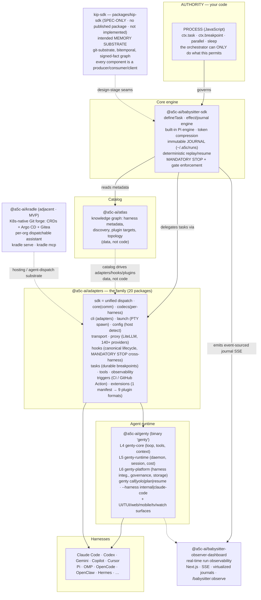

[Docs](./index.md) › Architecture

# Architecture & How It Fits Together

**Babysitter's thesis is enforcement, not assistance: deterministic process execution of complex agentic workflows, with policy/process adherence — obedience — guaranteed by a hook-enforced mandatory stop after every step. This page shows how the pieces of the ecosystem cooperate to deliver that.**

---

## On this page

- [The vision](#the-vision)
- [The component diagram](#the-component-diagram)
- [The runtime flow](#the-runtime-flow)
- [How the layers cooperate](#how-the-layers-cooperate)
- [Maturity boundaries](#maturity-boundaries)
- [Next steps](#next-steps)

---

## The vision

Babysitter began as a single SDK for orchestrating Claude Code. v6 reframes it as a **universal orchestration platform**: run the same Babysitter processes on *any* AI coding harness, on every surface (CLI, TUI, web, mobile, K8s). The unifying design principle is the **adapter pattern** — "every integration surface is defined once in a central catalog and multiplexed to N adapters or targets through generated code." Adding a harness, target, or specialization is a **data change, not a code change.**

The value proposition is a triad:

1. **Deterministic process execution** — your workflow is real JavaScript (`async function process(inputs, ctx)`); the orchestrator can only do what that code permits; state is event-sourced in an immutable journal for deterministic replay and resume.
2. **Complex agentic workflows** — tasks, breakpoints, sleeps, parallel dispatch, dependencies, and sub-agent delegation across harnesses from a single entry point.
3. **Policy / process adherence (obedience)** — a hook-enforced **mandatory stop** after each step, a process check ("what does the process permit next?"), and a decision (permit / halt until a gate passes). Gates block progression; they are not suggestions.

Quality convergence is one capability that falls out of code-defined gates — one of roughly five differentiators (process enforcement, deterministic replay, quality convergence, human-in-the-loop breakpoints, parallel execution), not the headline.

---

## The component diagram



> **Rendering note:** The Mermaid block above renders as a diagram on GitHub and GitBook. The rendered Docusaurus site does not currently load the Mermaid theme, so the same relationships are repeated below as an ASCII map — no information is lost on any surface.

```
   AUTHORITY (your code)
   ┌────────────────────────────────────────────────────────────┐
   │ PROCESS (JavaScript): ctx.task / ctx.breakpoint / parallel / │
   │ sleep — the orchestrator can ONLY do what this code permits  │
   └───────────────────────────────┬──────────────────────────────┘
                                    │ governs
                                    ▼
   @a5c-ai/babysitter-sdk  ── core engine: effects, immutable JOURNAL (~/.a5c/runs),
    (defineTask, Pi engine,    deterministic replay/resume, MANDATORY STOP + gate
     compression, MCP)         enforcement, 4-layer token compression
        │            │            │
        │ reads      │ uses        │ delegates tasks to harnesses
        ▼            ▼             ▼
   @a5c-ai/atlas   @a5c-ai/adapters (FAMILY — 20 packages) ───────────────────────┐
   (catalog graph: │  sdk = unified dispatch; core(comm) + codecs(per-harness)    │
    harness meta,  │  + cli(`adapters`); launch(PTY spawn) + config(host detect)  │
    discovery,     │  + transport + proxy(LiteLLM, 140+ providers)                │
    plugin targets,│  + hooks(canonical lifecycle, MANDATORY STOP cross-harness)  │
    topology) ◄────┘  + tasks(durable breakpoints) + tools + observability        │
        ▲               + triggers(CI/GitHub Action) + extensions(plugin compile) │
        │  catalog drives adapters/hooks/plugins (data, not code)                 │
        │                                                                          ▼
   @a5c-ai/genty (CLI `genty`) ── unified agent product:                    Harnesses:
     L4 genty-core (loop, tools, context)    `genty call|yolo|plan|resume`  Claude, Codex,
     L5 genty-runtime (daemon, session, cost) `--harness internal|claude…`  Gemini, Copilot,
     L6 genty-platform (harness integ.,        start-server (MCP), tui,     Cursor, Pi, OMP,
        governance, interaction, storage)      retrospect, doctor          OpenCode, OpenClaw,
        + UI/TUI/web/mobile/tv/watch surfaces                              Hermes, …
        │ emits event-sourced journal (SSE)
        ▼
   @a5c-ai/babysitter-observer-dashboard ── real-time run observability
                                            (Next.js, SSE, virtualized journals, /babysitter:observe)

   @a5c-ai/kradle   ── (adjacent · MVP) K8s-native Git forge: CRDs + Argo CD + Gitea,
                        per-org dispatchable assistant, `kradle serve` + `kradle mcp`
   kip-sdk          ── packages/kip-sdk (SPEC-ONLY · no published package · not implemented) intended MEMORY SUBSTRATE;
                        every other component is a producer/consumer/client of its seams
```

---

## The runtime flow

A typical interactive run:

1. **You invoke** `/babysitter:call` (or `genty call`).
2. **The SDK creates a run + journal** under `~/.a5c/runs/<runId>/`.
3. **The SDK delegates each task to a harness** via `@a5c-ai/adapters` — dispatch → codec → `launch` spawns a PTY session; an optional **proxy** gives backend freedom across 140+ providers.
4. **After each step the hooks adapter enforces a MANDATORY STOP.**
5. **The process code decides what is permitted next** — permit the next task, or halt until a gate passes.
6. **At a breakpoint the tasks adapter parks a durable human-approval request** (e.g. a GitHub Issue) that survives cold starts.
7. **Every event is appended to the immutable journal.**
8. **The Observer Dashboard streams the journal over SSE** for real-time visibility.

[Atlas](./ecosystem/atlas.md) supplies all harness/plugin/discovery metadata as generated catalog data, so none of this is hand-wired. In CI, the **triggers adapter** (a GitHub Action) normalizes the event and launches the same flow non-interactively (`--bridge-hooks`).

---

## How the layers cooperate

| Layer | Component | Role in the flow |
|-------|-----------|------------------|
| Authority | Your process code | Defines what is permitted — the source of obedience. |
| Engine | [babysitter-sdk](./ecosystem/babysitter-sdk.md) | Runs the process, journals every event, enforces the mandatory stop and gates. |
| Catalog | [atlas](./ecosystem/atlas.md) | Supplies harness/plugin/topology metadata as data. |
| Multiplexer | [adapters](./ecosystem/adapters.md) family | Dispatches tasks to harnesses; normalizes hooks; bridges providers; parks durable breakpoints; triggers CI; compiles plugins. |
| Agent runtime | [genty](./ecosystem/genty.md) | Packages the agent loop/daemon/platform and the internal (Pi) harness; surfaces the CLI/TUI/UI. |
| Harnesses | Claude Code, Codex, … | Do the adaptive work, under enforcement. |
| Observability | [observer-dashboard](./ecosystem/observer-dashboard.md) | Streams the journal live. |
| Adjacent | [kradle](./ecosystem/kradle.md) | A hosting/forge + agent-dispatch substrate (MVP). |
| Design-stage | [kip-sdk](./ecosystem/kip-sdk.md) | The intended memory substrate — **spec only, no code.** |

---

## Maturity boundaries

The diagram mixes shipping and forward-looking pieces deliberately, so be clear which is which:

- **GA / runtime:** babysitter-sdk, atlas, genty, observer-dashboard, the adapters family.
- **MVP:** kradle (its own README's word).
- **Spec only — not implemented:** kip-sdk (entirely Markdown; nothing to install).

---

## Next steps

- **Tour each component:** [Ecosystem Overview](./ecosystem/overview.md)
- **The enforcement layer up close:** [Adapter Types reference](./reference/adapter-types.md)
- **The model in depth:** [Two-Loops Architecture](./features/two-loops-architecture.md)
- **Run it:** [Quickstart](./getting-started/quickstart.md)
