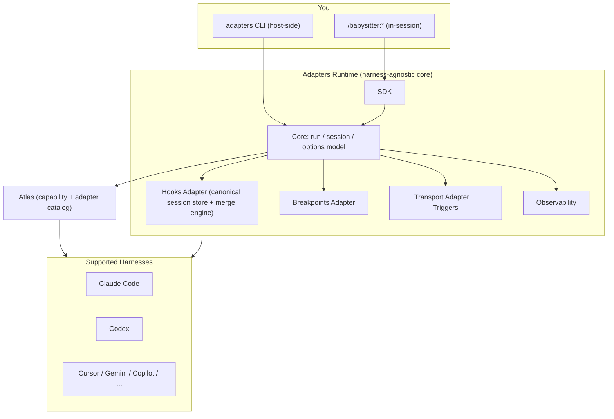

[Docs](../index.md) › [Features](./index.md) › Adapters

# Adapters: Run Babysitter on Any Harness

**Version:** 5.1.0 (v6) · **Last Updated:** 2026-06-22 · **Category:** Feature Guide

---

## In Plain English

**Adapters let your Babysitter processes run on any supported AI coding harness - not just Claude Code.**

Before v6, Babysitter orchestration was wired specifically to Claude Code's session and hook model. With **Adapters**, the orchestration runtime is harness-agnostic: the same process, the same journal, the same quality gates and breakpoints run on Claude Code, Codex, Cursor, Gemini, GitHub Copilot, and a growing list of others. You pick the harness; Babysitter adapts to it.

There are two ways you will touch Adapters:

- **The Adapters runtime** - the harness-agnostic core that every Babysitter run now sits on. You don't install this separately; it ships with the SDK.
- **The [Adapters CLI](../reference/adapters-cli.md)** (`adapters`) - a host-side binary that lets you run and manage harnesses directly from your shell.

> **Headline change for v6:** Babysitter is no longer "an orchestration framework for Claude Code." It is an orchestration framework for *any supported harness*, and Adapters is the subsystem that makes that true.

> **Adapters is a FAMILY, not one thing.** What this page calls "Adapters" is really 20 distinct package types under `packages/adapters/` — triggers (CI), extensions (plugin compile), hooks (mandatory-stop lifecycle), proxy (140+ providers), tasks (durable breakpoints), codecs (per-harness drivers), and more. When you hear "adapters," ask *which* adapter. The full enumeration is in the [Adapter Types reference](../reference/adapter-types.md).

---

## On this page

- [Why Adapters Exist](#why-adapters-exist)
- [The Adapters Runtime (Technical Depth)](#the-adapters-runtime-technical-depth)
- [How Adapters Replace the Legacy Model](#how-adapters-replace-the-legacy-model)
- [Getting Started with Adapters](#getting-started-with-adapters)
- [Related Documentation](#related-documentation)

---

## Why Adapters Exist

The original Babysitter design assumed one [harness](../reference/glossary.md) (Claude Code) and one continuation mechanism (Claude's `Stop` hook). Every new harness meant hand-rolling the orchestration loop against that harness's specific lifecycle - bespoke code, duplicated logic, and drift between integrations.

Adapters invert that. A harness is integrated by describing it - its capabilities, its hook model, its command surface - as data in a catalog, and the runtime adapts. Adding or updating a harness becomes an **adapter/data change**, not a fork of the orchestration engine.

This is the core v6 story: **harness-agnosticism through adapters**.

---

## The Adapters Runtime (Technical Depth)

The Adapters runtime is composed of several cooperating packages under `packages/adapters/*`:

| Subsystem | Responsibility |
|-----------|----------------|
| **Core** | The harness-agnostic run/session/options model that every adapter implements against |
| **SDK** | The programmatic surface processes use to run agents through adapters |
| **Gateway** | The browser/mobile gateway service (`adapters gateway serve`) for remote control of runs |
| **Observability** | Session, cost, and trace capture across harnesses |
| **Codecs** | Encoding/decoding of harness-specific message and tool formats into the common model |
| **Transport** | Provider transports (Anthropic, OpenAI chat/responses, Google) and the proxy used by `adapters launch` |
| **Harness mock** | A mock harness (`--use-mock-harness`) for testing processes without spending tokens |

### How Adapters Relate to the Rest of v6

Adapters is the runtime layer the other v6 subsystems plug into:

- **[Hooks Adapter](hooks.md)** - a canonical session store plus a merge engine that normalizes each harness's distinct hook/continuation model (Claude `Stop`, Gemini/antigravity `AfterAgent`, openclaw daemon `agent_end`, opencode `session.idle`, Hermes ACP, and the thin `/skill:*` alias harnesses) into one consistent contract. Adapters do not generalize the Claude `Stop`-hook model onto harnesses that don't have it.
- **Breakpoints Adapter** - serverless-durable human-in-the-loop approval with pluggable backends (GitHub Issues, server) and "proven" cryptographic signing. See [Breakpoints](breakpoints.md).
- **Transport Adapter and Triggers** - normalize provider transports and inbound webhooks (GitHub/GitLab/Bitbucket) so a run can be launched from CI. See [GitHub Actions Setup](../../github-actions-setup-babysitter.md).
- **Atlas** - the catalog that the runtime reads to discover harness capabilities and adapters.

### v6 Architecture



---

## How Adapters Replace the Legacy Model

| Prod (pre-v6) mental model | v6 reality with Adapters |
|----------------------------|--------------------------|
| "Orchestration framework for Claude Code" | Orchestration framework for any supported harness |
| Loop driven by Claude's `Stop` hook | Per-harness continuation models normalized by the Hooks Adapter |
| New harness = bespoke SDK integration code | New harness = an adapter/data entry in Atlas |
| `Agent-Mux` packages (`-mux`) | Renamed to **Adapters** (`-adapter`) |

If you are reading older docs that describe hand-rolling the SDK loop into a harness, treat that as a contributor-level integration note - the user-facing path is now the Adapters runtime plus the per-harness pages.

---

## Getting Started with Adapters

Install the host-side CLI and run a harness immediately:

```bash
npm install -g @a5c-ai/adapters-cli
adapters doctor
adapters run claude "explain this codebase"
```

To use Adapters from inside a harness as a Babysitter orchestration run, install that harness's plugin (see the per-harness pages) and use its command surface.

---

## Related Documentation

- [Adapter Types reference](../reference/adapter-types.md) - All 20 adapter package types enumerated (Adapters is a family)
- [Adapters (ecosystem overview)](../ecosystem/adapters.md) - Introductory tour of the adapters family
- [Adapters CLI Reference](../reference/adapters-cli.md) - Every `adapters` command and flag
- [Architecture & How It Fits Together](../architecture.md) - Where Adapters sits in the whole ecosystem
- [Architecture Overview](architecture-overview.md) - Where Adapters sits in the v6 architecture
- [Hooks](hooks.md) - The Hooks Adapter and per-harness continuation models
- [Harnesses: Install Matrix](../harnesses/install-matrix.md) - All supported harnesses
- [Claude Code](../harnesses/claude-code.md) · [Codex](../harnesses/codex.md) - Fully-worked harness pages
- [Glossary](../reference/glossary.md) - Adapter, Harness, Atlas, and related terms

## Next steps

- **Next:** [Adapter Types reference](../reference/adapter-types.md) — all 20 types
- **Related:** [Adapters CLI Reference](../reference/adapters-cli.md), [Install Matrix](../harnesses/install-matrix.md), [Hooks](./hooks.md), [Architecture & How It Fits Together](../architecture.md)
