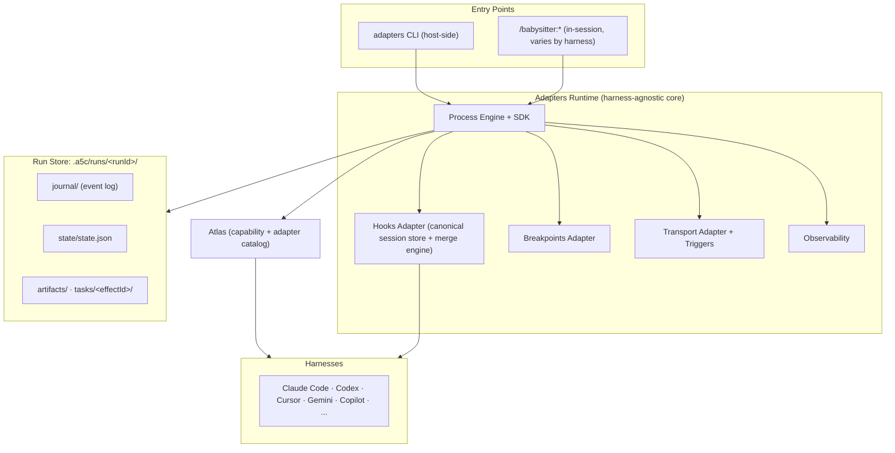

[Docs](../index.md) › [Features](./index.md) › Architecture Overview

# Architecture Overview

**Version:** 5.1.0 (v6)
**Last Updated:** 2026-06-22
**Category:** Feature Guide

---

## In Plain English

**Babysitter v6 is built around one headline subsystem: Adapters - the harness-agnostic runtime that lets the same orchestration run on any supported AI coding harness.**

Think of it like this:
- **Adapters** is the universal adapter plug - it lets Babysitter speak to Claude Code, Codex, Cursor, Gemini, and the rest through one common interface
- **The SDK** is the operations team - it actually runs the process
- **The Journal** is the filing cabinet - it keeps a replayable record of everything
- **Breakpoints** are the approval desk - they pause for human review when needed
- **Atlas** is the directory - the catalog the runtime reads to discover each harness's capabilities

**Tip for beginners:** You don't need to understand the architecture to use Babysitter. This document is for those who want to understand how it works under the hood, or who are building custom processes.

**Related:** [Adapters](./adapters.md) for the headline subsystem, and [Two-Loops Architecture](./two-loops-architecture.md) for the conceptual model of orchestration and AI working together.

---

## On this page

- [Overview](#overview)
- [High-Level Architecture](#high-level-architecture)
- [Core Components](#core-components)
- [Data Flow](#data-flow)
- [State Management](#state-management)
- [Extensibility](#extensibility)
- [Design Patterns](#design-patterns)

---

## Overview

Babysitter v6 uses a modular, **harness-agnostic** architecture designed for reliability, debuggability, and extensibility. The system combines a deterministic orchestration engine with adaptive AI capabilities, runs on top of the **Adapters** runtime so it is not tied to any single harness, and is backed by an event-sourced persistence layer.

The central change from the prior (Claude-only) design: orchestration no longer assumes one harness and one continuation hook. The Adapters runtime - together with the [Hooks Adapter](./hooks.md), [Breakpoints Adapter](./breakpoints.md), Transport Adapter, and the Atlas catalog - makes [harness](../reference/glossary.md)-agnosticism the core story.

---

## High-Level Architecture



---

## Core Components

### 1. Adapters Runtime

**Package family:** `@a5c-ai/*-adapter` (formerly the `-mux` / Agent Mux packages) under `packages/adapters/*`

**Responsibilities:**
- Presents a harness-agnostic run/session/options model to the orchestration engine
- Normalizes each harness's distinct hook/continuation model via the [Hooks Adapter](./hooks.md)
- Routes runs to providers via the Transport Adapter and the proxy used by `adapters launch`
- Reads the Atlas catalog to discover harness capabilities

**Technology:** Node.js, TypeScript. See [Adapters](./adapters.md) and the [Adapters CLI Reference](../reference/adapters-cli.md).

---

### 2. Babysitter Skill / Plugin (per harness)

**Location:** `plugins/babysitter-unified/skills/babysit/` (and the per-harness plugin packages)

**Responsibilities:**
- Parses natural language commands into process inputs
- Orchestrates the run loop via the SDK/CLI on top of the Adapters runtime
- Manages iteration lifecycle and resumption
- Reports progress back to the harness

**Technology:** The harness's plugin/skill system (JavaScript/TypeScript). The in-session command surface and continuation model **vary by harness** - see [Hooks](./hooks.md) and the [Install Matrix](../harnesses/install-matrix.md).

---

### 3. Babysitter SDK

**Package:** `@a5c-ai/babysitter-sdk`

**Core Modules:**

| Module | Purpose | Key Functions |
|--------|---------|--------------|
| **Process Engine** | Executes process definitions | `runProcess()`, `iterate()` |
| **Journal Manager** | Event-sourced persistence | `append()`, `replay()`, `getState()` |
| **Task Executor** | Runs tasks (agent, skill, node) | `executeTask()`, `parallel.all()` |
| **State Manager** | Maintains run state cache | `saveState()`, `loadState()` |
| **Hook System** | Extensibility points | `registerHook()`, `trigger()` |

**Technology:** Node.js, TypeScript

---

### 4. Event-Sourced Journal

**Format:** Individual JSON files in `journal/` directory, one per event, named `{SEQ}.{ULID}.json` (e.g. `000001.01ARZ3NDEKTSV4RRFFQ69G5FAV.json`)

**Event Types:**

```typescript
type JournalEvent =
  | { type: 'RUN_CREATED', recordedAt: string, data: { runId: string, inputs: any }, checksum: string }
  | { type: 'EFFECT_REQUESTED', recordedAt: string, data: { effectId: string, kind: string, args: any }, checksum: string }
  | { type: 'EFFECT_RESOLVED', recordedAt: string, data: { effectId: string, result: any }, checksum: string }
  | { type: 'RUN_COMPLETED', recordedAt: string, data: { status: string }, checksum: string }
  | { type: 'RUN_FAILED', recordedAt: string, data: { error: string }, checksum: string }

// Note: seq is derived from the filename, not stored in the event body.
// Breakpoints use EFFECT_REQUESTED with kind: 'breakpoint' and EFFECT_RESOLVED.
```

**Benefits:**
- **Deterministic replay**: Reconstruct exact state at any point
- **Audit trail**: Complete history of all actions
- **Debugging**: Trace execution flow and identify issues
- **Resumability**: Continue from last event after interruption

**Implementation:**
```javascript
// Write individual JSON file per event
function appendEvent(event, seq) {
  const filename = `${String(seq).padStart(6, '0')}.${ulid()}.json`;
  fs.writeFileSync(path.join(journalDir, filename), JSON.stringify(event, null, 2));
}

// Replay by reading all JSON files from journal/ directory
function replayJournal() {
  const files = fs.readdirSync(journalDir)
    .filter(f => f.endsWith('.json'))
    .sort(); // lexicographic sort preserves sequence order

  const events = files.map(f =>
    JSON.parse(fs.readFileSync(path.join(journalDir, f), 'utf-8'))
  );

  return events.reduce(applyEvent, initialState);
}
```

For more details on the journal system, see [Journal System](./journal-system.md).

---

### 5. Process Definitions

**Format:** JavaScript/TypeScript functions

**Execution Model:**

```
+----------------------------------------------------------+
| Process Definition (JavaScript)                          |
|                                                          |
|  export async function process(inputs, ctx) {           |
|    // User-defined orchestration logic                  |
|    const result = await ctx.task(someTask, args);       |
|    await ctx.breakpoint({ question: '...' });           |
|    return result;                                        |
|  }                                                       |
+----------------------------------------------------------+
                          |
                          v
+----------------------------------------------------------+
| Context API (ctx)                                        |
|                                                          |
|  - ctx.task(task, args, opts)       Execute task        |
|  - ctx.breakpoint(opts)             Wait for approval   |
|    Returns BreakpointResult: { approved, feedback, ... }|
|  - ctx.parallel.all([...])          Run in parallel     |
|  - ctx.hook(name, data)             Trigger hooks       |
|  - ctx.log(msg, data)               Log to journal      |
|  - ctx.getState(key)                Access state        |
|  - ctx.setState(key, value)         Update state        |
+----------------------------------------------------------+
```

**Process Lifecycle:**

1. **Load**: Process definition loaded from file or default
2. **Initialize**: Context created with state and journal access
3. **Execute**: Process function called with inputs and context
4. **Iterate**: Process may loop internally or be called multiple times
5. **Complete**: Process returns final result

For more details on creating processes, see [Process Definitions](./process-definitions.md).

---

### 6. Task Execution System

**Task Types:**

| Type | Executor | Use Case | Example |
|------|----------|----------|---------|
| **Agent** | LLM API | Planning, analysis, scoring | Any supported harness |
| **Skill** | Harness skill | Code operations | Refactoring, search |
| **Node** | Node.js | Scripts and tools | Build, test, deploy |
| **Shell** | System shell | Commands | git, npm, docker |

**Execution Flow:**

```
+---------------------------------------------------------+
| Task Request                                            |
| ctx.task(taskDef, args, opts)                           |
+-----------------+---------------------------------------+
                  |
                  v
+---------------------------------------------------------+
| Task Validation                                         |
| - Validate arguments                                    |
| - Check dependencies                                    |
| - Generate task ID                                      |
+-----------------+---------------------------------------+
                  |
                  v
+---------------------------------------------------------+
| Journal Event: EFFECT_REQUESTED                         |
+-----------------+---------------------------------------+
                  |
                  v
+---------------------------------------------------------+
| Execute Task                                            |
| - Agent: Call LLM API                                   |
| - Skill: Invoke the harness skill                       |
| - Node: Run JavaScript function                         |
| - Shell: Execute command                                |
| - Breakpoint: Wait for approval (kind: breakpoint)      |
+-----------------+---------------------------------------+
                  |
                  v
+---------------------------------------------------------+
| Journal Event: EFFECT_RESOLVED                          |
+-----------------+---------------------------------------+
                  |
                  v
+---------------------------------------------------------+
| Return Result                                           |
| - Success: Return task output                           |
| - Failure: Throw error or return error object           |
+---------------------------------------------------------+
```

**Parallel Execution:**

```javascript
// Tasks run concurrently with Promise.all
await ctx.parallel.all([
  () => ctx.task(task1, args1),
  () => ctx.task(task2, args2),
  () => ctx.task(task3, args3)
]);

// All results returned when all complete
// If any fails, entire parallel group fails
```

For more details on parallel execution, see [Parallel Execution](./parallel-execution.md).

---

## Data Flow

**Complete Request Flow:**

```
1. User Command
   |
   +--> Harness (Claude Code, Codex, Cursor, ...)
        |
        +--> Babysitter Skill
             |
             +-- Parse intent
             +-- Load/create run
             +--> CLI: babysitter run:iterate (on the Adapters runtime)
                  |
                  +--> SDK Process Engine
                       |
                       +-- Load process definition
                       +-- Replay journal -> restore state
                       +-- Execute process function
                       |    |
                       |    +-- ctx.task() -> Execute tasks
                       |    |    |
                       |    |    +-- Append EFFECT_REQUESTED
                       |    |    +-- Run executor (agent/skill/node/shell)
                       |    |    +-- Append EFFECT_RESOLVED
                       |    |
                       |    +--> ctx.breakpoint() -> Wait for approval
                       |         |
                       |         +-- Append EFFECT_REQUESTED (kind: breakpoint)
                       |         +-- Poll for response
                       |         +-- Append EFFECT_RESOLVED
                       |
                       +-- Append iteration events to journal
                       +-- Save state cache
                       +--> Return results to skill
                            |
                            +--> Report to the harness
                                 |
                                 +--> Display to user
```

---

## State Management

**Two-Layer State System:**

1. **Journal (source of truth)**:
   - Append-only event log
   - Immutable history
   - Replayed to reconstruct state

2. **State Cache (performance)**:
   - Snapshot of current state
   - Rebuilt from journal if missing
   - Fast access without replay

**State Structure:**

```typescript
interface RunState {
  runId: string;
  status: 'running' | 'paused' | 'completed' | 'failed';
  iteration: number;
  inputs: any;
  outputs?: any;
  processState: Map<string, any>;  // Process-specific state
  taskResults: Map<string, any>;    // Cached task results
  metrics: {
    startTime: number;
    endTime?: number;
    iterations: number;
    qualityScores: number[];
  };
}
```

---

## Extensibility

**Hook System:**

```javascript
// Register custom hooks
ctx.hook('task:completed', async (taskResult) => {
  await sendMetricsToDatadog(taskResult);
});

ctx.hook('quality:score', async (score) => {
  if (score < 70) {
    await sendAlert('Low quality score');
  }
});

// Built-in hook points
- 'run:started'
- 'run:completed'
- 'iteration:started'
- 'iteration:completed'
- 'task:started'
- 'task:completed'
- 'breakpoint:requested'
- 'breakpoint:resolved'
- 'quality:score'
```

**Custom Task Types:**

```javascript
// Define custom task executor
function registerCustomTask(type, executor) {
  taskExecutors.set(type, executor);
}

// Use custom task
await ctx.task({ type: 'custom', fn: myExecutor }, args);
```

For more details on hooks, see [Hooks](./hooks.md).

---

## Technology Stack

| Component | Technology | Purpose |
|-----------|-----------|---------|
| **Adapters Runtime** | TypeScript + Node.js | Harness-agnostic run/session model |
| **Plugin** | JavaScript/TypeScript | Per-harness integration (12 harnesses) |
| **SDK** | TypeScript + Node.js | Core orchestration engine |
| **Process Definitions** | JavaScript/TypeScript | User workflow logic |
| **Journal** | Individual JSON files | Event persistence |
| **CLI** | Commander.js | Command-line interface |

---

## Design Patterns

**Event Sourcing:**
- All state changes recorded as events
- State derived from event replay
- Time-travel debugging possible

**Command Query Responsibility Segregation (CQRS):**
- Write: Append events to journal
- Read: Query state cache or replay

**Saga Pattern:**
- Long-running workflows with compensation
- Breakpoints as decision points
- Resumable across sessions

**Plugin Architecture:**
- Extensible via hooks
- Custom task types
- Process definitions as plugins

---

## Related Documentation

- [Adapters](./adapters.md) - The headline v6 runtime and harness-agnosticism
- [Hooks](./hooks.md) - The Hooks Adapter and per-harness continuation models
- [Two-Loops Architecture](./two-loops-architecture.md) - Conceptual model of orchestration and AI loops
- [Process Definitions](./process-definitions.md) - Creating custom processes
- [Journal System](./journal-system.md) - Event sourcing and replay
- [Breakpoints](./breakpoints.md) - Human-in-the-loop approval
- [Parallel Execution](./parallel-execution.md) - Running tasks concurrently

---

## Summary

Babysitter's v6 architecture is built on these key principles:

- **Harness-agnostic by default**: The Adapters runtime lets the same process run on any supported harness
- **Modular Design**: Each component has a clear, single responsibility
- **Event Sourcing**: The journal provides a complete, replayable audit trail
- **Two-Layer State**: Journal for truth, cache for performance
- **Extensibility**: Hooks and custom tasks enable integration with any system
- **Human-in-the-Loop**: Breakpoints enable approval workflows

This architecture enables reliable, debuggable, and auditable AI-powered workflows that can run on any harness and be paused, resumed, and replayed at any point.

---

## Next steps

- **Next:** [Two-Loops Architecture](./two-loops-architecture.md)
- **Related:** [Adapters](./adapters.md), [Journal System](./journal-system.md), [Hooks](./hooks.md)
