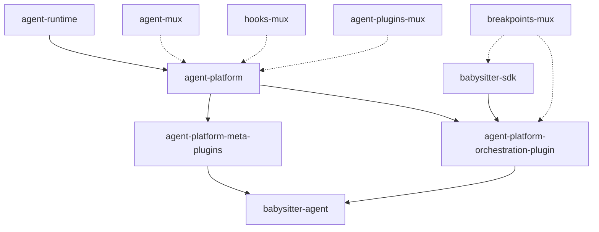

# Package Specifications

→ [Documentation Index](README.md) | Previous: [V6 Vision](v6-vision.md) | Next: [Plugin Ecosystem](plugin-ecosystem.md)

## @a5c-ai/agent-runtime

**Purpose**: Low-level, programmatic agentic engine with zero filesystem dependencies.

**Responsibilities**:
- Agent-core integration for model communication and agentic loop functionality
- Extendable programmatic hooks system (in-memory)
- Model provider/configuration management
- Tool use coordination (async/background/parallel)
- Steering and cancellation
- Context compaction hooks with fallback implementation
- In-memory session management and hooks (fork, edit, append)
- Structured event-driven protocol for consumers (with hook acknowledgments)

**Key Characteristics**:
- **Zero filesystem access** - All state management in-memory → [Testing Framework](testing-framework.md)
- **Pure programmatic interface** - No CLI, no file I/O
- **Event-driven architecture** - Structured protocol for consumers
- **Hook ecosystem ready** - Provides foundation for upper layers

**Complete API Surface**:
```typescript
// Core engine with enhanced configuration
export interface AgentRuntimeEngine {
  createSession(options: SessionOptions): RuntimeSession;
  configureModel(config: ModelConfig): Promise<void>;
  registerHook(type: HookType, handler: HookHandler): HookRegistration;
  unregisterHook(registration: HookRegistration): void;
  getMetrics(): RuntimeMetrics;
}

// Enhanced session management with lifecycle
export interface RuntimeSession {
  readonly id: string;
  readonly status: SessionStatus;
  
  // Core interaction
  prompt(message: string, options?: PromptOptions): Promise<AgentResponse>;
  useTool(tool: ToolDefinition, args: unknown): Promise<ToolResult>;
  
  // Session control
  fork(options?: ForkOptions): RuntimeSession;
  merge(session: RuntimeSession): Promise<MergeResult>;
  steer(direction: SteerDirection): void;
  cancel(reason?: string): void;
  pause(): void;
  resume(): void;
  
  // State management (in-memory only)
  getContext(): SessionContext;
  updateContext(updates: Partial<SessionContext>): void;
  
  // Event handling
  on(event: SessionEventType, handler: SessionEventHandler): void;
  off(event: SessionEventType, handler: SessionEventHandler): void;
  emit(event: SessionEvent): void;
}

// Event-driven architecture with structured protocols
export interface RuntimeEvent {
  id: string;
  type: EventType;
  source: EventSource;
  payload: unknown;
  timestamp: number;
  sessionId: string;
  correlationId?: string;
  metadata?: EventMetadata;
}

// Layer boundary enforcement
export interface LayerBoundary {
  validateAccess(operation: LayerOperation): Promise<AccessResult>;
  enforceConstraints(context: ExecutionContext): Promise<ConstraintResult>;
  auditAccess(operation: LayerOperation, result: AccessResult): void;
}

// Hook ecosystem with validation
export interface HookHandler {
  handle(event: HookEvent): Promise<HookResult>;
  validate?(event: HookEvent): Promise<ValidationResult>;
  cleanup?(): Promise<void>;
}

export interface HookRegistration {
  id: string;
  type: HookType;
  handler: HookHandler;
  options: HookOptions;
  unregister(): void;
}
```

**Boundary Enforcement Mechanisms**:
```typescript
// Filesystem boundary validation
export class FilesystemBoundaryValidator implements LayerBoundary {
  async validateAccess(operation: LayerOperation): Promise<AccessResult> {
    if (operation.type === 'filesystem') {
      return { allowed: false, reason: 'Runtime layer cannot access filesystem' };
    }
    return { allowed: true };
  }
}

// Plugin isolation enforcement
export class PluginIsolationValidator implements LayerBoundary {
  async validateAccess(operation: LayerOperation): Promise<AccessResult> {
    const allowedResources = operation.context.plugin?.allowedResources || [];
    if (!allowedResources.includes(operation.resource)) {
      return { allowed: false, reason: 'Resource not in plugin allowlist' };
    }
    return { allowed: true };
  }
}
```

## @a5c-ai/agent-platform

**Purpose**: Plugin system and persistent session management layer.

**Responsibilities**:
- Plugin system infrastructure and marketplace support → [Plugin Ecosystem](plugin-ecosystem.md)
- Persistent session management (filesystem-based)
- Configuration persistence and env variable management
- Basic "coding tools" (grep, bash, read) - replaceable via plugins
- Basic orchestration tools (skill, task, background tasks, scheduling)
- MCP client integration and configuration
- Claude Code protocol support (hooks, plugins, skills, subagents)
- JSON event protocol support
- hooks-mux format hooks (direct integration)
- `.a5c` and `~/.a5c` root management
- `AGENT_ENV_FILE` mechanism for subprocess environment sourcing
- Agent-mux protocol exposure for UIs/CLIs/tools

**Key Characteristics**:
- **Filesystem-based persistence** - Session state, configuration
- **Extensibility layer** - Plugin and meta-plugin foundation
- **Tool ecosystem** - Replaceable tool definitions
- **Multi-protocol support** - Claude Code, MCP, JSON events
- **Environment integration** - Subprocess and shell environment

**Enhanced API Surface**:
```typescript
// Platform core with plugin system
export interface AgentPlatform {
  // Plugin management
  installPlugin(plugin: PluginManifest): Promise<PluginInstance>;
  uninstallPlugin(pluginId: string): Promise<UninstallResult>;
  listPlugins(filter?: PluginFilter): Promise<PluginInfo[]>;
  getPlugin(pluginId: string): Promise<PluginInstance | null>;
  
  // Session persistence
  createSession(config: SessionConfig): Promise<PlatformSession>;
  loadSession(sessionId: string): Promise<PlatformSession>;
  saveSession(session: PlatformSession): Promise<void>;
  deleteSession(sessionId: string): Promise<void>;
  
  // Configuration management
  getConfig(key: string, scope?: ConfigScope): Promise<unknown>;
  setConfig(key: string, value: unknown, scope?: ConfigScope): Promise<void>;
  
  // Event system integration
  subscribe(pattern: string, handler: PlatformEventHandler): Subscription;
  publish(event: PlatformEvent): Promise<void>;
}

// Plugin system architecture
export interface PluginInstance {
  readonly manifest: PluginManifest;
  readonly status: PluginStatus;
  readonly permissions: PluginPermissions;
  
  start(): Promise<void>;
  stop(): Promise<void>;
  restart(): Promise<void>;
  
  invoke(method: string, args: unknown[]): Promise<unknown>;
  getMetrics(): PluginMetrics;
  
  // Security isolation
  getSecurityContext(): SecurityContext;
  validateOperation(operation: PluginOperation): Promise<ValidationResult>;
}

// Session persistence with recovery
export interface PlatformSession extends RuntimeSession {
  // Persistent state management
  save(): Promise<void>;
  load(): Promise<void>;
  checkpoint(name: string): Promise<Checkpoint>;
  restore(checkpoint: Checkpoint): Promise<void>;
  
  // File system integration (controlled)
  readFile(path: string): Promise<string>;
  writeFile(path: string, content: string): Promise<void>;
  listFiles(pattern: string): Promise<string[]>;
  
  // Plugin interaction
  loadPlugin(pluginId: string): Promise<PluginInstance>;
  callPlugin(pluginId: string, method: string, args: unknown[]): Promise<unknown>;
}

// Plugin marketplace integration
export interface PluginMarketplace {
  search(query: PluginSearchQuery): Promise<PluginSearchResult[]>;
  getDetails(pluginId: string): Promise<PluginDetails>;
  download(pluginId: string, version?: string): Promise<PluginPackage>;
  install(package: PluginPackage): Promise<PluginInstance>;
  
  // Security and governance
  validatePlugin(package: PluginPackage): Promise<SecurityValidation>;
  checkUpdates(installedPlugins: PluginInfo[]): Promise<UpdateInfo[]>;
}
```

**Plugin Isolation Architecture**:
```typescript
// Plugin security sandbox
export class PluginSandbox {
  private permissions: PluginPermissions;
  private resourceMonitor: ResourceMonitor;
  
  constructor(permissions: PluginPermissions) {
    this.permissions = permissions;
    this.resourceMonitor = new ResourceMonitor(permissions.resourceLimits);
  }
  
  async execute<T>(plugin: PluginInstance, operation: () => Promise<T>): Promise<T> {
    // Enforce resource limits
    this.resourceMonitor.startMonitoring();
    
    try {
      // Validate permissions before execution
      await this.validatePermissions(operation);
      
      // Execute in isolated context
      return await this.isolatedExecution(operation);
    } finally {
      this.resourceMonitor.stopMonitoring();
    }
  }
  
  private async validatePermissions(operation: any): Promise<void> {
    // Permission validation logic
  }
  
  private async isolatedExecution<T>(operation: () => Promise<T>): Promise<T> {
    // Isolated execution with security boundaries
    return operation();
  }
}
```

**Integration Points**:
- Uses `@a5c-ai/agent-runtime` for core engine functionality
- Integrates with `@a5c-ai/agent-mux` for agent dispatch  
- Integrates with `@a5c-ai/hooks-mux` for hook normalization
- Supports `@a5c-ai/agent-plugins-mux` for plugin compilation

## @a5c-ai/agent-platform-meta-plugins

**Purpose**: Meta-plugin framework for extending agent-platform capabilities.

**Responsibilities**:
- Meta-plugin architecture and registration
- Hook type extension system (sinks and pipeline processing)
- Session context management and propagation
- Dynamic plugin loading and lifecycle management
- Network hooks and remote hook definitions
- Skill/subagent-defined hooks (dynamically attached)
- Context variable and per-session toggle system

**Plugin Categories**:
- **Governance Plugins** - Policy engines, security rules, authority chains → [Security Architecture](security-architecture.md)
- **Memory Plugins** - Long-term memory, team memory, project memory
- **Cost Plugins** - Tracking, monitoring, budgeting with hook registration
- **Routing Plugins** - Model/provider routing and fallback chains
- **Integration Plugins** - CI/CD, messaging platforms, external services

## @a5c-ai/agent-platform-orchestration-plugin

**Purpose**: Babysitter SDK integration plugin for orchestration workflows.

**Responsibilities**:
- Babysitter SDK run lifecycle native orchestration integration
- Hook-based orchestration event handling
- Agent-mux-tools integration for inner-agent dispatch
- Orchestration-specific session management
- Process library integration
- Breakpoint and approval workflow management

**Integration**:
- Extends `@a5c-ai/agent-platform` via meta-plugin system
- Integrates `@a5c-ai/babysitter-sdk` functionality
- Provides orchestration-specific hooks and events

## @a5c-ai/babysitter-agent

**Purpose**: Complete babysitter orchestration solution.

**Responsibilities**:
- Programmatic usage of `agent-platform` + `orchestration-plugin`
- Built-in plugin ecosystem for comprehensive orchestration
- Governance system (policies, authorities, sandboxing)
- Memory management (long-term, project, team)
- Session management with continuity and history
- Cost monitoring, budgeting, and tracking
- Model/sub-agent selection and routing
- Daemon infrastructure and observability

**Built-in Plugin Suite**:
- **Governance Plugin** - Complete policy engine with sandbox support
- **Memory Plugin** - Multi-layered memory system
- **Session Plugin** - Advanced session management with persistence
- **Cost Plugin** - Comprehensive cost tracking and budgeting
- **Observability Plugin** - Monitoring, logging, and observability
- **Security Plugin** - Authority chains, mandates, permissions

## @a5c-ai/breakpoints-mux

**Purpose**: Serverless breakpoint multiplexing system with pluggable backends and cryptographic signing.

**Responsibilities**:
- **Multi-Backend Breakpoint Routing** - Git-native, server, and GitHub Issues backends
- **Cryptographic Trust System** - Ed25519 key management and signature verification
- **Model Context Protocol Integration** - 5 specialized MCP tools for AI agents
- **Harness Integration** - Direct babysitter-harness interaction provider
- **Serverless Coordination** - Zero-infrastructure git-native backend using `.breakpoints/` directories
- **Proven Breakpoints** - Cryptographic signing and verification of human decisions
- **Backend Factory System** - Pluggable backend registration and resolution
- **Domain/Tag-based Routing** - Sophisticated routing configuration with JSON-based rules

**Key Architectural Innovations**:
- **Zero-Infrastructure Design** - Git-native backend requires no servers or databases
- **Cryptographic Trust Chains** - Distributed trust model using git-tracked public keys
- **Working Plugin Architecture** - Demonstrates successful extensibility patterns for V6
- **Real Implementation** - Production-ready code with comprehensive test coverage

**Complete API Surface**:
```typescript
// Core backend interface
export interface BreakpointBackend {
  readonly name: string;
  submitBreakpoint(params: SubmitBreakpointParams): Promise<Breakpoint>;
  getBreakpoint(id: string): Promise<Breakpoint>;
  waitForAnswer(id: string, options?: WaitForAnswerOptions): Promise<BreakpointWaitResult>;
  listPendingBreakpoints(responderId?: string): Promise<Breakpoint[]>;
  answerBreakpoint(id: string, answer: SubmitAnswerParams): Promise<BreakpointAnswer>;
  cancelBreakpoint(id: string): Promise<void>;
}

// Cryptographic signing system
export interface ProvenBreakpointAnswer extends BreakpointAnswer {
  signature: string;
  publicKeyFingerprint: string;
  signedAt: string;
  signedFields: string[];
}

// MCP server integration  
export interface BreakpointMcpServer {
  askBreakpoint(params: AskBreakpointParams): Promise<BreakpointWaitResult>;
  checkBreakpointStatus(id: string): Promise<Breakpoint>;
  listBreakpoints(responderId?: string): Promise<Breakpoint[]>;
  answerBreakpoint(id: string, params: AnswerParams): Promise<BreakpointAnswer>;
  verifyBreakpointAnswer(id: string): Promise<ProvenVerificationResult>;
}

// Harness interaction provider
export interface BreakpointMuxInteractionProvider {
  handleBreakpoint(payload: unknown, options: BreakpointOptions): Promise<BreakpointResult>;
}
```

**Built-in Backend Implementations**:
- **Git-Native Backend** - Filesystem-based coordination using `.breakpoints/` directories
- **Extension Support** - AEQ server and GitHub Issues backends via external packages
- **Backend Factory** - Runtime registration and configuration-driven selection

**Security Model**:
- **Ed25519 Key Pairs** - Generate, store, and rotate cryptographic keys
- **Git-based Trust** - Public keys committed and reviewed via standard git processes  
- **Signature Verification** - Cryptographic validation of breakpoint answers
- **Key Rotation** - Secure key lifecycle management with expiration timestamps

**Integration Points**:
- **babysitter-harness** - Direct interaction provider for ProcessContext.breakpoint()
- **babysitter-sdk** - Optional peer dependency with graceful fallback
- **MCP Protocol** - Standard Model Context Protocol server implementation
- **Git Repositories** - Native integration with existing git workflows

## Package Dependencies



## Bundle Size Targets

| Package | Target Size | Rationale |
|---------|-------------|-----------|
| `agent-runtime` | < 2MB | Core engine must be lightweight |
| `agent-platform` | < 5MB | Platform features with plugin system |
| `meta-plugins` | < 3MB | Extension framework |
| `orchestration-plugin` | < 4MB | Babysitter integration |
| `babysitter-agent` | < 10MB | Complete solution with all plugins |
| `breakpoints-mux` | < 2MB | Serverless coordination with minimal overhead |

→ [Performance Considerations](performance-docs.md)

---

**Related Documents**: [V6 Vision](v6-vision.md) | [Plugin Ecosystem](plugin-ecosystem.md) | [Implementation Roadmap](implementation/)