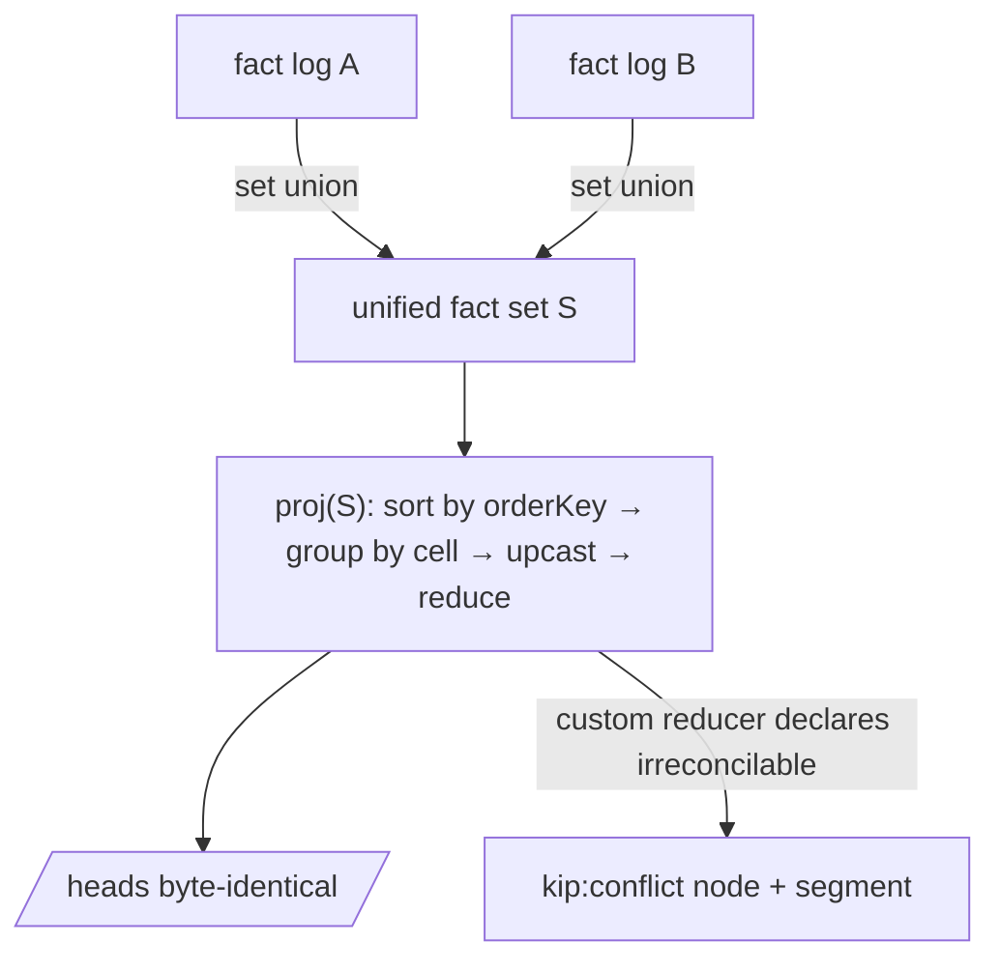
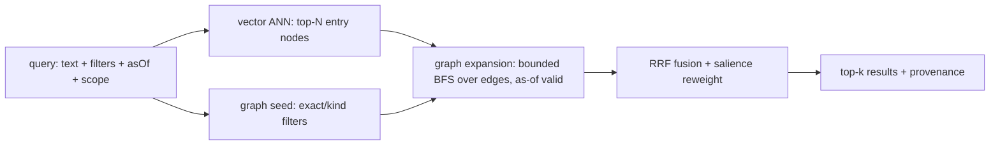

# `@a5c-ai/kip-sdk` — SPEC (v1)

> Status: **Draft v3**, spec-only. Illustrative TypeScript interfaces are normative for *shape*,
> not implementation. `MUST`/`SHOULD`/`MAY` are RFC-2119 keywords. Companion: `PRIOR-ART.md`
> (research brief). This SPEC **resolves** the hard problems and tensions enumerated there; it does
> not re-derive them. Cross-references like *(HP-4)* point at PRIOR-ART §3 hard problems and *(T-2)*
> at §4 tensions.
>
> **v3 correctness note.** The convergence model is stated in two cleanly separated halves:
> the **substrate state** is a grow-only fact set (a CRDT under union — associative, commutative,
> idempotent), and the **projection** `proj(factSet)` (heads, valid-time geometry, supersession,
> trust/revocation demotion, salience-as-deterministic) is a **single pure total function of that
> set**, order-independent by construction because it sorts facts by one global deterministic key
> before folding. Convergence is then trivial: equal admitted sets ⇒ byte-identical projection. The
> earlier pairwise `merge(base,a,b)` interface and the "valid-time-clipping fold is ACI" claim were
> unsound and have been **removed**.
>
> **v3 headline fix — the INGEST-GATE / PROJ split (C2-1).** v2 made trust demotion read `rxFrom`,
> the receiver-assigned *per-replica* transaction time, which silently re-broke `proj`-purity. v3
> draws one bright line and never crosses it:
>
> - **INGEST-GATE (objective, set-pure admission).** At ingest a replica admits a fact to the set
>   **iff** (i) its Ed25519 signature verifies over the canonical payload, (ii) its author key is a
>   **registered key at all** (present in the tenant key log — *authorized-to-sign*, distinct from
>   authorized-for-a-given-namespace-at-a-given-time, which is a proj decision), and (iii) its
>   author-HLC `wall` is within the bounded drift ε of the receiver's physical clock (anti-backdating).
>   These three predicates are **objective functions of the fact's own signed bytes** — every honest
>   replica admits exactly the same set. The gate **MUST NOT** consult `rxFrom`, namespace-at-time,
>   or revocation status; it only keeps the admitted set clean and forgery/backdate-free.
> - **PROJ (set-pure folding).** *All* authorization, namespace-membership, and revocation decisions
>   happen **inside `proj`**, keyed **only** on author-stamped, signed HLCs already resident in the
>   set (never on `rxFrom`). "Was the signing key authorized-for-this-namespace and not-yet-revoked
>   **at this fact's own author-HLC**?" is a pure question over the admitted set `S`.
> - **`rxFrom` is a non-authoritative audit annotation only.** It is **explicitly excluded** from
>   `proj`, from `orderKey`, and from every trust decision. It exists solely for per-replica
>   "believed-then" *audit* reads (§4.3), which are labeled non-convergent and never feed `/heads`.
>
> Because every input `proj` reads lives in `S`, and the admitted set is identical on equal-set
> replicas, `proj(S)` is byte-identical across replicas (§4b.4). The backdating attack that motivated
> v2's `rxFrom` check is instead defended **at the gate** by drift-ε (iii), not inside `proj`.

---

## 1. Executive summary

**Thesis.** *kip is a git-substrate, bitemporal, signed-fact property-graph memory whose unit of
synchronization is an append-only signed temporal fact, so that coordinator-free agent replicas
converge mechanically at the substrate and supersede semantically above it, and a context-management
layer can be built entirely on derived, rebuildable projections.*

kip-sdk (Knowledge / Inference / Provenance) is the **ideal core** beneath a future
context-management product. It is a library, not a runtime (cf. Letta pitfall — memory is a
substrate, agents are clients). It provides:

1. A **typed property graph** (nodes, edges, properties, schema/ontology, dual identity) as the
   conceptual surface.
2. A **git object/ref layout** as the *only* durable store: every memory write is a commit; history,
   branching, merge, and sync are git operations specialized with typed semantics.
3. **Bitemporal signed temporal facts** as the *unit of change and the unit of synchronization* —
   the graph is a *projection* of the fact log, never an authoritative store of its own.
4. **Coordinator-free convergence**: HLC-stamped, Ed25519-signed facts form a **grow-only fact
   set** (a CRDT under union); the read model is a **deterministic pure projection** of that set;
   semantic supersession is itself recorded as facts so all replicas fold the *same recorded
   decision*. Convergence = set-convergence + projection determinism (§4b.4).
5. **Hybrid retrieval**: vector candidates → graph expansion → RRF fusion, over
   content-addressed, incrementally rebuildable projections.
6. **Memory semantics**: episodic vs semantic, salience/decay, consolidation, and forgetting via
   **logical tombstone** (signature-preserving) vs **physical excision** (the one authorized
   history-rewrite that frees bytes and breaks pure append-only — stated plainly, §4.5).

### Goals

- G1. Git is the **sole source of truth**. Any projection (graph adjacency, vector index, salience)
  is droppable and rebuildable from git objects alone, deterministically.
- G2. Every change is an **append-only, signed, bitemporal fact** carrying its own version tag.
- G3. **Coordinator-free convergence**: two replicas that have seen the same set of facts compute
  byte-identical **deterministic** projections (heads/graph), independent of ingestion order
  (HP-6, T-4, T-5). Non-deterministic accelerators (ANN/embeddings) are explicitly *out* of this
  byte-identity guarantee (§5.3, INV-5).
- G4. **Stable entity identity** decoupled from content addressing (HP-4, T-1).
- G5. **Incremental projections** keyed off git object hashes — never a monolithic full rebuild
  (HP-2, T-3).
- G6. **Forgetting coexists with immutable history** via tombstone + excision (HP-7).
- G7. **Schema/fact evolution** via versioned upcasters from day one (HP-8).
- G8. A **small, composable, well-typed** core API (the "seams" the context layer plugs into).

### Non-goals

- N1. The context-management layer itself (assembly heuristics, prompt packing, token budgeting).
  kip specs the *seams* (§4c), not the layer.
- N2. The embedding model, LLM, or extraction pipeline. kip consumes embeddings/extracted facts;
  it does not produce them. (cognee ECL lives *above* kip.)
- N3. A query language / SQL surface. kip exposes a typed traversal + retrieval API, not a DSL.
- N4. A network server / replication daemon. kip provides the fact log, sync primitives, and
  transports; deployment topology is a client concern.
- N5. **No fallbacks.** Ambiguous merges surface as typed conflicts; unverifiable facts are
  rejected. kip never silently "picks something."

### Terminology

| Term | Meaning |
|---|---|
| **Fact** | The atomic, immutable, signed, bitemporal unit of change. Asserts or retracts one statement about one node or edge. The *only* writable thing. |
| **Fact set / substrate** | The grow-only set of all delivered facts. A CRDT under union (ACI). The *state* that converges. |
| **Node / Edge** | *Projected* graph entities, reconstructed by `proj` over the relevant facts. Not stored directly. |
| **`proj`** | The deterministic pure total function `proj(factSet) → heads/graph`. Order-independent by construction (§4b.4). |
| **Entity id (EID)** | **Namespaced, cryptographically anchored** stable identity of a node/edge (`<tenant>/<namespaceId>/<localId>`, §3.6). `namespaceId` is a FROZEN genesis id, stable across key rotation/revocation (M2-3). Equality requires equal namespace. |
| **Content id (CID)** | git object id (SHA-1 or SHA-256, fixed per convergence group) of an immutable value. |
| **Projection** | A derived, rebuildable read model. **Deterministic** projections (heads, graph adjacency, salience-with-fixed-weights) are byte-identical across replicas; **accelerator** projections (ANN/embeddings) are best-effort, *not* byte-identical (§5.3). |
| **HLC** | Hybrid Logical Clock stamp on every fact: `(wall, counter, replicaId)` (§4b.1). Author-stamped and signed. |
| **Replica** | An independent kip instance (one agent / one process) with its own branch and its own ingest order. |
| **Valid time** | When a fact is true *in the modeled world* (`validFrom`/`validTo`). May contain **gaps** (Unknown, §4.2). |
| **Transaction time** | **Receiver-assigned, AUDIT-ONLY**: the HLC the *receiving* replica stamps when it first verifies and ingests a fact (`rxFrom`). Used **only** for per-replica "believed-then" audit reads (§4.3), which are explicitly **non-convergent**. `rxFrom` is **excluded from `proj`, `orderKey`, and every trust/revocation decision** (C2-1). |
| **Author-HLC** | The fact's own author-stamped, signed `hlc` (§4.1). The **only** time axis `proj` ever reads — for `orderKey`, valid-time geometry, *and* authorization/revocation decisions. Set-resident ⇒ identical on every replica. |
| **INGEST-GATE** | The objective, set-pure admission predicate (signature ∧ key-registered ∧ drift-within-ε). Decides set *membership* only; identical on every honest replica; **never** decides a projected value (C2-1). §3.2. |
| **PROJ-demotion** | Authorization / namespace / revocation decisions made **inside `proj`**, keyed on **author-HLC** over the admitted set. Set-pure ⇒ convergent. §3.6, §8.1. |
| **Authority** | A key (Ed25519) authorized, by a signed chain rooted in the tenant root key, to write a given EID **namespace** and/or perform scoped ops (excise, revoke), **as of an author-HLC interval**. Authorization-to-sign-at-all is an ingest-gate predicate; authorization-for-a-namespace-at-a-time is a proj decision. §2.4, §8. |

---

## 2. Conceptual model — memory as a typed property graph

### 2.1 Nodes, edges, properties

A node is a typed bag of properties with provenance; an edge is a typed, directed, attributed,
**bitemporal** relationship. This mirrors `packages/atlas` (`AtlasRecord` / `Edge`) but every field
is the *fold* of facts, not an authored file.

```ts
type EID = string;          // namespaced: "<tenant>/<namespaceId>/<localId>"  (§3.6) — namespaceId is the frozen genesis id (M2-3)
type CID = string;          // git object id (hex)
type NodeKind = string;     // schema-defined, e.g. "person", "episode"
type EdgeKind = string;     // schema-defined, e.g. "works_at", "derived_from"
type PropKey = string;
type BlobRef = { blob: CID };                       // tagged: a reference to a large value blob (m-1)
type PropValue = string | number | boolean | null | BlobRef; // large values → tagged BlobRef, never a bare CID string

interface NodeView {
  eid: EID;
  kind: NodeKind;
  props: Record<PropKey, PropCell>;   // each cell carries its own provenance + temporality
  provenance: Provenance;             // latest asserting fact's provenance
}

interface EdgeView {
  eid: EID;
  kind: EdgeKind;
  from: EID;
  to: EID;
  props: Record<PropKey, PropCell>;
  validFrom: HlcOrTime; validTo: HlcOrTime | null;   // valid-time interval (Graphiti-style)
  provenance: Provenance;
}

// A cell projects to a sequence of valid-time segments. Gaps are FIRST-CLASS (Unknown), not errors.
type CellSegment<V = PropValue> =
  | { kind: "value"; value: V; validFrom: HlcOrTime; validTo: HlcOrTime | null; assertedBy: FactId }
  | { kind: "unknown"; validFrom: HlcOrTime; validTo: HlcOrTime | null }   // no covering fact / retracted (M-9)
  | { kind: "conflict"; validFrom: HlcOrTime; validTo: HlcOrTime | null; candidates: FactId[] }; // tied, see §3.4

interface PropCell<V = PropValue> {   // the read unit; produced ONLY by proj, never authored or text-merged
  segments: CellSegment<V>[];         // non-overlapping, ordered by validFrom; gaps appear as `unknown`
}
```

The **cell** (one property of one entity, across valid-time) is the granularity at which `proj`
materializes state. It is **not** a merge unit with its own binary join — it is the *output* of the
single deterministic fold `proj` (§3.4, §4b.4). A cell's segments are non-overlapping; any valid-time
sub-interval with no covering non-retracted assert projects to an explicit `unknown` segment.

### 2.2 Typing / schema / ontology

Schema is a **per-tenant, mutable ontology** (cf. kradle `AgentMemoryOntology`), itself versioned and
stored as facts so schema history is auditable and as-of-queryable.

```ts
interface NodeKindDef {
  kind: NodeKind;
  version: number;                    // schema version → upcaster keying (HP-8)
  props: PropSchema[];
  cellReducer: CellReducerRef;        // per-prop deterministic reducer (§3.4): lww-hlc | max | min | gset | …
  identity: IdentityPolicy;           // how EID namespaces are anchored/validated (§3.6)
}
interface EdgeKindDef {
  kind: EdgeKind; version: number;
  source: NodeKind | NodeKind[]; target: NodeKind | NodeKind[];
  cardinality: "1:1" | "1:N" | "N:1" | "N:M";   // projected/surfaced, NOT a write gate (m-12)
  inverse?: EdgeKind;
  temporal: boolean;                  // bitemporal validity tracked (default true)
  cellReducer: CellReducerRef;
}
```

**Decision: schema is applied in `proj` via versioned upcasters; it is NOT a write-time gate that
rejects facts.** Rejecting facts at write would break set-union convergence: rejection is
order-dependent and replica-relative (a replica on ontology v1 would accept a fact that a replica on
v2 rejects — divergence, M-8). Therefore:

- **Facts are always accepted into the substrate** if their *signature and authority* verify (the
  only hard gate, §2.4). Schema conformance is **not** a gate.
- `proj` applies the ontology **as-of each fact's own `validFrom`/version** via declarative upcasters.
  A fact that conforms projects normally. A fact that does **not** conform under the *current* ontology
  (e.g. a required prop a later schema added, an unknown fact version) is **not dropped**: it projects
  to a typed `kip:schema-violation` / **quarantined** segment — visible, queryable, never silently
  lost, and never inventing data (honoring N5 + "no fallbacks").
- Upcasters **need not be total at write time.** `proj` handles unknown/future fact versions by
  **passthrough-as-opaque** (carry the raw payload as an opaque quarantined value) rather than
  throwing. This makes ontology evolution and the no-fallback rule coexist.

*Rejected alternative:* read-time *rejection* (drop non-conforming on read) — discarded: dropping is a
silent fallback and is itself order/version-sensitive across replicas. *Rejected alternative:* the v1
"reject at `assertFact`" gate — discarded: it is the M-8 divergence bug (merge must re-ingest without
re-gating to converge, so the gate cannot hold on the merge path anyway).

**Cardinality and `inverse` are PROJECTED, not write-gated (m-12).** `cardinality` (e.g. `1:1`) is a
multi-cell constraint and cannot be enforced by the cell-local reducer without breaking set-union
convergence (two concurrent `1:1` asserts to different targets must both be accepted). kip therefore
treats cardinality like atlas treats schema: **descriptive**. `proj` **detects** a cardinality
violation (e.g. two valid `1:1` targets at the same valid-time) and surfaces it as a
`kip:cardinality-violation` segment/node — visible and queryable — rather than silently dropping one.
`inverse` edges are **materialized by `proj`** (an `inverse` declaration causes `proj` to project the
reciprocal adjacency), not separately asserted. Neither is a write gate.

### 2.3 Episodic vs semantic

Two co-resident layers in one graph, distinguished by node kind and a `memoryClass` facet, **not** by
separate stores (Mem0 pitfall: a bolted-on second store that doesn't earn its keep).

| Layer | Node kinds (examples) | Origin | Lifecycle |
|---|---|---|---|
| **Episodic** | `episode`, `observation`, `run`, `event` | Direct ingestion (e.g. babysitter journal, à la kradle `parseJournalForImport` — summary-only, never raw). | High volume, time-stamped, **decays**, candidate for consolidation. |
| **Semantic** | `entity`, `concept`, `claim`, `relation` | **Consolidated** from episodic via promotion facts; or asserted directly. | Lower volume, durable, **provenance-linked back** to source episodes. |

`derived_from` edges link semantic nodes to the episodes that produced them — so every semantic claim
is auditable to its episodic source, and forgetting an episode can cascade (§4 decay).

### 2.4 Provenance (first-class on every fact)

```ts
interface Provenance {
  author: ActorId;                    // who/what asserted it (agent, human, importer)
  signature: Ed25519Sig;              // over the canonical payload (= ALL signed fields EXCEPT signature itself)
  publicKeyFingerprint: string;       // SHA-256 of pubkey DER (the SIGNING key fingerprint) — IN canonical payload (M2-1)
  signedFields: string[];             // explicit ordered field set → verifier rebuilds payload
  source?: { uri: string; cid?: CID }; // upstream artifact (journal, doc, message)
  confidence?: number;                // [0,1] — advisory only; never affects mechanical resolution (m-2)
}

// Annotated AFTER durable recording — NOT a signed field, NOT part of FactId, NOT read by proj/orderKey (m-3, C2-1):
interface FactAnnotation {
  commit: CID;                        // commit that durably recorded the fact (post-hoc, transport-only — M2-2)
  rxFrom: HlcStamp;                   // receiver-assigned transaction time; AUDIT-ONLY (§4.2/§4.3). Excluded from proj, orderKey, and all trust decisions (C2-1).
}
```

**Canonical-payload field list (NORMATIVE — closes M2-1).** The canonical signed payload of a `Fact`
is built deterministically from **exactly** these fields, in this order, and the `factCID` is the
content hash of that payload:

`[ v, type, target, value?, validFrom, validTo, hlc, causedBy?, supersedes?, author,
  publicKeyFingerprint, replicaId ]`

— i.e. every author/replica-distinguishing field (`publicKeyFingerprint`, `replicaId`, the schema
version `v`) is **in** the canonical payload. The `signature` field is the **only** field excluded
(one cannot sign over one's own signature); `commit` and `rxFrom` are post-hoc annotations and are
likewise excluded. Consequence: two facts that differ in *any* author/replica/version field have
**distinct `factCID`s**, so `factCID` is a genuine always-unique final tiebreak (re-stated in §3.4
totality, INV-3). `replicaId` here is the author's stamped `hlc.replicaId`, signed, not a receiver
quantity.

Provenance is **signed and verifiable before ingest** (resolving the trust half of HP-6). The
INGEST-GATE (§3.2) admits a fact **iff** (i) its signature verifies, (ii) its signing key is a
**registered key** in the tenant key log at all (authorized-to-sign), and (iii) its author-HLC `wall`
is within drift ε. These three are objective set-pure predicates. **Namespace-authorization and
revocation are NOT ingest gates** — they are set-pure demotions inside `proj` keyed on author-HLC
(§3.6, §8.1, C2-1), so an admitted fact-set is identical across replicas and `proj` over it is pure.
`commit` and `rxFrom` are post-hoc annotations (excluded from `signedFields`, `FactId`, `proj`, and
`orderKey`), so there is no forward-reference circularity (m-3) and no replica-local input to `proj`.

**`confidence` is advisory only** (m-2): it feeds the salience projection but is *never* an input to
the deterministic cell reducer. A higher-confidence fact does **not** beat a later HLC-max fact under
`lww-hlc`; if confidence-weighted resolution is desired, use a custom reducer that reads `confidence`
deterministically (and document it), but the default never does. **Every reducer's final tiebreak MUST
terminate in `orderKey`** (m2-1): a confidence-keyed custom reducer that ties on confidence MUST fall
through to `orderKey`, so totality is structural and a confidence tie can never leave the result
non-deterministic (enforced by INV-3).

---

## 3. Git substrate

### 3.1 Object & ref layout

Git is the *only* durable store. The mapping:

```
refs/
  heads/main                         # the trunk: canonical, merged history
  kip/replicas/<replicaId>           # one branch per replica/agent (T-2 hybrid)
  kip/sessions/<runId>               # short-lived per-session branch, pinned read-set (kradle snapshot)
  kip/projections/<name>@<srcHash>   # CACHE ref: a built projection keyed to its source tree hash
  kip/keys/<tenant>/trusted          # per-tenant authority set (root + delegated keys, §8) — append-only, signed
objects/                             # content-addressed: blobs, trees, commits (+ packs)

# tree layout inside a commit (working tree of the memory):
/facts/<shardHi>/<shardLo>/<factId>.json     # the append-only fact log (one file per fact) — AUTHORITATIVE
/heads/nodes/<eidShard>/<eid>.json           # DERIVED projection cache of proj(facts) — see merge rule below
/heads/edges/<eidShard>/<eid>.json           # DERIVED projection cache
/ontology/nodes/<kind>@<ver>.json            # schema as data, versioned
/ontology/edges/<kind>@<ver>.json
/upcasters/<factType>@<from>-<to>.json       # declarative upcaster descriptors (HP-8)
/manifest.json                               # repo format version, hash algo, clock epoch, GENESIS tenant root key set, shard depth, drift ε — IMMUTABLE post-genesis (m2-5)
.gitattributes                               # binds /heads/** AND /manifest.json to the regenerate/reject-not-merge merge driver (below)
```

**Sharding** (`<shardHi>/<shardLo>` = first 2 + next 2 hex of the fact/eid hash, default depth 2)
keeps any single tree small, so prolly-tree-style subtree-hash-skip diffs are cheap and loose-object
fan-out is bounded (HP-3). **Shard depth is a `manifest.json` parameter** (m-8): the fixed 2+2 layout
(65,536 leaves) is the valid band for ≲10⁷ facts; beyond that, `manifest.shardDepth` selects deeper
sharding (e.g. 2+2+2). All replicas in a convergence group MUST agree on `shardDepth` and on the
**hash algorithm** (SHA-1 *or* SHA-256, fixed in `manifest.json`); cross-algo membership in one
convergence group is a **hard error** — object CIDs are not portable across algos, so content-addressed
transfer is impossible (m-6).

**`/heads` is a DERIVED projection cache — committed but NEVER merged (decision, M-3).** This resolves
the T-3 contradiction (committed *and* derived):

- `/facts/**` is the **authoritative append-only log** and the only thing `proj` reads.
- `/heads/**` is `proj(facts)` materialized into the tree so a fresh clone answers point reads without
  a rebuild. It is **advisory**: authoritative truth is always `proj(/facts)`, audited by `kip fsck`
  (INV-1).
- **Merge rule — regenerate, not 3-way-merge.** The repo ships a `.gitattributes` entry
  `'/heads/** merge=kip-regen'` binding a custom merge driver that **discards both sides and recomputes
  `/heads` from the unioned `/facts`**. `/heads` blobs are *never* text/3-way-merged; a naive
  `git merge` cannot produce a head conflict because the driver overwrites them from the re-fold. After
  any merge, `/heads == proj(merged /facts)` by construction.
- *Rejected alternative (a):* do not commit `/heads` at all, rebuild from `/facts` on clone (read cost
  bounded by snapshots). Viable and **halves write amplification** (M-6); we choose (b) committed +
  regenerate-not-merge to keep the "self-contained clone" property, and note (a) explicitly as the
  lower-write-amplification option an embedder MAY select via `manifest.headsCommitted=false`.

**`/manifest.json` is genesis-immutable and NEVER 3-way-merged (m2-5).** The genesis parameters —
hash algorithm, `shardDepth`, drift ε, clock epoch, and the **genesis** tenant root key set — are
fixed at repo creation and bound to the same regenerate/reject merge driver as `/heads`: a `git merge`
that would conflict on `manifest.json` is a **hard error (fork)**, never a silent 3-way merge of
`shardDepth`/`hashAlgo`/root-keys. Adding a *new tenant* to an existing repo is **not** a manifest
edit: it is either a new repo, or an append-only `tenants/` **fact log** entry signed by a super-root
key (a key-authorization fact, §8.1) — so tenancy growth stays in the convergent fact substrate, not
in the immutable genesis file. Key **rotation/revocation within** an existing tenant likewise never
touches the manifest (the genesis root is permanent; current signing authority moves via the
key-authorization chain, §8.1, M2-3).

Vector/salience-accelerator projections are **NOT** committed (too large, too volatile, and
non-deterministic for ANN — §5.3); they live under `refs/kip/projections/*` cache refs.

### 3.2 A memory write → a commit

The author constructs and **signs** `f` (including its author-stamped `hlc`, §4.1/M-4); kip on the
receiving replica then:

```
ingest(f) ⇒                                       // THE INGEST-GATE: objective, set-pure, identical on every honest replica (C2-1)
  1. verify f.signature over the canonical payload                          (reject if invalid)
  2. verify f's signing key is a REGISTERED key in the tenant key log       (reject if unknown key)
     — "authorized-to-sign-at-all", NOT "authorized-for-this-namespace-now".
       Namespace authorization + revocation are NOT checked here; they are proj decisions (step 7).
  3. bounded-drift check (M-2): reject iff f.hlc.wall > local_wall + ε      (anti-backdating gate)
     — this is the SOLE defense against backdated author-HLC; it is a membership gate, not a value decision.
  4. advance this replica's local HLC past f.hlc; assign AUDIT annotation
     rxFrom = receiver HLC (§4.2) — does NOT alter f, its CID, or any projected value
  5. write /facts/<shard>/<f.id>.json   (new blob; if blob already present → no-op, INV-7)
  6. write tree + commit on the replica branch (commit = transport, NOT trust — M2-2)
       commit.message = canonical fact summary
       commit.author  = f.provenance.author        // may differ from commit signer on regenerated DAGs (M2-2)
       commit trailers: Kip-Fact-Id, Kip-HLC, Kip-Sig-Fpr, Kip-Rx-Hlc (audit)
  7. /heads and projections are rebuilt LAZILY (on read, on snapshot, or by the merge driver) —
     NOT eagerly per fact (M-6). proj re-folds only the cells touched by the new fact(s), and it is
     proj — NOT this gate — that decides namespace-authorization and revocation, keyed on AUTHOR-HLC
     over the admitted set (set-pure, §3.6/§8.1, C2-1).
```

> **NOTE — the gate decides MEMBERSHIP only, never a value (C2-1).** Steps 1–3 are objective functions
> of `f`'s own signed bytes (+ the registered-key list and the local physical clock for the ε bound),
> so every honest replica admits **the same set**. A fact admitted on one replica but not another would
> break `S_A = S_B`; therefore the gate **MUST NOT** consult `rxFrom`, namespace-at-time, or revocation
> status. All of those are set-pure demotions inside `proj` (step 7), keyed on author-HLC. This is the
> bright line that makes `proj(S)` byte-identical across replicas.
>
> **NOTE — schema is NOT a gate here (M-8).** There is no "validate against current ontology / reject
> on violation" step either. Ontology is applied later, in `proj`, with non-conforming facts
> quarantined (§2.2), never dropped.

**Commit granularity (decision).** Default is **batched**: a `txn([...facts])` — a *memory
transaction* — produces **one commit** containing many facts (resolving HP-3 / write-amplification M-6:
per-fact commits explode object count, and per-fact `/heads` rewrites multiply tree churn). `/heads` is
**not** rewritten per commit; it is rebuilt lazily (step 6). *Rejected alternative:* one-commit-per-fact
(Datomic-tx-like) — clean but pathological for git object count at agent write rates.

**Durability (m-9).** `assertFact` returns a `{ factId, status }` where `status ∈ {"pending","durable"}`.
A buffered (not-yet-committed) fact returns `"pending"`; the caller MUST treat a `pending` id as
non-durable until a `commit()`/`txn` resolves. `txn` returns only after the commit is the publish
point, so all its facts are `"durable"`. There is no path where a `"durable"` ack precedes the commit.

### 3.3 Branch & commit semantics

```
trunk (refs/heads/main):  o──o──o───────────o (merge)
                               \             /
replica A:                      a1──a2──a3──/
                                     \
session S (pinned read-set):          (no writes; read snapshot @a2)
```

- **commit** = a durable, ordered set of facts on a branch. Commit DAG gives causal order at the
  *batch* level; HLC gives causal order at the *fact* level (§4b).
- **branch** = an independent timeline. `refs/kip/replicas/*` are long-lived (one per agent);
  `refs/kip/sessions/*` are short-lived read pins (kradle snapshot model) and normally carry **no
  writes** (read isolation), or carry session-scratch writes that merge back.
- **as-of a commit** = check out `/heads` at that commit → a complete, self-contained graph snapshot
  with zero rebuild.

### 3.4 Merge & conflict resolution — set-union substrate + deterministic `proj`

The central T-4 / HP-1 decision, **re-stated soundly** (C-1, C-2). Two cleanly separated things:

**(a) The substrate state is a grow-only fact set, and union is the merge.** Facts are immutable and
content-addressed; merging `/facts/**` between branches is **set union of fact blobs** — genuinely
associative, commutative, idempotent. Two replicas that ingested the same facts in any order hold the
*same set* `S`. This — and only this — is the CRDT. There is **no binary cell-merge operator**; the
old `merge(base, a, b)` interface is **removed** (it could not express valid-time geometry and its ACI
claim was unsound, C-1/C-2).

**(b) Heads are a deterministic pure projection of the set.** `proj(S)` materializes `/heads`. It is a
**single total function of the whole fact set**, order-independent *by construction* because it sorts
before it folds:

```ts
// THE deterministic ordering key — used identically on EVERY replica so ties break the same way.
// Reads ONLY author-stamped, set-resident fields. NEVER rxFrom, commit-order, or wall-clock-at-read (C2-1).
type OrderKey = readonly [
  validFrom: bigint, hlcWall: bigint, hlcCounter: number,
  replicaId: string,            // author's stamped hlc.replicaId (signed)
  publicKeyFingerprint: string, // author/signer identity — distinguishes distinct-author identical-content facts (M2-1)
  factCID: string,              // final tiebreak; total because the canonical payload covers ALL author/replica fields (M2-1)
];
function orderKey(f: Fact): OrderKey;   // total order. publicKeyFingerprint precedes factCID so distinct signers never tie pre-CID.

// Per-property reducer: a PURE function over the WHOLE set of facts for ONE cell. NOT a binary op.
type CellReducerRef = "lww-hlc" | "max" | "min" | "gset" | "pncounter" | "custom:<id>";
interface CellReducer<V = PropValue> {
  id: string;
  // Deterministic, total over the fact subset for a cell. No `base`, no pairwise merge.
  reduce(facts: ReadonlyArray<Fact>): CellSegment<V>[];   // input pre-sorted by orderKey
}

// proj is the whole-set fold. Pseudocode (illustrative):
function proj(S: ReadonlySet<Fact>): Heads {
  const sorted = [...S].sort(byOrderKey);                 // ONE global deterministic order
  const byCell = groupBy(sorted, factCellId);            // (eid, prop) | (edge eid) buckets
  for (const [cellId, facts] of byCell)
    heads[cellId] = upcastThenReduce(facts);             // §2.2 upcast/quarantine, then CellReducer
  return heads;
}
```

**Why this converges (and the old version did not).** `proj` never folds pairwise and never depends on
delivery order: it takes the *set*, imposes one total order, and reduces. Equal sets ⇒ identical sorted
sequence ⇒ byte-identical `/heads`. **Valid-time geometry is computed inside `reduce` by a sweep-line
over interval endpoints in `orderKey` order** — a pure function of the set, not "clip the loser as
facts arrive." For `lww-hlc`: over the sorted asserts, at each elementary valid-time sub-interval the
covering value is the `orderKey`-max assert whose `[validFrom,validTo)` contains it; retracts remove
coverage. Three concurrent asserts A,B,C now yield the *same* arrangement regardless of fold order,
because there is no fold order — there is one sort then one sweep (this is the direct fix to the C-1
`(A⊕B)⊕C ≠ A⊕(B⊕C)` counterexample).

**Default reducer `lww-hlc`**: at each valid-time point, the `orderKey`-max covering assert wins.
`gset` (grow-only set) and `pncounter` (positive-negative counter, the correct structure for
retract/re-assert — m of C-2) are the multi-value reducers; `set-union` is an alias for `gset`. A
`gset`/`pncounter` reducer carries per-member/per-increment **tags = the asserting FactId**, so a
`retract` names the exact tags it removes (OR-Set semantics, resolving the "OR-Set without removal yet
supports removal" contradiction — see §4b.2). All reducers MUST be deterministic, total, and a pure
function of their fact subset (INV-3).

**Interval geometry & gaps (M-9).** `reduce` produces **non-overlapping** segments; **gaps are legal
and first-class** (`{kind:"unknown"}`). A `retract` of the middle of `[0,20)` yields `value [0,5)`,
`unknown [5,10)`, `value [10,20)` — a *split*, not a "partition with a hole." Reads in a gap return
`Unknown` (distinct from `null`, which is an asserted absence). INV-4 tests **no-overlap + gap-as-unknown**, not "partition" (the old "no gaps" invariant was self-contradictory with `retract`).

**Existence gates properties — no ghost nodes (m2-2).** `node-existence` is the **gate** cell for an
entity. `proj` evaluates existence first: for any valid-time sub-interval where the `node-existence`
cell is retracted/`unknown` (the node does not exist), `proj` **suppresses** that entity's
`node-prop` segments over the same sub-interval (they project to `unknown`, not a propertied-but-
nonexistent ghost). A `node-prop` assert whose interval extends past an existence retract is clipped to
the existence interval. This is a pure set function (existence and props are both cells folded by the
same `orderKey` sweep) and is tested by INV-4.

**Conflict surfacing (no fallback) — and the per-cell-type resolution table.** kip distinguishes
**commutative** cell types (where a total-order tiebreak is *semantically* the defined answer) from
**non-commutative** ones (where an `orderKey` tiebreak among genuinely contradictory authored
decisions would be an arbitrary winner — a fallback in disguise, banned by N5 and the repo
"fallbacks are evil" rule). The **default** reducer per cell type, and whether it tiebreaks or
surfaces a conflict, is normative:

| Cell type / reducer | Concurrent (neither author-HLC dominates) **same outcome** | Concurrent **different outcomes** |
|---|---|---|
| `lww-hlc` (scalar register) | identical value ⇒ one segment | **commutative-by-definition LWW**: the `orderKey`-max value wins. This *is* the documented semantics of a last-writer-wins register — not a hidden fallback — and is the ONLY cell type allowed to silently total-order contradictory scalar asserts. |
| `gset` / `set-union` | union (idempotent) | union (both members coexist; OR-Set) — no conflict possible |
| `pncounter` | sum (tags dedup) | sum — no conflict possible (commutative) |
| `supersede` (correction) | no-op (same CID, INV-7) | **NON-commutative ⇒ `kip:conflict` surfaced by the DEFAULT reducer** (C2-2). Never `factCID`-tiebroken. |
| `custom:<id>` | reducer-defined; final tiebreak MUST terminate in `orderKey` (m2-1) | reducer **declares** reconcilable (folds) or irreconcilable (`kip:conflict`); silent hash-tiebreak of contradictory outcomes is **forbidden**. |

A `conflict` segment therefore arises (1) when a **custom** reducer declares irreconcilability, **or**
(2) — newly, C2-2 — when the **default** `supersede` handling sees two concurrent supersede facts over
overlapping `inputCids` asserting **different** outcomes. In both cases kip emits a `kip:conflict` node
and the segment reads `CONFLICTED`; kip does **not** pick a value by hash. The resolution is itself a
new authored fact (a dominating supersede, §3.4 below / §4b.3), so it converges. Read semantics for
`CONFLICTED` cells are **defined** (m-4): `getNode`/`recall` return the cell with `kind:"conflict"` and
the full `candidates: FactId[]`; callers MUST handle it explicitly (recall ranks a conflicted node by
its salience but surfaces all candidate values rather than choosing one).

**Semantic supersession is also a pure function of the set (C-3).** Supersession facts are *just more
facts*; `proj` applies them by the same `orderKey`. If supersession is LLM-assisted, **the LLM's
decision is recorded as a signed `supersede` fact** (an assertion naming the input fact CIDs it acted
on and the corrective `retract`/`assert` it implies), keyed by that input-CID set. Therefore:

- All replicas fold the **same recorded decision** — they never independently re-run the LLM during
  `proj` (proj is pure and LLM-free). 
- Re-running the supersession *pass* over the same input CID set producing the **same** outcome is a
  **no-op** (the corrective fact already exists, same CID, INV-7) — so two replicas running the pass
  converge instead of emitting contradictory corrections.
- **Concurrent CONTRADICTORY supersede (C2-2 — no silent hash tiebreak).** If two replicas emit
  *different* `supersede` facts over the same/overlapping `inputCids` (e.g. different model versions)
  asserting **different** outcomes, and **neither author-HLC dominates the other** (genuinely
  concurrent), the **default** supersede reducer does **not** pick one by `factCID`. It emits a typed
  `kip:conflict` cell/marker naming both candidates. This is byte-deterministic (the conflict marker
  is a pure function of the set) **and** honest (it surfaces absence-of-agreement instead of laundering
  a hash winner as consensus). **Resolution requires a new authored `supersede` fact whose author-HLC
  strictly dominates both** (an agent or human adjudicates); only then does the cell leave `CONFLICTED`.
  There is no default total-order tiebreak for contradictory supersessions — that path is reserved for
  the genuinely commutative cell types in the table above (`lww-hlc`, `gset`, `pncounter`).
- The *bytes of `/heads` are a function of the set only*, never of which replica ran the pass when.
  This is the precise C-3/C2-2 fix: the semantic layer's order-sensitivity is **frozen into a recorded
  fact** before it can affect convergence, and contradictory recorded decisions surface rather than
  silently arbitrate.



### 3.5 GC / packing / history bloat

(HP-3, content-addressed pitfall.)

**Honest storage model (M-6).** kip storage is **monotonically growing by design** — immutable
history keeps every fact reachable. Two distinct axes must not be conflated:

- **Read latency** (how many facts `proj` traverses) — reclaimed by *rollup* and *snapshots*.
- **Bytes on disk** (reachable objects) — reclaimed **only by excision/gc of unreachable objects**.
  Rollup does **not** free bytes while old commits remain reachable.

- **Write amplification.** A memory transaction (§3.2) is *one* commit for *many* facts, and `/heads`
  is rebuilt **lazily** (not per fact), so per-fact tree churn is one fact blob + its path trees, not a
  head-blob rewrite per fact. Embedders who set `manifest.headsCommitted=false` (§3.1) avoid committing
  `/heads` entirely, roughly **halving** write amplification at the cost of a clone-time rebuild. The
  spec states this tradeoff explicitly rather than assuming committed heads are free.
- **Packing.** kip schedules `git repack`/`gc` after N commits or M loose objects. Delta compression
  across same-shard fact blobs helps (shared envelope) but is **modest** on payloads that differ —
  do not assume it offsets growth; it does not.
- **Snapshot / rollup (read latency only).** A **rollup** writes a `kip:rollup` marker fact recording
  the covered HLC range + the pre-rollup tip CID, and materializes a `/heads` snapshot at a chosen
  commit so reads after the rollup **bound traversal cost** (read from the snapshot forward). The old
  fact blobs **remain reachable** (auditability: "history before T is summarized at CID X") and are
  **not** freed. Byte reclamation requires excision (§4.5).
- **Excision vs gc.** Ordinary gc removes only *unreachable* objects. *Forgetting* (deliberate, byte
  reclaiming fact removal) is the distinct, authorized, history-rewriting operation §4.5 — the **one**
  thing that frees the bytes of reachable facts, and the **only** operation that breaks pure
  append-only.

### 3.6 Content-addressing vs stable identity (the dual-id scheme)

(HP-4, T-1, **C-5** — resolved.) kip maintains **both** layers and declares which is authoritative
for equality:

- **CID (content id)** = git object id. Authoritative for **integrity, dedup, and sync** (Noms: send
  only missing chunks). Identical fact/value content stored once, repo-wide.
- **EID (entity id)** = a **namespaced, cryptographically anchored** stable id. Authoritative for
  **identity/equality over time** ("the same entity").

**EID structure (C-5 — identity is no longer a forgeable bare string):**

```
EID = "<tenant>/<namespaceId>/<localId>"

  tenant       — the tenancy root (matches a key set under refs/kip/keys/<tenant>/trusted)
  namespaceId  — a STABLE namespace id == fingerprint of the GENESIS authority that created the
                 namespace, FROZEN at creation. It is NOT the current signing key's fingerprint, so
                 key rotation/revocation NEVER changes the EID (M2-3). Alternatively a registered
                 natural-key-class id whose collisions are intended (see below).
  localId      — author-chosen local name, OR a content/natural-key HASH within the namespace
```

**`namespaceId` is a STABLE genesis id, not a revocable key fingerprint (M2-3).** v2 embedded the
*current authority key's* fingerprint in the EID string, so any key rotation (routine hygiene, or
forced by the C-6 revocation v2 added) orphaned the entire namespace — the new key minted a *different*
namespace and could never write the old entities. v3 fixes this at the root: `namespaceId` is the
fingerprint of the **genesis** authority *frozen at namespace creation*, and **write authority over
that fixed namespace moves across keys via the key-authorization chain** (§8.1). Rotating
`Kfpr1 → Kfpr2` is a key-authorization fact granting `Kfpr2` `write` over the *same* `namespaceId`;
the EID never changes, the namespace is never orphaned, and **revoking the old key never retroactively
invalidates facts it signed before `effectiveFrom`** (those remain trusted up to the author-HLC cutoff,
§8.1, M2-5). Cross-tenant references work iff a `grant` fact (§8.2) authorizes a tenant-A key to
**reference** (read) tenant-B's namespace; writes remain namespace-gated to authorized keys.

```ts
type IdentityPolicy =
  | { kind: "authority-local" }                 // localId minted by the owning authority; collisions impossible across authorities
  | { kind: "natural-key"; keyProps: PropKey[] } // localId = hash(canonical(keyProps)); collisions are INTENDED matches
  | { kind: "content-seeded-frozen" };          // localId = hash(seed content), frozen at creation
```

**Equality requires same namespace.** Two references are the same entity **iff equal full EID**
(tenant + namespaceId + localId all equal). Because `namespaceId` is the *frozen genesis* id (not a
rotating key fingerprint), this equality is **stable across key rotation/revocation** (M2-3). A bare
`localId` collision across **different namespaces or tenants is NOT a match** — it is two distinct
entities. This kills the v1 "equal string ⇒ same entity across tenants" hazard (C-5.2): `concept/auth`
minted under two different genesis namespaces are two EIDs (`A/ns1/auth` vs `B/ns2/auth`), never
silently merged. Where collision *is* desired (two records of the same real-world person), use a
`natural-key` policy whose `keyProps` are explicit, so the merge is intentional and auditable — not
accidental.

**Write authority is cryptographically bound, and demotion is SET-PURE (C-5.1, C-5.3, C2-1).** A fact
asserting about an EID is **authoritative iff its signing key was authorized for that EID's
`<tenant>/<namespaceId>` AT THE FACT'S OWN AUTHOR-HLC** — a pure question over the admitted set
(the key-authorization facts and their `effectiveFrom`/revocation `effectiveFrom` are all in `S`, all
in author-HLC space). Concretely:

- This authorization decision is made **inside `proj`**, keyed on **author-HLC**, **never** on `rxFrom`
  or "this replica's ingest HLC" (C2-1). Two replicas with the same admitted set therefore make the
  **same** authorization decision for every fact ⇒ byte-identical `/heads`.
- A fact whose signing key was **not** authorized-for-the-namespace at its author-HLC projects as
  **`untrusted`**: `proj` marks its segments `untrusted` and the default `lww-hlc` reducer **ignores
  untrusted asserts** when a trusted assert covers the interval. The fact is still admitted to the set
  and queryable (surfaced, never silently dropped — N5); it simply loses to trusted asserts. A
  low-privilege or cross-tenant key therefore **cannot overwrite** an entity's authoritative head
  (fixes the EID-hijack of C-5.1) **without** any per-replica ingest decision affecting the value.
- `withScope`/EID minting is a **client-side write guard** (C-5.3): the SDK refuses to *author* an EID
  outside the local key's authorized namespaces. But the authoritative *cross-replica* enforcement is
  the set-pure proj demotion above — never an ingest-time value decision — so an out-of-scope fact that
  nonetheless reaches the set is uniformly demoted by `proj` on every replica, not rejected on some and
  kept on others (which would break `S_A = S_B`). The **only** ingest gate is the objective triad
  (signature ∧ key-registered ∧ drift-ε, §3.2).

The mapping `EID → ordered list of (orderKey, CID)` (the entity's head history) is a derived
projection rebuildable from the fact set. **Facts reference entities by EID, never by CID.** *Resolves
the Noms pitfall (content == identity) and T-1, and closes C-5 by binding identity namespaces to keys.*

---

## 4. Temporality & temporal facts

### 4.1 The fact envelope (the unit of change *and* sync)

```ts
type FactId = string;          // = CID of the canonical SIGNED fact payload (content-addressed, M-4)
type FactType = "assert" | "retract" | "supersede" | "revoke-key" | "excision";
type Target =
  | { kind: "node-prop"; eid: EID; nodeKind: NodeKind; prop: PropKey }
  | { kind: "edge"; eid: EID; edgeKind: EdgeKind; from: EID; to: EID }
  | { kind: "edge-prop"; eid: EID; prop: PropKey }
  | { kind: "node-existence"; eid: EID; nodeKind: NodeKind }
  | { kind: "schema"; ontologyRef: string }
  | { kind: "key"; keyFpr: string; namespace: string }            // authority/revocation facts (§8)
  | { kind: "control"; op: "rollup" | "tombstone" | "consolidate" | "excision" };

interface Fact {
  id: FactId;                  // CID of the canonical payload — payload INCLUDES hlc (so it is signed)
  v: number;                   // fact schema version → upcaster key (HP-8, event-sourcing)
  type: FactType;
  target: Target;
  value?: PropValue;           // present for assert (BlobRef for large values, m-1)
  // VALID-TIME axis (author-asserted, MAY be in the past):
  validFrom: HlcOrTime;
  validTo: HlcOrTime | null;   // null = still valid; a retract sets a bounded interval (gaps legal, M-9)
  // CAUSAL/ORDERING anchor — AUTHOR-STAMPED and SIGNED (M-4): part of the canonical payload & of id.
  hlc: HlcStamp;
  // Concurrency hints. Detection ALSO uses the git commit DAG (the causal history git already stores):
  causedBy?: FactId[];         // OPTIONAL same-replica causal parents; see §4b.1 for the exact rule
  // supersession metadata (only when type==="supersede"), pins the LLM/heuristic decision to its inputs:
  supersedes?: { inputCids: FactId[]; retract: FactId[]; assert?: PropValue }; // keyed by inputCids (C-3)
  provenance: Provenance;      // signed (§2.4); hlc above is the signed ordering field
}
```

> **Transaction time is NOT in the signed Fact, and NOT read by proj (M-4, M-5, C2-1).** The author
> stamps and signs `hlc` (so `FactId` is stable and idempotent ingestion holds — INV-7). Transaction
> time `rxFrom` is **assigned by the receiving replica** at ingest (§3.2, §4.2) and stored as a
> *post-hoc, AUDIT-ONLY annotation* (`FactAnnotation`, §2.4), never in the payload, never in the CID,
> **never read by `proj`, `orderKey`, or any trust/revocation decision**. Its sole use is per-replica
> "believed-then" *audit* reads (§4.3), which are labeled non-convergent.
>
> **Backdating is defended at the GATE, not inside proj (C2-1, supersedes the v2 C-6.2 design).** v2
> defended author backdating by checking revocation against the receiver's `rxFrom` — but that injected
> a replica-local quantity into `proj` and broke set-purity. v3 instead defends backdating with the
> **bounded-drift ε ingest gate** (§3.2 step 3, M-2): an honest receiver **refuses to admit** a fact
> whose author-HLC `wall` is more than ε beyond physical time, so an attacker cannot stamp an
> arbitrarily old (or future) author-HLC *and* have it accepted by honest replicas. Revocation and
> authorization are then decided **inside `proj` against the fact's signed author-HLC** (§8.1) — a
> set-pure comparison. Gate (membership) and proj (value) are kept strictly separate.

**Accretion-only (Datomic).** Facts are never updated or deleted in place. "Update" = a new assert;
"delete" = a `retract` (closes/splits an interval, may leave an `unknown` gap, M-9). The single
exception that physically removes bytes is **excision** (§4.5) — the one operation that breaks pure
append-only, recorded as a signed `excision` fact. The **convergent** graph is `proj(S)` evaluated at
`validTime` — a pure function of the admitted set, identical on every replica (§4b.4). The separate,
**non-convergent audit** lens "what did *this* replica believe at transaction-time `rxTime`?" is
`proj(facts with rxFrom ≤ rxTime)` evaluated at `validTime`, and is explicitly per-replica (§4.3).

### 4.2 Bitemporal soundness

(HP-5 — resolved.) Two independent axes:

- **Valid time** (`validFrom`/`validTo`): when the statement is true in the modeled world. Supports
  **late-arriving** ("yesterday X was true") and **corrected** ("we were wrong, X held [t0,t1)") facts.
  Valid time **may contain gaps** (intervals with no covering fact = `Unknown`, M-9).
- **Transaction time = `rxFrom`, RECEIVER-assigned, PER-REPLICA, and AUDIT-ONLY (M-5, C2-1).** When kip
  ingests a fact it stamps `rxFrom` = this replica's HLC at first verified ingest, recorded in the
  commit (`Kip-Rx-Hlc` trailer) and the `FactAnnotation`. This is **the actual order in which *this*
  replica came to believe things** — strictly monotone in this replica's own ingest order. A fact that
  arrives late via merge gets a *later* `rxFrom` on the replica that receives it late, correctly
  reflecting that the replica did not believe it earlier. **`rxFrom` is consumed ONLY by the
  per-replica `txTime` belief-audit lens (below); it is excluded from `proj`, `orderKey`, and every
  trust/authorization/revocation decision** (C2-1), so it can never make `/heads` replica-dependent.

**Two distinct read lenses — keep them separate (M2-4).**

- **`asOf({validTime})` is CONVERGENT and proj-pure.** "What was true in the world at valid-time V?"
  is `proj(S)` filtered to segments covering V. It reads **only** the admitted set and author-HLCs —
  **no `rxFrom`, no commit-DAG walk** — so equal sets ⇒ byte-identical answer on every replica
  (INV-11). The validTime axis MUST NOT be routed through any replica-local quantity.
- **`asOf({txTime})` is AUDIT-ONLY and replica-relative (M-5).** "What did *replica R* believe at
  transaction-time T?" is answered from R's `rxFrom` ingest order — different replicas legitimately
  believed different things at the same instant. This lens resolves against the **fact frontier of R
  whose `rxFrom` ≤ T** (§4.3) and is **explicitly non-convergent** (it is audit, not world-truth). The
  author's `hlc` is used for `proj`'s `orderKey` and trust decisions (convergence); `rxFrom` is used
  **only** for this audit lens, never for `/heads`.

**Interval invariant (NON-OVERLAP, gaps legal — M-9).** For a given (eid, prop) and `rxTime` slice,
`proj` produces **non-overlapping** valid-time segments. **Gaps are legal and first-class**: a
sub-interval covered by no non-retracted assert projects to `{kind:"unknown"}` and reads as `Unknown`
(distinct from an asserted `null`). A `retract` of the middle of an interval **splits** it (leaving an
`unknown` gap) — it does not violate any invariant. Concurrent overlapping asserts are resolved at each
valid-time point by `orderKey`-max (§3.4) — a pure function of the set, identical on every replica.
INV-4 tests **non-overlap + gaps-read-as-unknown**, *not* "partition with no gaps" (the v1 invariant
that `retract` itself violated). This resolves the Graphiti out-of-order pitfall *deterministically*,
not via an LLM prompt — semantic/LLM supersession (§4c) is recorded as a `supersede` fact (§4.1) and
folded by the same pure `proj`.

```
valid-time →   [ades works_at A ........]
correction:    [.....](invalidated)[works_at B .......]        (validTo set on A, B asserted)
tx-time ↑      believed-then vs true-then are both reconstructable
```

### 4.3 History & as-of queries

```ts
interface AsOf {
  txTime?: HlcOrTime | "now";    // "what did REPLICA `believer` believe at txTime?" (default now)
  validTime?: HlcOrTime | "now"; // "what was true at validTime?"                    (default now)
  believer?: ReplicaId;          // whose belief order (M-5); default = the local replica
  excised?: "placeholder" | "error"; // how to read across an excised CID (§4.5); default placeholder
}
```

`asOf(...)` returns a **read-only graph view**. The two axes resolve completely differently (M2-4):

- **`validTime`-only reads are proj-pure and convergent.** `asOf({validTime: V})` = `proj(S)` filtered
  to segments covering `V`. It **never** walks a commit DAG and **never** reads `rxFrom`; it is a pure
  function of the admitted set `S`. Equal sets ⇒ identical answer across replicas (INV-11). This is the
  world-truth lens callers should use unless they explicitly want belief audit.
- **`txTime` reads are audit-only and replica-relative (M-5).** `asOf({txTime: T, believer: R})`
  selects the subset of `S` whose `rxFrom` (on R) ≤ T, then `proj`-folds *that subset* and filters by
  `validTime`. Because `rxFrom` differs per replica, this lens is **explicitly non-convergent** and is
  labeled belief-audit, not bitemporal world-truth (INV-4 is renamed accordingly). It addresses the
  **fact frontier** (the set of facts with `rxFrom ≤ T`), **NOT a commit CID** (C2-3).
- **Fact-frontier addressing, never commit-CID addressing (C2-3).** A post-merge history is a DAG, but
  `asOf` resolution depends only on the *fact frontier in author-HLC / `rxFrom` space*, **never** on
  which commit CIDs exist. After excision (even concurrent excision, §4.5) the commit DAG may be
  re-derived to different CIDs on different replicas, but the fact frontier converges, so `asOf`
  answers remain consistent. The commit DAG is **transport/storage**, not an addressable resolution
  target (M2-2).
- Reads that would resolve through an **excised** fact return a typed `"excised"` placeholder segment
  (or error if `excised:"error"`), never silently fabricated data (§4.5).

### 4.4 Decay, salience, consolidation as operations over time

Memory dynamics are **facts about facts**, so they are themselves auditable, signed, and as-of-queryable:

- **Salience** is a derived projection (§5.4), not stored on the node. It is a function of recency
  (HLC age), access frequency (read-event facts), confidence (provenance), and graph centrality.
- **Decay** = scheduled recomputation of salience with a time-discount; a node below a floor becomes a
  **consolidation/forgetting candidate**. Decay writes no facts; it only changes a projection.
- **Consolidation** (episodic→semantic, Letta sleep-time / Mem0 fact-extraction analog but
  *mechanical at the core*): a background pass MAY emit `consolidate` control facts that (a) assert
  semantic nodes/edges and (b) link them `derived_from` the source episodes. The *decision* of what to
  consolidate is an above-core (context-layer/LLM) concern; the core only provides the
  `consolidate` fact type, the `derived_from` provenance edge, and idempotent re-runnability (cognee
  pitfall: ingestion MUST be replayable from the log — same inputs ⇒ same consolidation facts, keyed
  by source CIDs).

### 4.5 Forgetting vs immutable history

(HP-7, **C-4**, **m-11** — resolved.) Two **logical** mechanisms (append-only, signature-preserving)
and one **physical** mechanism (the explicit, authorized history-rewrite). The spec states plainly:
**excision is the ONE operation that breaks pure append-only.**

1. **Soft-forget (decay/eviction)**: drop from hot projections; facts remain in git. Reversible.
2. **Tombstone (logical)**: a signed `tombstone`/`retract` fact closes/splits valid-time and removes
   the entity from default reads. **Keeps the original fact, its bytes, and its signature.** History
   before the tombstone is still as-of-queryable. Auditable, reversible, **does not break
   content-addressing or signatures**. This is the default for "forgetting."
3. **Excision (physical, legal erasure — GDPR Art. 17).** A deliberate, authorized **history rewrite**
   that produces a **new excision-root**. The spec does not pretend this is free:

   - **It breaks the content hash of the excised blob** (the blob's bytes are gone; its CID can no
     longer be re-derived) and, because git rewrite changes descendant commit hashes, it produces a
     **new commit DAG**. Old commit CIDs downstream of the excised object become invalid. **This is
     tolerable because identity/as-of/pins address the FACT SET, never commit CIDs** (C2-3, below).
   - **Authorization (m-11).** An `excision` fact MUST be signed by a key holding the **`excise` scope**
     for the target's tenant/namespace (§8). An unauthorized excision marker is **rejected** — a
     replica never deletes data on an unauthorized peer's say-so (closes the censorship/DoS vector).
   - **Marker (C-4.3 — no PII fingerprint).** The signed `excision` fact records a **random nonce id**
     (or a tenant-salted HMAC of the removed CID), the **reason + actor + scope**, and the **set of
     `/heads` cells to re-fold** — it does **NOT** carry the raw content CID of low-entropy PII as a
     stable fingerprint. It proves *that* something was removed and *who authorized it*, without
     re-exposing *what* via a content-derived hash.
   - **Heads re-fold (C-4.1).** Excision **re-runs `proj` over the remaining set and rewrites `/heads`**
     so no residue of the excised value survives in the materialized projection. A head that folded in
     the excised value is recomputed; if a cell loses its only covering assert it becomes `unknown`.
     A `pncounter`/aggregate cell that lost an input projects a **`kip:excised-input` provenance flag**
     so a reader knows the aggregate is post-erasure and possibly incomplete (m2-3).
   - **Pins/as-of address the FACT SET, never commit CIDs (C-4.1, C2-3, M2-2).** Pins and
     `SnapshotRef`s content-address the **`factSetDigest` + author-HLC frontier** (§4c) — **`dagTips`
     is DROPPED from the durable pin contract.** `asOf` resolves against the *fact frontier* (§4.3),
     never a commit CID. So a pin survives any rewrite by re-resolving the fact frontier; it can never
     dangle on a stale or non-canonical commit CID. An `asOf` that resolves *through* an excised fact
     returns a typed `"excised"` placeholder (§4.3), never fabricated data.
   - **Concurrent excision is confluent by DAG REGENERATION (C2-3).** The commit DAG is treated as a
     **deterministic projection of the ordered fact set**: after any excision, kip **regenerates** the
     canonical commit sequence by folding the remaining admitted set in `orderKey` order (a pure
     function of the set), rather than *rebasing* the old DAG. Therefore two replicas that excise
     **concurrently** (A excises F1, B excises F2) converge: the excision *markers* are append-only and
     converge as a G-Set; the **remaining admitted set converges** (it is the G-Set minus an
     authorized, replicated excision-fact-set); and re-deriving the canonical DAG from the **same**
     remaining ordered set yields the **same** canonical commit sequence on both replicas. Excision
     convergence is thus: *remaining admitted set converges ⇒ `proj` + the regenerated DAG converge* —
     confluent by construction, with no path-dependent rebase. (git `filter-repo`/`replace-object`
     rewrites do not commute; **regeneration from the ordered set does**, which is why v3 regenerates
     rather than rebases.)
   - **Re-verification — fact signatures are the SOLE trust anchor; commits are transport (C-4.4, M2-2).**
     After rewrite, remaining **fact** signatures still verify (each fact is self-signed; removing one
     does not invalidate others). **Commit-level signatures are NOT a trust anchor and `fsck` does not
     check them.** The regenerated DAG is either *unsigned* (deterministic transport) or signed by the
     **regenerating replica's own key**, with `commit-author ≠ fact-author` **explicitly allowed and
     documented** — the regenerator does **not** re-sign commits *as* the original authors (that would
     forge authorship and, being a write at a new `rxFrom`, re-enter the C2-1 trap). The excision itself
     is recorded as a **signed `excision` fact**; commit regeneration is a deterministic side effect of
     the fact set, not an authored act. `fsck` checks **fact** signatures *and*
     `/heads == proj(remaining facts)` post-excision (INV-6), never commit signatures.
   - **SEC bound (C-4.2).** The convergence theorem (§4b.4) is stated over the **non-excised admitted
     fact set, after excision markers have propagated**. During the propagation window a replica that
     has not yet applied the excision still holds the fact and its `/heads` differ; this is an explicit,
     bounded divergence window, *not* a counterexample to SEC, which the theorem now names (§4b.4).
     Crucially, convergence is asserted on `proj` + the **regenerated** DAG (a function of the set),
     **not** on commit-CID equality, so concurrent excision converges (C2-3).

   Secret redaction on export (adapters/tasks key-name regex) is the lightweight per-read form and does
   not rewrite history.

---

## 4b. Synchronization & distribution (FIRST-CLASS)

(HP-6, T-2, T-4, T-5 — the core's headline capability.)

### 4b.1 Clock — HLC (decision)

Every fact carries an **HLC stamp** `(wall: int64ms, counter: uint32, replicaId)`, author-stamped and
signed (§4.1). (T-5 resolved.)

- **Rejected:** wall-clock alone (no causal order across replicas); Lamport (can't be human-anchored,
  can't bound drift); vector/dotted-version clocks (metadata grows O(replicas) — too heavy for
  high-fan-out agent fleets).
- **Chosen:** HLC — human-anchored *and* causally sound, O(1) metadata. Ordering for `orderKey` (§3.4):
  compare `validFrom`, `wall`, `counter`, `replicaId`, then **`publicKeyFingerprint`**, then `factCID`
  — a deterministic total order over author-stamped, set-resident fields only (never `rxFrom`, M2-1/C2-1).

**Counter width & overflow (M-2).** `counter: uint32`. Per canonical HLC, on overflow within a single
`wall` millisecond the algorithm **carries into `wall+1` and resets `counter` to 0** (it never wraps —
wrap would violate the total order and break SEC). `wall: int64ms` cannot realistically overflow.

**Bounded-drift rejection (M-2, corrects OQ-7).** HLC ordering *fairness* (not just readability) does
depend on a drift bound: a replica with a far-ahead `wall` drags the whole fleet's logical time forward
and would win all `lww-hlc` races forever (monotonic poisoning). kip therefore enforces a **max-drift
bound ε** (manifest parameter): on ingest, a fact whose `wall` exceeds the receiver's physical clock by
more than ε is **rejected and surfaced** (per N5 — never silently accepted). This moves drift from
"operational" to a **core correctness/fairness parameter** for `lww-hlc`.

**Concurrency detection — use the commit DAG, not closure traversal (M-1).** kip does **not** claim
"DVV-grade" detection. The precise, honest rule:

- The **git commit DAG is the causal history git already stores.** Two facts are **causally ordered**
  if one's recording commit is an ancestor of the other's in the commit DAG — an **O(1)-amortized**
  ancestry check against the DAG kip already maintains, *not* O(replicas) and *not* a per-fact
  `causedBy` closure walk.
- `causedBy` is an **optional, intra-batch hint** (same-replica facts in one commit have no DAG edge
  between them; `causedBy` orders those). It is **never required for correctness**.
- **Two facts are treated as concurrent iff neither's recording commit is a DAG ancestor of the other
  AND no `causedBy` edge orders them.** Absent information defaults to **concurrent** — the *safe*
  direction, which invokes the deterministic reducer (`orderKey`-max) rather than assuming a linear
  supersession. A forgotten/omitted `causedBy` edge can therefore only make two facts *look concurrent*
  (resolved deterministically by `orderKey`), never silently mis-linearize — so completeness does not
  depend on writer diligence. This is **best-effort concurrency detection with a safe default**, stated
  as such, replacing the unsound v1 "DVV-grade" claim.
- **Concurrency detection NEVER changes a projected value (C2-1, C2-3).** It is an *audit/diagnostic*
  signal (e.g. to flag "these were concurrent" in provenance), **not** an input to `proj`'s value
  decision. `proj` resolves *every* cell purely by set-pure `orderKey`-max over the admitted set,
  whether or not two facts are "concurrent." This matters because commit-DAG ancestry is a transport
  detail (and, post-excision, a *regenerated* projection of the set, §4.5): were it allowed to flip a
  projected value, `proj` could become replica-dependent. It is not. Both `causedBy` and DAG-ancestry
  are constrained to be **consistent with author-HLC order** (a `causedBy` parent MUST have a ≤
  author-HLC), so they never contradict the set-pure `orderKey`.

### 4b.2 Append-only fact log over git as the convergence substrate

The fact set `/facts/**` is a **grow-only set (G-Set)** of immutable, content-addressed facts. This is
the load-bearing CRDT. **Terminology reconciliation (C-2):** the *substrate* is a pure G-Set — facts
are only ever **added**, never removed (a `retract` is itself a new fact, not a set removal). "Removal"
semantics live entirely in `proj`, which interprets `retract` facts. Where a *multi-value cell* needs
remove semantics (e.g. a tag set), the reducer is an **OR-Set with explicit tags** (§3.4): each member
carries the asserting `FactId` as its tag, and a `retract` names the tag(s) it removes. So there is no
"G-Set that nonetheless removes" contradiction: the **set of facts** is grow-only; the **projected
collection value** uses OR-Set/PN-Counter semantics computed by `proj` from those grow-only facts.

- **Merge = set union of fact blobs** (§3.4). Trivially associative, commutative, idempotent.
- **Transport = git's content-addressed delta** (Noms lesson): `sync` = `git fetch`/`push` of missing
  objects only. Sending a replica's new facts is sending its missing fact blobs — nothing more.
- **Idempotent ingestion (INV-7)**: a fact's id *is* its content CID **including the author-stamped,
  signed `hlc`** (§4.1, M-4). Two delivery paths of the *same logical assertion* carry the *same* `hlc`
  (author-stamped once, before signing), so they have the *same* CID and re-ingesting is a strict no-op
  — no double-counting under `pncounter`, no duplicate valid-time intervals. (The v1 "receiver stamps
  HLC" design would have produced *different* CIDs per replica and broken this; it is removed.)

### 4b.3 Reconciliation — two layers (the core's central distinction)

Per T-4, kip splits resolution into a converging substrate and a *recorded* semantic layer:

| Layer | Where | Mechanism | Property |
|---|---|---|---|
| **Substrate state** | core | grow-only fact-**set** union | **CRDT** (assoc/comm/idem). Converges. |
| **Projection `proj`** | core | one deterministic pure total function of the set (sort by `orderKey` → group → upcast → reduce) | **Byte-identical** for equal sets. No LLM in this path, no order sensitivity. |
| **Semantic supersession** | above core | LLM/heuristic decides "this invalidates that" — but the decision is **recorded as a signed `supersede` fact** keyed by its input CIDs | Re-enters the substrate; `proj` folds the *recorded decision*, never re-runs the LLM. |

**Key invariant (C-3):** the semantic layer **never mutates** a fact and **never participates in
`proj`**. An order-sensitive LLM decision is **frozen into a `supersede` fact** *before* it can affect
convergence; that fact is then just another member of the set. Because the corrective fact is **keyed
by its input-CID set**, a re-run over the same inputs produces the **same CID** (a no-op, INV-7), so
two replicas running the pass converge rather than emitting contradictory corrections. If two genuinely
different decisions are emitted (e.g. different model versions), `proj` resolves them by `orderKey` like
any concurrent asserts — deterministically. Thus **the bytes of `/heads` are a function of the set
only**, never of which replica ran supersession or when. This is the precise resolution of T-4 and the
C-3 fix.

### 4b.4 Convergence guarantee

> **Theorem (Strong Eventual Consistency = G-Set convergence + `proj` determinism).** Let `S_A`, `S_B`
> be the non-excised **admitted** fact sets held by replicas A and B after excision markers (if any)
> have propagated. If `S_A = S_B = S`, then A and B compute **byte-identical `/heads` and byte-identical
> deterministic projections**, regardless of delivery order, batching, `rxFrom`, commit-order,
> wall-clock-at-read, or which replica authored which fact.

*Proof.*
1. **The admitted set converges.** The substrate is a G-Set; union is associative, commutative,
   idempotent. The INGEST-GATE (§3.2) admits a fact iff (signature ∧ key-registered ∧ drift-within-ε)
   — three **objective functions of the fact's signed bytes** (plus the registered-key log and physical
   clock), so every honest replica admits **the same** facts; admission never depends on `rxFrom` or on
   namespace/revocation status. After exchanging missing objects, both replicas hold the same admitted
   set `S` (Noms-style content-addressed sync guarantees no fact is missed or duplicated). [substrate half]
2. **`proj` is a deterministic total function of `S` alone (C2-1).** `proj(S)` (§3.4) imposes **one**
   global total order (`orderKey`), where `orderKey` reads **only** author-stamped, set-resident fields
   and ends in `publicKeyFingerprint` then `factCID`. Totality is genuine: the canonical payload covers
   **every** author/replica/version-distinguishing field (§2.4, M2-1), so two **distinct** admitted
   facts can never tie on all components (INV-3 conformance check). `proj` then groups by cell, applies
   versioned upcasters (quarantining unknown versions, never failing), decides **authorization and
   revocation by comparing each fact's signed AUTHOR-HLC** to set-resident key-authorization /
   revocation `effectiveFrom` (§3.6, §8.1) — **never** `rxFrom`, never ingest order, never
   wall-clock-at-read — and reduces each cell with a **deterministic total reducer** computing
   valid-time geometry by a sweep-line over the *set*. Every input is in `S`; no input is replica-local.
   Therefore `proj(S)` depends **only** on `S`. Equal sets ⇒ identical sorted sequence ⇒ identical
   trust demotions ⇒ byte-identical `/heads`. [projection half — sound because the fold, the order key,
   **and the trust overlay** are all pure set functions; `rxFrom` is excluded by construction.]
3. **Downstream deterministic projections** (graph adjacency, salience with fixed weights/seeds) are
   pure functions of `proj(S)` + `S` (§5), keyed by source hashes ⇒ equal sources ⇒ equal projections.
   (Accelerator projections — ANN/embeddings — are explicitly **excluded** from byte-identity; §5.3.)
4. **Identity/as-of/pins address the fact set, not commit CIDs (C2-3).** `asOf({validTime})` and durable
   pins resolve against `factSetDigest` + author-HLC frontier; the commit DAG is a deterministic
   *regeneration* of the ordered set. So even after **concurrent** excision (where commit CIDs may
   differ per replica) the resolution targets converge. Commit CIDs are never an addressable identity.
   ∎

**Independence corollary (INV-1/INV-2).** `proj` output is **independent of `rxFrom`, commit-order,
and wall-clock-at-read** — these never appear in `orderKey`, in any reducer, or in any
trust/authorization decision. The v2 defect (revocation demotion reading `rxFrom`) is eliminated at the
root: revocation/authorization are author-HLC comparisons over `S` (§8.1, M2-5).

The conformance suite (§9) tests this by random-order, random-partition replay equality (INV-2).

**Divergence window (C-4.2).** SEC is bounded to the **non-excised** set *after markers propagate*.
While an excision marker is in flight, a replica still holding the excised fact computes a different
`/heads` — an explicit, bounded, expected window, not a counterexample. Equality is restored once the
excision has propagated and `/heads` has been re-folded on both sides.

**Partition tolerance.** Replicas operate fully offline (local branch writes). On reconnect, `sync`
exchanges missing objects; convergence holds the moment fact-sets equalize. No coordinator, no quorum,
no global lock (T-2 resolved toward *coordinator-free*).

### 4b.5 Branch-per-agent vs trunk (decision)

**Decision: hybrid — long-lived `refs/kip/replicas/<id>` per agent, a shared `main` trunk, and
short-lived `refs/kip/sessions/<runId>` read-pins.** (T-2 resolved.)

- Each agent writes only to *its own* replica branch (no write serialization across agents → no
  coordinator).
- `sync` performs the typed merge (§3.4) replica↔replica or replica→main. Because merge is
  mechanically convergent, *any* merge topology (star via main, or peer-to-peer mesh) converges to
  the same state — the trunk is a *convenience anchor*, not a correctness requirement.
- Branch proliferation (the T-2 cost) is bounded: session branches are ephemeral (deleted after
  rollup), and replica branches are O(agents), not O(writes). gc reclaims merged session branches.
- *Rejected:* pure single-trunk (Datomic) — serializes writes, can't branch-from-past. *Rejected:*
  unbounded branch-per-memory — gc/merge nightmare. The hybrid keeps as-of *and* divergent timelines.

---

## 4c. Context-management enablement (seams only)

kip exposes exactly the seams the on-top context layer needs; it does **not** implement context
assembly (N1).

| Seam | kip primitive | Context layer uses it to… |
|---|---|---|
| **Scoped snapshot** | `pin(scope, asOf) → SnapshotRef` (content-addresses the fact-set frontier, §below) | Freeze a deterministic, immutable read-set per run (kradle snapshot-pinning) that **survives excision rebase** (C-4). |
| **As-of read** | `asOf({txTime, validTime, believer})` | Reconstruct "what *this replica* believed at point T" (per-replica, M-5). |
| **Salience-ranked recall** | `recall(query, { scope, asOf, k, rank })` | Pull the top-k most relevant memories; conflicted cells surfaced explicitly (m-4). |
| **Incremental update stream** | `subscribe(scope, since) → AsyncIterable<FactDelta>` | Receive only the *new facts* since the cursor frontier → incrementally patch the working context. |
| **Compaction hint** | `salience(eid)` + `summarizeRange(hlcRange)` | Decide what to keep vs. drop vs. consolidate. |
| **Provenance trace** | `provenanceOf(eid|factId)` | Cite/justify every item placed in context. |

```ts
// The DURABLE frontier is author-HLC space only — NO commit CIDs (C2-3, M2-2). dagTips dropped.
type Frontier = { perReplicaHlc: Record<ReplicaId, HlcStamp> }; // author-HLC frontier; survives concurrent excision

interface SnapshotRef {
  scope: ScopeRef;
  frontier: Frontier;                 // author-HLC frontier of the pinned fact-set (no commit CIDs)
  factSetDigest: CID;                 // merkle digest of the pinned fact-set; THE durable resolution target — re-resolves after any rewrite (C-4, C2-3)
  // NOTE: dagTips: CID[] is intentionally ABSENT. Commit CIDs are transport, not identity; under
  // concurrent excision they diverge per replica (C2-3), so they cannot be a durable pin target.
}

interface FactDelta {                 // the incremental, synchronized context-update unit
  facts: Fact[];                      // new facts since `cursor`
  affected: EID[];                    // ALL entities whose head changed since `cursor` — INCLUDING heads
                                      // re-folded due to a REVOCATION or EXCISION re-demotion, not only
                                      // those touched by newly-arrived asserts (m2-6)
  cursor: Frontier;                   // resume point — an author-HLC FRONTIER, not a scalar HLC (m-5)
}
```

**Cursor is an author-HLC frontier, not a scalar HLC (m-5).** A scalar HLC cursor would *miss* a
late-merged fact whose author `hlc` is lower than the cursor (HLC is not globally monotone).
`subscribe` therefore advances a **per-replica author-HLC frontier**: a delta includes every admitted
fact not already ≤ the cursor frontier, so causally-late deliveries are **never skipped**. A delta's
`affected` lists **every** entity whose head changed — including entities re-folded because a
**revocation or excision** re-demoted a previously-trusted fact, not only entities touched by new
asserts (m2-6) — so a subscriber never misses a revocation-induced head change. `pin`
content-addresses the same frontier plus a `factSetDigest` (the **durable** resolution target), so a
pin **re-resolves after any excision rewrite — including concurrent excision** (C-4, C2-3) — instead of
dangling on a stale or non-canonical commit CID. The pin contract carries **no commit CIDs** (M2-2).

**Temporal facts drive incremental synchronized context updates**: the context layer maintains a
frontier cursor and pulls `FactDelta`s; sync across replicas delivers the same facts, so distributed
agents converge their *contexts*, not just their stores. The context layer is a pure consumer of the
fact stream.

---

## 5. Retrieval

### 5.1 Hybrid pipeline (vector candidates → graph expansion → RRF)



```ts
interface RecallQuery {
  text?: string;                      // → embedding → ANN candidates
  filters?: { kind?: NodeKind[]; props?: Record<PropKey, PropValue>; edgeKinds?: EdgeKind[] };
  scope?: ScopeRef;                   // tenant / namespace / pinned snapshot
  asOf?: AsOf;
  expand?: { hops: number; edgeKinds?: EdgeKind[]; maxFanout?: number }; // bounded — Mem0 precision pitfall
  k: number;
  rank?: { rrfK?: number; salienceWeight?: number; recencyWeight?: number };
}
```

- **Vector half** (the atlas gap kip fills): ANN over an embedding projection (HNSW or IVF; pluggable
  index, embeddings supplied by caller — N2). Returns candidate entry nodes.
- **Graph half** (atlas `getNeighbors` lineage): bounded BFS expansion from candidates over `as-of`-
  valid edges, with `maxFanout`/`hops` caps to fight context dilution (Mem0/hybrid pitfall: graph
  expansion injects tangential noise — so expansion is **bounded and opt-in**, never unbounded).
- **Fusion**: **Reciprocal Rank Fusion** `score(d) = Σ_r 1/(rrfK + rank_r(d))` over the vector rank,
  graph-proximity rank, and salience rank. RRF avoids score-scale mismatch between cosine sim and
  graph distance. Final reweight by salience/recency knobs.

### 5.2 Graph traversal

Typed, directional, as-of BFS/DFS with seen-set (atlas adjacency model, made bitemporal): traversal
only crosses edges valid at the query's `validTime` and known as-of its `txTime`.

### 5.3 Indexing strategy — derived, content-addressed, incremental

(HP-2, T-3, **M-7** — resolved.) **All indexes are projections; none is the source of truth.** kip
splits projections into two classes with **different reproducibility contracts**:

| Class | Members | Reproducibility |
|---|---|---|
| **Deterministic** | `/heads`, graph adjacency, salience-with-fixed-weights **over an exactly-specified integer/rational centrality algorithm** | **Byte-identical** across replicas for equal source (INV-5 applies). |
| **Accelerator (non-deterministic)** | ANN index (HNSW/IVF), embedding vectors, **and any salience whose centrality term uses a floating/iterative-tolerance algorithm** (e.g. power-iteration PageRank) | **Best-effort ranked**; reproducible *only* given the same build. Byte-identity is **explicitly NOT guaranteed** (INV-5 excludes these). |

- **Keying.** Each projection chunk is keyed by the **git hash of its source subtree** (a shard) or
  the source fact CIDs, cached under `refs/kip/projections/<name>@<srcHash>`. **For accelerators, the
  key MUST also include the embedding-model identity** (model id + version, recorded as a fact, §5.4)
  so "same source, different embedding model" is a cache miss, not silent staleness (M-7.2).
- **Incremental rebuild.** On a new commit, diff the tree (prolly-style subtree-hash skip): only
  changed shards reproject. Embeddings recompute only for entities whose embedded content changed.
- **ANN is not byte-deterministic (M-7.1).** HNSW layer assignment and IVF k-means init are
  order/seed-dependent; two builds over the same vectors can yield different graphs. kip does **not**
  claim byte-identity for the ANN index. Its conformance test is **recall-based** ("equivalent up to
  index nondeterminism"), not byte equality. A *fixed-seed* build is reproducible only on the same
  builder; cross-replica ANN indexes are expected to differ in bytes while agreeing in ranked recall.
- **Cache invalidation = key mismatch.** A chunk is valid iff its key (source hash *and*, for
  accelerators, embedding-model id) matches. Staleness of a *deterministic* projection is structurally
  impossible; staleness of an *accelerator* is detectable via the model-id component of the key — **not**
  "structurally impossible" (the v1 claim was too strong; corrected, M-7).
- **Rebuildability invariant (INV-5).** Dropping and rebuilding all **deterministic** projections
  yields byte-identical results. Accelerators rebuild to **recall-equivalent**, not byte-identical.

### 5.4 Salience projection

```ts
interface SalienceModel {
  // salience(eid) = w_r·recency(hlcAge) + w_a·accessFreq + w_c·confidence + w_g·centrality
  // recompute incrementally as access-event facts and edges arrive; decay applies time-discount
  weights: { recency: number; access: number; confidence: number; centrality: number };
  halfLifeMs: number;                 // decay constant
}
```

Salience is a derived projection (never an authored property), so it is rebuildable and cannot drift
from the facts. Access events are themselves facts (`read` events), keeping the salience input
auditable and as-of-queryable.

**Centrality is byte-identical ONLY under an exactly-specified algorithm (m2-7).** Centrality is a
global graph property; an iterative, tolerance-dependent algorithm (power-iteration PageRank,
approximate betweenness) is **not** byte-reproducible — two incremental update paths can differ in the
last ULP — so it cannot be both "byte-identical" and "centrality-based." kip therefore requires: if the
centrality term is in the **deterministic** salience class, it MUST use an **exactly-specified
integer/rational** algorithm (e.g. fixed-point PageRank to a pinned rational tolerance, or an exact
combinatorial centrality), full-recompute-equal to incremental-recompute by construction. Otherwise
the centrality-bearing salience MUST be declared an **accelerator** projection (recall-equivalent, not
byte-identical, §5.3). It is never permitted to claim byte-identity over a floating/iterative
centrality.

**Reproducible recall (m-7).** Reads emit `read` facts that feed `accessFreq`, which would make recall
**observer-effecting** (two identical `recall(asOf=T)` calls ranking differently). kip closes this:
**salience inputs for a query are bounded by `asOf.txTime`** — only `read` facts with `rxFrom ≤
asOf.txTime` count. A `recall` at a fixed `asOf` is therefore a **pure function of the as-of fact-set**
and reproducible; the read-event a `recall` itself emits has a *later* `rxFrom` and so cannot affect
its own (or any equal-`asOf`) ranking. With fixed reducer weights/seeds, salience is a *deterministic*
projection (§5.3).

**Embedding-model identity is a fact (M-7.2).** The embedding model id + version used to build the
vector projection is recorded as a `kip:embedding-model` fact, so the accelerator projection's cache
key covers the embedding identity and a model change is a detectable cache miss rather than invisible
incomparable vectors.

---

## 6. SDK surface (minimal, composable, illustrative)

The core is deliberately small. Everything else (context assembly, LLM extraction, embedding) is a
client of these seams.

```ts
interface Kip {
  // --- lifecycle / substrate ---
  open(opts: OpenOptions): Promise<Repo>;          // open/clone a memory repo (git dir + manifest)
}

interface Repo {
  branch(): string;                                 // current replica/session branch
  withScope(scope: ScopeRef): Repo;                 // tenant/namespace lens (§8)

  // --- transactional writes (facts are the ONLY writable thing) ---
  txn<T>(fn: (tx: Tx) => Promise<T>): Promise<{ result: T; commit: CID }>; // one commit per txn
  commit(message?: string): Promise<CID>;           // flush auto-batched facts

  // --- facts ---  (author signs incl. HLC; ingest GATE = sig + key-registered + drift-ε; authority/revocation are proj decisions, NOT gates; schema is NOT a gate)
  assertFact(input: AssertInput): Promise<{ factId: FactId; status: "pending" | "durable" }>; // m-9
  retractFact(input: RetractInput): Promise<{ factId: FactId; status: "pending" | "durable" }>;

  // --- convenience folds over facts (sugar; emit facts under the hood) ---
  putNode(node: NodePut): Promise<EID>;             // → assert node-existence + prop facts
  putEdge(edge: EdgePut): Promise<EID>;             // → assert edge + edge-prop facts

  // --- reads ---
  getNode(eid: EID, asOf?: AsOf): Promise<NodeView | null>;
  getEdge(eid: EID, asOf?: AsOf): Promise<EdgeView | null>;
  query(spec: TraversalSpec): AsyncIterable<NodeView | EdgeView>;   // typed graph traversal
  recall(q: RecallQuery): Promise<RecallResult[]>;                  // hybrid vector+graph+RRF
  asOf(asOf: AsOf): Promise<ReadView>;                             // bitemporal snapshot lens

  // --- distribution ---
  pin(scope: ScopeRef, asOf?: AsOf): Promise<SnapshotRef>;          // frontier-addressed snapshot (survives excision)
  sync(remote: RemoteRef, opts?: SyncOptions): Promise<SyncReport>; // fetch/push facts + set-union merge
  merge(from: BranchRef, opts?: MergeOptions): Promise<MergeReport>;// explicit merge (convergent; heads regen-not-merge)
  subscribe(scope: ScopeRef, since?: Frontier): AsyncIterable<FactDelta>; // frontier cursor (m-5)

  // --- provenance / ops ---
  provenanceOf(ref: EID | FactId): Promise<Provenance[]>;
  rollup(opts: RollupOptions): Promise<CID>;        // read-latency snapshot (does NOT free bytes, §3.5)
  tombstone(eid: EID, reason: string): Promise<FactId>;        // logical, signature-preserving (§4.5)
  excise(factId: FactId, reason: string): Promise<ExcisionMarker>; // PHYSICAL erasure; requires `excise` scope (§4.5, m-11)
  revokeKey(keyFpr: string, effectiveFrom: HlcStamp, reason: string): Promise<FactId>; // effectiveFrom is AUTHOR-HLC, compared to each fact's author-HLC in proj (C-6, M2-5) — NOT rxFrom
  fsck(): Promise<FsckReport>;                       // verify heads == proj(facts); verify all FACT signatures + author-HLC authority chain. Does NOT check commit signatures (transport, M2-2).
}

interface SyncReport { received: number; sent: number; merged: number; conflicts: Conflict[]; tip: CID; }
```

Design notes:
- **`assertFact`/`retractFact` are the substrate**; `putNode`/`putEdge` are thin sugar that compile to
  facts. There is exactly one way to change state: append a signed fact. The author stamps and signs
  the HLC; kip's only hard ingest gates are **signature + key-registered + drift-ε** (objective,
  set-pure, §3.2). Namespace-authorization and revocation are **set-pure demotions inside `proj`** keyed
  on author-HLC (§3.6/§8), never ingest gates and never read against `rxFrom` (C2-1).
- **No `delete`/`update`** in the surface (accretion-only, §4.1). Forgetting is `tombstone`/`excise`.
- **`sync` and `merge` are first-class**, returning typed `conflicts` (never auto-picked).
- **Durability** is explicit: `assertFact` returns `pending` until the commit publishes (m-9).
- **Determinism**: every read takes an optional `asOf`; default is `now` (current local frontier).

---

## 7. Consistency & concurrency

- **Multi-writer model**: branch-per-replica (§4b.5). Within a replica, writes are serialized by the
  commit buffer; across replicas, no serialization — convergence handles divergence.
- **Conflict policy**: per-property `CellReducer` (default `lww-hlc`), conflicts surfaced as
  `kip:conflict` nodes, never silently resolved (N5). A custom reducer MUST be a **deterministic,
  total, pure function of its fact subset** (it has no binary `merge` op to be "ACI" — the set-fold is
  what converges, §3.4). The conformance suite (§9) tests determinism by **folding random permutations
  of the full fact multiset** for a cell and asserting byte-identical output (INV-3) — not the v1
  binary-triple ACI test, which proved nothing about the real fold.
- **Signing/provenance & trust — gate vs proj (C-6, C2-1)**: every fact is Ed25519-signed over the
  canonical payload **including the author HLC and `publicKeyFingerprint`** (M2-1). The **ingest gate**
  verifies only the objective triad: (i) signature, (ii) signing key is a **registered** tenant key
  (authorized-to-sign-at-all), (iii) author-HLC `wall` within drift ε (§3.2). A fact failing any of
  these is **not admitted** (objective, identical on every replica). **Namespace-authorization and
  revocation are NOT ingest gates** — they are **set-pure demotions inside `proj`** that compare each
  fact's signed **author-HLC** to the namespace-authorization / revocation `effectiveFrom` resident in
  the set (§3.6, §8.1). A fact whose key was unauthorized-for-namespace or revoked **at its author-HLC**
  projects `visible-but-untrusted` and loses to trusted asserts — surfaced, never silently dropped (N5),
  and **never decided by `rxFrom`**. Verifiability ≠ trustworthiness: a revoked key's facts remain
  *verifiable* but are *demoted* by `proj` deterministically. This makes convergence and trust composable
  *without* injecting a replica-local quantity into `proj`.
- **Isolation**: sessions read from pinned (frontier-addressed) snapshots, so a long-running agent run
  sees a stable graph even as other replicas write.
- **Atomicity**: a `txn` is one commit (all-or-nothing at the git level). A partially-written buffer
  is never visible (the commit is the publish point; `assertFact` reports `pending` until then, m-9).

---

## 8. Security, privacy, tenancy & testability

### 8.1 Trust model — root of trust, scoped authority, revocation (C-6)

The trust set is **not** a flat, freely-writable global ref. kip defines a real PKI-style model:

- **Root of trust (C-6.4).** Each tenant has a **genesis root key set** pinned in the immutable
  `manifest.json` (established at repo creation, never edited thereafter — m2-5/M2-3). The trusted-key
  ref `refs/kip/keys/<tenant>/trusted` is **append-only and itself a fact log**: a key-authorization
  fact (`type:"assert"`, `target:{kind:"key"}`) is **valid (trusted by `proj`) only if its
  *authorizing* key chains, at the key-add fact's author-HLC, to the genesis root** for that namespace.
  A key-add whose chain does not reach the genesis root is **demoted-untrusted by `proj`** (set-pure,
  author-HLC keyed) — so a `key` authorizing a forger key never *grants* authority, on every replica
  identically. (An unregistered *signing* key is caught earlier, at the objective ingest gate, §3.2.)
  So a replica that can merely `push` **cannot** self-authorize forgery: its key-add is admitted to the
  set but folds to *no authority*. The genesis root set itself is permanent (manifest-frozen); routine
  rotation moves *current* signing authority via the chain without ever touching the genesis root.

- **Scoped authority (C-6.3, C-5).** A key authorization binds `key → { namespaces: EIDNamespace[];
  ops: ("write" | "delegate" | "excise" | "revoke")[] }`. A key may write only EIDs in its authorized
  namespaces (the C-5 write-authority binding); `excise`/`revoke` are **separately scoped capabilities**
  (a write key cannot excise or revoke). Multi-tenant isolation is structural: a tenant-A key is never
  an authority for a tenant-B namespace.

```ts
interface KeyAuthorization {                 // recorded as a signed fact, target.kind === "key"
  keyFpr: string;                            // SHA-256 of the authorized pubkey
  namespaces: string[];                      // STABLE namespaceIds this key may write (M2-3); authority transfers across keys for a FIXED namespace
  ops: ("write" | "delegate" | "excise" | "revoke")[];
  authorizedBy: string;                      // fingerprint of the delegating key (chains to genesis root)
  effectiveFrom: HlcStamp;                   // AUTHOR-HLC: a fact is authorized iff its author-HLC ≥ this and < any later revocation (set-pure, proj decision)
}
interface KeyRevocation {                    // type:"revoke-key" fact; demotes, does not delete (N5)
  keyFpr: string;
  effectiveFrom: HlcStamp;                   // AUTHOR-HLC (M2-5, C2-1): a fact is demoted iff its OWN author-HLC ≥ this. Compared to author-HLC, NEVER to receiver rxFrom.
  reason: string;
  revokedBy: string;                         // must hold `revoke` scope (chains to genesis root)
}
```

- **Revocation is a SET-PURE proj decision keyed on AUTHOR-HLC (C-6.1, C2-1, M2-5).** Key compromise is
  recoverable **without** rewriting history: a signed `revoke-key` fact carries `effectiveFrom` in
  **author-HLC space**. Inside `proj`, an assert from a revoked key is demoted to **untrusted iff its
  OWN signed author-HLC ≥ `effectiveFrom`** — a comparison between two set-resident author-HLCs, made
  identically on every replica. `proj` then lets a trusted assert win over the untrusted segment —
  *surfaced, not silently dropped* (N5). Because both operands live in `S` and neither is `rxFrom`, the
  demotion is **byte-identical across replicas** (this is the C2-1 root fix: revocation no longer reads
  the receiver-assigned, per-replica `rxFrom`). The compromised key's facts stay *verifiable* (history
  intact) but *untrustworthy*; kip never conflates the two. A revoker can **predict exactly** which
  facts a revocation catches — all and only those whose author-HLC ≥ `effectiveFrom` — independent of
  any replica's ingest order. (Physical erasure of specific malicious facts is the separate,
  `excise`-scoped operation, §4.5.) **Pre-`effectiveFrom` facts remain trusted forever** — revocation
  never retroactively invalidates facts signed before the cutoff (M2-3), so key rotation is safe.

- **Backdating defense — the INGEST GATE's drift-ε bound, NOT receiver-time inside proj (C-6.2, C2-1).**
  v2 defended backdating by comparing revocation to the receiver's `rxFrom` — security-correct but
  convergence-fatal (it made `proj` replica-dependent, C2-1). v3 moves the defense to the **ingest
  gate**: an honest replica **refuses to admit** a fact whose author-HLC `wall` is more than ε beyond
  its physical clock (§3.2 step 3, M-2). An attacker holding a compromised key therefore cannot stamp an
  author-HLC arbitrarily *before* `effectiveFrom` and *also* have honest replicas admit it — the only
  HLCs honest replicas accept are within ε of real time, and a key revoked at `effectiveFrom` cannot
  produce a within-ε-honest fact whose author-HLC predates `effectiveFrom` by more than ε. Thus
  backdating is blocked at admission (a membership question, objective and set-pure), while
  authorization/revocation themselves are decided **inside `proj` against the signed author-HLC** (a
  value question, set-pure). Gate and proj never share a clock space, and `proj` never reads `rxFrom`.

### 8.2 Tenancy & scoping

- **Tenant = a path-scoped subtree + ontology + authority key-set** (kradle path-scoping). `ScopeRef`
  selects a namespace; `withScope` is a **client-side write guard + read filter** (C-5.3): the SDK
  refuses to *author* EIDs outside the scope's authorized namespaces, and reads are filtered to the
  scope. The authoritative *cross-replica* enforcement remains the **set-pure `proj` demotion** keyed on
  author-HLC (§3.6) — never an ingest-time value rejection — so an out-of-scope fact that nonetheless
  reaches the set is uniformly demoted everywhere, not kept on some replicas and dropped on others.
  Cross-tenant reads require explicit `grant` facts (a tenant-A key may *reference* tenant-B's frozen
  `namespaceId` but never *write* it, M2-3).
- **Access policy** is data: `allow`/`deny` facts over (scope, actor, capability), as-of-queryable and
  auditable. Reads outside policy return nothing (no partial leak).

### 8.3 Privacy / secrets / redaction / erasure

- **Secret redaction** on export by key-name regex (adapters/tasks) — `token|secret|password|...`
  cells are redacted at read for unprivileged scopes.
- **Erasure**: tombstone (logical, signature-preserving) + excise (physical, GDPR, `excise`-scoped,
  re-folds `/heads`, marker uses a **non-content-derived nonce** so it is not a PII fingerprint) per
  §4.5. The two are distinct mechanisms with the strength/cost tradeoff stated plainly there.

### 8.3a Auditability

Every state change is a signed fact with provenance, an author HLC, and (post-hoc, audit-only) a
`rxFrom` + commit — so history is a verifiable audit log. `provenanceOf` traces any value to its
asserting fact, actor, authority chain, and source. `fsck` proves `heads == proj(facts)`, that all
**fact** signatures verify, that every fact's author key chains to the tenant genesis root for its
namespace **at the fact's author-HLC**, and (post-excision) that no excised residue survives in
`/heads`. **`fsck` does NOT check commit signatures** (M2-2): commit objects are transport, not trust;
fact signatures are the sole trust anchor, so commit-author ≠ fact-author on a regenerated DAG is
expected and not an integrity violation.

### 8.4 Testability — conformance invariants (the suite kip ships)

Determinism is the testing strategy. The conformance suite asserts (each INV updated to the v2 model):

- **INV-1 (proj determinism + rxFrom-independence).** `proj(factSet)` ⇒ byte-identical `/heads`
  regardless of delivery order, batching, **`rxFrom`, commit-order, or wall-clock-at-read** (C2-1). A
  dedicated test perturbs each fact's `rxFrom`/ingest order and commit grouping and asserts `/heads`
  is **unchanged** — proving `proj` reads no replica-local quantity. `/heads` is advisory; `fsck`
  asserts committed `/heads == proj(facts)`.
- **INV-2 (convergence / SEC, INCLUDING the trust overlay).** For random fact-set partitions delivered
  in random orders to N replicas — **including key-authorization and `revoke-key` facts that cross
  author-HLC boundaries** — all replicas reach byte-identical `/heads` and byte-identical
  **deterministic** projections once admitted non-excised fact-sets equalize and excision markers
  propagate (§4b.4). The suite includes the C2-1 counterexample (a fact straddling a revocation, merged
  late on one replica) and asserts **equal** heads. Accelerator projections are excluded (see INV-5).
- **INV-3 (reducer determinism + orderKey totality).** Every registered `CellReducer`, folded over
  **random permutations of the full fact multiset for a cell**, yields byte-identical segments; every
  reducer's final tiebreak terminates in `orderKey` (m2-1). Additionally: **no two distinct admitted
  facts share an `orderKey`** (totality — checked by asserting the canonical payload covers
  `publicKeyFingerprint`, `replicaId`, `v`, M2-1). A reducer that is non-total or non-deterministic, or
  an `orderKey` collision between distinct facts ⇒ test failure.
- **INV-4 (belief-consistency — renamed from "bitemporal soundness", per-replica AUDIT, M2-4).**
  Projected segments of any cell are **non-overlapping at every rxTime slice; gaps read as `Unknown`**.
  `asOf({txTime, believer=R})` agrees with a **per-replica** reference oracle built from R's ingest
  order. This is a *belief-audit* invariant (explicitly NOT a convergence claim — txTime is
  replica-local). Convergence of the *validTime* axis is INV-11.
- **INV-5 (projection rebuildability — scoped).** Dropping and rebuilding all **deterministic**
  projections yields byte-identical results. **Accelerator** projections (ANN/embeddings) rebuild to
  **recall-equivalent** (a recall@k threshold test), **not** byte-identical (§5.3, M-7).
- **INV-6 (gate/proj separation + verification).** The **ingest gate** rejects only objective failures
  (bad signature, unregistered signing key, author-HLC beyond drift ε) — and does so **identically on
  every replica** (membership convergence). **Out-of-namespace and revoked facts are NOT rejected at
  ingest**; they are **demoted-untrusted inside `proj` keyed on author-HLC** (C2-1) — surfaced, never
  silently trusted or dropped. Excision preserves verifiability of remaining **fact** signatures and
  re-folds `/heads` so no excised residue survives. **Commit signatures are NOT a trust anchor and are
  NOT checked** (M2-2); the regenerated DAG may carry the regenerator's signature with
  commit-author ≠ fact-author, which is allowed.
- **INV-7 (idempotent ingestion).** Re-ingesting any fact set is a no-op — CID dedup holds because the
  author-stamped, signed HLC is part of the CID (M-4), so the same logical fact has one CID on all
  replicas (no double-count under `pncounter`).
- **INV-8 (upcaster soundness — terminates, never invents).** `upcast(v_old → v_n)` **terminates with a
  typed result** (`value | quarantine`) for every historical and future fact version; unknown versions
  pass through as opaque-quarantined; it **never throws and never invents missing required data** (M-8,
  honoring the no-fallback rule). The v1 "total / never quarantines" claim is corrected.
- **INV-9 (GC/excision safety).** gc/repack/rollup never change query results for any non-excised
  `asOf`; excision changes results **only** for the excised CID (returning an `"excised"` placeholder)
  and re-folds dependent heads.
- **INV-10 (authority chain — author-HLC keyed).** Every fact whose author key chains (at the fact's
  author-HLC) to its tenant genesis root for the target namespace projects trusted; one that does not
  is demoted-untrusted by `proj` (not rejected at ingest). A key-add or excision/revocation whose
  *authoring* key lacks the scoped capability is itself demoted-untrusted by the same author-HLC rule.
- **INV-11 (validTime convergence — closes M2-4).** Equal admitted sets ⇒ **byte-identical**
  `asOf({validTime})` on all replicas. A dedicated test perturbs `rxFrom`/ingest order and asserts the
  validTime answer is unchanged, catching any regression that leaks `rxFrom` into the validTime path.
  (This is the convergent counterpart to the per-replica belief-audit INV-4.)
- **INV-12 (concurrent-excision pin/as-of convergence — closes m2-4, C2-3).** After **concurrent**
  excision on different replicas, `asOf` and durable pins (`factSetDigest` + author-HLC frontier)
  resolve **identically** across replicas, **independent of commit-CID divergence**, and the
  **regenerated** commit DAG is identical given the equal remaining ordered set. The suite excises F1
  on A and F2 on B concurrently, syncs, and asserts equal `/heads`, equal pin resolution, and equal
  regenerated DAG. (This forces the C2-3 fix and prevents INV-2 from green-lighting a build whose
  commit DAG / pins diverge while heads happen to agree.)

Determinism (author-stamped HLC, fixed reducer seeds, fixed replicaIds, content-addressed everything,
**`rxFrom` excluded from every convergent path**) makes all of these reproducible. The accelerator
(ANN) tests are recall-threshold, not byte-equality.

---

## 9. Open questions (non-core — explicitly deferred)

These are out of the *core* and belong to the context layer or to ops tuning; the core is complete
without resolving them:

- **OQ-1.** Default embedding model & dimensionality (caller-supplied — N2). Core fixes the *index
  contract* and requires the model id be recorded as a fact (§5.4); it does not pick the model.
- **OQ-3.** Consolidation *heuristics* (which episodes promote to semantic, when) — above-core (§4.4).
- **OQ-4.** Rollup/gc *scheduling* policy (after-N-commits vs size vs time) — ops tuning; core fixes
  the mechanism (§3.5), not the trigger.
- **OQ-5.** Cross-tenant federation transport (beyond git remotes) — deployment concern (N4).
- **OQ-6.** Concrete ANN index choice (HNSW vs IVF vs DiskANN) per scale tier — core fixes the
  pluggable index interface, not the implementation.

**Promoted to core (no longer deferred — they are correctness, not ops):**
- ~~OQ-2~~ → **core (§4b.3, C-3, C2-2).** Supersession's convergence is a *core* guarantee: the LLM
  decision is recorded as a `supersede` fact keyed by input CIDs, so `proj` folds the same recorded
  decision on every replica. **Concurrent contradictory supersessions surface a `kip:conflict` by the
  DEFAULT reducer (never a hash tiebreak, C2-2)** and require a new dominating supersede to resolve.
  Only the *prompt design* (when to fire) remains above-core; the convergence — and the no-silent-arbitration
  guarantee — are core.
- ~~OQ-7~~ → **core (§4b.1, M-2).** The HLC max-drift bound ε is a *core fairness/correctness* parameter
  for `lww-hlc` (unbounded drift causes monotonic poisoning), not mere human-readability. Facts beyond
  ε are rejected and surfaced.

---

## Appendix A — end-to-end write→sync→recall (illustrative)

```ts
const repo = await kip.open({ dir: ".kip", replicaId: "agent-7", keyring }); // keyring chains to tenant root
const t = repo.withScope({ tenant: "acme", namespace: "<namespaceId>" });   // write-gated scope (§8.2); namespaceId is the frozen genesis id (M2-3)

// EIDs are namespaced: "<tenant>/<namespaceId>/<localId>" (§3.6). Equality requires same namespace; stable across key rotation.
await t.txn(async (tx) => {
  const ada = await tx.putNode({ kind: "person", eid: "acme/<namespaceId>/person:ada", props: { name: "Ada" } });
  await tx.putEdge({ kind: "works_at", from: ada, to: "acme/<namespaceId>/org:acme",
                     props: {}, validFrom: "2025-01-01" });
});                                              // → one signed commit (author-stamped HLC) on refs/kip/replicas/agent-7

await repo.sync({ remote: "origin/main" });      // fetch+push fact blobs; set-union merge; /heads regenerated, not merged

const ctx = await repo.recall({                  // deterministic graph + best-effort ANN, as-of now (salience bounded by asOf)
  text: "where does Ada work?",
  expand: { hops: 1, edgeKinds: ["works_at"], maxFanout: 8 },
  k: 5,
});
// later correction (bitemporal): Ada changed jobs as of 2026-03; append, never mutate:
await t.assertFact({ type: "assert", target: { kind: "edge", eid: "acme/<namespaceId>/edge:works_at#ada",
  edgeKind: "works_at", from: "acme/<namespaceId>/person:ada", to: "acme/<namespaceId>/org:beta" },
  validFrom: "2026-03-01" });
// proj re-folds the cell over the WHOLE fact set (sort by orderKey → sweep): the acme interval ends and
// the beta interval begins at 2026-03 — a pure function of the set, identical on every replica. Both
// remain as-of-queryable; a retract would instead leave an `unknown` gap (§4.2, M-9).
```
