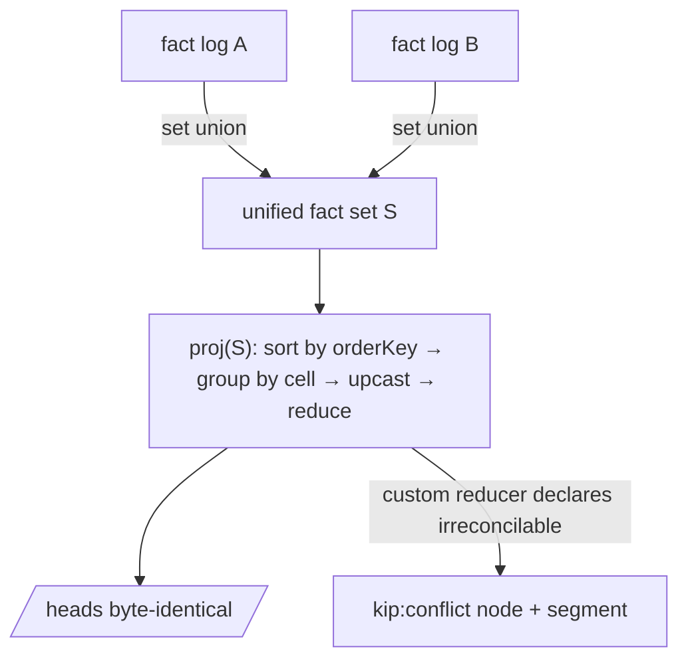
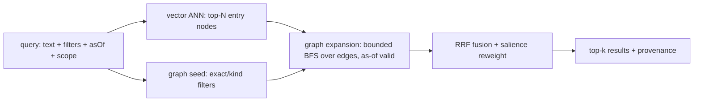

# `@a5c-ai/kip-sdk` — SPEC (v1)

> Status: **Ship-quality v6 (round-6 adversarial findings resolved — M6-1 `key-chain-durable` vs
> per-key-quota contradiction closed via cap-bounded retention + on-demand re-fetch; m6-1 per-`(replicaId,
> key)` chain disambiguation; m6-2 INV-19 non-reversal under the cap; m6-3 re-fetch liveness residual
> stated; builds on v5: C5-1 compositional backdating, M5-1 SEC-corollary scope, M5-2 revocation
> impossibility, m5-1..m5-5)** — 0 CRITICAL across six audits, convergence core unchanged. Spec-only.
> Illustrative TypeScript interfaces are normative for *shape*,
> not implementation. `MUST`/`SHOULD`/`MAY` are RFC-2119 keywords. Companion: `PRIOR-ART.md`
> (research brief). This SPEC **resolves** the hard problems and tensions enumerated there; it does
> not re-derive them. Cross-references like *(HP-4)* point at PRIOR-ART §3 hard problems and *(T-2)*
> at §4 tensions.
>
> **v3 correctness note.** The convergence model is stated in two cleanly separated halves:
> the **substrate state** is a grow-only fact set (a CRDT under union — associative, commutative,
> idempotent), and the **projection** `proj(factSet)` (heads, valid-time geometry, supersession,
> trust/revocation demotion, salience-as-deterministic) is a **single pure total function of that
> set**, order-independent by construction because it sorts facts by one global deterministic key
> before folding. Convergence is then trivial: equal admitted sets ⇒ byte-identical projection. The
> earlier pairwise `merge(base,a,b)` interface and the "valid-time-clipping fold is ACI" claim were
> unsound and have been **removed**.
>
> **v3 headline fix — the SIGNATURE-ONLY INGEST-GATE / PROJ split (C2-1, C3-1..C3-3, M3-4, M3-5).**
> v2 made trust demotion read `rxFrom`, the receiver-assigned *per-replica* transaction time, which
> silently re-broke `proj`-purity. An earlier v3 draft fixed that but relocated the non-determinism into
> **set membership** by gating admission on the receiver's physical wall clock (drift-ε) and on the
> replica's partially-synced key log — making admitted sets able to differ *permanently*. v3 (final)
> draws one bright line and never crosses it: **signature validity is the ONLY thing that can gate
> membership, because it is the only predicate that is a pure function of the fact's own bytes.**
>
> - **INGEST-GATE (signature-validity ONLY — a true G-Set over signature-valid facts).** At ingest a
>   replica admits a fact to the set **iff** (i) it is well-formed (parses; canonical payload
>   reconstructible from `signedFields`) and (ii) its Ed25519 signature over that canonical payload
>   verifies. **NOTHING else gates membership** — not drift, not key-registration, not namespace
>   authority, not revocation. Ed25519 verification is deterministic and a function of the fact's bytes
>   alone, so **every honest replica admits exactly the same set**: the admitted set is a pure function
>   of the *received* facts (a true grow-only set over signature-valid facts). Equal received sets ⇒
>   equal admitted sets ⇒ (proj pure) ⇒ equal heads. The gate **MUST NOT** consult `rxFrom`, the
>   physical clock, the key-registration log, namespace-at-time, or revocation status.
> - **PROJ (set-pure folding + ALL trust demotions).** *Every* trust question —
>   drift/backdating plausibility, key-registration, namespace-authorization, revocation — is a
>   **set-pure demotion inside `proj`**, keyed **only** on author-stamped, signed HLCs already resident
>   in the set (never on `rxFrom`, never on the receiver clock, never on local sync state). A fact that
>   fails any trust question projects `visible-but-untrusted` / **quarantined** — surfaced and
>   queryable, never dropped — and is **re-evaluated automatically as more facts arrive** (monotone,
>   convergent). "Is this fact's key registered / authorized-for-this-namespace / not-yet-revoked, and
>   is its author-HLC causally plausible, **at this fact's own author-HLC** over the admitted set `S`?"
>   is a pure question over `S`.
> - **`rxFrom` is a non-authoritative audit annotation only.** It is **explicitly excluded** from
>   `proj`, from `orderKey`, and from every trust decision. It exists solely for per-replica
>   "believed-then" *audit* reads (§4.3), which are labeled non-convergent and never feed `/heads`.
>
> Because admission is a pure function of received bytes (Ed25519 verify), equal received sets give
> equal admitted sets; and because every input `proj` reads lives in `S`, `proj(S)` is byte-identical
> across replicas (§4b.4). The backdating attack that motivated v2's `rxFrom` check is defended
> **inside `proj`** by a **set-resident causal rule** (a fact's author-HLC must dominate the author-HLC
> of its causal ancestry, and a revoked key's concurrent/backdated facts are demoted), never by a
> receiver clock. **Offline-first and convergence are now compatible** (C3-2): a signature-valid fact
> is *never* dropped, so an offline replica that reconnects has all its locally-authored facts accepted
> by every peer (they verify by signature regardless of age); any still-implausible fact is quarantined
> in `proj`, never discarded, and re-cleared as the facts it depends on arrive.
>
> **v4 headline fixes — separate LOGICAL MEMBERSHIP from DURABLE STORAGE (C4-1), and derive
> anti-backdating from INVOLUNTARY substrate evidence (C4-2/M4-2).** The v3 signature-only gate is sound
> for convergence but bought membership purity with *unbounded storage*: every signature-valid fact was
> admitted and stored forever on every replica, so any keyholder — even an unregistered one — could flood
> every replica (C4-1). v4 draws a **second** bright line, parallel to the gate/proj line:
> **LOGICAL MEMBERSHIP (the G-Set `proj` reads) stays signature-only and unchanged — SEC is preserved
> verbatim — while DURABLE STORAGE is a separate TRANSPORT/REPLICATION-layer policy** (§3.5a Admission
> control & retention) that a replica applies to decide which signature-valid facts it *replicates and
> keeps bytes for*, by per-key quota / capability / proof-of-deposit / trusted-author allowlist. Admission
> control is a **local resource policy, not a `proj` input**: `proj` stays a pure function of whatever set
> a replica holds. The honest consequence (stated plainly, not hidden): admission control means two
> replicas may hold different **subsets** by policy (partial replication), so SEC is restated
> **per-shared-subset** — *for any two replicas, on the intersection of what they both chose to store,
> heads agree* (§4b.4). Trusted-authored durable facts are never evicted; untrusted/quarantined facts from
> unregistered keys are eviction-eligible and never enter durable history.
>
> **Anti-backdating no longer rests on the voluntary, omittable `causedBy` field (C4-2).** v4 adds the
> **per-key author-HLC monotonicity rule**: a key's own facts form a per-key sequence in `S`, and a fact
> `F` from key `K` is demoted backdated/untrusted if `S` contains another admitted fact `F'` from the
> **same** `K` with `author-HLC(F') > author-HLC(F)` while `F` is not an ancestor of `F'` — `K` cannot
> un-emit its higher-stamped facts, so this is **involuntary** (set-pure, not author-forgeable). It bounds
> backdating *relative to the key's own observed activity*; a key that has emitted nothing higher can
> still self-date freely — an acknowledged, acceptable residual (no conflicting history to poison). The
> voluntary `causedBy` closure rule is retained only as a **secondary, tightening** check, plus a new
> `causedBy` well-formedness demotion (acyclic + parent-author-HLC ≤ child). The over-strong "the only
> defense that distinguishes a malicious backdate from an honest late fact" claim is **retracted** and
> replaced with the precise bound above (§8.1).
>
> **Revocation now exposes intent (M4-1).** `revoke-key` carries a `mode`: an **ordinary cutoff**
> (demote only `author-HLC ≥ effectiveFrom` — preserves honest concurrent pre-`T` work, the default) vs a
> **causal/compromise cutoff** (the stronger non-ancestor rule, opt-in, for true key compromise).
> Causally-demoted honest-concurrent facts surface with a **distinct** status `kip:revoked-concurrent`
> (not the generic untrusted bucket) so recall can show them. The honest-loss cost of the compromise mode
> is stated explicitly. **DAG regeneration determinism (M4-3)** pins the exact byte recipe (fixed `+0000`
> offset, integer-seconds, LF-only UTF-8 no-encoding-header message, no `gpgsig`, identical sentinel
> author==committer, deterministic parents); INV-12 asserts byte-identical regenerated commit objects and
> names the required git env normalization.
>
> **v5 headline fix — anti-backdating made EVICTION-SAFE by per-key CHAIN-COMPLETENESS gating (C5-1), SEC
> corollary scoped honestly (M5-1), revocation impossibility stated (M5-2).** Round 4's two fixes were
> individually sound but *mutually undermining*: C4-1's partial-replication/eviction can remove the very
> higher-stamped same-key fact that C4-2's involuntary per-key monotonicity rule reads, so a holder of a
> *registered* key could backdate a fully-trusted fact onto a victim replica whose durable subset lacks
> that key's higher facts (late registration + disk-pressure eviction, both in-spec/default). v5 closes
> this at the root by **reusing machinery already in the spec**: per-key trust is **gated on per-key
> `(wall,counter)` chain completeness** — the exact contiguity rule §4c/m4-1 already defines for
> pin-completeness. A fact `F` from key `K` projects **trusted** only over `K`'s complete gap-free chain
> up to `F`; an evicted/withheld/unreplicated earlier same-key fact yields a gap, so `F` projects
> **`pending`** (not trusted, not rejected) until the chain completes — an evicted higher honest fact can
> therefore **never silently flip a lower backdate to trusted**. A registered key's emission is made
> **`key-chain-durable`** (preferentially retained, §3.5a; the v5 draft made it *never*-evictable, which
> the v6 fix below corrects to a **cap-bounded** retention with on-demand re-fetch — see the v6 headline,
> M6-1), so the evidence the rule reads is normally retained and always completable; an unregistered key's
> facts may be evicted but have no trusted same-key fact to defeat and still `pending`-on-gap. Per-key
> trust is thus a function of `K`'s **complete chain** —
> replica-independent once complete, **monotone and eviction-safe** (INV-16/INV-19). INV-16 is amended:
> "no higher same-key fact" → "no higher same-key fact **in the complete durable chain**." The SEC
> corollary is reworded from "not regressed" to **"preserved on the complete durable subset"** (M5-1) and
> the value-neutrality premise's C5-1 exception is pinned. §8.1 states the **revocation impossibility**
> plainly (M5-2): no set-pure mode both stops a compromised key's sub-`effectiveFrom` backdate *and*
> preserves honest concurrent sub-`effectiveFrom` work — an explicit tradeoff, not a defect. A **global
> aggregate `quarantinePoolBytes` budget** (m5-1) bounds the multi-key flood; the `kip:revoked-concurrent`
> recovery path is mechanized as a **`re-attest` fact** (m5-3).
>
> **v6 headline fix — DECOUPLE backdating-safety from chain RETENTION; the registered-key durable pool is
> CAP-BOUNDED with on-demand re-fetch (M6-1), closing the last internal contradiction.** The v5 C5-1 fix
> used two mechanisms: **(i)** a per-key **chain-completeness gate** (a `(wall,counter)` gap ⇒ `pending`,
> never a silent trusted backdate) and **(ii)** `key-chain-durable` retention (a registered key's chain is
> never evicted). Mechanism (i) alone is the **safety** property; (ii) was a **liveness** aid that
> over-reached into "never evict a registered key's *entire emission*," which (a) reopened the C4-1
> unbounded-durable-storage residual for a registered/compromised key and (b) **contradicted** the spec's
> own "bounded per registered key by quota" claim — a quota that can never evict is not a bound. v6 makes
> `key-chain-durable` **bounded by a per-key `keyChainDurableCapBytes`** (manifest-pinned): a registered
> key's chain is **preferentially retained up to its cap**; past the cap, the *oldest* chain links may be
> evicted. **Safety is unaffected** — the completeness gate (i) makes any resulting `(wall,counter)` gap
> project **`pending`** (never a silent trusted backdate), so an evicted-then-needed link is simply
> **re-fetched on demand** (content-addressed, the mechanism the spec already uses for late registration);
> dependent same-key facts stay `pending` until the link is re-fetched or the chain otherwise completes.
> This makes "bounded per registered key by quota" **true**, removes the INV-18(d) contradiction, and
> leaves the convergence core untouched. INV-18(d) is amended ("retained UP TO the cap; an evicted link
> forces dependent facts `pending`, never trusted"); INV-19's non-reversal is preserved by **pinning the
> completed-chain frontier** (a link that has completed a chain for a non-`pending` dependent is retained
> while that dependent is non-`pending`), so `pending → demoted/trusted` still happens at most once. The
> per-key chain is disambiguated as **per-key** (an author key may emit from multiple replicas), with
> `(wall,counter)` contiguity decided **per-`(replicaId,key)`** (matching the §4c/m4-1 rule it reuses) and
> the monotonicity demotion key-wide (m6-1). The honest **re-fetch liveness residual** (a pre-registration
> chain link LRU-dropped from *every* replica leaves dependent facts permanently `pending` — safe, never a
> wrong trusted value) is stated plainly (m6-3); INV-19 holds under cap-bounded retention (m6-2).

---

## 1. Executive summary

**Thesis.** *kip is a git-substrate, bitemporal, signed-fact property-graph memory whose unit of
synchronization is an append-only signed temporal fact, so that coordinator-free agent replicas
converge mechanically at the substrate and supersede semantically above it, and a context-management
layer can be built entirely on derived, rebuildable projections.*

kip-sdk (Knowledge / Inference / Provenance) is the **ideal core** beneath a future
context-management product. It is a library, not a runtime (cf. Letta pitfall — memory is a
substrate, agents are clients). It provides:

1. A **typed property graph** (nodes, edges, properties, schema/ontology, dual identity) as the
   conceptual surface.
2. A **git object/ref layout** as the *only* durable store: every memory write is a commit; history,
   branching, merge, and sync are git operations specialized with typed semantics.
3. **Bitemporal signed temporal facts** as the *unit of change and the unit of synchronization* —
   the graph is a *projection* of the fact log, never an authoritative store of its own.
4. **Coordinator-free convergence**: HLC-stamped, Ed25519-signed facts form a **grow-only fact
   set** (a CRDT under union); the read model is a **deterministic pure projection** of that set;
   semantic supersession is itself recorded as facts so all replicas fold the *same recorded
   decision*. Convergence = set-convergence + projection determinism (§4b.4).
5. **Hybrid retrieval**: vector candidates → graph expansion → RRF fusion, over
   content-addressed, incrementally rebuildable projections.
6. **Memory semantics**: episodic vs semantic, salience/decay, consolidation, and forgetting via
   **logical tombstone** (signature-preserving) vs **physical excision** (the one authorized
   history-rewrite that frees bytes and breaks pure append-only — stated plainly, §4.5).

### Goals

- G1. Git is the **sole source of truth**. Any projection (graph adjacency, vector index, salience)
  is droppable and rebuildable from git objects alone, deterministically.
- G2. Every change is an **append-only, signed, bitemporal fact** carrying its own version tag.
- G3. **Coordinator-free convergence**: two replicas that have seen the same set of facts compute
  byte-identical **deterministic** projections (heads/graph), independent of ingestion order
  (HP-6, T-4, T-5). Non-deterministic accelerators (ANN/embeddings) are explicitly *out* of this
  byte-identity guarantee (§5.3, INV-5).
- G4. **Stable entity identity** decoupled from content addressing (HP-4, T-1).
- G5. **Incremental projections** keyed off git object hashes — never a monolithic full rebuild
  (HP-2, T-3).
- G6. **Forgetting coexists with immutable history** via tombstone + excision (HP-7).
- G7. **Schema/fact evolution** via versioned upcasters from day one (HP-8).
- G8. A **small, composable, well-typed** core API (the "seams" the context layer plugs into).

### Non-goals

- N1. The context-management layer itself (assembly heuristics, prompt packing, token budgeting).
  kip specs the *seams* (§4c), not the layer.
- N2. The embedding model, LLM, or extraction pipeline. kip consumes embeddings/extracted facts;
  it does not produce them. (cognee ECL lives *above* kip.)
- N3. A query language / SQL surface. kip exposes a typed traversal + retrieval API, not a DSL.
- N4. A network server / replication daemon. kip provides the fact log, sync primitives, and
  transports; deployment topology is a client concern.
- N5. **No fallbacks.** Ambiguous merges surface as typed conflicts; unverifiable facts are
  rejected. kip never silently "picks something."

### Terminology

| Term | Meaning |
|---|---|
| **Fact** | The atomic, immutable, signed, bitemporal unit of change. Asserts or retracts one statement about one node or edge. The *only* writable thing. |
| **Fact set / substrate** | The grow-only set of all delivered facts. A CRDT under union (ACI). The *state* that converges. |
| **Node / Edge** | *Projected* graph entities, reconstructed by `proj` over the relevant facts. Not stored directly. |
| **`proj`** | The deterministic pure total function `proj(factSet) → heads/graph`. Order-independent by construction (§4b.4). |
| **Entity id (EID)** | **Namespaced, cryptographically anchored** stable identity of a node/edge (`<tenant>/<namespaceId>/<localId>`, §3.6). `namespaceId` is a FROZEN genesis id, stable across key rotation/revocation (M2-3). Equality requires equal namespace. |
| **Content id (CID)** | git object id (SHA-1 or SHA-256, fixed per convergence group) of an immutable value. |
| **Projection** | A derived, rebuildable read model. **Deterministic** projections (heads, graph adjacency, salience-with-fixed-weights) are byte-identical across replicas; **accelerator** projections (ANN/embeddings) are best-effort, *not* byte-identical (§5.3). |
| **HLC** | Hybrid Logical Clock stamp on every fact: `(wall, counter, replicaId)` (§4b.1). Author-stamped and signed. |
| **Replica** | An independent kip instance (one agent / one process) with its own branch and its own ingest order. |
| **Valid time** | When a fact is true *in the modeled world* (`validFrom`/`validTo`). May contain **gaps** (Unknown, §4.2). |
| **Transaction time** | **Receiver-assigned, AUDIT-ONLY**: the HLC the *receiving* replica stamps when it first verifies and ingests a fact (`rxFrom`). Used **only** for per-replica "believed-then" audit reads (§4.3), which are explicitly **non-convergent**. `rxFrom` is **excluded from `proj`, `orderKey`, and every trust/revocation decision** (C2-1). |
| **Author-HLC** | The fact's own author-stamped, signed `hlc` (§4.1). The **only** time axis `proj` ever reads — for `orderKey`, valid-time geometry, *and* authorization/revocation/plausibility decisions. Set-resident ⇒ identical on every replica. |
| **INGEST-GATE** | The **signature-validity-only** admission predicate (well-formed ∧ Ed25519 signature verifies). Decides set *membership* only; a pure function of the fact's bytes ⇒ identical on every honest replica; **never** decides a projected value, and **never** consults drift, key-registration, authority, or revocation (C2-1, C3-1, M3-4). §3.2. |
| **PROJ-demotion** | All trust decisions — key-registration, namespace-authorization, revocation, *and* author-HLC causal plausibility (anti-backdating) — made **inside `proj`**, keyed on **author-HLC** over the admitted set. Set-pure ⇒ convergent. A demoted fact is `untrusted`/`quarantined`, never dropped, and re-evaluated monotonically as facts arrive. §3.6, §8.1. |
| **Causal plausibility** | A set-pure anti-backdating rule (replaces the v2-draft receiver-clock drift gate, C3-1/C3-3/M3-1; C4-2 makes its PRIMARY form involuntary; C5-1 makes it eviction-safe): a fact `F` from key `K` projects **trusted** only over `K`'s **complete gap-free `(wall,counter)` chain** up to `F` (else **`pending`**, reusing the §4c/m4-1 pin-completeness contiguity rule, C5-1), and once complete is demoted `untrusted-anachronistic` if `S` holds a **higher-author-HLC, non-ancestor** fact from the **same** `K` **in that complete chain** (per-key monotonicity — reads `K`'s *involuntary* footprint, not forgeable by omitting `causedBy`, C4-2; not defeatable by evicting `K`'s higher facts — an evicted link yields a `(wall,counter)` gap ⇒ `pending`, and a registered key's chain is `key-chain-durable`, cap-bounded with on-demand re-fetch, §3.5a, C5-1/M6-1; contiguity decided per-`(replicaId,key)`, demotion key-wide, m6-1). A *secondary* tightening rule additionally requires `F`'s author-HLC to dominate its *declared* `causedBy` closure over `S`. Compared only to set-resident author-HLCs, never to any receiver clock. §3.6, §8.1, §4b.1. |
| **Authority** | A key (Ed25519) authorized, by a signed chain rooted in the tenant root key, to write a given EID **namespace** and/or perform scoped ops (excise, revoke), **as of an author-HLC interval**. Key-registration, namespace authority, and revocation are **all** proj decisions keyed on author-HLC; **only** signature validity is an ingest-gate predicate. §2.4, §8. |
| **Functionality / Microagent** | A genty microagent (`IsolationMode` `subprocess`/`worker`/`container`) with a declared `inputSchema`/`outputSchema`, invoked as a `MicroagentInvocation` and returning a `MicroagentResult`. The patent's "functionality" (an isolated, single-purpose executable bound to a relation). A **client** of kip, never the substrate: its output is wrapped as signed facts, never written to the graph directly (§5b.1). |
| **Functionality descriptor** | A `MicroagentManifest` (`name`, `version`, `description`, `inputSchema`, `outputSchema`, `isolation`, `runtime{entrypoint, skills, tools, scripts, processes, model, timeout, env}`, `tags`, `builtIn`). Advisory **selection** metadata only — it ranks *which* microagent to dispatch; it **never** gates fact membership (only the Ed25519 signature does, C2-1). §5b.1. |
| **Contextual relation** | An `EdgeKind` whose ontology definition references one or more bound microagent functionalities (`FunctionalityBinding`). The edge declares source/target `NodeKind`s matching the functionality's input/output types; the microagent realizes the hop. The relation is both a navigation edge and a unit of computation (patent). §5b.1. |
| **Query graph / Segment match** | A **contextual query** (known seed instance + desired target `NodeKind` + linkage expression) compiles to a small **query graph** — the patent's "number of **single-step queries**" (one per step = one `MicroagentInvocation`) — matched against a **segment** over the ontology graph via discovery traversal (§5.1/§5.2). A segment is an ordered path in the linear case and MAY be a **dependency DAG** (`Segment.deps`, the patent's "ordered graph comprising a plurality of sub-graphs"), executed in a **deterministic topological order** read purely over `proj`. Compilation is a **pure read over `proj`**; only execution emits facts. Multiple matching segments surface as a typed choice, never silently picked (N5). §5b.1. |
| **Learner microagent** | A microagent that proposes graph edits (candidate `NodeKind`/`EdgeKind`/instance facts) by running the **knowledge-autoencoding loop** (encode → decode → loss → propose) and emits the converged result as **signed `kip:learn` facts** naming inputs + achieved loss. It is a client that *proposes*; `proj` decides what becomes effective (§3.4/C-3). §5b.2. |
| **Reconstruction loss** | A model-relative, **accelerator-class** (non-deterministic, §5.3) distance between a raw artifact and the artifact reconstructed by a decode microagent from candidate graph facts. Used **only** as a convergence/search signal; it is never a `proj` input. The *achieved* loss value is recorded inside a signed `kip:learn` fact for audit, **and is EXCLUDED from `orderKey` and from every reducer/trust decision exactly as `rxFrom` is (C2-1)** — the `kip:learn` winner is chosen by ordinary author-HLC `orderKey`, NEVER by loss. §5b.2. |
| **`kip:learn` / `kip:learn-exhausted` facts** | Reserved `kip:*` system-kinds (cf. `kip:conflict`/`kip:schema-violation`, §3.4/§2.2) authored by the autoencoding loop: on **accept**, a signed `kip:learn` fact (correction-class cell; competing accepted sets ⇒ `kip:conflict`, §3.4) naming inputs + achieved loss + accepted `AssertInput[]`; on **exhaustion**, a signed `kip:learn-exhausted` marker (`gset`/append) and NO accept fact (N5). §5b.2/§6. |
| **Knowledge autoencoding** | The agentic loop `raw → ENCODE → candidate graph facts → DECODE → reconstructed raw → loss → LEARNER proposes edits`, iterated until `loss < threshold` **or** any budget axis caps (`maxIterations` ∨ `maxWallMs` ∨ `maxInvocations` — `converged()` trips `"exhausted"` on the FIRST axis to reach its cap, i.e. the budget is **disjunctive**; it is total over all three, so no unbounded loops). The *search* is accelerator-class; the *output* is a deterministic set of signed facts. §5b.2. |
| **Microagent families (acquisition + learner)** | Three **core** families realizing the patent `data-resource → objects-of-interest → query → acquire` pipeline — **Miner** (pulls candidate instances from external sources), **Discoverer** (expands a query via recall + bounded traversal, §5.1/§5.2), **Ingestor** (normalizes a raw resource into episodic facts, §2.3) — plus **RDF import/export** as an Ingestor specialization and the **Learner** (§5b.2) as a peer grow-the-map family. All emit **signed** facts with source provenance; dedup by EID (= patent node-merge); standalone members are invoked via `runAcquisition` (§6). The set is **open** (the patent's "…and more"): ANY manifest whose output validates as an `AcquisitionResult`/binding `outputSchema` is a family member — edge-bound ⇒ `runContextualQuery`, sourceless ⇒ `runAcquisition` — no core change needed. §5b.3. |

---

## 2. Conceptual model — memory as a typed property graph

### 2.1 Nodes, edges, properties

A node is a typed bag of properties with provenance; an edge is a typed, directed, attributed,
**bitemporal** relationship. This mirrors `packages/atlas` (`AtlasRecord` / `Edge`) but every field
is the *fold* of facts, not an authored file.

```ts
type EID = string;          // namespaced: "<tenant>/<namespaceId>/<localId>"  (§3.6) — namespaceId is the frozen genesis id (M2-3)
type CID = string;          // git object id (hex)
type NodeKind = string;     // schema-defined, e.g. "person", "episode"
type EdgeKind = string;     // schema-defined, e.g. "works_at", "derived_from"
type PropKey = string;
type BlobRef = { blob: CID };                       // tagged: a reference to a large value blob (m-1)
type PropValue = string | number | boolean | null | BlobRef; // large values → tagged BlobRef, never a bare CID string

interface NodeView {
  eid: EID;
  kind: NodeKind;
  props: Record<PropKey, PropCell>;   // each cell carries its own provenance + temporality
  provenance: Provenance;             // latest asserting fact's provenance
}

interface EdgeView {
  eid: EID;
  kind: EdgeKind;
  from: EID;
  to: EID;
  props: Record<PropKey, PropCell>;
  validFrom: HlcOrTime; validTo: HlcOrTime | null;   // valid-time interval (Graphiti-style)
  provenance: Provenance;
}

// A cell projects to a sequence of valid-time segments. Gaps are FIRST-CLASS (Unknown), not errors.
type CellSegment<V = PropValue> =
  | { kind: "value"; value: V; validFrom: HlcOrTime; validTo: HlcOrTime | null; assertedBy: FactId }
  | { kind: "unknown"; validFrom: HlcOrTime; validTo: HlcOrTime | null }   // no covering fact / retracted (M-9)
  | { kind: "conflict"; validFrom: HlcOrTime; validTo: HlcOrTime | null; candidates: FactId[] }; // tied, see §3.4

interface PropCell<V = PropValue> {   // the read unit; produced ONLY by proj, never authored or text-merged
  segments: CellSegment<V>[];         // non-overlapping, ordered by validFrom; gaps appear as `unknown`
}
```

The **cell** (one property of one entity, across valid-time) is the granularity at which `proj`
materializes state. It is **not** a merge unit with its own binary join — it is the *output* of the
single deterministic fold `proj` (§3.4, §4b.4). A cell's segments are non-overlapping; any valid-time
sub-interval with no covering non-retracted assert projects to an explicit `unknown` segment.

### 2.2 Typing / schema / ontology

Schema is a **per-tenant, mutable ontology** (cf. kradle `AgentMemoryOntology`), itself versioned and
stored as facts so schema history is auditable and as-of-queryable.

```ts
interface NodeKindDef {
  kind: NodeKind;
  version: number;                    // schema version → upcaster keying (HP-8)
  props: PropSchema[];
  cellReducer: CellReducerRef;        // per-prop deterministic reducer (§3.4): lww-hlc | max | min | gset | …
  identity: IdentityPolicy;           // how EID namespaces are anchored/validated (§3.6)
}
interface EdgeKindDef {
  kind: EdgeKind; version: number;
  source: NodeKind | NodeKind[]; target: NodeKind | NodeKind[];
  cardinality: "1:1" | "1:N" | "N:1" | "N:M";   // projected/surfaced, NOT a write gate (m-12)
  inverse?: EdgeKind;
  temporal: boolean;                  // bitemporal validity tracked (default true)
  cellReducer: CellReducerRef;
}
```

**Decision: schema is applied in `proj` via versioned upcasters; it is NOT a write-time gate that
rejects facts.** Rejecting facts at write would break set-union convergence: rejection is
order-dependent and replica-relative (a replica on ontology v1 would accept a fact that a replica on
v2 rejects — divergence, M-8). Therefore:

- **Facts are always accepted into the substrate** if their *signature* verifies (the only hard gate,
  §2.4). *Authority* (key-registration, namespace, revocation) is **not** an ingest gate — it is a
  set-pure `proj` demotion (§3.6, §8.1). Schema conformance is **not** a gate either.
- `proj` applies the ontology **as-of each fact's own `validFrom`/version** via declarative upcasters.
  A fact that conforms projects normally. A fact that does **not** conform under the *current* ontology
  (e.g. a required prop a later schema added, an unknown fact version) is **not dropped**: it projects
  to a typed `kip:schema-violation` / **quarantined** segment — visible, queryable, never silently
  lost, and never inventing data (honoring N5 + "no fallbacks").
- Upcasters **need not be total at write time.** `proj` handles unknown/future fact versions by
  **passthrough-as-opaque** (carry the raw payload as an opaque quarantined value) rather than
  throwing. This makes ontology evolution and the no-fallback rule coexist.

*Rejected alternative:* read-time *rejection* (drop non-conforming on read) — discarded: dropping is a
silent fallback and is itself order/version-sensitive across replicas. *Rejected alternative:* the v1
"reject at `assertFact`" gate — discarded: it is the M-8 divergence bug (merge must re-ingest without
re-gating to converge, so the gate cannot hold on the merge path anyway).

**Cardinality and `inverse` are PROJECTED, not write-gated (m-12).** `cardinality` (e.g. `1:1`) is a
multi-cell constraint and cannot be enforced by the cell-local reducer without breaking set-union
convergence (two concurrent `1:1` asserts to different targets must both be accepted). kip therefore
treats cardinality like atlas treats schema: **descriptive**. `proj` **detects** a cardinality
violation (e.g. two valid `1:1` targets at the same valid-time) and surfaces it as a
`kip:cardinality-violation` segment/node — visible and queryable — rather than silently dropping one.
`inverse` edges are **materialized by `proj`** (an `inverse` declaration causes `proj` to project the
reciprocal adjacency), not separately asserted. Neither is a write gate.

### 2.3 Episodic vs semantic

Two co-resident layers in one graph, distinguished by node kind and a `memoryClass` facet, **not** by
separate stores (Mem0 pitfall: a bolted-on second store that doesn't earn its keep).

| Layer | Node kinds (examples) | Origin | Lifecycle |
|---|---|---|---|
| **Episodic** | `episode`, `observation`, `run`, `event` | Direct ingestion (e.g. babysitter journal, à la kradle `parseJournalForImport` — summary-only, never raw). | High volume, time-stamped, **decays**, candidate for consolidation. |
| **Semantic** | `entity`, `concept`, `claim`, `relation` | **Consolidated** from episodic via promotion facts; or asserted directly. | Lower volume, durable, **provenance-linked back** to source episodes. |

`derived_from` edges link semantic nodes to the episodes that produced them — so every semantic claim
is auditable to its episodic source, and forgetting an episode can cascade (§4 decay).

### 2.4 Provenance (first-class on every fact)

```ts
interface Provenance {
  author: ActorId;                    // who/what asserted it (agent, human, importer)
  signature: Ed25519Sig;              // over the canonical payload (= ALL signed fields EXCEPT signature itself)
  publicKeyFingerprint: string;       // SHA-256 of pubkey DER (the SIGNING key fingerprint) — IN canonical payload (M2-1)
  signedFields: string[];             // explicit ordered field set → verifier rebuilds payload
  source?: { uri: string; cid?: CID }; // upstream artifact (journal, doc, message)
  confidence?: number;                // [0,1] — advisory only; never affects mechanical resolution (m-2)
}

// Annotated AFTER durable recording — NOT a signed field, NOT part of FactId, NOT read by proj/orderKey (m-3, C2-1):
interface FactAnnotation {
  commit: CID;                        // commit that durably recorded the fact (post-hoc, transport-only — M2-2)
  rxFrom: HlcStamp;                   // receiver-assigned transaction time; AUDIT-ONLY (§4.2/§4.3). Excluded from proj, orderKey, and all trust decisions (C2-1).
}
```

**Canonical-payload field list (NORMATIVE — closes M2-1).** The canonical signed payload of a `Fact`
is built deterministically from **exactly** these fields, in this order, and the `factCID` is the
content hash of that payload:

`[ v, type, target, value?, validFrom, validTo, hlc, causedBy?, supersedes?, reAttests?, author,
  publicKeyFingerprint, replicaId ]`

— i.e. every author/replica-distinguishing field (`publicKeyFingerprint`, `replicaId`, the schema
version `v`) is **in** the canonical payload. The `signature` field is the **only** field excluded
(one cannot sign over one's own signature); `commit` and `rxFrom` are post-hoc annotations and are
likewise excluded. Consequence: two facts that differ in *any* author/replica/version field have
**distinct `factCID`s**, so `factCID` is a genuine always-unique final tiebreak (re-stated in §3.4
totality, INV-3). `replicaId` here is the author's stamped `hlc.replicaId`, signed, not a receiver
quantity.

Provenance is **signed and verifiable before ingest** (resolving the trust half of HP-6). The
INGEST-GATE (§3.2) admits a fact **iff** it is well-formed **and** its Ed25519 signature verifies over
the canonical payload. **Signature validity is the SOLE membership predicate** — it is the only
predicate that is a pure function of the fact's bytes, so every honest replica admits exactly the same
set (a true G-Set over signature-valid facts). **Key-registration, namespace-authorization,
revocation, AND author-HLC plausibility (anti-backdating) are NOT ingest gates** — they are set-pure
demotions inside `proj` keyed on author-HLC (§3.6, §8.1, C2-1, C3-1/C3-3, M3-4), so an admitted
fact-set is a function of received facts only, identical across replicas, and `proj` over it is pure.
`commit` and `rxFrom` are post-hoc annotations (excluded from `signedFields`, `FactId`, `proj`, and
`orderKey`), so there is no forward-reference circularity (m-3) and no replica-local input to `proj`.

**`confidence` is advisory only** (m-2): it feeds the salience projection but is *never* an input to
the deterministic cell reducer. A higher-confidence fact does **not** beat a later HLC-max fact under
`lww-hlc`; if confidence-weighted resolution is desired, use a custom reducer that reads `confidence`
deterministically (and document it), but the default never does. **Every reducer's final tiebreak MUST
terminate in `orderKey`** (m2-1): a confidence-keyed custom reducer that ties on confidence MUST fall
through to `orderKey`, so totality is structural and a confidence tie can never leave the result
non-deterministic (enforced by INV-3).

---

## 3. Git substrate

### 3.1 Object & ref layout

Git is the *only* durable store. The mapping:

```
refs/
  heads/main                         # the trunk: canonical, merged history
  kip/replicas/<replicaId>           # one branch per replica/agent (T-2 hybrid)
  kip/sessions/<runId>               # short-lived per-session branch, pinned read-set (kradle snapshot)
  kip/projections/<name>@<srcHash>   # CACHE ref: a built projection keyed to its source tree hash
  kip/keys/<tenant>/trusted          # per-tenant authority set (root + delegated keys, §8) — append-only, signed
objects/                             # content-addressed: blobs, trees, commits (+ packs)

# tree layout inside a commit (working tree of the memory):
/facts/<shardHi>/<shardLo>/<factId>.json     # the append-only fact log (one file per fact) — AUTHORITATIVE
/heads/nodes/<eidShard>/<eid>.json           # DERIVED projection cache of proj(facts) — see merge rule below
/heads/edges/<eidShard>/<eid>.json           # DERIVED projection cache
/ontology/nodes/<kind>@<ver>.json            # schema as data, versioned
/ontology/edges/<kind>@<ver>.json
/upcasters/<factType>@<from>-<to>.json       # declarative upcaster descriptors (HP-8)
/manifest.json                               # repo format version, hash algo, clock epoch, GENESIS tenant root key set, shard depth, ε_causal (proj-time causal slack), regenBoundaryRule, quarantineTtlMs + quarantineKeyCapBytes + quarantinePoolBytes (per-key + GLOBAL aggregate retention bounds, §3.5a/m5-1) + keyChainDurableCapBytes (per-registered-key chain cap, §3.5a/M6-1) — IMMUTABLE post-genesis (m2-5)
.gitattributes                               # binds /heads/** AND /manifest.json to the regenerate/reject-not-merge merge driver (below)
```

**Sharding** (`<shardHi>/<shardLo>` = first 2 + next 2 hex of the fact/eid hash, default depth 2)
keeps any single tree small, so prolly-tree-style subtree-hash-skip diffs are cheap and loose-object
fan-out is bounded (HP-3). **Shard depth is a `manifest.json` parameter** (m-8): the fixed 2+2 layout
(65,536 leaves) is the valid band for ≲10⁷ facts; beyond that, `manifest.shardDepth` selects deeper
sharding (e.g. 2+2+2). All replicas in a convergence group MUST agree on `shardDepth` and on the
**hash algorithm** (SHA-1 *or* SHA-256, fixed in `manifest.json`); cross-algo membership in one
convergence group is a **hard error** — object CIDs are not portable across algos, so content-addressed
transfer is impossible (m-6).

**`/heads` is a DERIVED projection cache — committed but NEVER merged (decision, M-3).** This resolves
the T-3 contradiction (committed *and* derived):

- `/facts/**` is the **authoritative append-only log** and the only thing `proj` reads.
- `/heads/**` is `proj(facts)` materialized into the tree so a fresh clone answers point reads without
  a rebuild. It is **advisory**: authoritative truth is always `proj(/facts)`, audited by `kip fsck`
  (INV-1).
- **Merge rule — regenerate, not 3-way-merge.** The repo ships a `.gitattributes` entry
  `'/heads/** merge=kip-regen'` binding a custom merge driver that **discards both sides and recomputes
  `/heads` from the unioned `/facts`**. `/heads` blobs are *never* text/3-way-merged; a naive
  `git merge` cannot produce a head conflict because the driver overwrites them from the re-fold. After
  any merge, `/heads == proj(merged /facts)` by construction.
- *Rejected alternative (a):* do not commit `/heads` at all, rebuild from `/facts` on clone (read cost
  bounded by snapshots). Viable and **halves write amplification** (M-6); we choose (b) committed +
  regenerate-not-merge to keep the "self-contained clone" property, and note (a) explicitly as the
  lower-write-amplification option an embedder MAY select via `manifest.headsCommitted=false`.

**`/manifest.json` is genesis-immutable and NEVER 3-way-merged (m2-5).** The genesis parameters —
hash algorithm, `shardDepth`, `ε_causal` (the proj-time causal-plausibility slack, §4b.1; **not** a
receiver-clock drift bound), the `regenBoundaryRule` (the deterministic commit-batching rule for DAG
regeneration, §4.5/M3-3), clock epoch, and the **genesis** tenant root key set — are
fixed at repo creation and bound to the same regenerate/reject merge driver as `/heads`: a `git merge`
that would conflict on `manifest.json` is a **hard error (fork)**, never a silent 3-way merge of
`shardDepth`/`hashAlgo`/root-keys. Adding a *new tenant* to an existing repo is **not** a manifest
edit: it is either a new repo, or an append-only `tenants/` **fact log** entry signed by a super-root
key (a key-authorization fact, §8.1) — so tenancy growth stays in the convergent fact substrate, not
in the immutable genesis file. Key **rotation/revocation within** an existing tenant likewise never
touches the manifest (the genesis root is permanent; current signing authority moves via the
key-authorization chain, §8.1, M2-3).

Vector/salience-accelerator projections are **NOT** committed (too large, too volatile, and
non-deterministic for ANN — §5.3); they live under `refs/kip/projections/*` cache refs.

### 3.2 A memory write → a commit

The author constructs and **signs** `f` (including its author-stamped `hlc`, §4.1/M-4); kip on the
receiving replica then:

```
ingest(f) ⇒                                       // THE INGEST-GATE: signature-validity ONLY, a pure function of f's bytes (C2-1, C3-1, M3-4)
  1. parse f and rebuild the canonical payload from f.provenance.signedFields  (reject iff malformed)
  2. verify f.signature (Ed25519) over that canonical payload                  (reject iff signature invalid)
     — THIS IS THE ONLY MEMBERSHIP PREDICATE. Ed25519 verify is deterministic and reads ONLY f's bytes.
       NOTHING else gates admission: NOT drift, NOT key-registration, NOT namespace authority, NOT revocation.
       A signature-valid fact is ALWAYS admitted — even if old, even if its key is not yet registered here,
       even if its key is revoked. All of those become proj-time DEMOTIONS (step 6), never drops (C3-1/C3-2/M3-4).
  3. advance this replica's local HLC past f.hlc; assign AUDIT annotation
     rxFrom = receiver HLC (§4.2) — does NOT alter f, its CID, or any projected value
  4. write /facts/<shard>/<f.id>.json   (new blob; if blob already present → no-op, INV-7)
  5. write tree + commit on the replica branch (commit = transport, NOT trust — M2-2)
       commit.message = canonical fact summary
       commit.author  = f.provenance.author        // may differ from commit signer on regenerated DAGs (M2-2)
       commit trailers: Kip-Fact-Id, Kip-HLC, Kip-Sig-Fpr, Kip-Rx-Hlc (audit)
  6. /heads and projections are rebuilt LAZILY (on read, on snapshot, or by the merge driver) —
     NOT eagerly per fact (M-6). proj re-folds only the cells touched by the new fact(s), and it is
     proj — NOT this gate — that decides key-registration, namespace-authorization, revocation, AND
     author-HLC causal plausibility (anti-backdating), keyed on AUTHOR-HLC over the admitted set
     (set-pure, §3.6/§8.1, C2-1/C3-1/C3-3/M3-4). A fact failing any trust question projects
     untrusted/quarantined and is re-evaluated automatically as more facts arrive (monotone).
```

> **NOTE — the gate decides MEMBERSHIP by signature ALONE, never a value, never anything time-/replica-
> local (C2-1, C3-1, M3-4, M3-5).** Steps 1–2 are a pure function of `f`'s own signed bytes (Ed25519
> verification is deterministic and input-only), so every honest replica admits **the same set**: the
> admitted set is exactly the set of *received* signature-valid facts (a true G-Set). A fact admitted on
> one replica but not another would break `S_A = S_B`; therefore the gate **MUST NOT** consult `rxFrom`,
> the receiver's physical clock, the (partially-synced) key-registration log, namespace-at-time, or
> revocation status — every one of those is replica-/time-local and would make membership diverge
> permanently. All of them are set-pure demotions inside `proj` (step 6), keyed on author-HLC. This is
> the bright line that makes `proj(S)` byte-identical across replicas, and it is also what makes
> offline-first and convergence compatible: a fact authored offline and synced late still verifies by
> signature and is admitted everywhere (C3-2).
>
> **NOTE — schema is NOT a gate here (M-8).** There is no "validate against current ontology / reject
> on violation" step either. Ontology is applied later, in `proj`, with non-conforming facts
> quarantined (§2.2), never dropped.

**Commit granularity (decision).** Default is **batched**: a `txn([...facts])` — a *memory
transaction* — produces **one commit** containing many facts (resolving HP-3 / write-amplification M-6:
per-fact commits explode object count, and per-fact `/heads` rewrites multiply tree churn). `/heads` is
**not** rewritten per commit; it is rebuilt lazily (step 6). *Rejected alternative:* one-commit-per-fact
(Datomic-tx-like) — clean but pathological for git object count at agent write rates.

**Durability (m-9).** `assertFact` returns a `{ factId, status }` where `status ∈ {"pending","durable"}`.
A buffered (not-yet-committed) fact returns `"pending"`; the caller MUST treat a `pending` id as
non-durable until a `commit()`/`txn` resolves. `txn` returns only after the commit is the publish
point, so all its facts are `"durable"`. There is no path where a `"durable"` ack precedes the commit.

### 3.3 Branch & commit semantics

```
trunk (refs/heads/main):  o──o──o───────────o (merge)
                               \             /
replica A:                      a1──a2──a3──/
                                     \
session S (pinned read-set):          (no writes; read snapshot @a2)
```

- **commit** = a durable, ordered set of facts on a branch. Commit DAG gives causal order at the
  *batch* level; HLC gives causal order at the *fact* level (§4b).
- **branch** = an independent timeline. `refs/kip/replicas/*` are long-lived (one per agent);
  `refs/kip/sessions/*` are short-lived read pins (kradle snapshot model) and normally carry **no
  writes** (read isolation), or carry session-scratch writes that merge back.
- **as-of a commit** = check out `/heads` at that commit → a complete, self-contained graph snapshot
  with zero rebuild.

### 3.4 Merge & conflict resolution — set-union substrate + deterministic `proj`

The central T-4 / HP-1 decision, **re-stated soundly** (C-1, C-2). Two cleanly separated things:

**(a) The substrate state is a grow-only fact set, and union is the merge.** Facts are immutable and
content-addressed; merging `/facts/**` between branches is **set union of fact blobs** — genuinely
associative, commutative, idempotent. Two replicas that ingested the same facts in any order hold the
*same set* `S`. This — and only this — is the CRDT. There is **no binary cell-merge operator**; the
old `merge(base, a, b)` interface is **removed** (it could not express valid-time geometry and its ACI
claim was unsound, C-1/C-2).

**(b) Heads are a deterministic pure projection of the set.** `proj(S)` materializes `/heads`. It is a
**single total function of the whole fact set**, order-independent *by construction* because it sorts
before it folds:

```ts
// THE deterministic ordering key — used identically on EVERY replica so ties break the same way.
// Reads ONLY author-stamped, set-resident fields. NEVER rxFrom, commit-order, or wall-clock-at-read (C2-1).
type OrderKey = readonly [
  validFrom: bigint, hlcWall: bigint, hlcCounter: number,
  replicaId: string,            // author's stamped hlc.replicaId (signed)
  publicKeyFingerprint: string, // author/signer identity — distinguishes distinct-author identical-content facts (M2-1)
  factCID: string,              // final tiebreak; total because the canonical payload covers ALL author/replica fields (M2-1)
];
function orderKey(f: Fact): OrderKey;   // total order. publicKeyFingerprint precedes factCID so distinct signers never tie pre-CID.

// Per-property reducer: a PURE function over the WHOLE set of facts for ONE cell. NOT a binary op.
type CellReducerRef = "lww-hlc" | "max" | "min" | "gset" | "pncounter" | "custom:<id>";
interface CellReducer<V = PropValue> {
  id: string;
  // Deterministic, total over the fact subset for a cell. No `base`, no pairwise merge.
  reduce(facts: ReadonlyArray<Fact>): CellSegment<V>[];   // input pre-sorted by orderKey
}

// proj is the whole-set fold. Pseudocode (illustrative):
function proj(S: ReadonlySet<Fact>): Heads {
  const sorted = [...S].sort(byOrderKey);                 // ONE global deterministic order
  const byCell = groupBy(sorted, factCellId);            // (eid, prop) | (edge eid) buckets
  for (const [cellId, facts] of byCell)
    heads[cellId] = upcastThenReduce(facts);             // §2.2 upcast/quarantine, then CellReducer
  return heads;
}
```

**Why this converges (and the old version did not).** `proj` never folds pairwise and never depends on
delivery order: it takes the *set*, imposes one total order, and reduces. Equal sets ⇒ identical sorted
sequence ⇒ byte-identical `/heads`. **Valid-time geometry is computed inside `reduce` by a sweep-line
over interval endpoints in `orderKey` order** — a pure function of the set, not "clip the loser as
facts arrive." For `lww-hlc`: over the sorted asserts, at each elementary valid-time sub-interval the
covering value is the `orderKey`-max assert whose `[validFrom,validTo)` contains it; retracts remove
coverage. Three concurrent asserts A,B,C now yield the *same* arrangement regardless of fold order,
because there is no fold order — there is one sort then one sweep (this is the direct fix to the C-1
`(A⊕B)⊕C ≠ A⊕(B⊕C)` counterexample).

**Default reducer `lww-hlc`**: at each valid-time point, the `orderKey`-max covering assert wins.
`gset` (grow-only set) and `pncounter` (positive-negative counter, the correct structure for
retract/re-assert — m of C-2) are the multi-value reducers; `set-union` is an alias for `gset`. A
`gset`/`pncounter` reducer carries per-member/per-increment **tags = the asserting FactId**, so a
`retract` names the exact tags it removes (OR-Set semantics, resolving the "OR-Set without removal yet
supports removal" contradiction — see §4b.2). All reducers MUST be deterministic, total, and a pure
function of their fact subset (INV-3).

**Interval geometry & gaps (M-9).** `reduce` produces **non-overlapping** segments; **gaps are legal
and first-class** (`{kind:"unknown"}`). A `retract` of the middle of `[0,20)` yields `value [0,5)`,
`unknown [5,10)`, `value [10,20)` — a *split*, not a "partition with a hole." Reads in a gap return
`Unknown` (distinct from `null`, which is an asserted absence). INV-4 tests **no-overlap + gap-as-unknown**, not "partition" (the old "no gaps" invariant was self-contradictory with `retract`).

**Existence gates properties — no ghost nodes (m2-2).** `node-existence` is the **gate** cell for an
entity. `proj` evaluates existence first: for any valid-time sub-interval where the `node-existence`
cell is retracted/`unknown` (the node does not exist), `proj` **suppresses** that entity's
`node-prop` segments over the same sub-interval (they project to `unknown`, not a propertied-but-
nonexistent ghost). A `node-prop` assert whose interval extends past an existence retract is clipped to
the existence interval. This is a pure set function (existence and props are both cells folded by the
same `orderKey` sweep) and is tested by INV-4.

**Conflict surfacing (no fallback) — and the per-cell-type resolution table.** kip distinguishes
**commutative** cell types (where a total-order tiebreak is *semantically* the defined answer) from
**non-commutative** ones (where an `orderKey` tiebreak among genuinely contradictory authored
decisions would be an arbitrary winner — a fallback in disguise, banned by N5 and the repo
"fallbacks are evil" rule). The **default** reducer per cell type, and whether it tiebreaks or
surfaces a conflict, is normative:

| Cell type / reducer | Concurrent (neither author-HLC dominates) **same outcome** | Concurrent **different outcomes** |
|---|---|---|
| `lww-hlc` (scalar register) | identical value ⇒ one segment | **commutative-by-definition LWW**: the `orderKey`-max value wins. This *is* the documented semantics of a last-writer-wins register — not a hidden fallback — and is the ONLY cell type allowed to silently total-order contradictory scalar asserts. |
| `gset` / `set-union` | union (idempotent) | union (both members coexist; OR-Set) — no conflict possible |
| `pncounter` | sum (tags dedup) | sum — no conflict possible (commutative) |
| `supersede` (correction) | no-op (same CID, INV-7) | **NON-commutative ⇒ `kip:conflict` surfaced by the DEFAULT reducer** (C2-2). Never `factCID`-tiebroken. |
| `custom:<id>` | reducer-defined; final tiebreak MUST terminate in `orderKey` (m2-1) | reducer **declares** reconcilable (folds) or irreconcilable (`kip:conflict`); silent hash-tiebreak of contradictory outcomes is **forbidden**. |
| `kip:learn` (correction-class, §5b.2) | same accepted set ⇒ no-op (same CID, INV-7) | **NON-commutative ⇒ `kip:conflict`** for competing accepted sets at the same `(rawRef, ontologyAsOf, encode/decode/learner-manifest)` key. The recorded loss is **audit-only, EXCLUDED from `orderKey`/reducer** (like `rxFrom`, C2-1) — NEVER loss-tiebroken. Resolved by a dominating `resolve`-scoped supersede. |
| `kip:learn-exhausted` / `derived_from` (`gset`/append, §5b.2/§5b.1) | union (idempotent) | union (provenance/markers only accrete; no contradiction possible). |
| `same_as` (`gset` of equivalence *assertions* + a derived equivalence-closure, §5b.1) | union (idempotent) | union of the **asserted** edges (the raw `same_as` facts never contradict — they only accrete). The **closure** `proj` derives from them is a separate, total read (see §5b.1 "node-merge identity"): reflexive/symmetric/transitive over the admitted `same_as` set, bounded, order-independent, with a **total canonical-EID rule** (min by `(namespaceId, localId)` byte-order — `tenant` is redundant because `namespaceId` is a globally-unique genesis fingerprint, so the 2-tuple is already total across tenants). A `not_same_as`/distinct-EID assertion that **contradicts** a derived equivalence surfaces `kip:conflict` on a keyed correction cell for the disputed pair, **canonicalized to the ordered `(min, max)`** under that same `(namespaceId, localId)` order so both replicas rendezvous on one CONFLICTED cell — **never** a silent merge or a silent split. |
| microagent-registration (`supersede`/correction-class on `(name,version)`, §5b.1) | **byte-identical** manifest (same `factCID`) ⇒ no-op (INV-7) | **NON-commutative ⇒ `kip:conflict`** if two registrations of the same `(name,version)` carry **divergent** manifests (a versioned descriptor is immutable) — **never** an `orderKey`-max silent LWW overwrite of an incompatible descriptor (that would be the N5 fallback the prose forbids). This is a correction-class cell, **not** `lww-hlc`: the `(name,version)` key admits exactly one descriptor value, and divergence is a hard conflict resolved only by a dominating `resolve`-scoped supersede (bump the `version` to publish a changed descriptor). |

A `conflict` segment therefore arises (1) when a **custom** reducer declares irreconcilability, **or**
(2) — newly, C2-2 — when the **default** `supersede` handling sees two concurrent supersede facts over
overlapping `inputCids` asserting **different** outcomes. In both cases kip emits a `kip:conflict` node
and the segment reads `CONFLICTED`; kip does **not** pick a value by hash. The resolution is itself a
new authored fact (a dominating supersede, §3.4 below / §4b.3), so it converges. Read semantics for
`CONFLICTED` cells are **defined** (m-4): `getNode`/`recall` return the cell with `kind:"conflict"` and
the full `candidates: FactId[]`; callers MUST handle it explicitly (recall ranks a conflicted node by
its salience but surfaces all candidate values rather than choosing one).

**Semantic supersession is also a pure function of the set (C-3).** Supersession facts are *just more
facts*; `proj` applies them by the same `orderKey`. If supersession is LLM-assisted, **the LLM's
decision is recorded as a signed `supersede` fact** (an assertion naming the input fact CIDs it acted
on and the corrective `retract`/`assert` it implies), keyed by that input-CID set. Therefore:

- All replicas fold the **same recorded decision** — they never independently re-run the LLM during
  `proj` (proj is pure and LLM-free). 
- Re-running the supersession *pass* over the same input CID set producing the **same** outcome is a
  **no-op** (the corrective fact already exists, same CID, INV-7) — so two replicas running the pass
  converge instead of emitting contradictory corrections.
- **Concurrent CONTRADICTORY supersede (C2-2 — no silent hash tiebreak).** If two replicas emit
  *different* `supersede` facts over the same/overlapping `inputCids` (e.g. different model versions)
  asserting **different** outcomes, and **neither author-HLC dominates the other** (genuinely
  concurrent), the **default** supersede reducer does **not** pick one by `factCID`. It emits a typed
  `kip:conflict` cell/marker naming both candidates. This is byte-deterministic (the conflict marker
  is a pure function of the set) **and** honest (it surfaces absence-of-agreement instead of laundering
  a hash winner as consensus). **Convergence of the marker is contingent on admitted-set convergence**
  (M3-1): if replica A has both supersedes and B has only one, A reads `CONFLICTED` and B reads clean —
  they agree only once the sets equalize. Under the signature-only gate this **is** guaranteed (every
  signature-valid fact is admitted everywhere, §3.2/§4b.4), which is exactly why the gate fix is load-
  bearing for conflict convergence too.
  - **Resolution is SINGLE-WRITER per `inputCids` and provably terminating (M3-1).** A `kip:conflict`
    leaves `CONFLICTED` only via a new authored `supersede` over the same/overlapping `inputCids`
    **signed by a key holding the `resolve` scope** (the namespace-owner key or a key delegated
    `resolve`, §8.1). Because resolution authority is **single-writer per `inputCids`**, two adjudicators
    cannot *both* be authoritative: among facts that strictly dominate both originals **and** carry the
    `resolve` scope, the cell takes the **`orderKey`-max** one — a total-order pick that is semantically
    defensible **only here**, because the authorized adjudicator explicitly claimed authority to override
    (it is not a hidden tiebreak of un-adjudicated contradictory data). This **terminates**: the
    adjudication ladder cannot ping-pong, since any new dominating resolve must itself come from the
    single-writer authority and is ordered against prior resolves by `orderKey`; the set-pure
    `orderKey`-max among `resolve`-scoped dominators is the unique fixpoint. A dominating `supersede`
    **without** the `resolve` scope does **not** clear the conflict (it is just another candidate),
    so unauthorized concurrent "resolutions" cannot reopen the ladder.
  There is no default total-order tiebreak for contradictory supersessions among non-adjudicators —
  that path is reserved for the genuinely commutative cell types in the table above (`lww-hlc`, `gset`,
  `pncounter`) and for `resolve`-scoped adjudication.
- The *bytes of `/heads` are a function of the set only*, never of which replica ran the pass when.
  This is the precise C-3/C2-2 fix: the semantic layer's order-sensitivity is **frozen into a recorded
  fact** before it can affect convergence, and contradictory recorded decisions surface rather than
  silently arbitrate.



### 3.5 GC / packing / history bloat

(HP-3, content-addressed pitfall.)

**Honest storage model (M-6).** kip storage is **monotonically growing by design** — immutable
history keeps every fact reachable. Two distinct axes must not be conflated:

- **Read latency** (how many facts `proj` traverses) — reclaimed by *rollup* and *snapshots*.
- **Bytes on disk** (reachable objects) — reclaimed **only by excision/gc of unreachable objects**.
  Rollup does **not** free bytes while old commits remain reachable.

- **Write amplification.** A memory transaction (§3.2) is *one* commit for *many* facts, and `/heads`
  is rebuilt **lazily** (not per fact), so per-fact tree churn is one fact blob + its path trees, not a
  head-blob rewrite per fact. Embedders who set `manifest.headsCommitted=false` (§3.1) avoid committing
  `/heads` entirely, roughly **halving** write amplification at the cost of a clone-time rebuild. The
  spec states this tradeoff explicitly rather than assuming committed heads are free.
- **Packing.** kip schedules `git repack`/`gc` after N commits or M loose objects. Delta compression
  across same-shard fact blobs helps (shared envelope) but is **modest** on payloads that differ —
  do not assume it offsets growth; it does not.
- **Snapshot / rollup (read latency only).** A **rollup** writes a `kip:rollup` marker fact recording
  the covered HLC range + the pre-rollup tip CID, and materializes a `/heads` snapshot at a chosen
  commit so reads after the rollup **bound traversal cost** (read from the snapshot forward). The old
  fact blobs **remain reachable** (auditability: "history before T is summarized at CID X") and are
  **not** freed. Byte reclamation requires excision (§4.5).
- **Excision vs gc.** Ordinary gc removes only *unreachable* objects. *Forgetting* (deliberate, byte
  reclaiming fact removal) is the distinct, authorized, history-rewriting operation §4.5 — the **one**
  thing that frees the bytes of reachable facts, and the **only** operation that breaks pure
  append-only.

### 3.5a Admission control & retention — bounding storage WITHOUT touching membership (C4-1)

(C4-1 — the headline round-4 fix. The signature-only gate makes *logical membership* a pure function of
bytes, which is what SEC needs — but it must **not** force every replica to keep the bytes of unlimited
facts from unlimited unregistered keys forever. v4 separates **two layers cleanly** and never lets the
second touch the first.)

**Two layers, stated explicitly.**

1. **LOGICAL membership (the G-Set `proj` reads).** Unchanged from v3: a fact is *logically* a member
   of the set a replica `proj`s over **iff** it is signature-valid (§3.2) **and** the replica currently
   holds it. Signature-validity is still the **sole** membership *predicate*; `proj` is still a pure
   function of whatever set the replica holds (§4b.4). **Nothing in this section changes `proj` purity or
   the SEC theorem's form** — it only changes *which* signature-valid facts a replica chooses to
   replicate and durably store.

2. **ADMISSION CONTROL & RETENTION (transport/replication-layer policy — N4, NOT a `proj` input).** A
   replica applies a **local resource policy** to decide which signature-valid facts it
   **replicates / stores bytes for**. This policy is enforced when *accepting a push* or *fetching*, at
   the **transport layer**, and is **explicitly excluded from `proj`, `orderKey`, and every trust
   decision** (exactly as `rxFrom` is). It is a liveness/DoS control, distinct from the convergence
   guarantee. A replica MAY admit-and-store a signature-valid fact based on any of:

   - **Per-key quota** keyed on the signing-key fingerprint (bytes/facts per key per epoch);
   - **Capability token / proof-of-deposit / proof-of-work** presented with the push;
   - **Trusted-author allowlist** = the **set-resident** registered-key set (a key with a genesis-rooted
     `KeyAuthorization ≤ the fact's author-HLC`, §8.1), **tenant-scoped**. A registered key's **trusted**
     (in-namespace, non-revoked, plausible) facts are `durable` and **always durably stored** (never
     evicted) — honest authors are never starved. A registered key's **untrusted/anachronistic** facts
     (which still anchor its `(wall,counter)` chain) are `key-chain-durable` — preferentially retained up
     to `keyChainDurableCapBytes`, not unconditionally (M6-1, next).

**Retention model (set-pure eligibility, transport-local enforcement).** `proj` computes, as a pure
function of `S`, a per-fact **`RetentionClass`** that the transport layer reads to decide eviction. It is
**not** a `proj` *value* and never feeds `/heads` — it is metadata about durability, derived set-purely
so every replica computes the *same class* for the same fact:

```ts
type RetentionClass =
  | "durable"             // trusted (registered, in-namespace, non-revoked, plausible) — NEVER evicted
  | "key-chain-durable"   // a KEY's OWN emission (a fact authored by registered key K, including its
                          //   own quarantined/anachronistic facts) — PREFERENTIALLY retained up to a
                          //   per-key keyChainDurableCapBytes cap, because K's complete (wall,counter)
                          //   chain is the substrate the per-key anti-backdating rule reads (C5-1).
                          //   Past the cap, oldest chain links may be evicted; an evicted-then-needed
                          //   link is re-fetched on demand, and dependent same-key facts stay `pending`
                          //   (via the completeness gate, §3.6) until re-fetch — SAFE, never trusted
                          //   silently (M6-1). Pinned the moment K acquires a set-resident KeyAuthorization.
  | "quarantined-ttl"     // signature-valid but proj-demoted, from an UNREGISTERED key:
                          //   stored under a BOUNDED ttl/byte-cap; eviction-eligible under pressure
  | "evicted";            // bytes reclaimed; re-fetchable on demand if it later becomes durable
```

- A **`durable`** fact (trusted author) is **never evicted**: its bytes are pinned in durable history.
- A **`key-chain-durable`** fact is **any fact authored by a key `K` that holds a set-resident
  `KeyAuthorization`** (registered at *some* author-HLC), **whether or not that individual fact projects
  trusted** — including `K`'s pre-registration, anachronistic, or out-of-namespace facts. **It is
  PREFERENTIALLY RETAINED up to a per-key `keyChainDurableCapBytes` cap (manifest-pinned); past the cap,
  the OLDEST chain links may be evicted (M6-1 — bounded, not "never-evict").** Rationale: the per-key
  anti-backdating rule (§3.6) and the per-key chain-completeness gate it now requires both read `K`'s
  **own complete `(wall,counter)` chain** in `S`; the chain must be *available* for honest registered
  facts to leave `pending`. **The safety, however, does NOT require never-evicting it** — it rests on the
  **chain-completeness gate alone** (§3.6 step (i)): an evicted higher-stamped honest fact leaves a
  `(wall,counter)` gap, and a gap projects **`pending`** (never a silent trusted backdate). The cap
  therefore buys *liveness* (keep the working set local so completion is reachable without re-fetch), not
  *safety*. **When a chain link is evicted past the cap and a dependent same-key fact later needs it, the
  link is re-fetched ON DEMAND** (content-addressed; any peer that still holds the blob serves it — the
  same mechanism §3.5a already uses for late registration); until it is re-fetched (or the chain otherwise
  completes), every dependent same-key fact projects **`pending`** (not trusted, not rejected). So per-key
  trust is a function of `K`'s **complete chain** — replica-independent once complete — and a replica that
  has evicted part of `K`'s chain simply reads dependent facts `pending`, never a divergent trusted value.
  This pool is therefore **authenticated and genuinely quota-bounded** (per registered key by
  `keyChainDurableCapBytes`, §8.1) — bounded, not unbounded (m5-4, M6-1 contradiction closed). The class
  is pinned the instant `K` acquires a set-resident `KeyAuthorization`; before that, `K`'s facts are
  `quarantined-ttl` (next bullet) and an eviction of a pre-registration fact instead forces **`pending`**
  trust on later same-key facts via the completeness gate (§3.6) — either branch is safe
  (retained-and-readable, re-fetched-on-demand, or evicted-and-gap-forces-pending), never
  silently-trusted-backdate.
  - **Completed-chain-frontier pinning (keeps INV-19 non-reversal true under the cap — m6-2).** Eviction
    past `keyChainDurableCapBytes` follows the **frontier of completed-chain evidence**, not the whole
    emission: a chain link that has **completed `K`'s chain for a currently non-`pending` (trusted or
    demoted) dependent fact** is **pinned (not re-evictable) for as long as that dependent is non-`pending`**.
    Only *historical* links not currently backing a non-`pending` dependent are eviction-eligible. This
    bounds bytes (only the completion frontier is pinned, not every historical link) while guaranteeing a
    fact that has already left `pending` never re-opens its gap, so the `pending → trusted/demoted`
    transition is **monotone (at most once, never reverses)** even under cap-bounded retention with
    on-demand re-fetch (INV-19).
- A **`quarantined-ttl`** fact (signature-valid, from an **unregistered** key — no set-resident
  `KeyAuthorization` for its signing key at *any* author-HLC) is stored under a **bounded TTL and a
  per-key byte-cap** (manifest parameters `quarantineTtlMs`, `quarantineKeyCapBytes`) **and a GLOBAL
  aggregate byte budget** (next paragraph, m5-1). When a cap/TTL/budget is exceeded or disk pressure
  hits, its **bytes** become **`evicted`** — reclaimed by excision/gc of the now-unreachable blob.
  Eviction removes bytes, **not** logical membership: an evicted unregistered fact contributes
  **nothing** to `/heads` whether stored or evicted (it projected `quarantined`, which never covers a
  cell), so dropping its bytes **cannot change `proj`** of any *trusted* fact. **It also cannot silently
  flip a same-key backdate to trusted**, because (i) the authoring key is unregistered, so it has no
  *trusted* same-key fact whose monotonicity check could be defeated, and (ii) any later evaluation of a
  same-key fact across an evicted predecessor finds a `(wall,counter)` gap and projects **`pending`**,
  not trusted (§3.6 completeness gate). If a registration for the key later arrives, **all** of the key's
  facts flip to `key-chain-durable` and are **re-fetched on demand** (content-addressed; any peer that
  still holds them serves the blob) so no honest late-registered fact — or its chain — is lost.
- **Aggregate quarantine ceiling — the unlimited-identity defense (m5-1).** A per-key cap alone is **not**
  a global bound: an attacker mints `N` fresh unregistered keys and consumes `N × quarantineKeyCapBytes`,
  i.e. unbounded again. The retention policy therefore enforces a **manifest-pinned GLOBAL
  `quarantinePoolBytes` budget across ALL unregistered keys**, reclaimed by **LRU/TTL eviction over the
  whole `quarantined-ttl` pool** (oldest/least-recently-touched bytes first), independent of key count.
  The **TTL is the time-ceiling** (a fact is droppable after `quarantineTtlMs` regardless of key) and
  **`quarantinePoolBytes` is the space-ceiling** (the pool never exceeds it regardless of `#keys`); the
  per-key `quarantineKeyCapBytes` is a *fairness* sub-limit so one key cannot monopolize the pool, **not**
  the aggregate bound. With both, an `N`-key flood cannot refill the pool faster than TTL/LRU drains it.
- **Eviction is local and policy-driven, so two replicas may hold different SUBSETS** of the
  `quarantined-ttl` facts (one evicted, one not) — and, past the cap, of a registered key's
  `key-chain-durable` chain too. This is a **partial-replication** model. It is sound precisely because
  (i) evicted facts are non-durable-or-not-currently-load-bearing and project nothing trusted, **and**
  (ii) per-key trust is gated on **chain completeness** (§3.6 step (i)), so wherever a replica's held
  subset is *not* complete for a covering key — whether because an unregistered key's fact, or a
  cap-evicted registered chain link, is missing — that key's dependent facts project **`pending`**, never
  a divergent *trusted* value. An evicted registered-chain link is re-fetched on demand so the chain can
  complete; until then the dependent reads `pending` (safe). See the **per-shared-subset SEC restatement**
  in §4b.4.

**Why this bounds the C4-1 attack while preserving v3's convergence.** The unlimited-identity vector is
**unregistered keys** (registration is proj-time, so a fresh keypair's facts are admitted logically). v4
makes their **bytes** the bounded resource: an unregistered key's flood is `quarantined-ttl`, capped
per-key, **bounded in aggregate by the global `quarantinePoolBytes` budget (m5-1)**, and evicted under
pressure — it can never force unbounded durable growth, and it never affects `/heads` (those facts
project `quarantined`). Registered honest authors are `durable`/`key-chain-durable` and converge exactly
as in v3. The quota is moved to **transport**, so **membership purity is preserved AND availability is
bounded**. Excision/revocation still demote-not-delete in `proj` (§4.5/§8.1); **retention eviction** is
the new, separate, *byte-reclaiming* path for non-durable facts — the missing back-pressure the v3 model
lacked.

**Why eviction is anti-backdating-safe (C5-1) — safety rests on the gate, not on retention (M6-1).** The
per-key anti-backdating rule (§3.6) reads `K`'s own same-key facts in `S`. The **safety** property (no
eviction ever flips a same-key backdate to *trusted*) is closed by the **chain-completeness gate alone**:
any absent same-key fact — evicted, withheld, never-replicated, or cap-evicted — leaves a `(wall,counter)`
gap, and a gap projects **`pending`**, never trusted. `key-chain-durable` retention (cap-bounded, M6-1) is
a **liveness** aid layered on top — it keeps the chain local so honest registered facts complete without
re-fetch — *not* a safety requirement; even fully relaxed, safety survives via the gate, at the cost of a
dependent fact sitting `pending` until re-fetch. Both readings reuse the per-key `(wall,counter)`
contiguity rule already defined for pins (§4c/m4-1), with **no new machinery**:
- For a **registered** key, its facts are `key-chain-durable` — **preferentially retained up to
  `keyChainDurableCapBytes`**, so `K`'s complete `(wall,counter)` chain is normally available locally and
  honest registered facts project trusted without re-fetch. **Safety does not depend on this retention**:
  if a chain link is evicted past the cap, the completeness gate (§3.6 step (i)) makes the resulting gap
  project **`pending`**, never a silent trusted backdate; the link is re-fetched on demand to complete the
  chain. The monotonicity evidence therefore cannot be *silently* evicted away into a trusted backdate —
  the worst case is a dependent fact stuck `pending` until re-fetch (M6-1).
- For an **unregistered** key, its facts are `quarantined-ttl` and evictable, **but** the key has no
  trusted same-key fact to defeat; and §3.6 now gates per-key trust on **chain completeness**: a fact `F`
  from `K` projects **trusted** only over a gap-free `(wall,counter)` chain of `K` up to `F`'s
  author-HLC. If an earlier same-key fact is evicted/withheld/unreplicated, the gap forces `F`
  **`pending`** (not trusted, not rejected) until the chain is complete. So an evicted higher fact can
  never *silently* flip a lower backdate to trusted — the gap makes the dependent projection `pending`.
Per-key trust is therefore a function of `K`'s **complete-for-`K` durable chain**, which is
**replica-independent once complete** — eviction-safe and monotone (it only ever *adds* trust as the
chain completes, never removes it).

**What this does NOT do (honest bound).** A replica that *chooses* a permissive policy (store everything)
is still exposed to disk growth — admission control is a **MAY**, the *mechanism* not a mandate; the spec
makes it expressible and pins the set-pure `RetentionClass`, leaving the policy aggressiveness to N4
ops. It also does not bound an attacker who obtains a *registered* key (that is the insider threat, bounded
**now genuinely by the per-key `keyChainDurableCapBytes` cap (M6-1)** + revocation §8.1, **and — for
backdating — by the per-key chain-completeness gate, which `pending`s/demotes any backdate that violates
`K`'s own chain**, C5-1). The residual that remains is precise: a registered key can still self-date a
*lone* fact at an author-HLC **below all of its own existing facts** only if that fact begins a fresh
contiguous chain segment with no lower same-key fact (genuine first-emission), exactly the acknowledged
§3.6 residual — not a fact that contradicts a higher same-key fact in its chain. The guarantees are:
**(a) no UNREGISTERED key can force unbounded DURABLE growth on a replica applying the default retention
policy; (b) no eviction or partial replication can flip a same-key backdate from `pending`/`demoted` to
`trusted` (C5-1); (c) a REGISTERED key's durable chain is now bounded by `keyChainDurableCapBytes`, so a
registered/compromised key can no longer force unbounded non-evictable durable bytes (M6-1).**

**Re-fetch liveness residual — stated honestly (m6-3).** Cap-bounded retention plus on-demand re-fetch
introduces one narrow, *safe* liveness cliff. A key registered *after* its pre-registration facts have
already aged out of **every** replica's `quarantined-ttl` pool (the global `quarantinePoolBytes` LRU can
drain a blob on all replicas under correlated pressure) — or a `key-chain-durable` chain link evicted past
the cap on every replica that ever held it — leaves **no peer to re-fetch from**, so the chain **cannot
complete**, and every dependent same-key fact stays **`pending` permanently**. This is **safe** (it never
yields a wrong *trusted* value — `pending` is a labeled not-yet-known, §3.6) but it is a genuine, honest
**liveness loss**, not a bug. **Mitigation:** `key-chain-durable` chains are preferentially retained up to
`keyChainDurableCapBytes`, and operators **size the cap (and `quarantineTtlMs`) to the working set** and
**register keys before their pre-registration facts' `quarantineTtlMs` elapses**, so the working chain is
retained somewhere and re-fetch succeeds. This residual is listed as an accepted non-core bound in §8.3b/§9.

### 3.6 Content-addressing vs stable identity (the dual-id scheme)

(HP-4, T-1, **C-5** — resolved.) kip maintains **both** layers and declares which is authoritative
for equality:

- **CID (content id)** = git object id. Authoritative for **integrity, dedup, and sync** (Noms: send
  only missing chunks). Identical fact/value content stored once, repo-wide.
- **EID (entity id)** = a **namespaced, cryptographically anchored** stable id. Authoritative for
  **identity/equality over time** ("the same entity").

**EID structure (C-5 — identity is no longer a forgeable bare string):**

```
EID = "<tenant>/<namespaceId>/<localId>"

  tenant       — the tenancy root (matches a key set under refs/kip/keys/<tenant>/trusted)
  namespaceId  — a STABLE namespace id == fingerprint of the GENESIS authority that created the
                 namespace, FROZEN at creation. It is NOT the current signing key's fingerprint, so
                 key rotation/revocation NEVER changes the EID (M2-3). Alternatively a registered
                 natural-key-class id whose collisions are intended (see below).
  localId      — author-chosen local name, OR a content/natural-key HASH within the namespace
```

**`namespaceId` is a STABLE genesis id, not a revocable key fingerprint (M2-3).** v2 embedded the
*current authority key's* fingerprint in the EID string, so any key rotation (routine hygiene, or
forced by the C-6 revocation v2 added) orphaned the entire namespace — the new key minted a *different*
namespace and could never write the old entities. v3 fixes this at the root: `namespaceId` is the
fingerprint of the **genesis** authority *frozen at namespace creation*, and **write authority over
that fixed namespace moves across keys via the key-authorization chain** (§8.1). Rotating
`Kfpr1 → Kfpr2` is a key-authorization fact granting `Kfpr2` `write` over the *same* `namespaceId`;
the EID never changes, the namespace is never orphaned, and **revoking the old key never retroactively
invalidates facts it signed before `effectiveFrom`** (those remain trusted up to the author-HLC cutoff,
§8.1, M2-5). Cross-tenant references work iff a `grant` fact (§8.2) authorizes a tenant-A key to
**reference** (read) tenant-B's namespace; writes remain namespace-gated to authorized keys.

```ts
type IdentityPolicy =
  | { kind: "authority-local" }                 // localId minted by the owning authority; collisions impossible across authorities
  | { kind: "natural-key"; keyProps: PropKey[] } // localId = hash(canonical(keyProps)); collisions are INTENDED matches
  | { kind: "content-seeded-frozen" };          // localId = hash(seed content), frozen at creation
```

**Equality requires same namespace.** Two references are the same entity **iff equal full EID**
(tenant + namespaceId + localId all equal). Because `namespaceId` is the *frozen genesis* id (not a
rotating key fingerprint), this equality is **stable across key rotation/revocation** (M2-3). A bare
`localId` collision across **different namespaces or tenants is NOT a match** — it is two distinct
entities. This kills the v1 "equal string ⇒ same entity across tenants" hazard (C-5.2): `concept/auth`
minted under two different genesis namespaces are two EIDs (`A/ns1/auth` vs `B/ns2/auth`), never
silently merged. Where collision *is* desired (two records of the same real-world person), use a
`natural-key` policy whose `keyProps` are explicit, so the merge is intentional and auditable — not
accidental.

**Write authority is cryptographically bound, and demotion is SET-PURE (C-5.1, C-5.3, C2-1).** A fact
asserting about an EID is **authoritative iff its signing key was authorized for that EID's
`<tenant>/<namespaceId>` AT THE FACT'S OWN AUTHOR-HLC** — a pure question over the admitted set
(the key-authorization facts and their `effectiveFrom`/revocation `effectiveFrom` are all in `S`, all
in author-HLC space). Concretely:

- This authorization decision is made **inside `proj`**, keyed on **author-HLC**, **never** on `rxFrom`
  or "this replica's ingest HLC" (C2-1). Two replicas with the same admitted set therefore make the
  **same** authorization decision for every fact ⇒ byte-identical `/heads`.
- A fact whose signing key was **not** authorized-for-the-namespace at its author-HLC projects as
  **`untrusted`**: `proj` marks its segments `untrusted` and the default `lww-hlc` reducer **ignores
  untrusted asserts** when a trusted assert covers the interval. The fact is still admitted to the set
  and queryable (surfaced, never silently dropped — N5); it simply loses to trusted asserts. A
  low-privilege or cross-tenant key therefore **cannot overwrite** an entity's authoritative head
  (fixes the EID-hijack of C-5.1) **without** any per-replica ingest decision affecting the value.
- **Key-registration is a `proj`-time demotion, not an ingest gate (M3-4).** A fact whose signing key
  has **no set-resident registration fact** (no `KeyAuthorization` for that key chaining to the genesis
  root, §8.1) projects `untrusted`/`quarantined` — exactly as an out-of-namespace fact does. It is
  still admitted to the set. The moment the key's registration fact arrives in the set, the fact
  **automatically becomes trusted** on re-fold (monotone, convergent): registration-ordering races
  (data fact arrives before its key's registration) resolve set-purely and **no fact is ever lost** to
  a sync-order race. This collapses the gate to a *single* truly-objective predicate (signature) and
  removes the second membership-divergence axis the v2-draft key-log gate introduced.
- **Anti-backdating is derived from the author's INVOLUNTARY same-key footprint, not the voluntary
  `causedBy` field (C4-2/M4-2 root fix; supersedes the v3 `causedBy`-only rule).** The v3 rule read only
  the fact's *own* signed `causedBy` closure — an **optional, author-controlled** field — so a registered
  key could backdate freely by simply omitting `causedBy` (vacuous ancestry ⇒ no demotion). v4 makes the
  primary anti-backdating bound **per-key author-HLC monotonicity**, which reads the author's *involuntary*
  footprint in `S` and is **not** author-forgeable:
  - **PRIMARY — per-key HLC monotonicity, GATED ON PER-KEY CHAIN COMPLETENESS (set-pure, involuntary,
    eviction-safe — C4-2 primary + C5-1 root fix).** Every key `K`'s own facts form a per-key
    `(wall,counter)` sequence in `S` (gap-free by construction at the author, §4b.1/§4c m4-1). A fact `F`
    from key `K` is evaluated as follows:
    - **(i) Chain-completeness gate (C5-1).** `F` may project **trusted** only if the replica holds the
      **complete, gap-free `(wall,counter)` chain of `K`'s facts up to `F`'s author-HLC** — the *exact*
      per-key contiguity rule already defined for pin-completeness (§4c/m4-1, INV-14). If any earlier
      same-key fact below `F` is **missing / evicted / not-yet-replicated** (a `(wall,counter)` gap in
      `K`'s chain below `F`), `F` projects **`pending`** — *not* trusted, *not* rejected — exactly like a
      `pin-incomplete` read, and is **re-evaluated monotonically** as the missing chain links arrive. This
      makes per-key trust a function of `K`'s **complete-for-`K` durable chain**, which is
      **replica-independent once complete**: an evicted or withheld higher honest fact from `K` can
      **never silently flip a backdated lower fact to trusted**, because the very gap that hides the higher
      fact also leaves the chain incomplete, so the backdate is `pending` (not trusted) until the chain —
      including that higher fact — is present, at which point the monotonicity rule (ii) demotes it. The
      gate reads only **local-chain contiguity** (locally decidable, §4c m4-1), so it stays set-pure.
      - **What "`K`'s chain" means — per-key, contiguity per-`(replicaId,key)` (DISAMBIGUATED, m6-1).** An
        author key `K` MAY emit from **multiple `replicaId`s** (a shared service key, or a key rotated
        onto two agents), so "`K`'s chain" is **per-key across all replicaIds `K` used**, ordered by `K`'s
        global emission in **author-HLC** order. There is no single `(wall,counter)` sequence spanning two
        replicas; the gate therefore decides **`(wall,counter)` contiguity per-`(replicaId, key)`** —
        exactly the §4c/m4-1 rule — requiring, for **each** `(replicaId, key)` pair `K` used at or below
        `F`'s author-HLC, an unbroken `(wall,counter)` chain from that pair's genesis up to its frontier.
        Completeness is the **union** over all of `K`'s `(replicaId,key)` chains (a gap on *any* of `K`'s
        replicas ⇒ `pending`); the monotonicity demotion (ii) is **key-wide** (it compares author-HLCs
        across **all** of `K`'s facts regardless of replica). So *completeness* is
        per-`(replicaId,key)`-union-wide and *demotion* is key-wide. A build that checks only a single
        `replicaId`'s chain and misses a gap on `K`'s other replica is non-conformant (INV-19).
    - **(ii) Monotonicity demotion (involuntary).** Once the chain is complete up to `F`, `F` is demoted
      `untrusted-anachronistic` iff `S` contains another admitted fact `F'` from the **same key `K`** with
      `author-HLC(F') > author-HLC(F)` **and** `F` is **not** a causal ancestor of `F'` (via the
      set-resident `causedBy` closure). Rationale: `K` already *emitted* a later-stamped fact, so a
      lower-stamped, non-ancestor fact from `K` is a backdate. `K` **cannot un-emit** its higher-stamped
      facts, so the bound reads only `K`'s involuntary same-key facts — **set-pure** and **not evadable by
      omitting an optional field**. This is the per-author generalization of the revocation causal-cutoff
      (§8.1).
    - **Retention coupling (liveness, not safety — cap-bounded, M6-1).** A registered key's facts are
      **`key-chain-durable`** — preferentially retained up to `keyChainDurableCapBytes` (§3.5a), so the
      chain the gate reads is normally available locally and honest registered facts complete *without*
      re-fetch. This retention is a **liveness** aid: **safety is closed by gate (i) alone** — any absent
      link (including one evicted past the cap) leaves a gap ⇒ `pending`, never a silent trusted backdate.
      An evicted link is **re-fetched on demand** (content-addressed, §3.5a) to complete the chain; until
      then dependents read `pending`. An unregistered key's facts are evictable but have no trusted
      same-key fact to defeat, and any gap forces `pending` per (i). Either way the gate cannot be defeated
      by eviction or selective non-replication.
    - **Precise bound — what it does and does NOT prevent.** It bounds backdating **relative to the key's
      own observed activity over `K`'s complete durable chain**: a key whose chain contains a higher-stamped
      non-ancestor fact cannot insert a *trusted* lower-stamped fact (it is demoted), and a replica that has
      not yet completed `K`'s chain projects the candidate **`pending`**, never trusted. It does **NOT**
      stop a key that has emitted **nothing higher in its chain** from self-dating a genuine first-emission
      fact — there is no higher same-key fact to contradict it. **This residual is acknowledged and
      acceptable**: such a fact has **no conflicting same-key history to poison**; it stands alone and is
      resolved against other authors' facts by the ordinary set-pure `orderKey` like any honest late fact.
      **The C5-1 closure (chain-completeness gate + `key-chain-durable` retention) removes the *eviction*
      route to this residual**: "no higher same-key fact" must now mean "no higher same-key fact **in the
      complete durable chain**," not merely "no higher same-key fact in *this replica's* possibly-evicted
      subset" — an evicted/withheld higher fact yields a chain gap and forces `pending`, never a silent
      trusted backdate. The over-strong v3 claim ("the only defense that distinguishes a malicious backdate
      from an honest late fact") is **retracted** (§8.1).
  - **SECONDARY — voluntary `causedBy` closure (tightening only).** The v3 rule is retained as a
    *secondary* check that only **tightens** the net: if `F` *does* declare `causedBy`, `F`'s author-HLC
    must also dominate the author-HLC of every fact in its declared `causedBy` closure over `S`. Declaring
    `causedBy` can only *increase* the chance of a correct demotion; omitting it never causes a wrong one
    (completeness independent of writer diligence). Because it reads an author-controlled field it is a
    **lower bound** on real causality (it can omit real predecessors and could be forged to include false
    ones) — so it is never relied on alone.
  - **`causedBy` well-formedness demotion (set-pure, M4-2).** A fact whose any declared `causedBy` parent
    *resolved in `S`* has `author-HLC > F`'s own author-HLC is **self-contradictory** and demoted
    `untrusted-malformed` (a forward edge that would invert the dominance check). The `causedBy` closure
    walk requires **acyclicity** (a cycle is likewise demoted-malformed), making the closure terminating
    and the dominance check well-defined. A `causedBy` parent **not yet in `S`** leaves the closure
    `pin-incomplete`-style **pending** (the fact is not yet trusted, re-evaluated on arrival), never
    silently trusted.
  Taken together: the *primary* bound is involuntary and unforgeable; the *secondary* + well-formedness
  checks only tighten and sanitize the voluntary field. A genuine backdate (a fact authored *after* honest
  same-key facts but stamped *before* them) is exposed by the higher-author-HLC same-key facts `K` itself
  emitted; an honest late fact (offline author, low author-HLC, no higher same-key fact, causally
  consistent) passes. The comparison is **only** against set-resident author-HLCs —
  never `local_wall`, never any receiver clock — so it is byte-identical on every replica and converges
  monotonically as ancestry arrives. This distinguishes the *malicious* backdate (causally inconsistent)
  from the *honest* old fact (causally consistent), which a receiver-clock gate provably cannot
  (C3-2/C3-3).
- `withScope`/EID minting is a **client-side write guard** (C-5.3): the SDK refuses to *author* an EID
  outside the local key's authorized namespaces. But the authoritative *cross-replica* enforcement is
  the set-pure proj demotion above — never an ingest-time value decision — so an out-of-scope fact that
  nonetheless reaches the set is uniformly demoted by `proj` on every replica, not rejected on some and
  kept on others (which would break `S_A = S_B`). The **only** ingest gate is **signature validity**
  (§3.2); key-registration, namespace authority, revocation, and author-HLC plausibility are all
  set-pure `proj` demotions.

The mapping `EID → ordered list of (orderKey, CID)` (the entity's head history) is a derived
projection rebuildable from the fact set. **Facts reference entities by EID, never by CID.** *Resolves
the Noms pitfall (content == identity) and T-1, and closes C-5 by binding identity namespaces to keys.*

---

## 4. Temporality & temporal facts

### 4.1 The fact envelope (the unit of change *and* sync)

```ts
type FactId = string;          // = CID of the canonical SIGNED fact payload (content-addressed, M-4)
type FactType = "assert" | "retract" | "supersede" | "revoke-key" | "excision" | "re-attest";
//   re-attest (m5-3): a trusted-key re-assertion of a kip:revoked-concurrent casualty's content, naming
//   the demoted fact via reAttests; projects the content as a trusted assert under the NEW key (§8.1).
type Target =
  | { kind: "node-prop"; eid: EID; nodeKind: NodeKind; prop: PropKey }
  | { kind: "edge"; eid: EID; edgeKind: EdgeKind; from: EID; to: EID }
  | { kind: "edge-prop"; eid: EID; prop: PropKey }
  | { kind: "node-existence"; eid: EID; nodeKind: NodeKind }
  | { kind: "schema"; ontologyRef: string }
  | { kind: "key"; keyFpr: string; namespace: string }            // authority/revocation facts (§8)
  | { kind: "control"; op: "rollup" | "tombstone" | "consolidate" | "excision" };

interface Fact {
  id: FactId;                  // CID of the canonical payload — payload INCLUDES hlc (so it is signed)
  v: number;                   // fact schema version → upcaster key (HP-8, event-sourcing)
  type: FactType;
  target: Target;
  value?: PropValue;           // present for assert (BlobRef for large values, m-1)
  // VALID-TIME axis (author-asserted, MAY be in the past):
  validFrom: HlcOrTime;
  validTo: HlcOrTime | null;   // null = still valid; a retract sets a bounded interval (gaps legal, M-9)
  // CAUSAL/ORDERING anchor — AUTHOR-STAMPED and SIGNED (M-4): part of the canonical payload & of id.
  hlc: HlcStamp;
  // Concurrency hints. Detection ALSO uses the git commit DAG (the causal history git already stores):
  causedBy?: FactId[];         // OPTIONAL same-replica causal parents. A LOWER BOUND on real causality
                               //   (author-supplied: may omit real predecessors, M4-2). Anti-backdating's
                               //   PRIMARY bound is the INVOLUNTARY per-key author-HLC rule (§3.6, C4-2),
                               //   NOT this field; well-formedness (acyclic + parent author-HLC ≤ child)
                               //   is enforced set-purely in proj (§4b.1, INV-15).
  // supersession metadata (only when type==="supersede"), pins the LLM/heuristic decision to its inputs:
  supersedes?: { inputCids: FactId[]; retract: FactId[]; assert?: PropValue }; // keyed by inputCids (C-3)
  reAttests?: FactId;          // present ONLY when type==="re-attest" (m5-3): the kip:revoked-concurrent
                               //   fact whose honest CONTENT this fact re-asserts under a trusted key (§8.1)
  provenance: Provenance;      // signed (§2.4); hlc above is the signed ordering field
}
```

> **Transaction time is NOT in the signed Fact, and NOT read by proj (M-4, M-5, C2-1).** The author
> stamps and signs `hlc` (so `FactId` is stable and idempotent ingestion holds — INV-7). Transaction
> time `rxFrom` is **assigned by the receiving replica** at ingest (§3.2, §4.2) and stored as a
> *post-hoc, AUDIT-ONLY annotation* (`FactAnnotation`, §2.4), never in the payload, never in the CID,
> **never read by `proj`, `orderKey`, or any trust/revocation decision**. Its sole use is per-replica
> "believed-then" *audit* reads (§4.3), which are labeled non-convergent.
>
> **Backdating is defended INSIDE proj by a set-resident causal rule, NEVER by a receiver clock
> (C2-1, C3-1, C3-3, supersedes both the v2 `rxFrom` design and the v3-draft drift-ε gate).** v2
> defended author backdating by checking revocation against the receiver's `rxFrom`; a v3 draft moved it
> to a receiver-physical-clock drift *ingest gate* — but **both** inject a replica-/time-local quantity
> (the v2 one into `proj`, the draft one into *membership itself*, making admitted sets diverge
> permanently and the SEC theorem vacuous, C3-1). v4 defends backdating with **set-resident rules**
> decided inside `proj`, whose **PRIMARY** form reads the author's *involuntary* footprint (§3.6, §8.1):
> (a) **per-key author-HLC monotonicity** — a fact `F` from key `K` is demoted if `S` holds a
> **higher-author-HLC, non-ancestor** fact from the **same** `K` (this is **not** evadable by omitting the
> optional `causedBy` field, the C4-2 root fix — `K` cannot un-emit its own later-stamped facts);
> (b) a *secondary tightening* check on `F`'s declared `causedBy` closure; (c) `causedBy` well-formedness
> (acyclic + parent author-HLC ≤ child, M4-2); and (d) once a key is revoked, the mode-dependent cutoff
> (§8.1, M4-1). **No receiver clock appears anywhere.** This distinguishes an honest
> old-but-causally-consistent fact (admitted *and* trusted — offline-first preserved, C3-2) from a forged
> backdate (admitted but demoted) **to the precise extent of the key's own observed activity** — a key
> that has emitted nothing higher can still self-date (acknowledged residual, §3.6), which is acceptable
> because such a fact has no conflicting same-key history to poison. Membership (signature only) and proj
> (value + trust) are kept strictly separate, and neither reads a replica-local clock.

**Accretion-only (Datomic).** Facts are never updated or deleted in place. "Update" = a new assert;
"delete" = a `retract` (closes/splits an interval, may leave an `unknown` gap, M-9). The single
exception that physically removes bytes is **excision** (§4.5) — the one operation that breaks pure
append-only, recorded as a signed `excision` fact. The **convergent** graph is `proj(S)` evaluated at
`validTime` — a pure function of the admitted set, identical on every replica (§4b.4). The separate,
**non-convergent audit** lens "what did *this* replica believe at transaction-time `rxTime`?" is
`proj(facts with rxFrom ≤ rxTime)` evaluated at `validTime`, and is explicitly per-replica (§4.3).

### 4.2 Bitemporal soundness

(HP-5 — resolved.) Two independent axes:

- **Valid time** (`validFrom`/`validTo`): when the statement is true in the modeled world. Supports
  **late-arriving** ("yesterday X was true") and **corrected** ("we were wrong, X held [t0,t1)") facts.
  Valid time **may contain gaps** (intervals with no covering fact = `Unknown`, M-9).
- **Transaction time = `rxFrom`, RECEIVER-assigned, PER-REPLICA, and AUDIT-ONLY (M-5, C2-1).** When kip
  ingests a fact it stamps `rxFrom` = this replica's HLC at first verified ingest, recorded in the
  commit (`Kip-Rx-Hlc` trailer) and the `FactAnnotation`. This is **the actual order in which *this*
  replica came to believe things** — strictly monotone in this replica's own ingest order. A fact that
  arrives late via merge gets a *later* `rxFrom` on the replica that receives it late, correctly
  reflecting that the replica did not believe it earlier. **`rxFrom` is consumed ONLY by the
  per-replica `txTime` belief-audit lens (below); it is excluded from `proj`, `orderKey`, and every
  trust/authorization/revocation decision** (C2-1), so it can never make `/heads` replica-dependent.

**Two distinct read lenses — keep them separate (M2-4).**

- **`asOf({validTime})` is CONVERGENT and proj-pure.** "What was true in the world at valid-time V?"
  is `proj(S)` filtered to segments covering V. It reads **only** the admitted set and author-HLCs —
  **no `rxFrom`, no commit-DAG walk** — so equal sets ⇒ byte-identical answer on every replica
  (INV-11). The validTime axis MUST NOT be routed through any replica-local quantity.
- **`asOf({txTime})` is AUDIT-ONLY and replica-relative (M-5).** "What did *replica R* believe at
  transaction-time T?" is answered from R's `rxFrom` ingest order — different replicas legitimately
  believed different things at the same instant. This lens resolves against the **fact frontier of R
  whose `rxFrom` ≤ T** (§4.3) and is **explicitly non-convergent** (it is audit, not world-truth). The
  author's `hlc` is used for `proj`'s `orderKey` and trust decisions (convergence); `rxFrom` is used
  **only** for this audit lens, never for `/heads`.

**Interval invariant (NON-OVERLAP, gaps legal — M-9).** For a given (eid, prop) and `rxTime` slice,
`proj` produces **non-overlapping** valid-time segments. **Gaps are legal and first-class**: a
sub-interval covered by no non-retracted assert projects to `{kind:"unknown"}` and reads as `Unknown`
(distinct from an asserted `null`). A `retract` of the middle of an interval **splits** it (leaving an
`unknown` gap) — it does not violate any invariant. Concurrent overlapping asserts are resolved at each
valid-time point by `orderKey`-max (§3.4) — a pure function of the set, identical on every replica.
INV-4 tests **non-overlap + gaps-read-as-unknown**, *not* "partition with no gaps" (the v1 invariant
that `retract` itself violated). This resolves the Graphiti out-of-order pitfall *deterministically*,
not via an LLM prompt — semantic/LLM supersession (§4c) is recorded as a `supersede` fact (§4.1) and
folded by the same pure `proj`.

```
valid-time →   [ades works_at A ........]
correction:    [.....](invalidated)[works_at B .......]        (validTo set on A, B asserted)
tx-time ↑      believed-then vs true-then are both reconstructable
```

### 4.3 History & as-of queries

```ts
interface AsOf {
  txTime?: HlcOrTime | "now";    // "what did REPLICA `believer` believe at txTime?" (default now)
  validTime?: HlcOrTime | "now"; // "what was true at validTime?"                    (default now)
  believer?: ReplicaId;          // whose belief order (M-5); default = the local replica
  excised?: "placeholder" | "error"; // how to read across an excised CID (§4.5); default placeholder
}
```

`asOf(...)` returns a **read-only graph view**. The two axes resolve completely differently (M2-4):

- **`validTime`-only reads are proj-pure and convergent.** `asOf({validTime: V})` = `proj(S)` filtered
  to segments covering `V`. It **never** walks a commit DAG and **never** reads `rxFrom`; it is a pure
  function of the admitted set `S`. Equal sets ⇒ identical answer across replicas (INV-11). This is the
  world-truth lens callers should use unless they explicitly want belief audit.
- **`txTime` reads are audit-only and replica-relative (M-5).** `asOf({txTime: T, believer: R})`
  selects the subset of `S` whose `rxFrom` (on R) ≤ T, then `proj`-folds *that subset* and filters by
  `validTime`. Because `rxFrom` differs per replica, this lens is **explicitly non-convergent** and is
  labeled belief-audit, not bitemporal world-truth (INV-4 is renamed accordingly). It addresses the
  **fact frontier** (the set of facts with `rxFrom ≤ T`), **NOT a commit CID** (C2-3).
- **Fact-frontier addressing, never commit-CID addressing (C2-3).** A post-merge history is a DAG, but
  `asOf` resolution depends only on the *fact frontier in author-HLC / `rxFrom` space*, **never** on
  which commit CIDs exist. After excision (even concurrent excision, §4.5) the commit DAG may be
  re-derived to different CIDs on different replicas, but the fact frontier converges, so `asOf`
  answers remain consistent. The commit DAG is **transport/storage**, not an addressable resolution
  target (M2-2).
- Reads that would resolve through an **excised** fact return a typed `"excised"` placeholder segment
  (or error if `excised:"error"`), never silently fabricated data (§4.5).

### 4.4 Decay, salience, consolidation as operations over time

Memory dynamics are **facts about facts**, so they are themselves auditable, signed, and as-of-queryable:

- **Salience** is a derived projection (§5.4), not stored on the node. It is a function of recency
  (HLC age), access frequency (read-event facts), confidence (provenance), and graph centrality.
- **Decay** = scheduled recomputation of salience with a time-discount; a node below a floor becomes a
  **consolidation/forgetting candidate**. Decay writes no facts; it only changes a projection.
- **Consolidation** (episodic→semantic, Letta sleep-time / Mem0 fact-extraction analog but
  *mechanical at the core*): a background pass MAY emit `consolidate` control facts that (a) assert
  semantic nodes/edges and (b) link them `derived_from` the source episodes. The *decision* of what to
  consolidate is an above-core (context-layer/LLM) concern; the core only provides the
  `consolidate` fact type, the `derived_from` provenance edge, and idempotent re-runnability (cognee
  pitfall: ingestion MUST be replayable from the log — same inputs ⇒ same consolidation facts, keyed
  by source CIDs).

### 4.5 Forgetting vs immutable history

(HP-7, **C-4**, **m-11** — resolved.) Two **logical** mechanisms (append-only, signature-preserving)
and one **physical** mechanism (the explicit, authorized history-rewrite). The spec states plainly:
**excision is the ONE operation that breaks pure append-only.**

1. **Soft-forget (decay/eviction)**: drop from hot projections; facts remain in git. Reversible.
2. **Tombstone (logical)**: a signed `tombstone`/`retract` fact closes/splits valid-time and removes
   the entity from default reads. **Keeps the original fact, its bytes, and its signature.** History
   before the tombstone is still as-of-queryable. Auditable, reversible, **does not break
   content-addressing or signatures**. This is the default for "forgetting."
3. **Excision (physical, legal erasure — GDPR Art. 17).** A deliberate, authorized **history rewrite**
   that produces a **new excision-root**. The spec does not pretend this is free:

   - **It breaks the content hash of the excised blob** (the blob's bytes are gone; its CID can no
     longer be re-derived) and, because git rewrite changes descendant commit hashes, it produces a
     **new commit DAG**. Old commit CIDs downstream of the excised object become invalid. **This is
     tolerable because identity/as-of/pins address the FACT SET, never commit CIDs** (C2-3, below).
   - **Authorization (m-11).** An `excision` fact MUST be signed by a key holding the **`excise` scope**
     for the target's tenant/namespace (§8). An unauthorized excision marker is **rejected** — a
     replica never deletes data on an unauthorized peer's say-so (closes the censorship/DoS vector).
   - **Marker (C-4.3 — no PII fingerprint).** The signed `excision` fact records a **random nonce id**
     (or a tenant-salted HMAC of the removed CID), the **reason + actor + scope**, and the **set of
     `/heads` cells to re-fold** — it does **NOT** carry the raw content CID of low-entropy PII as a
     stable fingerprint. It proves *that* something was removed and *who authorized it*, without
     re-exposing *what* via a content-derived hash.
   - **Heads re-fold (C-4.1).** Excision **re-runs `proj` over the remaining set and rewrites `/heads`**
     so no residue of the excised value survives in the materialized projection. A head that folded in
     the excised value is recomputed; if a cell loses its only covering assert it becomes `unknown`.
     A `pncounter`/aggregate cell that lost an input projects a **`kip:excised-input` provenance flag**
     so a reader knows the aggregate is post-erasure and possibly incomplete (m2-3).
   - **Pins/as-of address the FACT SET, never commit CIDs (C-4.1, C2-3, M2-2).** Pins and
     `SnapshotRef`s content-address the **`factSetDigest` + author-HLC frontier** (§4c) — **`dagTips`
     is DROPPED from the durable pin contract.** `asOf` resolves against the *fact frontier* (§4.3),
     never a commit CID. So a pin survives any rewrite by re-resolving the fact frontier; it can never
     dangle on a stale or non-canonical commit CID. An `asOf` that resolves *through* an excised fact
     returns a typed `"excised"` placeholder (§4.3), never fabricated data.
   - **Concurrent excision is confluent by DETERMINISTIC DAG REGENERATION (C2-3, M3-3).** The commit DAG
     is treated as a **deterministic, fully set-derived function of the ordered fact set**: after any
     excision, kip **regenerates** the canonical commit sequence by folding the remaining admitted set in
     `orderKey` order, rather than *rebasing* the old DAG. For the regenerated DAG to be **byte-identical**
     across replicas (INV-12), **every** field of every regenerated commit object MUST be a pure function
     of the ordered set — *no* per-replica or wall-clock field may appear:
       - **Commit/batch boundaries** = a deterministic rule over `orderKey`: one commit per
         **author-HLC-contiguous batch** (a maximal run of facts sharing the same `(replicaId, hlc.wall)`
         in `orderKey` order), or — equivalently and simpler — one commit per fixed `N` facts by
         `orderKey`. A deployment pins exactly one rule in `manifest.json`; original transport batch
         membership (a non-set-derivable artifact, gone after excision) is **never** reused.
       - **Commit timestamp** (author *and* committer date) = the **author-HLC `wall` of the batch's
         maximum fact** by `orderKey` — the only set-resident time — rendered as **integer Unix seconds
         `floor(wall / 1000)` (sub-second precision TRUNCATED deterministically) with a FIXED `+0000`
         timezone offset** (M4-3). The regenerator **never** stamps "now" and **never** uses local `$TZ`
         (which git defaults to, yielding `… +0200` on one replica vs `… +0000` on another ⇒ divergent
         bytes).
       - **Author identity == committer identity** = a **single fixed sentinel** (e.g.
         `kip-regen <regen@kip>`), byte-identical name+email on every replica, used for **both** the
         author and committer lines so neither carries per-replica bytes (M4-3) — **never** the
         regenerating replica's key or identity.
       - **The regenerated DAG is UNSIGNED — NO `gpgsig`/SSH-signature header** (deterministic transport).
         There is **no** regenerator self-signing that changes bytes (the "may be signed by the
         regenerator's key" option is **dropped** — it contradicts INV-12, since A-signed and B-signed
         commits differ in bytes, M3-3/M4-3).
       - **Parent selection** = deterministic: a regenerated commit's parent is the immediately-preceding
         regenerated commit in `orderKey`-batch order (the excision-root has no parent), so the DAG shape
         is a pure function of the ordered set — **never** the pre-rewrite transport parents.
       - **Message** = a canonical, deterministic summary derived from the batch's facts, encoded as
         **UTF-8 with NO `encoding` header (LF-only line endings, no trailing-whitespace variance)**
         (M4-3) — no free-form text, no locale/time formatting, no CRLF (a Windows regenerator must
         normalize to LF; `core.autocrlf` MUST NOT rewrite the message bytes).
       - **Required git env normalization (M4-3).** A conformant regenerator MUST neutralize environment
         leakage: fixed `TZ=UTC` (or explicit `+0000` in the object), `core.autocrlf=false` /
         LF-only message bytes, `commit.gpgSign=false`, `i18n.commitEncoding=UTF-8` (no `encoding`
         header emitted), and the fixed sentinel `user.name`/`user.email`. These are the exact
         "git env: TZ, line endings, commit encoding" residua INV-12 now asserts away **by recipe**.
     Therefore two replicas that excise **concurrently** (A excises F1, B excises F2) converge: the
     excision *markers* are append-only and converge as a G-Set; the **remaining admitted set converges**
     (the signature-valid G-Set minus an authorized, replicated excision-fact-set); and re-deriving the
     canonical DAG from the **same** remaining ordered set by the rules above yields the **byte-identical**
     canonical commit sequence on both replicas. Confluent by construction, with no path-dependent rebase.
     (git `filter-repo`/`replace-object` rewrites do not commute; **deterministic regeneration from the
     ordered set does**.)
   - **Re-verification — fact signatures are the SOLE trust anchor; commits are transport (C-4.4, M2-2,
     M3-3).** After rewrite, remaining **fact** signatures still verify (each fact is self-signed;
     removing one does not invalidate others). **Commit-level signatures are NOT a trust anchor and
     `fsck` does not check them.** The regenerated DAG is **UNSIGNED** (deterministic transport) and uses
     the fixed sentinel committer; `commit-author ≠ fact-author` is **explicitly allowed and documented**.
     The "signed by the regenerating replica's own key" option is **removed** — a per-replica signature
     makes the commit bytes per-replica and **contradicts INV-12** (M3-3), and it would forge authorship.
     The excision itself is recorded as a **signed `excision` fact**; commit regeneration is a
     deterministic side effect of the fact set, not an authored act. `fsck` checks **fact** signatures
     *and* `/heads == proj(remaining facts)` post-excision (INV-6), never commit signatures.
   - **Regeneration cost — incremental from the excision point (m3-5).** Full regeneration is
     `O(|remaining set|)`, which is wasteful for a multi-million-fact repo where one GDPR excision touches
     a single fact. Because commit boundaries are a deterministic function of `orderKey` position, only
     commits **at or after the earliest excised fact's `orderKey` position** can change; all commits
     strictly before it are byte-identical and reused. Regeneration is therefore
     `O(facts after the earliest excision point)`, not whole-history; concurrent excisions regenerate
     from the **minimum** of their excision points. The cost is stated plainly here (it is the excision
     analogue of the §3.5 read-latency/byte tradeoffs) rather than assumed free.
   - **SEC bound (C-4.2).** The convergence theorem (§4b.4) is stated over the **non-excised admitted
     fact set, after excision markers have propagated**. During the propagation window a replica that
     has not yet applied the excision still holds the fact and its `/heads` differ; this is an explicit,
     bounded divergence window, *not* a counterexample to SEC, which the theorem now names (§4b.4).
     Crucially, convergence is asserted on `proj` + the **regenerated** DAG (a function of the set),
     **not** on commit-CID equality, so concurrent excision converges (C2-3).

   Secret redaction on export (adapters/tasks key-name regex) is the lightweight per-read form and does
   not rewrite history.

---

## 4b. Synchronization & distribution (FIRST-CLASS)

(HP-6, T-2, T-4, T-5 — the core's headline capability.)

### 4b.1 Clock — HLC (decision)

Every fact carries an **HLC stamp** `(wall: int64ms, counter: uint32, replicaId)`, author-stamped and
signed (§4.1). (T-5 resolved.)

- **Rejected:** wall-clock alone (no causal order across replicas); Lamport (can't be human-anchored,
  can't bound drift); vector/dotted-version clocks (metadata grows O(replicas) — too heavy for
  high-fan-out agent fleets).
- **Chosen:** HLC — human-anchored *and* causally sound, O(1) metadata. Ordering for `orderKey` (§3.4):
  compare `validFrom`, `wall`, `counter`, `replicaId`, then **`publicKeyFingerprint`**, then `factCID`
  — a deterministic total order over author-stamped, set-resident fields only (never `rxFrom`, M2-1/C2-1).

**Counter width & overflow (M-2).** `counter: uint32`. Per canonical HLC, on overflow within a single
`wall` millisecond the algorithm **carries into `wall+1` and resets `counter` to 0** (it never wraps —
wrap would violate the total order and break SEC). `wall: int64ms` cannot realistically overflow.

**Anti-poisoning by SET-RESIDENT causal plausibility, NOT a receiver-clock ingest gate (M-2, C3-1,
corrects OQ-7).** HLC ordering *fairness* (not just readability) does depend on bounding backdating /
forward-poisoning: a replica that stamps a far-ahead `wall` would win all `lww-hlc` races forever
(monotonic poisoning), and a compromised key could backdate facts. An earlier draft policed this with a
**receiver-physical-clock drift-ε ingest gate** — but that made set *membership* depend on the
receiver's wall clock and delivery timing, so honest replicas could admit permanently-different sets
(C3-1), and it dropped honest offline-authored facts (C3-2). kip therefore polices drift **inside
`proj` with set-resident causal rules, never at the gate and never against any receiver clock**. The
**primary** rule (C4-2) is **per-key author-HLC monotonicity, gated on per-key chain completeness**
(C5-1), which reads the author's *involuntary* footprint in `S` and is not author-forgeable: a fact `F`
from key `K` projects **trusted** only over a gap-free `(wall,counter)` chain of `K` up to `F` (else
`pending`, §3.6/§4c m4-1), and is demoted if `S` holds a **higher-author-HLC, non-ancestor** fact from
the **same** `K` (§3.6) — `K` cannot un-emit its own later-stamped facts, and **safety holds via the
completeness gate alone**: an evicted/cap-evicted link yields a `(wall,counter)` gap ⇒ `pending`, never a
silent trusted backdate (a registered key's chain is `key-chain-durable`, cap-bounded with on-demand
re-fetch, §3.5a/M6-1 — a *liveness* aid, not the safety mechanism). A **secondary** rule (tightening only)
demotes `F` if its author-HLC fails to
dominate the author-HLC of every fact in its *declared* `causedBy` closure over `S`; this reads an
author-controlled field, so it is a lower bound on real causality and is never relied on alone. A
**well-formedness** rule demotes a fact with a forward (`> child`) or cyclic `causedBy` edge (§3.6, M4-2).
A backdated stamp is exposed by the higher-author-HLC same-key facts `K` itself already emitted; a
forward-poisoned stamp is bounded **by the same per-key rule** the moment `K` emits any later (correctly
dated) fact, and otherwise stands alone with no same-key history to poison. This is byte-identical on
every replica (only set-resident author-HLCs are compared), converges monotonically, and — unlike a clock
gate — keeps honest late facts (C3-2). **`ε_causal` semantics (pinned, m4-3):** `ε_causal` (a small slack,
manifest parameter, **ms in author-HLC `wall` units**) is applied **only** to the secondary `causedBy`
comparison and the per-key comparison as a **same-`wall`-tie tolerance**: a fact whose author-HLC is
within `ε_causal` *at or above* the compared ancestor's `wall` passes (absorbing honest same-millisecond
skew); a fact stamped **more than `ε_causal` below** a higher same-key/ancestor fact is demoted. It is
compared **only to set-resident author-HLCs, never to a physical clock**, and `ε_causal = 0` is the strict
(no-slack) setting.

**Concurrency detection — use the commit DAG, not closure traversal (M-1).** kip does **not** claim
"DVV-grade" detection. The precise, honest rule:

- The **git commit DAG is the causal history git already stores.** Two facts are **causally ordered**
  if one's recording commit is an ancestor of the other's in the commit DAG — an **O(1)-amortized**
  ancestry check against the DAG kip already maintains, *not* O(replicas) and *not* a per-fact
  `causedBy` closure walk.
- `causedBy` is an **optional, intra-batch hint** (same-replica facts in one commit have no DAG edge
  between them; `causedBy` orders those). It is **never required for correctness**.
- **Two facts are treated as concurrent iff neither's recording commit is a DAG ancestor of the other
  AND no `causedBy` edge orders them.** Absent information defaults to **concurrent** — the *safe*
  direction, which invokes the deterministic reducer (`orderKey`-max) rather than assuming a linear
  supersession. A forgotten/omitted `causedBy` edge can therefore only make two facts *look concurrent*
  (resolved deterministically by `orderKey`), never silently mis-linearize — so completeness does not
  depend on writer diligence. This is **best-effort concurrency detection with a safe default**, stated
  as such, replacing the unsound v1 "DVV-grade" claim.
- **Concurrency detection NEVER changes a projected VALUE (C2-1, C2-3).** It is an *audit/diagnostic*
  signal (e.g. to flag "these were concurrent" in provenance), **not** an input to `proj`'s value
  decision. `proj` resolves *every* cell purely by set-pure `orderKey`-max over the admitted set,
  whether or not two facts are "concurrent." This matters because the **transport commit-DAG** ancestry
  is a transport detail (and, post-excision, a *regenerated* projection of the set, §4.5): were it
  allowed to flip a projected value, `proj` could become replica-dependent. It is not.
- **The causal-plausibility / revocation TRUST rule reads the SET-RESIDENT causal relation, NOT the
  transport DAG (C3-1/C3-3 reconciliation).** The anti-backdating and revocation-causal-cutoff rules
  (§3.6, §8.1, §4b.1) need a *causal ancestry*, but to stay set-pure they read **only set-resident,
  signed causal edges** — the `causedBy` field (a signed component of the canonical payload, §2.4) — and
  the **deterministic transitive closure** of those edges over the admitted set, **not** the
  transport/regenerated commit-DAG (which is non-authoritative and may differ per replica). This closure
  is a pure function of `S` (same `causedBy` edges ⇒ same ancestry on every replica), so the trust
  decision it feeds is byte-identical. The **`causedBy` ≤-author-HLC consistency constraint is now
  ENFORCED set-purely, not assumed** (M4-2): a fact with a `causedBy` parent (resolved in `S`) whose
  author-HLC **>** the child's is demoted `untrusted-malformed`, and a `causedBy` cycle is likewise
  demoted — so the closure is acyclic, terminating, and can never contradict the set-pure `orderKey`
  (INV-15). (A fact may *omit* `causedBy`; then the **secondary** voluntary rule has no ancestry to check
  — but the **PRIMARY per-key author-HLC monotonicity rule** (§3.6, C4-2) still applies, reading the
  author's *involuntary* same-key footprint in `S`, so a `causedBy`-less backdate from a key that already
  emitted higher-stamped facts is **still demoted**. A key that has emitted nothing higher can self-date
  freely — the acknowledged residual (no conflicting same-key history to poison, §3.6). Diligence in
  stamping `causedBy` only *tightens* the net; its absence never causes a wrong demotion, preserving
  "completeness does not depend on writer diligence." `causedBy` is **author-asserted ⇒ only a lower bound
  on real causality** — it can omit real predecessors and could be forged to include false ones; the
  secondary rule that reads it inherits this and is never stronger than "the author truthfully declared its
  ancestry," which is why the primary involuntary rule carries the load.)

### 4b.2 Append-only fact log over git as the convergence substrate

The fact set `/facts/**` is a **grow-only set (G-Set)** of immutable, content-addressed facts. This is
the load-bearing CRDT. **Terminology reconciliation (C-2):** the *substrate* is a pure G-Set — facts
are only ever **added**, never removed (a `retract` is itself a new fact, not a set removal). "Removal"
semantics live entirely in `proj`, which interprets `retract` facts. Where a *multi-value cell* needs
remove semantics (e.g. a tag set), the reducer is an **OR-Set with explicit tags** (§3.4): each member
carries the asserting `FactId` as its tag, and a `retract` names the tag(s) it removes. So there is no
"G-Set that nonetheless removes" contradiction: the **set of facts** is grow-only; the **projected
collection value** uses OR-Set/PN-Counter semantics computed by `proj` from those grow-only facts.

- **Merge = set union of fact blobs** (§3.4). Trivially associative, commutative, idempotent.
- **Transport = git's content-addressed delta** (Noms lesson): `sync` = `git fetch`/`push` of missing
  objects only. Sending a replica's new facts is sending its missing fact blobs — nothing more.
- **Idempotent ingestion (INV-7)**: a fact's id *is* its content CID **including the author-stamped,
  signed `hlc`** (§4.1, M-4). Two delivery paths of the *same logical assertion* carry the *same* `hlc`
  (author-stamped once, before signing), so they have the *same* CID and re-ingesting is a strict no-op
  — no double-counting under `pncounter`, no duplicate valid-time intervals. (The v1 "receiver stamps
  HLC" design would have produced *different* CIDs per replica and broken this; it is removed.)

### 4b.3 Reconciliation — two layers (the core's central distinction)

Per T-4, kip splits resolution into a converging substrate and a *recorded* semantic layer:

| Layer | Where | Mechanism | Property |
|---|---|---|---|
| **Substrate state** | core | grow-only fact-**set** union | **CRDT** (assoc/comm/idem). Converges. |
| **Projection `proj`** | core | one deterministic pure total function of the set (sort by `orderKey` → group → upcast → reduce) | **Byte-identical** for equal sets. No LLM in this path, no order sensitivity. |
| **Semantic supersession** | above core | LLM/heuristic decides "this invalidates that" — but the decision is **recorded as a signed `supersede` fact** keyed by its input CIDs | Re-enters the substrate; `proj` folds the *recorded decision*, never re-runs the LLM. |

**Key invariant (C-3):** the semantic layer **never mutates** a fact and **never participates in
`proj`**. An order-sensitive LLM decision is **frozen into a `supersede` fact** *before* it can affect
convergence; that fact is then just another member of the set. Because the corrective fact is **keyed
by its input-CID set**, a re-run over the same inputs produces the **same CID** (a no-op, INV-7), so
two replicas running the pass converge rather than emitting contradictory corrections. If two genuinely
different `supersede` decisions are emitted concurrently (e.g. different model versions) over overlapping
`inputCids`, the **default** reducer surfaces a deterministic `kip:conflict` (never a hash/`orderKey`
tiebreak of contradictory adjudications, C2-2), resolved only by a `resolve`-scoped dominating supersede
(§3.4, M3-1) — a pure function of the set either way. Thus **the bytes of `/heads` are a function of the
set only**, never of which replica ran supersession or when. This is the precise resolution of T-4 and
the C-3/C2-2 fix.

### 4b.4 Convergence guarantee

> **Theorem (Strong Eventual Consistency = G-Set convergence + `proj` determinism).** Let `S_A`, `S_B`
> be the non-excised **admitted** fact sets held by replicas A and B after excision markers (if any)
> have propagated. If `S_A = S_B = S`, then A and B compute **byte-identical `/heads` and byte-identical
> deterministic projections**, regardless of delivery order, batching, `rxFrom`, commit-order,
> wall-clock-at-read, or which replica authored which fact.
>
> **Corollary — SEC under PARTIAL REPLICATION (admission control & retention, C4-1; value-neutrality
> exception pinned, M5-1/C5-1).** When replicas apply admission-control/retention policies (§3.5a) they may
> hold *different subsets* of the signature-valid universe (some `quarantined-ttl` facts evicted on one
> replica, kept on another). SEC is then stated **per-shared-subset**: **for any two replicas A and B, on
> the INTERSECTION `S_A ∩ S_B` of what they both currently store, AND restricted to cells whose covering
> facts' authoring keys are chain-complete on both, `proj` agrees** — every such cell projects
> byte-identically on A and B. This holds because (i) `proj` is a pure function of the held set and reads
> no policy; (ii) eviction only ever removes facts that contribute **nothing trusted** to any cell's
> `/heads` value — `quarantined-ttl` facts (an **unregistered** key's facts), or `key-chain-durable`
> chain links beyond `keyChainDurableCapBytes` that are not currently backing a non-`pending` dependent
> (M6-1); and (iii) per-key trust is gated on **chain completeness** (§3.6/C5-1), so wherever a replica's
> held subset is *not* complete for a covering key — whether an unregistered fact or a cap-evicted
> registered link is missing — that cell projects `pending` **on that replica**, not a divergent trusted
> value (the link is re-fetched on demand to complete the chain). Divergence is surfaced as `pending`,
> never as two different trusted heads. Equivalently: **every cell whose covering keys are chain-complete
> on both replicas converges byte-identically**; only not-yet-complete cells read `pending`, and only
> unregistered or cap-evicted non-load-bearing bytes may differ.
>
> **Value-neutrality exception (M5-1/C5-1 — pinned, no longer over-claimed).** v3's SEC was: equal
> *received* sets ⇒ byte-identical heads, full stop. v4-final's SEC is **strictly weaker**: equal
> *complete durable* subsets ⇒ identical heads on that subset, and held subsets may legitimately differ on
> everything else. The earlier draft claimed "the SEC core is **not** regressed"; that is **retracted** as
> over-stated. The honest statement: **the SEC core is PRESERVED ON THE COMPLETE DURABLE SUBSET; full-
> universe byte-identity is RELAXED to per-shared-subset — a deliberate, weaker guarantee that is the
> price of bounded storage.** The premise "evicting a `quarantined-ttl` fact is value-neutral" holds
> **only** for facts **outside any key's relied-upon completeness chain**. The C5-1 case where it would
> *not* be value-neutral — evicting a **pre-registration same-key** fact that is the
> monotonicity-contradicting evidence for a *later* same-key fact, thereby flipping that later fact
> demoted↔trusted — is closed by the chain-completeness gate: the eviction produces a `(wall,counter)`
> gap, so the later fact projects **`pending`**, never a silently-flipped trusted value. The **same**
> reasoning extends to cap-evicted `key-chain-durable` links under M6-1: a registered chain link evicted
> past `keyChainDurableCapBytes` produces a gap ⇒ dependents `pending`, never a flipped trusted value, and
> is re-fetched on demand. With the C5-1 fix in force, eviction is value-neutral for every fact a replica
> may evict (unregistered-key facts and cap-evicted registered links), always with `pending`-on-gap
> semantics for any dependent same-key fact. **INV-19 holds under cap-bounded retention (m6-2):** trust is
> preserved once the chain is complete OR re-fetched, `pending` otherwise — the M6-1 cap does **not**
> contradict the monotone `pending → trusted/demoted` guarantee, because the completed-chain frontier is
> pinned while any non-`pending` dependent relies on it (§3.5a). Membership purity (signature-only) is
> preserved; availability is bounded; convergence is guaranteed **on the complete durable subset**.

*Proof.*
1. **The admitted set converges — admission is a pure function of the fact's bytes (C3-1, M3-4, M3-5).**
   The substrate is a G-Set; union is associative, commutative, idempotent. The INGEST-GATE (§3.2)
   admits a fact **iff it is well-formed and its Ed25519 signature verifies over the canonical payload**
   — and **nothing else** (not drift, not key-registration, not namespace authority, not revocation).
   Ed25519 verification is **deterministic and a function of the fact's bytes alone**: it reads no
   clock, no `rxFrom`, no partially-synced key log, no local state. Therefore the admitted set is exactly
   the set of *received* signature-valid facts — a true G-Set whose element universe is identical on
   every replica. After exchanging missing objects, two replicas that have received the same facts hold
   the **same** admitted set `S` (Noms-style content-addressed sync guarantees no fact is missed or
   duplicated), and equal received sets ⇒ equal admitted sets. (This is the C3-1/M3-5 fix: the v3-draft
   step 1 listed "the registered-key log and physical clock" as inputs, which are per-replica and
   negated the convergence it claimed; both are removed from membership and become proj-time demotions,
   step 2.) [substrate half — now genuinely a pure function of received bytes]
2. **`proj` is a deterministic total function of `S` alone (C2-1).** `proj(S)` (§3.4) imposes **one**
   global total order (`orderKey`), where `orderKey` reads **only** author-stamped, set-resident fields
   and ends in `publicKeyFingerprint` then `factCID`. Totality is genuine: the canonical payload covers
   **every** author/replica/version-distinguishing field (§2.4, M2-1), so two **distinct** admitted
   facts can never tie on all components (INV-3 conformance check). `proj` then groups by cell, applies
   versioned upcasters (quarantining unknown versions, never failing), and decides **ALL trust questions
   by comparing each fact's signed AUTHOR-HLC** to set-resident evidence — **key-registration** (a
   `KeyAuthorization` for the signing key must be in `S`, M3-4), **namespace-authorization**,
   **revocation** `effectiveFrom` (mode-dependent, M4-1), **author-HLC causal plausibility** — now the
   **involuntary per-key author-HLC monotonicity** rule (a fact is demoted if `S` holds a higher-HLC
   non-ancestor fact from the *same* key, C4-2) plus the *secondary* voluntary `causedBy` closure and the
   `causedBy` well-formedness demotion (M4-2) — all keyed on AUTHOR-HLC over `S`, **never** `rxFrom`,
   never the receiver clock, never
   the local key-log view, never ingest order, never wall-clock-at-read. A fact failing any trust
   question projects `untrusted`/`quarantined` (surfaced, never dropped) and is re-evaluated
   monotonically as facts arrive. `proj` then reduces each cell with a **deterministic total reducer**
   computing valid-time geometry by a sweep-line over the *set*. Every input is in `S`; no input is
   replica-local.
   Therefore `proj(S)` depends **only** on `S`. Equal sets ⇒ identical sorted sequence ⇒ identical
   trust demotions ⇒ byte-identical `/heads`. [projection half — sound because the fold, the order key,
   **and the trust overlay** are all pure set functions; `rxFrom` is excluded by construction.]
3. **Downstream deterministic projections** (graph adjacency, salience with fixed weights/seeds) are
   pure functions of `proj(S)` + `S` (§5), keyed by source hashes ⇒ equal sources ⇒ equal projections.
   (Accelerator projections — ANN/embeddings — are explicitly **excluded** from byte-identity; §5.3.)
4. **Identity/as-of/pins address the fact set, not commit CIDs (C2-3).** `asOf({validTime})` and durable
   pins resolve against `factSetDigest` + author-HLC frontier; the commit DAG is a deterministic
   *regeneration* of the ordered set. So even after **concurrent** excision (where commit CIDs may
   differ per replica) the resolution targets converge. Commit CIDs are never an addressable identity.
   ∎

**Independence corollary (INV-1/INV-2).** `proj` output is **independent of `rxFrom`, commit-order,
and wall-clock-at-read** — these never appear in `orderKey`, in any reducer, or in any
trust/authorization decision. The v2 defect (revocation demotion reading `rxFrom`) is eliminated at the
root: revocation/authorization are author-HLC comparisons over `S` (§8.1, M2-5).

The conformance suite (§9) tests this by random-order, random-partition replay equality (INV-2).

**Divergence window (C-4.2).** SEC is bounded to the **non-excised** set *after markers propagate*.
While an excision marker is in flight, a replica still holding the excised fact computes a different
`/heads` — an explicit, bounded, expected window, not a counterexample. Equality is restored once the
excision has propagated and `/heads` has been re-folded on both sides.

**Partition tolerance — offline-first and convergence are COMPATIBLE (C3-2, resolved tension).**
Replicas operate fully offline (local branch writes). On reconnect, `sync` exchanges missing objects;
because **signature-valid facts are never dropped** (admission is signature-only, §3.2), an offline
replica that reconnects after an arbitrarily long partition has **all** its locally-authored facts
accepted by every peer — peers verify them by signature regardless of age, with **no clock-skew /
delivery-timing window** that could reject them (this is the central contradiction the v3-draft drift-ε
gate created — partitions longer than ε would lose data; it is gone). Convergence holds the moment
fact-sets equalize. Any fact that is still *causally implausible* given the currently-received facts is
**quarantined** (projected `untrusted-anachronistic`) and **re-evaluated as more facts arrive** — so its
*logical membership* is never lost while it can still be cleared. **Retention of its BYTES, however, is
bounded (§3.5a, m4-2/m5-4/M6-1):** a quarantined fact from a **trusted (registered) key** is
`key-chain-durable` — **preferentially retained up to `keyChainDurableCapBytes`**, so an honest transient
anachronism that clears later is normally recoverable locally and the key's `(wall,counter)` chain — the
C5-1 anti-backdating evidence — is normally retained; past the cap the oldest chain links may be evicted
and **re-fetched on demand** (dependents read `pending` until then — safe). A quarantined fact from an
**unregistered** key is `quarantined-ttl` — kept under a bounded TTL + per-key byte-cap + **global
`quarantinePoolBytes` aggregate budget** (m5-1) and **eviction-eligible** thereafter (re-fetchable on
demand if it later becomes durable). So a permanently-partitioned *unregistered* author's never-clearing
quarantine has a **storage ceiling** (TTL/LRU over a fixed global pool) rather than unbounded indefinite
growth. **Honest bound (m5-4 / M6-1 — now genuinely bounded):** for a **registered** key, the durable
chain is **"bounded per registered key by quota" — and this is now *true*, not aspirational**, because
`keyChainDurableCapBytes` is an actual eviction cap (M6-1), not a never-evict promise. A registered or
compromised key therefore can **no longer** force unbounded non-evictable durable bytes; the only cost of
the cap is the **re-fetch liveness residual** (§3.5a/m6-3): if an evicted chain link is unavailable on
every peer, dependent same-key facts stay `pending` (never wrong-trusted). v4/v6 deliberately trades the
m4-2 unbounded *unregistered* quarantine and the (former) unbounded *registered* `key-chain-durable` pool
for a *cap-bounded-per-registered-key* pool with on-demand re-fetch — the correct safety choice (never
silently lose-into-trusted honest data, never silently trust a backdate), stated explicitly rather than
claimed as unconditionally "bounded." No coordinator, no
quorum, no global lock (T-2 resolved toward *coordinator-free*).

### 4b.5 Branch-per-agent vs trunk (decision)

**Decision: hybrid — long-lived `refs/kip/replicas/<id>` per agent, a shared `main` trunk, and
short-lived `refs/kip/sessions/<runId>` read-pins.** (T-2 resolved.)

- Each agent writes only to *its own* replica branch (no write serialization across agents → no
  coordinator).
- `sync` performs the typed merge (§3.4) replica↔replica or replica→main. Because merge is
  mechanically convergent, *any* merge topology (star via main, or peer-to-peer mesh) converges to
  the same state — the trunk is a *convenience anchor*, not a correctness requirement.
- Branch proliferation (the T-2 cost) is bounded: session branches are ephemeral (deleted after
  rollup), and replica branches are O(agents), not O(writes). gc reclaims merged session branches.
- *Rejected:* pure single-trunk (Datomic) — serializes writes, can't branch-from-past. *Rejected:*
  unbounded branch-per-memory — gc/merge nightmare. The hybrid keeps as-of *and* divergent timelines.

---

## 4c. Context-management enablement (seams only)

kip exposes exactly the seams the on-top context layer needs; it does **not** implement context
assembly (N1).

| Seam | kip primitive | Context layer uses it to… |
|---|---|---|
| **Scoped snapshot** | `pin(scope, asOf) → SnapshotRef` (content-addresses the fact-set frontier, §below) | Freeze a deterministic, immutable read-set per run (kradle snapshot-pinning) that **survives excision rebase** (C-4). |
| **As-of read** | `asOf({txTime, validTime, believer})` | Reconstruct "what *this replica* believed at point T" (per-replica, M-5). |
| **Salience-ranked recall** | `recall(query, { scope, asOf, k, rank })` | Pull the top-k most relevant memories; conflicted cells surfaced explicitly (m-4). |
| **Incremental update stream** | `subscribe(scope, since) → AsyncIterable<FactDelta>` | Receive only the *new facts* since the cursor frontier → incrementally patch the working context. |
| **Compaction hint** | `salience(eid)` + `summarizeRange(hlcRange)` | Decide what to keep vs. drop vs. consolidate. |
| **Provenance trace** | `provenanceOf(eid|factId)` | Cite/justify every item placed in context. |

```ts
// The DURABLE frontier is author-HLC space only — NO commit CIDs (C2-3, M2-2). dagTips dropped.
type PinStatus = "pin-complete" | "pin-incomplete";  // (M3-2) incomplete until all sub-frontier facts present
type Frontier = { perReplicaHlc: Record<ReplicaId, HlcStamp> }; // author-HLC frontier; survives concurrent excision
// A replicaId ABSENT from perReplicaHlc means "−∞ for that replica" (m3-3): facts authored by a replica
// not in the map are NOT ≤-frontier and are EXCLUDED. A pin thus captures exactly the replicas it
// enumerated at pin time; a later-joining replica's low-author-HLC facts fall OUTSIDE the pin (they are
// absent ⇒ −∞ ⇒ excluded), so the pinned subset is deterministic and not silently grown by new replicas.

interface SnapshotRef {
  scope: ScopeRef;
  frontier: Frontier;                 // author-HLC frontier of the pinned fact-set (no commit CIDs)
  // (M3-2) A pin DENOTES the deterministically-selected subset { f ∈ S : f.authorHlc ≤ frontier[f.replicaId] }
  //   (replicaId absent ⇒ excluded, m3-3). factSetDigest is the order-independent merkle root (over orderKey)
  //   of THAT subset — recomputed from the current set, NOT a snapshot hash of "the set as it was when pinned".
  factSetDigest: CID;                 // merkle root of the sub-frontier subset; THE durable resolution target — re-resolves after any rewrite (C-4, C2-3, M3-2)
  // NOTE: dagTips: CID[] is intentionally ABSENT. Commit CIDs are transport, not identity; under
  // concurrent excision they diverge per replica (C2-3), so they cannot be a durable pin target.
}

interface FactDelta {                 // the incremental, synchronized context-update unit
  facts: Fact[];                      // new facts since `cursor`
  affected: EID[];                    // ALL entities whose head changed since `cursor` — INCLUDING heads
                                      // re-folded due to a REVOCATION or EXCISION re-demotion, not only
                                      // those touched by newly-arrived asserts (m2-6)
  cursor: Frontier;                   // resume point — an author-HLC FRONTIER, not a scalar HLC (m-5)
}
```

**Cursor is an author-HLC frontier, not a scalar HLC (m-5).** A scalar HLC cursor would *miss* a
late-merged fact whose author `hlc` is lower than the cursor (HLC is not globally monotone).
`subscribe` therefore advances a **per-replica author-HLC frontier**: a delta includes every admitted
fact not already ≤ the cursor frontier, so causally-late deliveries are **never skipped**. A delta's
`affected` lists **every** entity whose head changed — including entities re-folded because a
**revocation or excision** re-demoted a previously-trusted fact, not only entities touched by new
asserts (m2-6) — so a subscriber never misses a revocation-induced head change. `pin`
content-addresses the same frontier plus a `factSetDigest` (the **durable** resolution target), so a
pin **re-resolves after any excision rewrite — including concurrent excision** (C-4, C2-3) — instead of
dangling on a stale or non-canonical commit CID. The pin contract carries **no commit CIDs** (M2-2).

**Pin resolution and stability as the set grows (M3-2).** A pin does **not** denote "the bytes of the
set at pin time"; it denotes the **deterministically-selected subset**
`{ f ∈ S_current : f.authorHlc ≤ frontier[f.replicaId] }` (a replicaId absent from the frontier map is
treated as `−∞` ⇒ that replica's facts are excluded, m3-3). `factSetDigest` is the **order-independent
merkle root over `orderKey`** of *that subset*, recomputed from whatever set the resolving replica
currently holds. Because HLC is **not globally monotone**, a *late-arriving* fact whose author-HLC is
≤ the pinned frontier was not present when the pin was taken but **is** ≤-frontier once received — so a
pin is **valid only when COMPLETE**: every fact ≤ frontier has been received. kip therefore defines a
typed `PinStatus`:

- **`pin-incomplete`** — the replica has **not** yet received every sub-frontier fact (it cannot yet
  prove the subset is final). Resolution returns the `pin-incomplete` status, **never a silent partial
  read** (N5). Completion is **monotone**: once a sub-frontier fact arrives it is never removed, so a
  pin transitions `incomplete → complete` exactly once and never back.
  - **Completeness is LOCALLY DECIDABLE via the per-replica HLC-counter contiguity rule (m4-1).** A
    replica decides "I hold every fact `≤ frontier[R]` from replica `R`" **without** enumerating facts it
    has never seen, because HLC counters are **per-(replicaId,key) monotone and gap-free by
    construction**: each `(replicaId, key)` stamps a contiguous `hlc.counter` chain (carrying into
    `wall+1` on overflow, §4b.1). Completeness for `R` therefore holds **iff** the replica holds an
    **unbroken `(wall, counter)` chain from `R`'s genesis up to `frontier[R]`** with no missing counter.
    A detected gap (a missing counter below the frontier) ⇒ `pin-incomplete`; a contiguous chain ⇒
    complete for `R`. This makes `pin-incomplete → pin-complete` decidable from local state alone, so
    INV-14 is testable.
- **`pin-complete`** — every fact ≤ frontier is present; the subset is final and its `factSetDigest`
  matches. **Two replicas that have both reached completeness for the same frontier compute the
  identical subset ⇒ identical `factSetDigest` ⇒ the pin resolves to the same logical state on every
  replica** (the stability the durable-pin contract requires, and what excision-survival rests on).

So `factSetDigest` *is* a stable, durable address — but only as the digest of the frontier-selected
subset, gated by completeness — not as a one-time snapshot hash of the growing store.

**Temporal facts drive incremental synchronized context updates**: the context layer maintains a
frontier cursor and pulls `FactDelta`s; sync across replicas delivers the same facts, so distributed
agents converge their *contexts*, not just their stores. The context layer is a pure consumer of the
fact stream.

---

## 5. Retrieval

### 5.1 Hybrid pipeline (vector candidates → graph expansion → RRF)



```ts
interface RecallQuery {
  text?: string;                      // → embedding → ANN candidates
  filters?: { kind?: NodeKind[]; props?: Record<PropKey, PropValue>; edgeKinds?: EdgeKind[] };
  scope?: ScopeRef;                   // tenant / namespace / pinned snapshot
  asOf?: AsOf;
  expand?: { hops: number; edgeKinds?: EdgeKind[]; maxFanout?: number }; // bounded — Mem0 precision pitfall
  k: number;
  rank?: { rrfK?: number; salienceWeight?: number; recencyWeight?: number };
}
```

- **Vector half** (the atlas gap kip fills): ANN over an embedding projection (HNSW or IVF; pluggable
  index, embeddings supplied by caller — N2). Returns candidate entry nodes.
- **Graph half** (atlas `getNeighbors` lineage): bounded BFS expansion from candidates over `as-of`-
  valid edges, with `maxFanout`/`hops` caps to fight context dilution (Mem0/hybrid pitfall: graph
  expansion injects tangential noise — so expansion is **bounded and opt-in**, never unbounded).
- **Fusion**: **Reciprocal Rank Fusion** `score(d) = Σ_r 1/(rrfK + rank_r(d))` over the vector rank,
  graph-proximity rank, and salience rank. RRF avoids score-scale mismatch between cosine sim and
  graph distance. Final reweight by salience/recency knobs.

### 5.2 Graph traversal

Typed, directional, as-of BFS/DFS with seen-set (atlas adjacency model, made bitemporal): traversal
only crosses edges valid at the query's `validTime` and known as-of its `txTime`.

### 5.3 Indexing strategy — derived, content-addressed, incremental

(HP-2, T-3, **M-7** — resolved.) **All indexes are projections; none is the source of truth.** kip
splits projections into two classes with **different reproducibility contracts**:

| Class | Members | Reproducibility |
|---|---|---|
| **Deterministic** | `/heads`, graph adjacency, salience-with-fixed-weights **over an exactly-specified integer/rational centrality algorithm** | **Byte-identical** across replicas for equal source (INV-5 applies). |
| **Accelerator (non-deterministic)** | ANN index (HNSW/IVF), embedding vectors, **and any salience whose centrality term uses a floating/iterative-tolerance algorithm** (e.g. power-iteration PageRank) | **Best-effort ranked**; reproducible *only* given the same build. Byte-identity is **explicitly NOT guaranteed** (INV-5 excludes these). |

- **Keying.** Each projection chunk is keyed by the **git hash of its source subtree** (a shard) or
  the source fact CIDs, cached under `refs/kip/projections/<name>@<srcHash>`. **For accelerators, the
  key MUST also include the embedding-model identity** (model id + version, recorded as a fact, §5.4)
  so "same source, different embedding model" is a cache miss, not silent staleness (M-7.2).
- **Incremental rebuild.** On a new commit, diff the tree (prolly-style subtree-hash skip): only
  changed shards reproject. Embeddings recompute only for entities whose embedded content changed.
- **ANN is not byte-deterministic (M-7.1).** HNSW layer assignment and IVF k-means init are
  order/seed-dependent; two builds over the same vectors can yield different graphs. kip does **not**
  claim byte-identity for the ANN index. Its conformance test is **recall-based** ("equivalent up to
  index nondeterminism"), not byte equality. A *fixed-seed* build is reproducible only on the same
  builder; cross-replica ANN indexes are expected to differ in bytes while agreeing in ranked recall.
- **Cache invalidation = key mismatch.** A chunk is valid iff its key (source hash *and*, for
  accelerators, embedding-model id) matches. Staleness of a *deterministic* projection is structurally
  impossible; staleness of an *accelerator* is detectable via the model-id component of the key — **not**
  "structurally impossible" (the v1 claim was too strong; corrected, M-7).
- **Rebuildability invariant (INV-5).** Dropping and rebuilding all **deterministic** projections
  yields byte-identical results. Accelerators rebuild to **recall-equivalent**, not byte-identical.

### 5.4 Salience projection

```ts
interface SalienceModel {
  // salience(eid) = w_r·recency(hlcAge) + w_a·accessFreq + w_c·confidence + w_g·centrality
  // recompute incrementally as access-event facts and edges arrive; decay applies time-discount
  weights: { recency: number; access: number; confidence: number; centrality: number };
  halfLifeMs: number;                 // decay constant
}
```

Salience is a derived projection (never an authored property), so it is rebuildable and cannot drift
from the facts. Access events are themselves facts (`read` events), keeping the salience input
auditable and as-of-queryable.

**Centrality is byte-identical ONLY under an exactly-specified algorithm (m2-7).** Centrality is a
global graph property; an iterative, tolerance-dependent algorithm (power-iteration PageRank,
approximate betweenness) is **not** byte-reproducible — two incremental update paths can differ in the
last ULP — so it cannot be both "byte-identical" and "centrality-based." kip therefore requires: if the
centrality term is in the **deterministic** salience class, it MUST use an **exactly-specified
integer/rational** algorithm (e.g. fixed-point PageRank to a pinned rational tolerance, or an exact
combinatorial centrality), full-recompute-equal to incremental-recompute by construction. Otherwise
the centrality-bearing salience MUST be declared an **accelerator** projection (recall-equivalent, not
byte-identical, §5.3). It is never permitted to claim byte-identity over a floating/iterative
centrality.

**Reproducible recall (m-7).** Reads emit `read` facts that feed `accessFreq`, which would make recall
**observer-effecting** (two identical `recall(asOf=T)` calls ranking differently). kip closes this:
**salience inputs for a query are bounded by `asOf.txTime`** — only `read` facts with `rxFrom ≤
asOf.txTime` count. A `recall` at a fixed `asOf` is therefore a **pure function of the as-of fact-set**
and reproducible; the read-event a `recall` itself emits has a *later* `rxFrom` and so cannot affect
its own (or any equal-`asOf`) ranking. With fixed reducer weights/seeds, salience is a *deterministic*
projection (§5.3).

**Embedding-model identity is a fact (M-7.2).** The embedding model id + version used to build the
vector projection is recorded as a `kip:embedding-model` fact, so the accelerator projection's cache
key covers the embedding identity and a model change is a detectable cache miss rather than invisible
incomparable vectors.

---

## 5b. Active knowledge — contextual functionalities, microagents & knowledge autoencoding

§§1–5 specify a **passive** substrate: facts go in, `proj` folds them into a graph, retrieval reads
the fold. This section adds an **active** layer adapted from the contextual-relation map of patent
US9311402 (mechanisms extracted and re-grounded in kip; not its wording). The active layer lets
relations *carry computation*, lets the system *answer by traversal-and-execution*, and lets it
*learn new graph structure* — all while leaving the convergence core (§3.2 gate, §3.4 `proj`, §4b.4)
**byte-for-byte unchanged**.

The single load-bearing rule for the whole section:

> **INV-A1 (microagents are clients, never the substrate).** A microagent MUST NOT write to the
> graph. Every value it produces enters kip **only** as a signed, append-only fact authored by the
> orchestrator (§4.1, §6). The graph remains `proj(factSet)`; the active layer can change *what facts
> exist*, never *how facts fold*. A microagent that mutates state directly is non-conformant.

This is the Letta pitfall (N2) restated for executable relations: binding an executable to an edge
tempts the executable to write the resulting edge/node itself. It MUST NOT. It returns a result; the
orchestrator wraps that result as signed `assert` facts; the edge/node appears **only** via `proj`.

### 5b.1 Contextual-relation functionalities (patent-derived)

**The map is the ontology graph (already facts).** The patent's "type map" — a directed graph whose
vertices are instance *types* and whose edges express how one type can reach another — is exactly
kip's per-tenant **ontology/schema graph** (§2.2): each type is a `NodeKindDef`, each typed
reachability an `EdgeKindDef`, all stored as facts under `/ontology` and therefore versioned and
as-of-queryable like any other graph state. The active layer adds **no new store** — only new *kinds
of facts* the existing `proj` already knows how to fold.

**A contextual relation carries one or more functionalities.** An `EdgeKind` MAY declare **one or more**
`FunctionalityBinding`s: each is a reference to a microagent (by `MicroagentManifest.name` + `version`)
whose `inputSchema`/`outputSchema` are compatible with the edge's source/target `NodeKind`s. The edge is
then both a navigation hop *and* a unit of computation: traversing it MAY be realized by **dispatching
the bound microagent** rather than by reading a pre-existing adjacency. The patent's "a contextual
relation may be associated with **one or more** functionalities" (selection AMONG competing realizers
for one relation — e.g. a REST realizer *and* a SQL realizer for the same hop) is expressed by binding
**N** `FunctionalityBinding`s to the same `(edgeKind, sourceKind, targetKind)`: when a segment match
reaches that hop, **all** compatible bindings are enumerated as `Segment.alternatives` ordered by
`weight` (then the §3.4 `orderKey`/`factCID` tiebreak), and the caller chooses — kip NEVER silently
picks one realizer over another (N5, INV-A7). `registerFunctionality` is therefore additive: registering
a second realizer for the same hop ADDS an alternative; it does not overwrite the first.

```ts
// Normative for SHAPE (cf. §6). All identifiers (MicroagentManifest, MicroagentInvocation,
// MicroagentResult, IsolationMode) are the genty-core types defined in `@a5c-ai/genty-core`
// (MicroagentManifest: name/version/description/inputSchema/outputSchema/isolation/runtime/tags/builtIn;
// MicroagentInvocation: microagentName/input/correlationId/parentAgentId/timeout; MicroagentResult:
// output/exitCode); do not invent fields. The execution path below reads ONLY `MicroagentResult.output`,
// `MicroagentResult.exitCode`, `MicroagentInvocation.input`, and the EFFECTIVE timeout. Timeout rule
// (closes the two-timeout ambiguity): the orchestrator MUST set `MicroagentInvocation.timeout` to the
// bound manifest's `runtime.timeout`; that single value is the EFFECTIVE timeout the dispatch-failure
// outcome is evaluated against. The two fields never disagree because one is derived from the other.

/** Binds a contextual functionality (microagent) to an EdgeKind in the ontology. */
interface FunctionalityBinding {
  edgeKind: EdgeKind;                 // the contextual relation this realizes
  microagentName: string;            // MicroagentManifest.name (registered descriptor)
  version: string;                   // MicroagentManifest.version (semver)
  /** Source/target NodeKinds the hop connects; MUST be compatible with the manifest schemas. */
  sourceKind: NodeKind;
  targetKind: NodeKind;
  /** Patent CLAIM-12 CONDITIONAL relation: EdgeKinds whose instances MUST be PRESENT (projected) before
   *  this hop may fire — it gates on the *presence of a required OTHER instance*. Evaluated as a PURE READ
   *  over proj — never against sync state. Distinct from `constraint` below (which validates the SEED
   *  itself, not the presence of a neighbor). */
  requires?: EdgeKind[];
  /** Patent CLAIM-8 CONSTRAINT relation: a predicate the SEED/INPUT (the patent's "known instance") MUST
   *  satisfy as a precondition of the hop firing — `proj` VERIFIES the known instance complies with the
   *  constrain (claim 8: "verifying said at least one known instance comply with said constrain"). Unlike
   *  `requires`/`condition` (which read a *required other instance's* presence/props to gate the hop),
   *  `constraint` reads the seed's OWN projected PropCells. A non-compliant seed yields the N5-safe
   *  `constraint-violation` step outcome (no dispatch, no fact, Unknown cell, the violated constraint
   *  recorded in provenance). Pure read over proj; `unknown` PropCells ⇒ predicate `unknown` ⇒ NOT
   *  satisfied (never defaulted, N5). */
  constraint?: ConditionNode;
  /** Patent CONDITION NODE — a graded/complex condition that gates the hop, evaluated as a PURE READ
   *  over proj (over one or more projected PropCells — a `range`/`cmp` leaf reads exactly one,
   *  `all`/`any` compose several). It is a declared DATA value (a fact under /ontology, folded
   *  by proj), never a runtime float, so two replicas evaluate it identically. `unknown` PropCells make
   *  the predicate `unknown` ⇒ the guard is NOT satisfied (never defaulted, N5). */
  condition?: ConditionNode;
  /** Patent WEIGHTED contextual relation — a deterministic priority that totally orders competing
   *  bindings/segments at the SAME asOf. It is a declared fact under /ontology (never a runtime score),
   *  so the ordering is byte-identical on every replica; ties fall through to the §3.4 orderKey/factCID
   *  tiebreak. Advisory only: it orders the PRESENTED choice, it never auto-collapses a multi-segment
   *  match to a silent pick (N5, see Segment.alternatives + INV-A7). MUST be a FINITE number when
   *  present: `NaN`/`±Infinity` are MALFORMED and rejected at registration (a `NaN` weight compares
   *  false to everything, making the presentation sort NON-TOTAL — a silent-default in disguise, N5 —
   *  exactly the malformed-declared-data hazard the `range` min/max rule below already rejects). */
  weight?: number;
  /** Patent CLAIM-7 RELATION-TYPE TAXONOMY — the semantic category a contextual relation describes
   *  ("at least one of a social, a characterizing, an ownership, a property, and an identifying
   *  relation"). ADVISORY, set-resident `/ontology` metadata used ONLY for selection/presentation
   *  (like `weight`/`tags`); it NEVER gates fact membership or hop firing. An open free `tag` is also
   *  permitted via the manifest `tags` for categories outside this fixed enum, so the taxonomy is
   *  illustrative, not closed. */
  relationClass?: "social" | "characterizing" | "ownership" | "property" | "identifying";
  /** Cardinality the hop produces, for DSL `?`/`/` expectation checking. */
  cardinality: "one" | "many";
}

/** Patent condition node: a graded range and/or a complex predicate over several projected PropCells.
 *  Pure over proj; `unknown` cells propagate `unknown` (never defaulted). A leaf is a single-prop
 *  comparison; `all`/`any` compose leaves (the patent's multi-node complex condition). A `range` with
 *  NEITHER `min` NOR `max` is MALFORMED and MUST be rejected at registration (it is never treated as
 *  an always-true gate — that would be a silent default, N5). Likewise any NUMERIC `min`/`max`/`value`
 *  leaf MUST be FINITE: a `NaN`/`±Infinity` numeric `PropValue` in a `range`/`cmp` leaf is MALFORMED
 *  and rejected at registration (a `NaN` comparand makes the guard's order non-total, the same
 *  silent-default hazard as a `NaN` `weight`, N5). */
type ConditionNode =
  | { kind: "range"; prop: PropKey; min?: PropValue; max?: PropValue }   // graded range (≥1 of min/max REQUIRED)
  | { kind: "cmp"; prop: PropKey; op: "=" | ">" | "<" | ">=" | "<="; value: PropValue }
  | { kind: "all"; of: ReadonlyArray<ConditionNode> }                    // complex multi-node AND
  | { kind: "any"; of: ReadonlyArray<ConditionNode> };                   // complex multi-node OR

/** A contextual query: a known seed instance + a desired target type + a linkage expression. */
interface ContextualQuery {
  seed: EID;                          // a concrete instance of a known NodeKind the caller already has
  target: NodeKind;                   // the type of instance the caller wants
  /** Ordered, possibly-PARTIAL linkage constraint. `via` lists EdgeKinds that MUST appear, IN THE GIVEN
   *  ORDER, as a SUBSEQUENCE of any matched `Segment.steps` (not necessarily contiguous, not necessarily
   *  a prefix); segments not containing the subsequence are EXCLUDED before `alternatives` enumeration.
   *  An empty/omitted `via` imposes no constraint and segment matching discovers a path (see Segment). */
  via?: EdgeKind[];
  /** Deterministic filters over PROJECTED PropCell values (Unknown cells excluded, never defaulted). */
  filters?: ReadonlyArray<{ prop: PropKey; op: "=" | ">" | "<" | ">=" | "<="; value: PropValue }>;
  /** Compiled & matched against this fact-set frontier and RECORDED in every emitted fact's provenance.
   *  Default `now` ⇒ a still-convergent but replica-local (irreproducible) answer (R5); pass an explicit
   *  pinned `asOf` for a reproducible mining run. */
  asOf?: AsOf;
}

/** A matched segment of the ontology graph: the ordered chain of contextual EdgeKinds connecting
 *  the seed's NodeKind to `target`. Produced by a PURE READ over proj (no dispatch yet). */
interface Segment {
  /** The patent's "number of SINGLE-STEP QUERIES" (claim 1(d)): one entry = one single-step query = one
   *  `MicroagentInvocation`. For the LINEAR case, `deps` is empty and `steps` is a chain where for every
   *  adjacent pair `steps[i].targetKind` MUST equal — or be an `is_a` supertype-compatible match of —
   *  `steps[i+1].sourceKind`. A Segment violating its applicable chaining rule (linear adjacency, or the
   *  `deps` producer→consumer kind-compatibility below) is ILL-TYPED and MUST NOT be compiled or surfaced
   *  as an alternative (this is what makes the composition well-typed; INV-A2). */
  steps: FunctionalityBinding[];
  /** Patent CLAIM-4 "an ordered graph comprising a PLURALITY OF SUB-GRAPHS" / CLAIM-1(e)+24 "in an order
   *  matching DEPENDENCIES in said subgraph": the segment MAY be a DEPENDENCY DAG, not merely the linear
   *  `steps[]` chain. Each `[producer, consumer]` pair (indices into `steps`) declares that step `consumer`
   *  consumes the materialized instance(s) of step `producer`; a step MAY thus consume MORE THAN ONE
   *  upstream instance (multi-input join) and two independent branches MAY converge. Producer→consumer
   *  kind-compatibility is the SAME `is_a`-compatible match the linear rule applies (`producer.targetKind`
   *  feeds `consumer.sourceKind`). Execution order is the DETERMINISTIC TOPOLOGICAL order over this DAG
   *  (ties broken by ascending `steps[]` index, then the §3.4 `orderKey`/`factCID` tiebreak), read PURELY
   *  over `proj` so two replicas pick the BYTE-IDENTICAL execution order (folded into INV-A2). EMPTY `deps`
   *  ⇒ the linear case (topological order = the `steps[]` index order); the linear chain is the DAG whose
   *  only edges are `[i, i+1]`. A `deps` containing a CYCLE, or an index out of range, is MALFORMED and
   *  rejected at compile (a cycle has no topological order — a silent re-entry/non-termination hazard, N5). */
  deps?: ReadonlyArray<readonly [producer: number, consumer: number]>;
  /** The OTHER segments that also satisfied the query, ENUMERABLE so the caller can present them.
   *  `alternatives.length > 0` ⇒ a typed CHOICE surfaced to the caller, NEVER an arbitrary pick (N5);
   *  mirrors how §3.4 surfaces `kip:conflict` as the candidate set, not a tally. `weight` (where
   *  declared) deterministically ORDERS this list for presentation but never collapses it (INV-A7). */
  alternatives: Segment[];
}

/** The patent's "answer graph": the requested + intermediate instances and the relation edges that
 *  produced them, expressed PURELY as derived_from provenance over the emitted facts. It is a READ
 *  view (recall over the derived facts), never a separately-authored authoritative artifact. */
interface AnswerGraph {
  result: EID[];                      // requested-type instances (the answer); empty ⇒ no answer (N5, never fabricated)
  intermediates: EID[];              // every in-between instance materialized along the chain
  /** The patent's answer graph "depicts the contextual RELATIONSHIP of the intermediate and requested
   *  instances": the ORDERED relation-edge chain seed → intermediate[0] → … → result, one entry per
   *  executed segment step, naming WHICH `EdgeKind` (and the binding's realizer) connected each pair and
   *  the `derived_from` fact that recorded it. This is the topology the DSL `~` back-steps over. Still a
   *  pure READ over the emitted `derived_from`/edge facts (INV-A8) — just shaped as the executed PATH,
   *  not a flat set. */
  edges: ReadonlyArray<{ from: EID; to: EID; edgeKind: EdgeKind; viaFactId: FactId }>;
  /** Every node/edge above is linked back to `seed` and to its asserting factId via derived_from.
   *  `producedBy` is the FACT-RESIDENT `Provenance` (the `provenance.source` recorded on the emitted
   *  fact, naming the MicroagentInvocation by id), NOT the ephemeral runtime invocation object — so the
   *  whole AnswerGraph is a pure READ over the emitted facts (INV-A8), carrying no non-fact value. */
  derivedFrom: ReadonlyArray<{ eid: EID; factId: FactId; producedBy: Provenance }>;
}
```

**Execution = ordered dispatch, results land as signed facts.** Running a contextual query is a
two-phase operation with a hard determinism boundary:

1. **Compile + match (pure read over `proj`).** The `ContextualQuery` is compiled into a query graph
   and matched against the ontology to produce a `Segment`. Path/guard/filter resolution reads **only**
   the deterministic projection of `/ontology` and existing facts at `asOf` — never replica-local sync
   state or a wall clock. Two replicas at the same `asOf` MUST compile the **byte-identical** segment set
   (INV-A2). If more than one segment satisfies the linkage, the result set surfaces **all** of them as a
   **typed choice** (`Segment.alternatives`), and the caller chooses — kip MUST NOT auto-collapse the
   match to a single executed segment (N5, INV-A7). Declared relation **`weight`** (a set-resident
   `/ontology` fact) and advisory `MicroagentManifest.tags` MAY *order* the presented choice for the
   caller, but ordering MUST NOT pick: a multi-segment match always returns the choice, never a silent
   winner (mirrors `kip:conflict`). The deterministic presentation order is `weight` desc, then the §3.4
   `orderKey`/`factCID` tiebreak over the bindings' registration facts; `tags` is an advisory pre-sort
   *within* an exact `weight` tie and is **never** the tiebreak. **Inheritance** (patent inherence) is
   resolved here: discovery
   traversal walks `is_a` subtype `EdgeKind`s so a relation defined on a parent `NodeKind` is reachable
   from a child — and that resolution is a pure function of the ontology facts, never an ambient
   in-code class hierarchy.
2. **Execute (the only side effect: signed facts).** The orchestrator owns the loop, walking the steps in
   the **deterministic topological order over `Segment.deps`** (the linear `steps[]` order when `deps` is
   empty). For each step it builds a `MicroagentInvocation` whose `input` is the materialized output of its
   `deps` producer(s) — one upstream instance for the linear case, several for a multi-input join — (or the
   seed for a source step), **first
   verifies the seed/input instance complies with the binding's `constraint`** (claim 8) and enforces any
   `requires`/`condition` guard (claim 12) as pure `proj` reads, dispatches the bound microagent, and
   **validates `MicroagentResult.output` against the manifest `outputSchema`** before minting anything.
   Exactly five step outcomes, all N5-safe:
   - **success** ⇒ author the facts (below);
   - **dispatch failure** — a non-zero `exitCode`, an `outputSchema`-validation failure, **or a timeout
     exceeding the effective `runtime.timeout`** (all three treated identically) ⇒ emit **no fact**, the
     cell stays `Unknown` (a fabricated plausible output is the banned fallback, N5);
   - **constraint-violation** (patent claim 8) — the binding declares a `constraint` and the **seed/input
     instance** fails it over `proj` (or the constraint is `unknown`) ⇒ **no dispatch**, **no fact**, the
     target cell reads `Unknown`, and the **violated `constraint`** is recorded in provenance. Distinct
     from a *pending guard* (which gates on a *required other instance's* presence/props), this validates
     the *known instance itself*. A non-compliant seed is NEVER coerced or waved through (N5);
   - **pending guard** — a `requires`/`condition` guard not yet satisfied over `proj` ⇒ **no dispatch**,
     the target cell reads `Unknown`, distinct from a dispatch failure **only in provenance** (the
     guard's unmet `EdgeKind`/`ConditionNode` is recorded), never fabricated;
   - **upstream stop** — any of the above on step *i* of an *N*-step segment ⇒ the orchestrator **stops
     the segment**, emits **no result-instance facts** for the requested `target`, and
     `runContextualQuery` returns an `AnswerGraph` whose `result` is `[]` (intermediates already
     committed through step *i−1* remain as ordinary facts; no terminal answer is fabricated, N5).

   On success the orchestrator authors signed `assert` facts for the intermediate/result instances, each
   with `provenance.source` naming the `MicroagentInvocation` (by id) **and recording the resolved
   `asOf` frontier** it compiled against, plus signed `derived_from` edge facts linking them back to the
   seed. The union of those `derived_from` facts, read back via `proj`, **is** the `AnswerGraph`
   (INV-A8). **Reproducibility is relative to the recorded `asOf`:** an `AnswerGraph` is reproducible
   only against the frontier pinned in its provenance; callers wanting a reproducible mining run MUST
   pass an explicit `asOf`, and default-`now` produces a still-convergent but replica-local (hence
   irreproducible) answer — an explicit residual (R5, §9), never a determinism guarantee on the active
   layer.

**Composition = the patent's combine-relations technique.** A `Segment` **is** a *composed/chained*
contextual relation: the patent's "a contextual relation may combine any number of contextual relations"
realized as an ordered chain of functionalities where `steps[i].targetKind` feeds `steps[i+1].sourceKind`.
Schema-type compatibility (`targetKind → sourceKind`) is exactly what makes the composition **well-typed**;
kip deliberately mines that technique — composition is the ordered graph of relations, not an ad-hoc join.
**Normatively:** for every adjacent pair, `steps[i].targetKind` MUST equal (or be an `is_a` supertype-
compatible match of) `steps[i+1].sourceKind`; a `Segment` violating this is ill-typed and MUST NOT be
compiled or surfaced as an alternative (folded into INV-A2's compile-determinism check).

**Composition-discovery across DIFFERENT contextual relations (patent functionality-DB chaining).** The
patent's functionality DB lets the engine **DISCOVER a CHAIN of functionalities spanning DIFFERENT
contextual relations** to satisfy a linkage that **no single functionality covers** — its canonical
example chains a *search* relation into a *currency-exchange* relation to answer "the price in **any**
currency," a linkage neither relation supplies alone. kip realizes this during **compile**: when no single
registered `FunctionalityBinding` realizes the requested `(seed → target)` linkage, the compiler MAY
**search the ontology graph** for an ordered chain of bindings — each drawn from a possibly **different**
`EdgeKind`/contextual relation — whose `targetKind → sourceKind` types compose end-to-end into a
well-typed `Segment` (the same well-typedness rule above). This is **distinct from the intra-segment
chaining** described just above (which composes steps *within one already-matched relation's* declared
path): composition-discovery *constructs* the multi-relation `Segment` itself by linking **separate**
functionalities the author never declared as one path. The search is a **pure, `proj`-total compile-time
read over the ontology graph** at `asOf` (a deterministic shortest-/all-paths walk over the registered
bindings, ties broken by `weight` desc then the §3.4 `orderKey`/`factCID` tiebreak), reads no replica-local
state, and emits **no fact** until the discovered chain is executed; on execution it follows the ordinary
`assert`/`derived_from` signing path (INV-A1). Multiple discovered chains satisfying one linkage are
surfaced as a **typed choice** (`Segment.alternatives`), never auto-collapsed to one (N5, INV-A7). Because
discovery is a pure compile-over-`proj` search that yields an ordinary well-typed `Segment`, it is covered
by **INV-A2** (two replicas discover the **byte-identical** chain set) and **INV-A7** (multi-chain typed
choice) — it adds no new substrate input and no new determinism surface.

> **Decision (D-5b.9): the engine MAY discover a multi-relation CHAIN of functionalities to satisfy a
> linkage no single relation covers (the patent's search→currency-exchange "price in any currency"), as a
> pure compile-time `proj`-search over the ontology graph.** Composition-discovery constructs a well-typed
> `Segment` by linking SEPARATE registered bindings across DIFFERENT contextual relations (distinct from
> intra-segment step chaining within one declared path). The search reads only `proj` at `asOf`, is
> deterministic (ties via `weight` then §3.4 tiebreak), emits **no** fact until execution, and on execution
> signs ordinary `assert`/`derived_from` facts (INV-A1) — so it is byte-identical across replicas (INV-A2)
> and surfaces multiple discovered chains as a typed choice, never auto-picked (INV-A7, N5).
>
> **Rejected alternative — require every cross-relation linkage to be hand-declared as a single
> functionality (no discovery), or run the chain search at dispatch time as a live heuristic.** Hand-
> declaration cannot answer linkages the patent explicitly composes from separate relations; a dispatch-
> time heuristic search would make the chosen chain replica-local and irreproducible. Rejected: the
> functionality DB is set-resident map data and the chain search is a pure, total function of `proj`.

**Single-step-query decomposition + dependency-ordered DAG execution (patent claim 1(d)(e)/claim 4/claim
24).** The patent names a specific technique: "dividing said query to a NUMBER OF SINGLE-STEP QUERIES" and
"iteratively executing … in an ORDER MATCHING DEPENDENCIES in said subgraph," the matched subgraph being
"an ORDERED GRAPH comprising a PLURALITY OF SUB-GRAPHS." kip adopts that vocabulary exactly: **compile
divides the `ContextualQuery` into a number of single-step queries — one per `Segment.steps` entry, each a
single `MicroagentInvocation`** — and **execute dispatches them in a DETERMINISTIC TOPOLOGICAL order over
the segment's dependency DAG (`Segment.deps`), NOT merely the linear `steps[]` index.** A step MAY
therefore consume more than one upstream instance (a multi-input join) and two independent branches MAY
converge — the linear chain is just the degenerate DAG whose only dependency edges are `[i, i+1]`. The
topological order is computed as a **pure read over `proj`** (the segment and its `deps` are themselves
compiled from `/ontology` facts at `asOf`), with ties broken by ascending `steps[]` index then the §3.4
`orderKey`/`factCID` tiebreak, so **two replicas at the same `asOf` pick the BYTE-IDENTICAL execution
order** (folded into INV-A2 alongside the compile-determinism check). An intermediate instance materialized
by one step feeds **every** downstream step that declares it as a producer, so a single computed
intermediate fans out to multiple downstream functionalities without re-dispatch (the patent's reuse of
intermediate instances across sub-graphs). A `deps` with a **cycle** (no topological order) or an
out-of-range index is **malformed and rejected at compile** — a cycle is a silent re-entry/non-termination
hazard (N5), exactly the malformed-declared-data class the `weight`/`range` rules already reject.

> **Decision (D-5b.8): a matched segment is a DEPENDENCY DAG of single-step queries executed in a
> deterministic topological order, not merely a linear chain.** Compile divides the query into a number of
> single-step queries (one per step = one `MicroagentInvocation`, the patent's claim-1(d) decomposition);
> execute walks them in a topological order over `Segment.deps` (claim-1(e)/24 "order matching
> dependencies," claim-4 "plurality of sub-graphs"), read purely over `proj` so the order is byte-identical
> on every replica (INV-A2). A computed intermediate feeds every declared downstream step (fan-out without
> re-dispatch). The linear chain is the degenerate DAG (`deps = []`). Cyclic/out-of-range `deps` are
> malformed and rejected at compile (N5).
>
> **Rejected alternative — keep execution strictly linear (`steps[i] → steps[i+1]` only), or topologically
> sort using a replica-local heuristic / dispatch order.** A strictly-linear chain cannot express a
> multi-input join or two converging branches the patent's "plurality of sub-graphs" contemplates; a
> replica-local sort makes the execution order — and therefore which intermediate facts get authored
> first — replica-dependent, re-introducing a non-deterministic quantity into a path that MUST compile
> identically everywhere. Rejected: the DAG is declared map data and the topological order is a pure,
> total function of `proj`.

**Linkage SELECTION from context (patent claims 5/6/27/28/30) — a client-layer construction step, never
a substrate input.** The patent lets the contextual linkage *itself* be **selected from context** rather
than spelled out by hand: "selecting said contextual linkage according to … said document [the known
instance appears in] (claim 5/6), a profile of a user (claim 27/30), a browsing history (claim 5), [or]
said object of interest (claim 28) / at least one characteristic of said website (claim 29)." kip realizes
this **above** the substrate: an upstream microagent (a Discoverer/Ingestor §5b.3, or a thin DSL client)
MAY **formulate the `ContextualQuery`** — choosing its `seed`/`via`/`filters` — from such a context
artifact: the document/page the seed appears in, a requester/user profile, a browsing-history record, or
the identified object-of-interest. This is **pure CLIENT-LAYER linkage construction**: it produces a
`ContextualQuery` value (caller input), emits **no fact** until that query is dispatched, and is therefore
**advisory selection only** — it steers *which* linkage is formulated, never what the substrate admits
(INV-A1). The profile/document/object-of-interest is **not a new substrate input** and carries **no
projection privilege**: if persisted at all, it is **ordinary facts** folded by the same `proj`, exactly
like any other instance — it never gates fact membership or hop firing (parity with `weight`/`tags`
advisory selection, C2-1). A context artifact thus changes *what query a client asks*, never *how facts
fold*; the substrate sees only the resulting dispatch's signed `assert`/`derived_from` facts. (This is the
linkage-construction dual of "who may grow the map": the map-writer and the linkage-selector are both
clients; effectiveness is decided by `proj`, not by the context that steered the choice.)

**Intermediates and dedup are free (patent node-merge).** Every hop's output is persisted as ordinary
signed facts, so intermediates are reusable: re-running the same hop on the same input is an idempotent
no-op because byte-identical facts share a `factCID` and merge by set-union (INV-7). Identical instances
resolve to the **same namespaced EID** (identity anchored by `IdentityPolicy`, §3.6) — the patent's
"recognize duplicates and merge into a single node." Semantic same-as is **never** an in-place rewrite:
it is a signed `same_as`/`supersede` fact all replicas fold identically; genuinely contradictory
concurrent merges surface as `kip:conflict`, never a hash-chosen winner.

> **Decision (D-5b.6): `same_as` node-merge is a deterministic equivalence CLOSURE with a total
> canonical-EID rule, never a silent pick.** Native identity stays EID-equality + `natural-key`
> `IdentityPolicy` (§3.6); `same_as` is a *separate, additive* merge layer `proj` derives as a pure,
> total, order-independent read over the admitted `same_as` facts:
> - **Closure.** Treat each signed `same_as(a,b)` as an undirected edge and compute the
>   **reflexive/symmetric/transitive** closure (A~B ∧ B~C ⇒ A~C) — a standard union-find over the
>   `same_as` gset. The fold is **set-pure** (a function of the admitted set only), **order-independent**
>   (union-find with deterministic tie-break is permutation-invariant), and **bounded/terminating**
>   (finite admitted set; each edge processed once). proj-totality over the closure is therefore as
>   well-founded as over any cell, and INV-A11 exercises it by random-permutation fold.
> - **Canonical EID.** Each equivalence class projects under a **total, order-independent canonical
>   EID = the class member that is minimum by `(namespaceId, localId)` byte-order** (the EID's own
>   frozen genesis fields, §3.6). The `tenant` component of the full EID triple (`<tenant>/<namespaceId>/
>   <localId>`, §3.6) is **deliberately omitted**: `namespaceId` is a **globally-unique genesis
>   fingerprint** (a FROZEN genesis id, M2-3), so `(namespaceId, localId)` is **already total across
>   tenants** — two distinct EIDs can never share a `(namespaceId, localId)` pair, and `tenant` is
>   therefore redundant in the canonical key (no cross-tenant tie is structurally possible). Because the
>   order is total and the class is a set, every replica picks the identical canonical EID with **no
>   hash-tiebreak and no LWW**.
> - **Contradiction ⇒ typed conflict (never a silent merge or split).** A signed `not_same_as(a,b)`
>   (distinct-EID assertion) that contradicts a derived `a~b` does **not** silently win or lose: it
>   surfaces a **`kip:conflict`** on a **keyed correction cell** for the disputed pair, **canonicalized
>   to the ordered pair `(min, max)` under the SAME total `(namespaceId, localId)` byte-order used for
>   the canonical EID above** (so a replica keying `(a,b)` and a replica keying `(b,a)` **rendezvous on
>   one** CONFLICTED cell, never two divergent ones). It thus has a concrete supersede target (unlike a
>   bare gset member), read as `CONFLICTED` until a dominating `resolve`-scoped supersede settles it. "No contradiction is possible" holds for
>   the raw `same_as` gset (assertions only accrete); the *closure-vs-distinctness* dispute is the one
>   place a conflict can arise, and it is surfaced, never resolved by fiat (N5).
>
> **Rejected alternative — fold `same_as` straight into EID-equality, or pick a class representative by
> insertion order / factCID hash.** Either re-introduces a non-total, replica-local, or hash-tiebroken
> identity (the N5 silent pick) and makes "no contradiction possible" false. Rejected: identity merge is
> a deterministic closure with a total canonical rule, and disputes are typed conflicts.

**The map is dynamic — and that, too, is facts.** New types/relations/functionalities are introduced
by emitting **signed schema facts** (a `NodeKindDef`/`EdgeKindDef` assert) and **microagent-registration
facts** (the `MicroagentManifest` recorded as a fact). A microagent MUST NOT write `/ontology` directly:
it *proposes* a schema fact; `proj` applies it as-of `validFrom` via upcasters; an instance that does
not conform **quarantines** (visible-but-untrusted) rather than being silently dropped. The
learner/miner/ingestor's **own** emitted schema and instance facts carry **no schema-write privilege**:
they are demoted by the ordinary proj authority/namespace/revocation rules (§3.6/§8.1) keyed on the
**orchestrator's signing key's author-HLC authority** — a learner key writing a `NodeKindDef` into a
namespace it is not authorized for projects `untrusted`/`quarantined`, never effective. The active layer
grants exactly the authority the signing key already holds, nothing more.

**Functionality descriptor = `MicroagentManifest`.** The patent's descriptor record maps onto manifest
fields **exhaustively**: publisher field → `builtIn`/provenance; testing/health module → a
`runtime.scripts` self-check + `outputSchema` validation; documentation record / **help file** →
`description` (+ its docs link); identification tags → `tags`; and the descriptor's **"list of links to
databases and references"** → the manifest's **data-resource/source bindings** (`runtime.tools`/`env`
resource refs — the very `data-resource` references a Miner consumes in §5b.3). **Crucially, none of
these gate fact membership** — only the Ed25519 signature does (C2-1). Manifest metadata is *advisory
selection* (it ranks dispatch, like a confidence score); emitted facts are admitted or quarantined on
signature validity alone. The patent's PARALLEL **realizer-type taxonomy** (claim 16 search-module,
claim 17 conversion-module, claims 18-19 web-service {REST/SOAP/SQL} and code-script {XSLT/text-transform/
regex/Python/Ruby/JS/precompiled-DLL}) is fully GENERALIZED by `MicroagentManifest.runtime{entrypoint}`
+ `IsolationMode` (the patent itself calls the descriptor "a simple function in any modern language", so
the enumeration is illustrative): the realizer *kind* is just **which executable the `entrypoint` names**
under **which `IsolationMode`** it runs — advisory selection metadata exactly like `relationClass`/
`weight`/`tags`, never a gate on fact membership or hop firing (C2-1). No realizer enum is reified; the
`runtime` descriptor subsumes the whole claim-16-19 taxonomy.

**Who may grow the map (patent operator/learning-module/user breadth).** The patent's map is updatable
"by an operator, a learning module, and/or any user." kip realizes all three uniformly: a
schema/relation/functionality update is a **signed fact** of the *same shape* (`NodeKindDef`/`EdgeKindDef`
assert, microagent-registration) and folds through the *same* `proj`, whether authored by a **learner
microagent** (§5b.2) or a **human operator/user** out-of-band. There is no privileged map-writer: every
author is a client, and effectiveness is decided by `proj` (authority/namespace/revocation, §3.6/§8.1),
not by who proposed it.

**A kip-flavored query DSL (client-layer sugar).** kip's core stays DSL-free (N3); the DSL lives in
the microagent/client layer and **compiles to the `ContextualQuery` above**, i.e. to pure reads plus
signed-fact-emitting dispatches — never to a direct-write escape hatch.

```text
person:tal -> employed_by ? = name>"A"
# seed = person:tal; -> hop the employed_by EdgeKind (dispatch its bound microagent);
# ? expect a LIST (recall returns all matching projected org instances);
# = filter on the projected `name` PropCell (>"A"); Unknown segments excluded, never defaulted.
# Result: an AnswerGraph (derived_from subgraph), not a flat value.
```

| Token | Meaning |
|---|---|
| `->` | forward hop along an `EdgeKind` (dispatch its bound microagent; output feeds the next step) |
| `~` | back-step along the `EdgeKind`'s declared inverse (proj-materialized reciprocal adjacency) |
| `?` | expect a **list** — `recall` returns all matching projected instances (`NodeView[]`) |
| `/` | expect a **single** — **error/conflict** if the projected result set is not singular (never silently pick one, N5) |
| `=` / `>` / `<` / `>=` / `<=` | deterministic comparison filters over **projected** scalar `PropCell` values (Unknown ⇒ excluded) |
| `/N` (list-iteration) | the patent's iterate-over-the-gathered-list step: **each** `NodeView` in the prior `?` result becomes the seed of the next hop (fan-out over the recalled list), compiling to **N** `ContextualQuery` executions whose `AnswerGraph`s **union**. **Client sugar (N3); N3-deferred** — pure segment composition (`steps[i].target` feeds `steps[i+1].source`), no core change |

```text
org:acme ~ employed_by / >= founded_year>=2000
# seed = org:acme; ~ back-step along employed_by's declared inverse (proj-materialized reciprocal:
#   the person instances employed_by org:acme); / expect a SINGLE — if the projected set is not
#   singular this is an ERROR/kip:conflict, never a silent pick (N5);
# >= filter on the projected `founded_year` PropCell (>=2000); Unknown segments excluded.
# Exercises the inverse-hop (~), the singular operator (/), and a >= comparison.
```

*(Style note: §5b adopts ID-tagged, blockquoted `Decision (D-§.n)` blocks as the going-forward
convention, giving each decision a stable cross-reference id the earlier bare `**Decision:**` blocks
(§2.2, §4b.5) lack; the two forms are equivalent in force. The `n` suffix is a **stable identifier
only** — assigned in authoring order and never reused — and does **not** track document position; D-5b.n
blocks may therefore appear out of numeric order across §5b.1–§5b.3.)*

> **Decision (D-5b.1): an `EdgeKind` MAY carry executable functionalities, but traversal results
> enter kip only as orchestrator-authored signed facts.** A contextual hop dispatches a microagent
> whose validated output the orchestrator commits as `assert` + `derived_from` facts; the projected
> edge/node materializes solely through `proj` over those facts. This buys executable, computed
> relations (REST/SQL/search/transform hops) without giving up `proj`-purity or convergence.
>
> **Rejected alternative — let the bound microagent write the edge/node directly into the graph.**
> Tempting (one fewer hop) but fatal: it makes the graph an authoritative store written by an
> unsigned, replica-local actor, bypassing the signature-only ingest gate (§3.2), letting two
> replicas' graphs diverge by execution order, and re-introducing the Letta substrate-coupling
> pitfall (N2). Rejected. The microagent is a pure client; the substrate is facts.

> **Decision (D-5b.4): weighted relations and condition nodes are declared `/ontology` FACTS, not
> runtime floats.** The patent's relation **weight** and **condition node** (graded range / complex
> multi-node predicate) are adapted as a `weight?: number` (deterministic priority) and a `ConditionNode`
> on `FunctionalityBinding` — both stored as set-resident `/ontology` facts and evaluated as **pure reads
> over `proj`**. So weight ORDERS the presented multi-segment choice (it never auto-picks, N5) and a
> condition gates a hop **byte-identically** on every replica. Both reject MALFORMED declared data at
> registration so the presentation/guard order stays TOTAL: a `range` with neither `min` nor `max`, and
> any `NaN`/`±Infinity` `weight` or numeric leaf comparand, are rejected (a non-total order is a silent
> default in disguise, N5).
>
> **Rejected alternative — evaluate weight/condition at dispatch time as a live runtime score.** A
> per-replica runtime float would make segment ordering and hop-gating replica-local and irreproducible,
> re-introducing a non-deterministic quantity into what MUST be a pure compile-over-`proj` read. Rejected:
> the patent's "weighted/conditional relation" is map data (a fact), evaluated deterministically.

> **Decision (D-5b.7): kip adapts THREE distinct patent relation facets — claim-8 CONSTRAINT, claim-12
> CONDITIONAL, and claim-7 RELATION-TYPE — as separate, set-resident binding fields.** They were
> previously conflated; the spec now keeps them orthogonal:
> - **Constraint (claim 8)** = `constraint?: ConditionNode`, VERIFIED against the **seed/known instance's
>   own** projected PropCells before dispatch; a non-compliant seed yields the `constraint-violation`
>   outcome (no dispatch, no fact, Unknown, violated constraint in provenance). Realizes "verifying said
>   known instance comply with said constrain."
> - **Conditional (claim 12)** = `requires?`/`condition?`, which gate on the **presence/props of a
>   REQUIRED OTHER instance**, not the seed itself.
> - **Relation type (claim 7)** = `relationClass?` (social/characterizing/ownership/property/identifying)
>   — ADVISORY selection/presentation metadata (like `weight`/`tags`), never gating; an open `tags`
>   escape hatch keeps the taxonomy illustrative, not closed.
> - **One-or-more functionalities** = N `FunctionalityBinding`s per `(edgeKind,sourceKind,targetKind)`,
>   enumerated as `Segment.alternatives` (descriptor selection AMONG competing realizers for one relation).
>
> **Rejected alternative — collapse constraint into the conditional guard (one `condition?`), drop the
> relation-type facet, and keep a 1:1 binding.** That conflates "is the seed itself valid?" with "does a
> required neighbor exist?", silently drops a named claim-7 dimension, and makes "one or more
> functionalities" unbacked by the types. Rejected: each patent facet is a distinct, separately-testable
> mechanism (INV-A3 covers `constraint-violation`; INV-A7 covers multi-realizer choice).

### 5b.2 Knowledge autoencoding via microagents

**Goal.** Learn graph structure from a raw artifact (markdown, image, transcript, …) by an
**autoencoder-shaped loop**: encode the artifact into candidate graph facts, decode those facts back
into a reconstructed artifact, measure the **reconstruction loss**, and have a **learner** propose
graph edits — iterating until the loss is small enough or a budget is spent.

```text
   raw ──ENCODE──▶ candidate graph facts ──DECODE──▶ reconstructed raw
                              ▲                              │
                              └────── LEARNER proposes ◀──── loss(raw, reconstructed)
                 (iterate until loss < threshold OR budget cap — never unbounded)
```

```ts
/** All three are genty microagents (MicroagentManifest descriptors); shapes are NORMATIVE (the
 *  declared input/output object shapes are binding, like every other type in this spec) — these are
 *  FUNCTION-TYPE aliases (no interface "members"; the normative content is the parameter/return shape),
 *  mirroring the LossMetric function-type form. */
type EncodeAgent =  // raw → candidate facts (PROPOSED, not yet committed)
  (input: { rawRef: BlobRef; ontologyAsOf: AsOf }) => Promise<{ candidateFacts: AssertInput[] }>;
type DecodeAgent =  // candidate facts → reconstructed raw
  // `rawKind` is the raw artifact's media/content kind (e.g. "text/markdown", "image/png"). It is SOURCED
  // ONCE by the orchestrator at `learn()` entry from `LearnOptions.rawKind` (the content-kind the caller
  // declares for `rawRef` alongside the blob, since a bare `BlobRef` is `{ blob: CID }` only, §255), and
  // the SAME value is threaded into every iteration's decode — never re-inferred per-iteration or
  // caller-asserted mid-loop, so encode and decode always agree on the kind. A wrong declared `rawKind`
  // is benign and N5-safe: the decode simply reconstructs against the wrong kind, scores high loss, and
  // the loop never converges (it never silently "accepts" a mismatched reconstruction).
  (input: { candidateFacts: AssertInput[]; rawKind: string }) => Promise<{ reconstructed: BlobRef }>;
/** The LEARNER microagent itself — proposes the NEXT candidate given the current one + its loss. */
type LearnerAgent =
  (input: { rawRef: BlobRef; current: AssertInput[]; loss: number; ontologyAsOf: AsOf })
    => Promise<{ next: AssertInput[] }>;

/** Reconstruction loss — ACCELERATOR-class (non-deterministic, model-relative; §5.3). NOT a proj input. */
type LossMetric = (rawRef: BlobRef, reconstructed: BlobRef) => Promise<number>; // 0 = perfect; lower is better

/** Bounded loop state owned by the orchestrator (the learner is the proposing microagent). */
interface LearnerLoopState {
  iteration: number;
  elapsedMs: number;               // wall-time consumed so far (counter, wired into converged)
  invocations: number;             // total encode/decode/loss/learner dispatches so far (counter)
  bestLoss: number;                // lowest loss seen so far (init +Infinity)
  candidate: AssertInput[];        // best candidate fact set so far (the one that achieved bestLoss)
  threshold: number;               // converge when bestLoss < threshold
  budget: { maxIterations: number; maxWallMs: number; maxInvocations: number };
}
// `learn()` initializes `threshold` from `LearnOptions.threshold` and `budget` from
// `LearnOptions.{maxIterations,maxWallMs,maxInvocations}`; the two shapes name ONE contract and MUST agree
// (INV-A12 asserts the seeded values equal the LearnOptions fields).
// Per-iteration update rule (the accept-if-STRICTLY-improved rule that makes bestLoss/candidate
// meaningful): each iteration computes l = loss(raw, decode(encode-or-learner-output)); if l < s.bestLoss
// then s.bestLoss := l and s.candidate := this proposal, ELSE retain the prior best (a non-improving — or
// failed/infinite-loss — proposal NEVER overwrites candidate, so bestLoss is monotone non-increasing).
// Either way s.invocations and s.elapsedMs are incremented, so a worsening proposal still drains budget
// toward "exhausted" without regressing the accepted candidate (INV-A12 exercises an improve-then-worsen
// sequence and asserts candidate == best).

/** Convergence criterion — a TOTAL predicate over ALL THREE budget axes, so the loop ALWAYS terminates
 *  (no unbounded loops): any axis tripping yields "exhausted" — no declared-but-unchecked budget knob. */
function converged(s: LearnerLoopState): "accept" | "exhausted" | "continue" {
  if (s.bestLoss < s.threshold) return "accept";                 // good enough
  if (s.iteration   >= s.budget.maxIterations)  return "exhausted"; // iteration cap
  if (s.elapsedMs   >= s.budget.maxWallMs)      return "exhausted"; // wall-clock cap (bounds slow/hung calls)
  if (s.invocations >= s.budget.maxInvocations) return "exhausted"; // invocation cap (bounds per-iteration fan-out)
  return "continue";
}
```

**Manifest selection is explicit (N5), mirroring `registerFunctionality`.** Before the loop runs, the
orchestrator MUST know *which* encode/decode/learner/loss microagents realize it for this artifact. kip
does **not** infer them from `rawKind` or any heuristic — the caller **names** each by `(name, version)`
via `LearnOptions.{encode,decode,learner,loss}` (the §5b.2 dual of §5b.1's explicit `registerFunctionality`
binding). Those selected `(name,version)` pairs are exactly the ones the `kip:learn` fact records in its
key `(rawRef, ontologyAsOf, encode/decode/learner-manifest)`, so the recorded result is reproducible
against the *same named agents*. A named manifest that is unregistered/unsigned is **rejected**, never
silently substituted (N5). The artifact's content-kind is likewise declared once (`LearnOptions.rawKind`)
and threaded unchanged into every `DecodeAgent.rawKind`, so encode and decode always agree on the kind.

**Per-iteration failure is treated as infinite loss (N5).** An encode/decode/learner dispatch that errors
(non-zero `exitCode`) or returns `outputSchema`-invalid output **consumes one `invocation` (and its
`elapsedMs`) against budget** and is scored as an **infinite-loss** iteration — the loop NEVER converges
on a failed candidate (`bestLoss` is not improved by it). Persistent failure therefore drains the budget
and terminates via `converged → "exhausted"`; there is **no best-effort accept** of a failed candidate
(N5). This mirrors the §5b.1 dispatch-failure rule: a failed agent yields no trusted output, ever.

**Determinism boundary (the whole point).** Encode/decode/loss/embedding/search are
**accelerator-class** (§5.3): they are non-deterministic, model-relative, and MUST NOT run inside
`proj`. What crosses the boundary into the substrate is the **learner's accepted output**, recorded as
**deterministic signed facts**. Concretely, mirroring the §3.4 / C-3 supersession pattern:

- While iterating, candidate facts are held **in memory** (or emitted as `quarantined`/untrusted
  proposals); the loop reads loss but commits nothing authoritative.
- On `"accept"`, the orchestrator authors a single signed **`kip:learn` fact** (a reserved `kip:*`
  system-kind, cf. the `kip:conflict`/`kip:schema-violation`/`kip:embedding-model` family, §3.4/§2.2)
  that *names its inputs* (`rawRef` CID, encode/decode/loss `MicroagentManifest` name+version,
  `ontologyAsOf`) and *records the achieved loss value* and the accepted `AssertInput[]`, then commits
  those facts. Replicas **fold the recorded result**; they **never re-run the learner inside `proj`**.
  The learned graph is thus byte-identical on every replica even though the *search that found it* was not.
- On `"exhausted"`, **no `accept` fact is authored** — the loop authors a single signed
  **`kip:learn-exhausted`** marker (also a reserved `kip:*` kind; auditable, names the same inputs +
  best loss seen), and the cells stay `Unknown`. There is no "best-effort accept" fallback (N5).

**The recorded loss is audit-only — EXCLUDED from `orderKey` and every reducer/trust decision.** Although
the achieved loss value lives inside the signed `kip:learn` fact bytes, it is treated exactly as `rxFrom`
is (C2-1): it is **never** an `orderKey` input and **never** an input to any reducer or trust decision.
The `kip:learn` winner among competing facts is chosen by the **ordinary author-HLC `orderKey`**, never by
"lowest loss." Routing the recorded loss into a "lowest-loss-wins" reducer is **forbidden** — it would
make the winner depend on a non-deterministic (model-relative, §5.3) quantity and silently break
byte-identity, the same trap §3.4/C2-1 closes for `rxFrom`.

**Reducer/orderKey treatment of the new §5b cells (so `proj` is provably total over them — INV-3/INV-A9).**
Every new fact-bearing kind declares its `CellReducer` so the fold is total:
- **`kip:learn`** — a **`supersede`/correction-class** cell keyed on `(rawRef, ontologyAsOf,
  encode/decode/learner-manifest)`. Two concurrent `kip:learn` facts for the **same** key asserting
  **different** accepted `AssertInput[]` ⇒ **`kip:conflict`** (NON-commutative), **never**
  loss-tiebroken; a dominating `resolve`-scoped supersede resolves it (§3.4). The conflict/no-op
  classification keys on the **asserted graph OUTCOME (the accepted `AssertInput[]`) ALONE** — the
  recorded loss is **never** consulted (loss-exclusion, C2-1/INV-A9). **Same accepted set ⇒ no-op**,
  *regardless of a divergent recorded loss*: the loss field is **canonicalized OUT of the dedup key**
  (the cell identity is the accepted set, not the whole `factCID`), so two same-set facts carrying
  different loss values fold as one no-op, never as a conflict — exactly as `rxFrom` is folded out of
  cell identity (C2-1). A divergent recorded loss alone therefore **never** surfaces `kip:conflict`.
  **Keying caveat (the same-key conflict guarantee is conditional on a PINNED `ontologyAsOf`).** The
  `ontologyAsOf` in the key is the **author-resolved frontier RECORDED in the fact** (a set-resident
  value), not the receiver's `now` — so the key is itself convergent. But `ontologyAsOf` **defaults to
  the authoring replica's local `now`** (R5): two replicas learning the **same** artifact under
  default-`now` resolve **different** frontiers ⇒ **different** keys ⇒ their `kip:learn` facts land in
  **separate** cells and **both** project trusted (dual-acceptance) — convergent, but the intended
  same-key `kip:conflict` **never fires**. This is benign (each cell folds deterministically; no
  byte-divergence) but it is *not* a contradiction-surfacing: the "competing accepted sets ⇒
  `kip:conflict`" guarantee holds **only** when `ontologyAsOf` is an **explicitly pinned frontier**.
  Callers wanting a single authoritative learned result per artifact MUST pin `LearnOptions.asOf`
  (mirroring the R5 asOf-pin recommendation); cross-ref R5/R6 (§9).
- **`kip:learn-exhausted`** — a **`gset`/append** marker (commutative; many exhaustion records can
  coexist, none contradicts another). It never competes with `kip:learn`; an `accept` for the same key
  simply supersedes the Unknown cell with a trusted head.
- **microagent-registration** — a **`supersede`/correction-class** cell (NOT `lww-hlc`) keyed on
  `(name, version)`. A **byte-identical** re-registration (same `factCID`) is a no-op (INV-7); two
  registrations of the same `(name,version)` with **divergent** manifests surface a **`kip:conflict`**
  (NON-commutative — a versioned descriptor MUST be immutable), **never** an `orderKey`-max silent LWW
  overwrite of an incompatible descriptor (that would be the N5 fallback). The label is deliberately
  correction-class, not `lww-hlc`: `lww-hlc` is the §3.4-reserved *commutative* register that silently
  total-orders contradictory scalars, which is exactly the behavior forbidden here. A genuinely changed
  descriptor is published under a **new `version`**; an in-place divergence is resolved only by a
  dominating `resolve`-scoped supersede (§3.4). INV-A10 checks this conflict-on-divergence behavior.
- **`derived_from`** edges — **`gset`/append** (commutative; provenance edges only accrete, no
  contradiction is possible).
- **`same_as`** edges — a **`gset`/append** of equivalence *assertions* (the raw facts only accrete and
  never contradict), **plus** a `proj`-derived **equivalence closure** (§5b.1): reflexive/symmetric/
  transitive over the admitted `same_as` set, with a **total, order-independent canonical-EID rule** so
  the merge result is byte-identical on every replica. A contradicting `not_same_as`/distinct assertion
  surfaces a typed **`kip:conflict`** on a keyed correction cell (the disputed pair), never a silent
  pick (N5). INV-A11 exercises both the closure's totality (random-permutation fold) and the disputed-
  merge conflict.

This is exactly the §3.4 rule that an LLM/embedding-driven decision is *recorded as a fact* so all
replicas converge on the recorded decision rather than re-deriving it non-deterministically.

**Accelerator-class residual on accept vs exhausted (R6, §9).** Because `budget` includes `maxWallMs`,
whether a single `learn()` run returns `accept` or `exhausted`, and *which* candidate it accepts, are
themselves accelerator-class, model-speed-dependent search outcomes — correctly **outside `proj`**. Two
replicas independently invoking `learn()` on the **same** raw artifact MAY therefore legitimately commit
**different** `kip:learn` facts (or one `accept` + one `kip:learn-exhausted`). This does **not** break
convergence; both fold into the union, but the resolution differs by **sub-case**:
- **two competing `accept`s, same pinned key** ⇒ they land in the same `supersede`/correction cell and
  `proj` surfaces a **`kip:conflict`** (resolved by a dominating `resolve`-scoped supersede) — never
  loss-tiebroken, never re-run.
- **one `accept` + one `kip:learn-exhausted`, same key** ⇒ these land in **different** cells (the accept
  is a correction cell, the exhausted-marker is a `gset`), so there is **no** cell in which they conflict
  or supersede each other: the `accept` simply takes the trusted head of its cell, and the
  `kip:learn-exhausted` marker **coexists as inert, accreting provenance**. (Under default-`now` keying
  even two `accept`s occupy different cells and both project trusted — see the keying caveat above.)

A reader MUST NOT mistake the search outcome for a determinism guarantee on the active layer; only the
*recorded* fact is substrate, and `proj` **never** re-runs the loop.

**Reversibility & audit.** A learned fact set is ordinary substrate: it is revertible via `tombstone`
(§4.5) and fully auditable via `provenanceOf` — the `kip:learn` fact's provenance names the artifact,
the agents+versions, and the loss achieved, so any later reviewer can re-examine (or re-run) the
derivation out-of-band.

**Residuals stated plainly.** Loss is **model-relative**: a low loss means "this graph reconstructs the
artifact *under this decode model*," not "this graph is true." A different decode/loss model may rank
differently — which is why loss never enters `proj` and the *achieved value + model identity* are
recorded in the fact for honest comparison. Convergence to `loss < threshold` is **not** a truth
guarantee; it is a recorded, reproducible-from-the-fact claim about a specific encode/decode pair.

> **Decision (D-5b.2): the autoencoding search is accelerator-class; only the accepted, loss-stamped
> fact set is substrate.** The learner loop runs outside `proj` under a hard budget cap; its accepted
> output is committed as a signed `kip:learn` fact that records inputs + achieved loss, so replicas
> fold the *result* and never re-execute the loop.
>
> **Rejected alternative — make `proj` re-run encode/decode to recompute the learned graph (or its
> loss) on demand.** This would embed a non-deterministic, model-versioned, possibly-network-bound
> computation inside the pure projection, instantly breaking byte-identical determinism (§5.3) and
> letting replicas with different model builds diverge. Rejected: `proj` reads recorded facts only.

### 5b.3 Microagents for mining, discovery & data ingestion

The patent's acquisition pipeline — `data-resource → objects-of-interest → query → acquire` — maps
onto three **core** microagent families (Miner/Discoverer/Ingestor), with **RDF import/export** as an
Ingestor specialization and the **Learner** (§5b.2) as a peer grow-the-map family. All are clients
(INV-A1); all emit **signed** facts with source provenance; all dedup by EID (patent node-merge); none
mutate the graph. A standalone (sourceless, non-edge-bound) family member is invoked via the
**`runAcquisition` seam** (§6): the orchestrator dispatches the family microagent and commits its
`AcquisitionResult.proposed` as signed facts (quarantined until trusted) — an edge-bound family member is
instead reached as a contextual hop via `runContextualQuery`. Either way the orchestrator, never the
agent, calls `assertFact` (INV-A1).

These families author the same **map-update facts** a human operator/user may author by hand (§5b.1
"who may grow the map"): the acquisition path is one privilege-equal client among several, never a
back door to authoritative writes.

**Open-set rule (the "…and more" is specified, not just asserted).** The Miner/Discoverer/Ingestor
enumeration is **illustrative, not closed**. The mechanical extension rule a developer applies to an
**unforeseen** family is: **ANY `MicroagentManifest` whose output validates as an `AcquisitionResult`
(or, for an edge-bound member, against an `EdgeKind` binding's `outputSchema`) is a valid acquisition
family member** — no core change is required to add one. The single dispatch decision is the
**edge-bound-or-not** test: a member that realizes a contextual hop (it has a source/target `NodeKind`
and an `EdgeKind` to ride) is invoked via `runContextualQuery`; a **sourceless/standalone** member (no
hop to ride) is invoked via `runAcquisition`. Either path keeps INV-A1 (orchestrator-only `assertFact`).
The families are thus a recognizer over manifest I/O types, not a fixed registry.

**AcquisitionResult → facts data flow (pinned, mirroring the §5b.1 execution table).** On a
`runAcquisition` dispatch the orchestrator commits, in order: (1) each `AcquisitionResult.proposed`
entry — typed `AssertInput | RetractInput` — → one signed `assert` (for an `AssertInput`) **or**
`retract` (for a `RetractInput`) fact (the entry's own kind is preserved — a mixed assert/retract batch
is committed verbatim, never coerced); (2) each `AcquisitionResult.sameAs` entry →
exactly one signed `same_as(candidate, existing)` fact (never an in-place rewrite; a contradiction
surfaces `kip:conflict` per the §5b.1 closure rule); (3) `AcquisitionResult.source` is recorded as
`provenance.source` on **every** fact minted in (1)–(2). The returned `{ facts: FactId[] }` lists all
of (1)+(2) **in that exact order** (the `proposed` order, then the `sameAs` order). INV-A10 asserts this
mapping — the kind-preservation and the (1)→(2) ordering of the returned `FactId[]`.

- **Miner** — *pull candidate instances from external sources.* Given a `data-resource` reference
  (API, file, feed), a Miner extracts candidate objects-of-interest and emits them as signed `assert`
  facts (often `quarantined`/untrusted until trusted, §8.1). It surfaces *candidates*; it never
  asserts truth, and it fails loudly rather than fabricating (N5).
- **Discoverer** — *expand a query to contextually related instances.* A Discoverer runs the
  hybrid-retrieval expand step (vector recall → **bounded** graph traversal, §5.1/§5.2) to find
  instances contextually linked to a seed, then emits `derived_from` facts recording *why* each was
  surfaced. Traversal is **bounded** (no unbounded crawl) and reads are pure over `proj`.
- **Ingestor** — *normalize a raw resource into episodic facts.* An Ingestor turns a raw artifact into
  **episodic** facts (§2.3) with source provenance; later **episodic→semantic consolidation** links
  the distilled semantic instances back to their episodes via `derived_from` (it is itself a learner
  pass, §5b.2). An **RDF/RDFS** import/export adapter is a specialization of Ingestor: it translates
  triples/vocabularies into signed `NodeKind`/`EdgeKind` + instance facts (and projects heads back out
  as RDF). Unsigned/unverifiable external data is **rejected**; triples that violate the current
  ontology **quarantine** rather than being coerced.

```ts
/** Family-agnostic shape: every family is a MicroagentManifest whose output the orchestrator
 *  wraps as signed facts. The orchestrator — never the agent — calls assertFact (§6). */
interface AcquisitionResult {
  /** Proposed facts (assert/retract), each to be signed & committed by the orchestrator IN ORDER, with
   *  each entry's own kind preserved — a mixed assert/retract batch is committed verbatim, never coerced.
   *  The discriminated union (each entry is its own `AssertInput` OR `RetractInput`, §6) is what makes the
   *  mixed batch actually expressible: an `AssertInput` entry mints a signed `assert`, a `RetractInput`
   *  entry a signed `retract`; the orchestrator preserves the kind (INV-A10). */
  proposed: ReadonlyArray<AssertInput | RetractInput>;
  /** Source provenance recorded on every emitted fact (data-resource id, fetch time, agent id+ver). */
  source: Provenance;
  /** EIDs the agent believes are duplicates of existing instances (patent node-merge) — emitted as
   *  signed `same_as` facts, NEVER an in-place rewrite; contradictions surface as kip:conflict. */
  sameAs?: ReadonlyArray<{ candidate: EID; existing: EID }>;
}
```

| Family | Patent pipeline stage | kip primitive it uses |
|---|---|---|
| **Miner** | data-resource → objects-of-interest | signed `assert` facts (often `quarantined`, §8.1); EID dedup (§3.6) |
| **Discoverer** | query → contextually related instances | `recall` hybrid pipeline + bounded `query` traversal (§5.1/§5.2); `derived_from` provenance |
| **Ingestor** | acquire / normalize a raw resource | episodic `assert` facts (§2.3); `derived_from` for episodic→semantic consolidation |
| **RDF adapter** (Ingestor specialization) | external semantic-web exchange | `NodeKindDef`/`EdgeKindDef` + instance `assert` facts; heads projected back out as RDF |
| **Learner** (§5b.2) | grow the map & functionality DB | signed `kip:learn` + schema-proposal + microagent-registration facts; `proj` decides effectiveness |

**Provided-member types & display-association output (patent claims 15/31/32) — instance NodeKinds + an
application-layer consumer, not a special substrate case.** Claim 15 enumerates the **provided-member**
types a functionality may return "contextually related to said known instance" — *an advertisement, a rich
site summary (RSS), a media file, a link to contextually related content, and a website*. In kip these are
**not special-cased**: each is just an ordinary instance `NodeKind` an acquisition or contextual hop MAY
yield, materialized as the same signed `assert` + `derived_from` facts every other hop emits (a Miner
mining an RSS feed, a contextual hop returning a media-file or link instance — all dedup by EID, all
quarantined-until-trusted, no new fact type). The substrate records only the signed facts + their
`derived_from` linkage back to the seed/object-of-interest; **which NodeKind** an instance is carries no
projection privilege. Claims 31/32 cover the **OUTPUT/DISPLAY stage** — "enhancing a display of said
website with said acquired instance" and the member "displayed in association with said object of
interest." That display-association is an **APPLICATION-LAYER consumer of the `AnswerGraph`**, explicitly
**OUT of substrate scope** (like the DSL is client sugar, N3): the substrate's job ends at recording the
signed facts; the answer's `derived_from` subgraph — keyed back to the object-of-interest `seed` — is
exactly the linkage an application reads to render a member *in association with* that seed. kip provides
the keyed-back-to-seed provenance (INV-A8); it does **not** render, place, or rank ads/media for display
(N1) — that is a client concern, recorded faithfully but never executed inside the substrate.

> **Decision (D-5b.3): acquisition is a family of clients that emit signed, source-provenanced facts;
> kip provides the recall/traversal/dedup primitives, not the crawlers.** Mining, discovery, and
> ingestion are realized as microagents whose outputs the orchestrator commits as facts (quarantined
> until trusted, deduped by EID), keeping kip a substrate, not an ETL engine (N1/N2).
>
> **Rejected alternative — a built-in ingestion daemon that writes "trusted" graph state on import.**
> This would make an unsigned external boundary an authoritative writer (breaking §3.2) and bake
> source-specific ETL into the core (N1/N2/N4). Rejected: ingestion is a client; trust is a proj
> demotion keyed on signature + authority, not an import flag.

> **Decision (D-5b.5): a standalone acquisition family gets a callable `runAcquisition` seam; only the
> orchestrator commits its facts.** A Miner/Discoverer/Ingestor/RDF agent that is **not** edge-bound has
> no contextual hop to ride, so §6 exposes `runAcquisition(manifest, input, opts?: { asOf?: AsOf })`: the
> orchestrator dispatches the family microagent and commits its `AcquisitionResult.proposed` as signed
> facts (quarantined until trusted, deduped by EID), keeping INV-A1 intact for sourceless acquisition. The
> `opts.asOf` is the same reproducibility pin the active layer insists on elsewhere (R5): a caller wanting
> a reproducible mining run passes an explicit frontier; default-`now` yields a still-convergent but
> replica-local answer.
>
> **Rejected alternative — force every acquisition agent to be modeled as an EdgeKind-bound functionality
> (invoked only via `runContextualQuery`).** This would require fabricating a synthetic seed/EdgeKind for
> a genuinely sourceless Miner, contorting the ontology to fit the invocation surface. Rejected: a
> standalone family is a first-class client with its own seam; the orchestrator-commits-the-facts
> lifecycle is the same either way.

---

## 6. SDK surface (minimal, composable, illustrative)

The core is deliberately small. Everything else (context assembly, LLM extraction, embedding) is a
client of these seams.

```ts
/** The signed-fact AUTHORING inputs (the substrate's only writable shapes, §4.1). An author supplies the
 *  intent fields of a `Fact` (§4.1: `target`, `value?`, valid-time, `causedBy?`, `provenance`, …) AND
 *  stamps and signs the schema version `v` (it is part of the canonical signed payload, §2.4); kip fills
 *  only the derived `id`/`FactId` (= CID of the canonical payload) and the audit-only `rxFrom` annotation
 *  — never `v`. `AssertInput` carries `type: "assert"`, `RetractInput`
 *  `type: "retract"` (a bounded `validTo`). Both are the spec's ESTABLISHED assert/retract-input
 *  convention — §5b REUSES these names (it does NOT invent its own): `EncodeAgent`/`DecodeAgent`/
 *  `LearnerAgent` outputs, `LearnerLoopState.candidate`, and `AcquisitionResult.proposed` are all typed
 *  in terms of them. Defined here once (where `assertFact`/`retractFact` consume them) so every §5b
 *  reference resolves. */
type AssertInput = Omit<Fact, "id" | "type"> & { type: "assert" };
type RetractInput = Omit<Fact, "id" | "type"> & { type: "retract" };

interface Kip {
  // --- lifecycle / substrate ---
  open(opts: OpenOptions): Promise<Repo>;          // open/clone a memory repo (git dir + manifest)
}

interface Repo {
  branch(): string;                                 // current replica/session branch
  withScope(scope: ScopeRef): Repo;                 // tenant/namespace lens (§8)

  // --- transactional writes (facts are the ONLY writable thing) ---
  txn<T>(fn: (tx: Tx) => Promise<T>): Promise<{ result: T; commit: CID }>; // one commit per txn
  commit(message?: string): Promise<CID>;           // flush auto-batched facts

  // --- facts ---  (author signs incl. HLC; ingest GATE = SIGNATURE VALIDITY ONLY; key-registration, authority, revocation, drift/backdating are ALL proj-time demotions, NOT gates; schema is NOT a gate)
  assertFact(input: AssertInput): Promise<{ factId: FactId; status: "pending" | "durable" }>; // m-9
  retractFact(input: RetractInput): Promise<{ factId: FactId; status: "pending" | "durable" }>;

  // --- convenience folds over facts (sugar; emit facts under the hood) ---
  putNode(node: NodePut): Promise<EID>;             // → assert node-existence + prop facts
  putEdge(edge: EdgePut): Promise<EID>;             // → assert edge + edge-prop facts

  // --- reads ---
  getNode(eid: EID, asOf?: AsOf): Promise<NodeView | null>;
  getEdge(eid: EID, asOf?: AsOf): Promise<EdgeView | null>;
  query(spec: TraversalSpec): AsyncIterable<NodeView | EdgeView>;   // typed graph traversal
  recall(q: RecallQuery): Promise<RecallResult[]>;                  // hybrid vector+graph+RRF
  asOf(asOf: AsOf): Promise<ReadView>;                             // bitemporal snapshot lens

  // --- distribution ---
  pin(scope: ScopeRef, asOf?: AsOf): Promise<SnapshotRef>;          // frontier-addressed snapshot (survives excision)
  sync(remote: RemoteRef, opts?: SyncOptions): Promise<SyncReport>; // fetch/push facts + set-union merge
  merge(from: BranchRef, opts?: MergeOptions): Promise<MergeReport>;// explicit merge (convergent; heads regen-not-merge)
  subscribe(scope: ScopeRef, since?: Frontier): AsyncIterable<FactDelta>; // frontier cursor (m-5)

  // --- provenance / ops ---
  provenanceOf(ref: EID | FactId): Promise<Provenance[]>;
  rollup(opts: RollupOptions): Promise<CID>;        // read-latency snapshot (does NOT free bytes, §3.5)
  tombstone(eid: EID, reason: string): Promise<FactId>;        // logical, signature-preserving (§4.5)
  excise(factId: FactId, reason: string): Promise<ExcisionMarker>; // PHYSICAL erasure; requires `excise` scope (§4.5, m-11)
  revokeKey(keyFpr: string, effectiveFrom: HlcStamp, reason: string, mode?: "ordinary-cutoff" | "causal-cutoff"): Promise<FactId>; // effectiveFrom is AUTHOR-HLC, compared to each fact's author-HLC in proj (C-6, M2-5) — NOT rxFrom. mode default "ordinary-cutoff" (M4-1): causal-cutoff is opt-in for key COMPROMISE and surfaces honest-concurrent casualties as kip:revoked-concurrent.
  fsck(): Promise<FsckReport>;                       // verify heads == proj(facts); verify all FACT signatures + author-HLC authority chain. Does NOT check commit signatures (transport, M2-2).

  // --- active knowledge (§5b) — thin clients that COMPILE TO FACTS (like putNode/putEdge) ---
  registerFunctionality(edgeKind: EdgeKind, manifest: MicroagentManifest): Promise<FactId>; // → signed microagent-registration + EdgeKind FunctionalityBinding facts; ADDITIVE — N realizers MAY bind one (edgeKind,sourceKind,targetKind), enumerated as Segment.alternatives, never silently picked (N5, INV-A7); descriptor is advisory selection only, NOT a gate (§5b.1)
  runContextualQuery(q: ContextualQuery): Promise<AnswerGraph>;                              // compile+match = PURE READ over proj at q.asOf (default now); execute = dispatch bound microagents; emits signed assert + derived_from facts that RECORD the resolved asOf in provenance; AnswerGraph is the derived_from subgraph read back (§5b.1, INV-A8). Multiple segments ⇒ typed choice, never auto-picked (N5, INV-A7). Reproducible only against the recorded asOf (R5).
  runAcquisition(manifest: MicroagentManifest, input: unknown, opts?: { asOf?: AsOf }): Promise<{ facts: FactId[] }>; // dispatches a STANDALONE Miner/Discoverer/Ingestor/RDF family microagent (not edge-bound) and commits its AcquisitionResult.proposed as signed facts (quarantined until trusted; same_as → signed same_as facts); orchestrator-only assertFact path (§5b.3, INV-A1)
  learn(rawRef: BlobRef, opts: LearnOptions): Promise<{ facts: FactId[]; loss: number; status: "accept" | "exhausted" }>; // SELECTS the encode/decode/learner/loss microagents explicitly from LearnOptions.{encode,decode,learner,loss} (name+version of registered manifests — NEVER a heuristic pick by rawKind, N5; the §5b.2 dual of registerFunctionality) and threads LearnOptions.rawKind unchanged into DecodeAgent.rawKind; seeds LearnerLoopState.threshold from LearnOptions.threshold and LearnerLoopState.budget from {maxIterations,maxWallMs,maxInvocations} (the two MUST agree — they name one contract); runs the autoencoding loop OUTSIDE proj under that budget cap (disjunctive: ANY axis); on accept, commits a signed kip:learn fact naming inputs (rawRef + the selected manifest (name,version)s) + achieved loss; on exhausted, commits a signed kip:learn-exhausted marker and NO accept fact (§5b.2)
}

interface LearnOptions {
  threshold: number; maxIterations: number; maxWallMs: number; maxInvocations: number; asOf?: AsOf;
  /** Content-kind of `rawRef` (e.g. "text/markdown", "image/png"); threaded UNCHANGED into every
   *  `DecodeAgent.rawKind` (a bare `BlobRef` is `{ blob: CID }` only, §255, so the kind is declared here). */
  rawKind: string;
  /** The encode/decode/learner/loss microagent SELECTION — `(name, version)` of each registered
   *  `MicroagentManifest` the loop dispatches for THIS run. This is the explicit manifest-selection seam
   *  (the §5b.2 dual of `registerFunctionality`'s explicit binding for §5b.1): kip NEVER silently picks a
   *  manifest by `rawKind` or any heuristic (N5) — the caller names exactly which agents realize the loop,
   *  and those `(name,version)` pairs are the very ones recorded in the `kip:learn` fact's key
   *  `(rawRef, ontologyAsOf, encode/decode/learner-manifest)` (§5b.2). An unregistered/unsigned named
   *  manifest is rejected, never substituted. */
  encode: { name: string; version: string };
  decode: { name: string; version: string };
  learner: { name: string; version: string };
  loss: { name: string; version: string };
}

interface SyncReport { received: number; sent: number; merged: number; conflicts: Conflict[]; tip: CID; }
```

Design notes:
- **`assertFact`/`retractFact` are the substrate**; `putNode`/`putEdge` are thin sugar that compile to
  facts. There is exactly one way to change state: append a signed fact. The author stamps and signs
  the HLC; kip's **only** hard ingest gate is **signature validity** (a pure function of the fact's
  bytes, §3.2). Key-registration, namespace-authorization, revocation, **and** author-HLC
  causal-plausibility (anti-backdating) are **set-pure demotions inside `proj`** keyed on author-HLC
  (§3.6/§8), never ingest gates and never read against `rxFrom` or any receiver clock (C2-1, C3-1).
- **No `delete`/`update`** in the surface (accretion-only, §4.1). Forgetting is `tombstone`/`excise`.
- **`sync` and `merge` are first-class**, returning typed `conflicts` (never auto-picked).
- **Durability** is explicit: `assertFact` returns `pending` until the commit publishes (m-9).
- **Determinism**: every read takes an optional `asOf`; default is `now` (current local frontier).
- **Active-layer seams are clients, the substrate is facts (§5b, INV-A1).** `registerFunctionality`,
  `runContextualQuery`, `runAcquisition`, and `learn` are **thin clients** in exactly the sense
  `putNode`/`putEdge` are: they ultimately call `assertFact`, so the *only* way they change state is by
  appending signed facts. A microagent (a bound functionality, an encode/decode/learner, a
  Miner/Discoverer/Ingestor) **never** touches the graph directly. `runContextualQuery` compiles +
  matches as a **pure read over `proj`** and emits its results — the `AnswerGraph` — as signed `assert` +
  `derived_from` facts that record the resolved `asOf`. `runAcquisition` gives the standalone (non-edge-
  bound) Miner/Discoverer/Ingestor/RDF families a callable seam: it dispatches the family microagent and
  commits its `AcquisitionResult.proposed` as signed facts (quarantined until trusted). `learn` runs the
  accelerator-class autoencoding loop **outside `proj`** under a hard budget cap **total over all three
  axes (disjunctive: ANY axis tripping its cap yields `exhausted`)** and, on convergence, records a
  signed `kip:learn` fact (or, on exhaustion, a
  `kip:learn-exhausted` marker) naming its inputs + achieved loss, so replicas **fold the recorded result
  and never re-run the loop** (§3.4/C-3). The ingest gate, `proj` purity, and convergence (§3.2, §3.4,
  §4b.4) are therefore untouched by the active layer.

---

## 7. Consistency & concurrency

- **Multi-writer model**: branch-per-replica (§4b.5). Within a replica, writes are serialized by the
  commit buffer; across replicas, no serialization — convergence handles divergence.
- **Conflict policy**: per-property `CellReducer` (default `lww-hlc`), conflicts surfaced as
  `kip:conflict` nodes, never silently resolved (N5). A custom reducer MUST be a **deterministic,
  total, pure function of its fact subset** (it has no binary `merge` op to be "ACI" — the set-fold is
  what converges, §3.4). The conformance suite (§9) tests determinism by **folding random permutations
  of the full fact multiset** for a cell and asserting byte-identical output (INV-3) — not the v1
  binary-triple ACI test, which proved nothing about the real fold.
- **Signing/provenance & trust — signature-only gate vs proj (C-6, C2-1, C3-1, M3-4)**: every fact is
  Ed25519-signed over the canonical payload **including the author HLC and `publicKeyFingerprint`**
  (M2-1). The **ingest gate** verifies **only signature validity** (well-formed ∧ Ed25519 verifies) —
  the sole predicate that is a pure function of the fact's bytes (§3.2). A fact failing it is **not
  admitted** (objective, identical on every replica); a signature-valid fact is **always** admitted.
  **Key-registration, namespace-authorization, revocation, AND author-HLC causal-plausibility are NOT
  ingest gates** — they are **set-pure demotions inside `proj`** that compare each fact's signed
  **author-HLC** to set-resident evidence (key-authorization / revocation `effectiveFrom`, causal
  ancestry) in the set (§3.6, §8.1). A fact whose key is unregistered, unauthorized-for-namespace,
  revoked **at its author-HLC**, or causally anachronistic projects `visible-but-untrusted`/`quarantined`
  and loses to trusted asserts — surfaced, never silently dropped (N5), re-evaluated as facts arrive,
  and **never decided by `rxFrom` or any receiver clock**. Verifiability ≠ trustworthiness: a revoked or
  unregistered key's facts remain *verifiable* but are *demoted* by `proj` deterministically. This makes
  convergence and trust composable *without* injecting any replica-local quantity into membership or
  `proj`.
- **Isolation**: sessions read from pinned (frontier-addressed) snapshots, so a long-running agent run
  sees a stable graph even as other replicas write.
- **Atomicity**: a `txn` is one commit (all-or-nothing at the git level). A partially-written buffer
  is never visible (the commit is the publish point; `assertFact` reports `pending` until then, m-9).

---

## 8. Security, privacy, tenancy & testability

### 8.1 Trust model — root of trust, scoped authority, revocation (C-6)

The trust set is **not** a flat, freely-writable global ref. kip defines a real PKI-style model:

- **Root of trust (C-6.4).** Each tenant has a **genesis root key set** pinned in the immutable
  `manifest.json` (established at repo creation, never edited thereafter — m2-5/M2-3). The trusted-key
  ref `refs/kip/keys/<tenant>/trusted` is **append-only and itself a fact log**: a key-authorization
  fact (`type:"assert"`, `target:{kind:"key"}`) is **valid (trusted by `proj`) only if its
  *authorizing* key chains, at the key-add fact's author-HLC, to the genesis root** for that namespace.
  A key-add whose chain does not reach the genesis root is **demoted-untrusted by `proj`** (set-pure,
  author-HLC keyed) — so a `key` authorizing a forger key never *grants* authority, on every replica
  identically. (A fact signed by an **unregistered** key — one with no set-resident `KeyAuthorization`
  chaining to the genesis root **at the fact's author-HLC** — is **not** rejected at ingest; it is
  **admitted** by signature alone and **demoted `untrusted`/`quarantined` by `proj`** (M3-4), becoming
  trusted automatically if/when a valid registration for that key arrives — so a data-fact that races
  ahead of its key's registration is never lost.) So a replica that can merely `push` **cannot**
  self-authorize forgery: its key-add is admitted to the set but folds to *no authority*. The genesis
  root set itself is permanent (manifest-frozen); routine rotation moves *current* signing authority via
  the chain without ever touching the genesis root.

- **Scoped authority (C-6.3, C-5, M3-1).** A key authorization binds `key → { namespaces:
  EIDNamespace[]; ops: ("write" | "delegate" | "excise" | "revoke" | "resolve")[] }`. A key may write
  only EIDs in its authorized namespaces (the C-5 write-authority binding); `excise`/`revoke`/`resolve`
  are **separately scoped capabilities** (a write key cannot excise, revoke, or adjudicate conflicts).
  `resolve` is the **single-writer adjudication scope** that lets a key author a *dominating* `supersede`
  which clears a `kip:conflict` (§3.4, M3-1) — so contradictory concurrent resolutions cannot both be
  authoritative. Multi-tenant isolation is structural: a tenant-A key is never an authority for a
  tenant-B namespace.

```ts
interface KeyAuthorization {                 // recorded as a signed fact, target.kind === "key"
  keyFpr: string;                            // SHA-256 of the authorized pubkey
  namespaces: string[];                      // STABLE namespaceIds this key may write (M2-3); authority transfers across keys for a FIXED namespace
  ops: ("write" | "delegate" | "excise" | "revoke" | "resolve")[]; // resolve = single-writer conflict adjudication (M3-1)
  authorizedBy: string;                      // fingerprint of the delegating key (chains to genesis root)
  effectiveFrom: HlcStamp;                   // AUTHOR-HLC: a fact is authorized iff its author-HLC ≥ this and < any later revocation (set-pure, proj decision)
}
interface KeyRevocation {                    // type:"revoke-key" fact; demotes, does not delete (N5)
  keyFpr: string;
  effectiveFrom: HlcStamp;                   // AUTHOR-HLC (M2-5, C2-1): trust cutoff. Compared to author-HLC, NEVER to receiver rxFrom.
  mode: "ordinary-cutoff" | "causal-cutoff"; // REVOKER INTENT (M4-1). Default SHOULD be "ordinary-cutoff".
  //   "ordinary-cutoff"  → demote ONLY facts with author-HLC ≥ effectiveFrom (catches future misuse;
  //                        PRESERVES honest concurrent pre-effectiveFrom work). The safe default.
  //   "causal-cutoff"    → ALSO demote facts NOT a causal ancestor of THIS revocation fact (for key
  //                        COMPROMISE: closes the sub-effectiveFrom backdating band, but ACCEPTS
  //                        honest-concurrent loss — those facts surface as kip:revoked-concurrent, M4-1).
  reason: string;
  revokedBy: string;                         // must hold `revoke` scope (chains to genesis root)
}
```

- **Revocation is a SET-PURE proj decision keyed on AUTHOR-HLC, with REVOKER-CHOSEN intent (C-6.1, C2-1,
  M2-5, C3-3, M4-1).** Key compromise is recoverable **without** rewriting history: a signed `revoke-key`
  fact carries `effectiveFrom` in **author-HLC space** **and** a `mode` declaring the revoker's intent
  (M4-1). Inside `proj`, an assert from a revoked key is demoted by one of two modes:
  1. **`ordinary-cutoff` (the SAFE DEFAULT).** Demote iff its **own signed author-HLC ≥ `effectiveFrom`**.
     This catches all facts dated at or after the revocation (future misuse) **and PRESERVES honest
     concurrent pre-`effectiveFrom` work** — an honest author writing concurrently during the revocation's
     propagation window (normal in an offline-first system) is **not** demoted. A revoker who only suspects
     misuse-going-forward uses this mode and loses no honest history.
  2. **`causal-cutoff` (OPT-IN, for genuine key COMPROMISE).** Demote iff (a) author-HLC ≥ `effectiveFrom`
     **OR** (b) the fact is **not a causal ancestor of the `revoke-key` fact** through the **set-resident
     `causedBy` closure** (the revoker-observed causal history the revocation names via its own signed
     `causedBy`; **not** the transport commit-DAG, §4b.1). A `causal-cutoff` `revoke-key` SHOULD stamp
     `causedBy` to pin the exact causal frontier observed at revocation time. This **closes the ε-width
     backdating band** a compromised key could exploit just below `effectiveFrom` (it cannot mint trusted
     facts dated `< effectiveFrom` after the revocation, because they are not in the revocation's
     ancestry) — the C3-3 fix — **at an explicit honest-loss cost** (below). The revoker MUST choose this
     mode deliberately; it is never the default.
  **Honest-loss cost of `causal-cutoff`, stated explicitly (M4-1).** The causal rule demotes by a single
  criterion — "is this fact a causal ancestor of the revoke fact?" — and **cannot distinguish a malicious
  concurrent backdate from an honest concurrent write.** In an offline-first system, honest concurrent
  authorship during revocation propagation is **normal**: an honest author's pre-`effectiveFrom` facts
  that the revoker had not yet observed are *concurrent*, not ancestors, and `causal-cutoff` demotes them.
  The loss is proportional to the partition/propagation delay. v4 therefore (a) makes `ordinary-cutoff`
  the **default** so this loss is opt-in, and (b) **surfaces** causally-demoted-but-pre-`effectiveFrom`
  honest-concurrent facts with a **DISTINCT** projected status **`kip:revoked-concurrent`** — *not* the
  generic `untrusted`/`untrusted-anachronistic` bucket — so a reader/operator can SEE them in `recall`
  and **re-adjudicate** an honest casualty via a **`re-attest` fact signed by a currently-trusted key**
  (m5-3, defined below — *not* a `resolve`-scoped re-assert, which adjudicates `kip:conflict`, not a
  revocation casualty), rather than the value silently vanishing from `/heads` (N5). Facts demoted by author-HLC ≥ `effectiveFrom` carry the ordinary
  `untrusted` status; only the concurrent-honest casualties of mode (2)(b) carry `kip:revoked-concurrent`.
  Both modes compare only **set-resident** quantities (author-HLCs and the signed `causedBy` closure, all
  in `S`), made identically on every replica, so the demotion is **byte-identical across replicas**
  (C2-1/C3-3 root fix). `proj` lets a trusted assert win over the demoted segment — *surfaced, not
  silently dropped* (N5). The compromised key's facts stay *verifiable* (history intact) but
  *untrustworthy*. A revoker can **predict exactly** which facts each mode catches: `ordinary-cutoff` →
  all facts from the key with author-HLC ≥ `effectiveFrom`; `causal-cutoff` → those **plus** all facts
  from the key not in the revocation's causal ancestry (which **includes** honest concurrent casualties,
  now visibly flagged). (Physical erasure of specific malicious facts is the separate, `excise`-scoped
  operation, §4.5.) **Pre-`effectiveFrom` facts the revoker causally observed remain trusted forever**
  under both modes — revocation never retroactively invalidates honest facts in its ancestry (M2-3), so
  key rotation is safe.

- **Backdating defense — a SET-RESIDENT CAUSAL rule inside proj, NOT any clock gate (C-6.2, C2-1,
  C3-1, C3-3).** v2 compared revocation to the receiver's `rxFrom` (convergence-fatal, C2-1); a v3 draft
  moved the defense to a **receiver-physical-clock drift-ε ingest gate** — which made set *membership*
  replica-/time-local (admitted sets could differ permanently, C3-1) and dropped honest offline facts
  (C3-2), and *still* left an ε-width backdating band a compromised key could exploit just below
  `effectiveFrom` (C3-3). v4 removes every clock from the defense and decides backdating **inside
  `proj`** by set-resident rules, with the **involuntary per-key rule** as the load-bearing primary
  (C4-2):
  1. **PRIMARY — per-key author-HLC monotonicity, GATED ON CHAIN COMPLETENESS (§3.6, §4b.1, C4-2 +
     C5-1).** A fact `F` from key `K` projects **trusted** only over a **complete, gap-free
     `(wall,counter)` chain of `K` up to `F`** (the §4c/m4-1 contiguity rule, reused); if a lower same-key
     fact is missing/evicted/unreplicated, `F` is **`pending`** (not trusted, not rejected) until the chain
     completes (C5-1). Once complete, `F` is demoted `untrusted-anachronistic` iff `S` holds a
     **higher-author-HLC, non-ancestor** fact from the **same** `K`. This reads `K`'s *involuntary* same-key
     footprint in `S` (not the voluntary `causedBy` field), so it is **not evadable by omitting
     `causedBy`** (C4-2) **nor by inducing the victim to evict/withhold `K`'s higher facts** — eviction
     yields a chain gap ⇒ `pending` (the completeness gate is the *safety* mechanism), and a registered
     key's chain is `key-chain-durable` (preferentially retained up to `keyChainDurableCapBytes`, with
     cap-evicted links re-fetched on demand, §3.5a/M6-1), so the evidence is normally retained and always
     completable (C5-1). A genuine backdate is exposed by the higher-stamped facts `K` itself emitted; an
     honest late fact with no higher same-key fact passes (C3-2).
  2. **SECONDARY (tightening) — voluntary `causedBy` plausibility (§3.6, §4b.1).** When `F` declares
     `causedBy`, its author-HLC must also dominate its declared ancestry's author-HLCs. This only
     tightens; it reads an author-controlled field and is never relied on alone.
  3. **`causedBy` well-formedness (M4-2).** A forward (`parent > child`) or cyclic `causedBy` edge demotes
     the fact `untrusted-malformed` and keeps the closure acyclic/terminating (INV-15).
  4. **Revocation cutoff (above, M4-1).** Mode-dependent: `ordinary-cutoff` (author-HLC ≥ effectiveFrom)
     by default, or opt-in `causal-cutoff` (also non-ancestors) for compromise, with honest-concurrent
     casualties surfaced as `kip:revoked-concurrent`.
  All rules compare only set-resident author-HLCs and set-resident ancestry; **no receiver clock, no
  `rxFrom`, no membership decision** is involved. Membership (signature only) and proj (value + trust)
  never share a clock space, and `proj` never reads `rxFrom`.
  **Precise bound (the over-strong v3 claim is RETRACTED, C4-2; the eviction route is CLOSED, C5-1).** The
  deleted v3 claim was "this is the *only* defense that distinguishes a malicious backdate from an honest
  late fact." The honest precise bound is: anti-backdating for a registered, non-revoked key holds
  **relative to that key's own observed activity in `K`'s complete durable chain** — a key whose retained
  chain contains a higher-stamped non-ancestor fact cannot insert a *trusted* lower-stamped fact (primary
  rule), and a replica missing part of `K`'s chain projects the candidate **`pending`**, never trusted
  (completeness gate). A key that has emitted **nothing higher in its chain** can still self-date a genuine
  first-emission fact freely; this residual is **acknowledged and acceptable** because such a fact has no
  conflicting same-key history to poison and is resolved against other authors by ordinary `orderKey`.
  **Crucially, this residual is NOT attacker-reachable by eviction/partial replication (C5-1):** the
  per-key chain-completeness gate (the *safety* mechanism) makes per-key trust a function of `K`'s
  **complete chain** — replica-independent once complete — so an evicted/withheld/cap-evicted higher honest
  fact yields a chain gap and forces `pending`, never a silent trusted backdate. `key-chain-durable`
  retention (cap-bounded up to `keyChainDurableCapBytes` with on-demand re-fetch, §3.5a/M6-1) is the
  *liveness* aid that keeps the chain completable; safety does **not** depend on it. The defense is
  therefore a *real, set-pure, non-forgeable, eviction-safe bound*, not a complete prohibition — stated
  precisely rather than over-claimed.

  **Anti-backdating is preserved under eviction & partial replication (INV-18(c)/INV-19).** The per-key
  trust decision is **monotone** (a fact moves `pending → trusted/demoted` exactly once as `K`'s chain
  completes; under cap-bounded retention the **completed-chain frontier is pinned** while any non-`pending`
  dependent relies on it, §3.5a/m6-2, so the chain is never *silently* un-completed — the transition never
  reverses) and **eviction-safe** (no eviction of any fact can flip a same-key backdate from
  `pending`/`demoted` to `trusted`). This is the invariant the C5-1 fix establishes and INV-18(c)/INV-19
  test.

  **Impossibility (revocation, stated honestly — M5-2).** No **set-pure** revocation mode can
  *simultaneously* (a) demote a **compromised** key's **sub-`effectiveFrom` backdates** and (b) **preserve
  that key's honest concurrent sub-`effectiveFrom` work** — because both are "past-stamped,
  non-ancestor-of-the-revocation" facts and are therefore **set-indistinguishable** to any rule that reads
  only the set (the only set-resident discriminator is causal-ancestry-of-the-revocation, which by
  definition cannot contain facts the revoker had not yet observed). The two modes are the two horns of
  this impossibility, shipped as an **explicit, honest tradeoff, not a defect**:
  - **`ordinary-cutoff` chooses (b):** it preserves honest concurrent pre-`T` work, and **lets a
    compromised key's backdate below `effectiveFrom` through** — *mitigated*, not eliminated, by the C5-1
    per-key chain-completeness rule, which still demotes any such backdate that contradicts `K`'s **own
    retained chain** (a backdate is only trusted if it is a genuine lone first-emission below the key's
    chain — see the residual above).
  - **`causal-cutoff` chooses (a):** it demotes every non-ancestor (catching the sub-`effectiveFrom`
    backdate) and therefore **demotes honest concurrent work too**, surfacing those casualties as the
    distinct status **`kip:revoked-concurrent`** for human re-adjudication.
  The C5-1 per-key rule helps **only if** the compromised key *also* emitted higher-stamped honest facts
  in its retained chain; for a lone backdate below the key's chain, no set-pure mode separates the two
  cases. The choice between modes is **intrinsic to set-purity, not a missing feature** — a reader should
  not hunt for a mode that achieves both halves; there is none.

  **Re-adjudicating a `kip:revoked-concurrent` casualty — the `re-attest` mechanism (m5-3).** A
  `kip:revoked-concurrent` fact's content was honest but its **signing key is revoked**, so it cannot be
  un-demoted in place (the key is no longer trusted) and a `resolve`-scoped `supersede` over `inputCids`
  (which adjudicates `kip:conflict`, §3.4/M3-1) is the **wrong** primitive — there is no contradiction to
  resolve, only a demoted-by-revocation value to **restore under a trusted key**. kip therefore defines a
  **`re-attest` fact** (`type:"assert"` carrying `reAttests: FactId` = the demoted fact's CID, signed by a
  **currently-trusted, non-revoked key** holding `write` scope for the namespace): `proj` projects the
  re-attested **content** as a normal trusted assert from the new key (ordered by the new key's
  author-HLC), so the honest value re-enters `/heads` with fresh, valid provenance while the original
  demoted fact stays verifiable in history (N5). `re-attest` is set-pure (it reads only `reAttests` + the
  new key's authorization in `S`) and convergent. The earlier cross-reference to a "`resolve`-scoped
  re-assert" is **corrected** to this `re-attest` primitive throughout (§8.1 mode (2), INV-17).

### 8.2 Tenancy & scoping

- **Tenant = a path-scoped subtree + ontology + authority key-set** (kradle path-scoping). `ScopeRef`
  selects a namespace; `withScope` is a **client-side write guard + read filter** (C-5.3): the SDK
  refuses to *author* EIDs outside the scope's authorized namespaces, and reads are filtered to the
  scope. The authoritative *cross-replica* enforcement remains the **set-pure `proj` demotion** keyed on
  author-HLC (§3.6) — never an ingest-time value rejection — so an out-of-scope fact that nonetheless
  reaches the set is uniformly demoted everywhere, not kept on some replicas and dropped on others.
  Cross-tenant reads require explicit `grant` facts (a tenant-A key may *reference* tenant-B's frozen
  `namespaceId` but never *write* it, M2-3).
- **Access policy** is data: `allow`/`deny` facts over (scope, actor, capability), as-of-queryable and
  auditable. Reads outside policy return nothing (no partial leak).

### 8.3 Privacy / secrets / redaction / erasure

- **Secret redaction** on export by key-name regex (adapters/tasks) — `token|secret|password|...`
  cells are redacted at read for unprivileged scopes.
- **Erasure**: tombstone (logical, signature-preserving) + excise (physical, GDPR, `excise`-scoped,
  re-folds `/heads`, marker uses a **non-content-derived nonce** so it is not a PII fingerprint) per
  §4.5. The two are distinct mechanisms with the strength/cost tradeoff stated plainly there.

### 8.3a Auditability

Every state change is a signed fact with provenance, an author HLC, and (post-hoc, audit-only) a
`rxFrom` + commit — so history is a verifiable audit log. `provenanceOf` traces any value to its
asserting fact, actor, authority chain, and source. `fsck` proves `heads == proj(facts)`, that all
**fact** signatures verify, that every fact's author key chains to the tenant genesis root for its
namespace **at the fact's author-HLC**, and (post-excision) that no excised residue survives in
`/heads`. **`fsck` does NOT check commit signatures** (M2-2): commit objects are transport, not trust;
fact signatures are the sole trust anchor, so commit-author ≠ fact-author on a regenerated DAG is
expected and not an integrity violation. **`fsck` is a LOCAL integrity check, not a convergence check
(m3-4):** it verifies `heads == proj(local facts)` on *one* replica; it does **not** imply two replicas
agree. Cross-replica convergence is INV-2/INV-13's job and follows from signature-only admission
(equal received facts ⇒ equal admitted sets ⇒ equal heads); a reader must not over-trust a green local
`fsck` as a convergence guarantee.

### 8.3b Resource-exhaustion / DoS threat model (C4-1, m4-5)

The signature-only membership gate (§3.2) deliberately makes *logical admission* the cheapest possible
predicate (one Ed25519 verify) and keeps it byte-pure — which is what SEC needs. The honest threat this
creates, and its bound:

- **Threat.** A holder of **any** key — including a fresh **unregistered** key (registration is proj-time,
  not gate-time) — can sign unlimited distinct signature-valid facts (distinct `factCID` each, so INV-7
  dedup does not coalesce them) and `push` them. Logically every replica admits them. **Excision and
  revocation do NOT bound this** — both *demote* in `proj`, they do **not** reclaim bytes (§4.5/§8.1
  "demotes, does not delete"), and the attacker can mint unlimited fresh unregistered keys, so there is no
  single key to revoke that stops the flood.
- **Bound (the C4-1 fix — §3.5a).** Membership purity is **not** the place to fix this (a membership gate
  re-opens C3-1/M3-4 divergence). Instead, **durable STORAGE is the bounded resource**, via the
  transport-layer admission-control & retention policy (§3.5a): unregistered-key facts are
  `quarantined-ttl` (per-key byte-cap + TTL, eviction-eligible), a registered key's **trusted** facts are
  `durable` (never evicted) and its chain-anchoring untrusted facts are `key-chain-durable` (cap-bounded
  per `keyChainDurableCapBytes` with on-demand re-fetch, M6-1). A replica applying the default retention
  policy therefore admits the flood *logically*
  (preserving convergence and late-registration races) but bounds the **bytes**, and the flood never
  affects `/heads` (those facts project `quarantined`). The quota lives at **transport**, out of `proj`.
- **Aggregate bound (the unlimited-identity defense, m5-1).** A per-key byte cap alone is **not** a global
  bound — `N` fresh keys give `N × quarantineKeyCapBytes`. The default policy therefore caps the
  **aggregate** `quarantined-ttl` pool by a manifest-pinned **global `quarantinePoolBytes` budget** with
  LRU/TTL eviction across **all** unregistered keys (§3.5a), so an `N`-key flood cannot multiply the
  ceiling or refill faster than TTL/LRU drains.
- **Residual / honest bound (registered-key DoS now genuinely bounded — M6-1).** This bounds the
  **unregistered-key** (unlimited-identity) vector via the global pool. An attacker with a **registered**
  key is the insider threat, bounded by **(i)** the per-registered-key `keyChainDurableCapBytes` cap on the
  `key-chain-durable` pool — **a real eviction cap (M6-1)**: past the cap the oldest chain links are
  evicted (re-fetched on demand if later needed), so a registered or **compromised-registered** key can
  **no longer** force unbounded non-evictable durable bytes on every replica (the former "never-evict /
  never-quota-drop" wording was an internal contradiction with the "bounded by per-key quota" claim and is
  retracted; the cap makes the quota *true* and enforceable); **(ii)** revocation (§8.1); and **(iii)** the
  per-key chain-completeness anti-backdating gate (C5-1), which `pending`s/demotes any backdate that
  contradicts the key's own chain — so a registered insider cannot silently backdate a trusted fact onto a
  victim by inducing eviction/non-replication of its higher facts. A replica that *opts out* of retention
  (stores everything) re-exposes itself to *disk growth* — admission control is a **MAY** mechanism, not a
  mandate — but opting out does **not** re-open C5-1 (the completeness gate is the safety mechanism and is
  part of `proj`, independent of the retention aggressiveness knob).
- **Accepted residual — re-fetch liveness cliff (m6-3).** The cost of the M6-1 cap is a narrow, *safe*
  liveness residual: a pre-registration chain link (or a cap-evicted `key-chain-durable` link) that has
  aged out of **every** replica leaves no peer to re-fetch from, so the chain cannot complete and dependent
  same-key facts stay **`pending` permanently** — never a wrong *trusted* value, but a permanent liveness
  loss for that key. Mitigation (operational): size `keyChainDurableCapBytes`/`quarantineTtlMs` to the
  working set and register keys before their pre-registration facts age out. Listed honestly in §9.
- **`withScope` is advisory (m4-5).** The client-side `withScope` write guard (§3.6/§8.2) is the *only*
  thing stopping an **honest** client from authoring out-of-scope/excess facts; an attacker simply does
  not run it. It is **not** a DoS control — the authoritative cross-replica bound is the set-pure proj
  demotion (for *value*) plus §3.5a retention (for *bytes*). The "real PKI-style" claim (§8.1) is now
  consistent with this section: unlimited unauthenticated keys can *push*, but cannot force unbounded
  *durable* growth or affect any trusted head.

### 8.4 Testability — conformance invariants (the suite kip ships)

Determinism is the testing strategy. The conformance suite asserts (each INV updated to the v2 model):

- **INV-1 (proj determinism + replica-local-input independence).** `proj(factSet)` ⇒ byte-identical
  `/heads` regardless of delivery order, batching, **`rxFrom`, commit-order, the receiver's physical
  clock, the local key-log sync state, or wall-clock-at-read** (C2-1, C3-1). A dedicated test perturbs
  each fact's `rxFrom`/ingest order, commit grouping, the simulated receiver clock, and key-registration
  arrival order, and asserts `/heads` is **unchanged** — proving `proj` reads no replica-local quantity.
  `/heads` is advisory; `fsck` asserts committed `/heads == proj(facts)`.
- **INV-2 (convergence / SEC over the SIGNATURE-VALID admitted set — non-vacuous, C3-1).** The admitted
  set is **exactly the signature-valid received set** (membership is signature-only, §3.2): so for
  random fact-set partitions delivered in random orders to N replicas — **including key-authorization,
  `revoke-key`, and backdated/anachronistic facts that cross author-HLC boundaries** — once the same
  facts have been *received* (not gate-filtered differently!), all replicas reach byte-identical `/heads`
  and byte-identical **deterministic** projections (modulo the bounded excision-propagation window,
  §4b.4). The suite includes the C2-1 counterexample (a fact straddling a revocation, merged late on one
  replica) **and** C3-1 stress (skewed receiver clocks, key-registration facts arriving *after* the data
  facts they authorize, long offline partitions) and asserts **equal** heads — catching any membership
  divergence, not only value divergence. Accelerator projections are excluded (see INV-5).
- **INV-3 (reducer determinism + orderKey totality).** Every registered `CellReducer`, folded over
  **random permutations of the full fact multiset for a cell**, yields byte-identical segments; every
  reducer's final tiebreak terminates in `orderKey` (m2-1). Additionally: **no two distinct admitted
  facts share an `orderKey`** (totality — checked by asserting the canonical payload covers
  `publicKeyFingerprint`, `replicaId`, `v`, M2-1). A reducer that is non-total or non-deterministic, or
  an `orderKey` collision between distinct facts ⇒ test failure.
- **INV-4 (belief-consistency — renamed from "bitemporal soundness", per-replica AUDIT, M2-4).**
  Projected segments of any cell are **non-overlapping at every rxTime slice; gaps read as `Unknown`**.
  `asOf({txTime, believer=R})` agrees with a **per-replica** reference oracle built from R's ingest
  order. This is a *belief-audit* invariant (explicitly NOT a convergence claim — txTime is
  replica-local). Convergence of the *validTime* axis is INV-11.
- **INV-5 (projection rebuildability — scoped).** Dropping and rebuilding all **deterministic**
  projections yields byte-identical results. **Accelerator** projections (ANN/embeddings) rebuild to
  **recall-equivalent** (a recall@k threshold test), **not** byte-identical (§5.3, M-7).
- **INV-6 (gate/proj separation + verification — signature-only gate, C3-1, M3-4).** The **ingest gate**
  rejects **only** signature-invalid or malformed facts (the sole byte-pure predicate) — and does so
  **identically on every replica** (membership convergence). **Unregistered-key, out-of-namespace,
  revoked, AND author-HLC-anachronistic facts are NOT rejected at ingest**; they are **demoted-untrusted
  / quarantined inside `proj` keyed on author-HLC** (C2-1, C3-1, M3-4) — surfaced, never silently trusted
  or dropped, and re-evaluated monotonically as facts arrive. A dedicated test feeds a signature-valid
  fact whose key is *unregistered at ingest time*, asserts it is **admitted** (not lost), then delivers
  the key-registration fact and asserts the fact becomes **trusted** on re-fold. Excision preserves
  verifiability of remaining **fact** signatures and re-folds `/heads` so no excised residue survives.
  **Commit signatures are NOT a trust anchor and are NOT checked** (M2-2); the regenerated DAG is
  **unsigned** with a fixed sentinel committer and commit-author ≠ fact-author, which is allowed (M3-3).
- **INV-7 (idempotent ingestion).** Re-ingesting any fact set is a no-op — CID dedup holds because the
  author-stamped, signed HLC is part of the CID (M-4), so the same logical fact has one CID on all
  replicas (no double-count under `pncounter`).
- **INV-8 (upcaster soundness — terminates, never invents).** `upcast(v_old → v_n)` **terminates with a
  typed result** (`value | quarantine`) for every historical and future fact version; unknown versions
  pass through as opaque-quarantined; it **never throws and never invents missing required data** (M-8,
  honoring the no-fallback rule). The v1 "total / never quarantines" claim is corrected.
- **INV-9 (GC/excision safety).** gc/repack/rollup never change query results for any non-excised
  `asOf`; excision changes results **only** for the excised CID (returning an `"excised"` placeholder)
  and re-folds dependent heads.
- **INV-10 (authority chain — author-HLC keyed).** Every fact whose author key chains (at the fact's
  author-HLC) to its tenant genesis root for the target namespace projects trusted; one that does not
  is demoted-untrusted by `proj` (not rejected at ingest). A key-add or excision/revocation whose
  *authoring* key lacks the scoped capability is itself demoted-untrusted by the same author-HLC rule.
- **INV-11 (validTime convergence — closes M2-4).** Equal admitted sets ⇒ **byte-identical**
  `asOf({validTime})` on all replicas. A dedicated test perturbs `rxFrom`/ingest order and asserts the
  validTime answer is unchanged, catching any regression that leaks `rxFrom` into the validTime path.
  (This is the convergent counterpart to the per-replica belief-audit INV-4.)
- **INV-12 (concurrent-excision pin/as-of convergence + BYTE-IDENTICAL regenerated DAG — closes m2-4,
  C2-3, M3-3).** After **concurrent** excision on different replicas, `asOf` and durable pins
  (`factSetDigest` + author-HLC frontier) resolve **identically** across replicas, **independent of
  commit-CID divergence**, and the **regenerated** commit DAG is **byte-identical** given the equal
  remaining ordered set. The test asserts byte-identity of the regenerated commit objects, which holds
  **iff** every regenerated commit field is set-derived: deterministic `orderKey`-based commit
  boundaries, commit timestamp = the batch's max author-HLC `wall`, **fixed sentinel committer**, and an
  **unsigned** DAG (M3-3). The suite excises F1 on A and F2 on B concurrently, syncs, and asserts equal
  `/heads`, equal pin resolution, and **byte-identical** regenerated DAG; a build that stamps "now",
  uses the regenerator's identity/key, or reuses transport batch boundaries **fails**. (This forces the
  C2-3/M3-3 fix and prevents INV-2 from green-lighting a build whose commit DAG / pins diverge while
  heads happen to agree.) **Cross-OS / cross-TZ byte recipe (M4-3):** the test runs the regenerator on a
  `+0200`-local replica and a `+0000` replica with mismatched `core.autocrlf` and locale, and asserts
  byte-identical commit objects — catching any leak of timezone offset (must be fixed `+0000`,
  integer-seconds `floor(wall/1000)`), commit-message line endings (must be LF-only), `encoding` header
  (must be absent / UTF-8), `gpgsig` header (must be absent), or author≠committer sentinel (must be the
  single identical sentinel). A regenerator that leaks any of these **fails**.
- **INV-13 (signature-valid ⇒ eventually-admitted-on-receipt — non-vacuous substrate convergence,
  C3-1/C3-2/M3-4/m3-6/m4-4).** Every **signature-valid** fact offered to any replica is **admitted by
  every replica that receives it, upon receipt** (eventual-on-receipt — *not* "within bounded time,"
  which is unstatable in a partition-tolerant async model where delivery has no bound, m4-4),
  **regardless** of clock skew, partition length, or whether its signing key's registration has arrived
  yet — and its *logical membership* is **never dropped** (its bytes MAY be retention-evicted per §3.5a
  if non-durable, but a peer still serves the blob on demand). The suite delivers signature-valid facts
  under adversarial clock skew, multi-day offline partitions, and data-before-key-registration ordering,
  and asserts each fact is present in every replica's admitted set after sync (a quarantined/untrusted
  fact still counts as *admitted*). This invariant is **only statable truthfully because admission is
  signature-only** (the v3-draft clock/key-log gate made it false); its passing is the conformance-level
  proof that the SEC antecedent (equal admitted sets, modulo §3.5a retention) is actually reachable, not
  vacuous.
- **INV-14 (pin completeness & stability — M3-2/m3-3).** A pin resolves to the deterministically-selected
  subset `{ f ∈ S : f.authorHlc ≤ frontier[f.replicaId] }` (replicaId absent ⇒ excluded). The suite
  takes a pin, then delivers a **late-arriving sub-frontier fact** to one replica only, and asserts the
  lagging replica reports **`pin-incomplete`** (never a silent partial digest mismatch); after the fact
  syncs to all replicas, every replica reports **`pin-complete`** with the **identical** `factSetDigest`.
  A causal anachronism or key-registration race must not change the pinned subset's digest once complete.
  Completeness is decided by the **per-replica HLC-counter contiguity rule** (an unbroken `(wall,counter)`
  chain up to `frontier[R]`, m4-1); a build that cannot locally decide completeness **fails**.
- **INV-15 (`causedBy` well-formedness — set-pure, M4-2).** A fact whose any `causedBy` parent resolved in
  `S` has author-HLC **>** the fact's own author-HLC is demoted `untrusted-malformed`; a `causedBy` cycle
  is demoted-malformed; an unresolved (not-yet-in-`S`) `causedBy` parent leaves the fact **pending** (not
  trusted), never silently trusted. The suite feeds (a) a forward `causedBy` edge, (b) a `causedBy` cycle,
  and (c) a dangling `causedBy`, and asserts each demotes/pends rather than projecting trusted, on every
  replica identically. Acyclicity guarantees the closure walk terminates.
- **INV-16 (per-key anti-backdating from INVOLUNTARY footprint, GATED ON CHAIN COMPLETENESS — C4-2 +
  C5-1, m5-5).** A signature-valid fact `F` from key `K` projects **trusted** only over a complete gap-free
  `(wall,counter)` chain of `K` up to `F` (else `pending`), and once complete is demoted
  `untrusted-anachronistic` iff `S` holds a higher-author-HLC, non-ancestor fact from the **same** `K` IN
  THE COMPLETE DURABLE CHAIN — **independent of whether `F` declares `causedBy`**. The suite asserts:
  - **(C4-2)** authors a registered, non-revoked key's higher-stamped fact, then a `causedBy`-LESS
    backdated fact from the same key, and asserts the backdate is **demoted** (NOT trusted).
  - **(genuine residual)** a lone self-dated fact from a key that **genuinely emitted nothing higher in its
    chain** projects trusted (the acknowledged acceptable residual, §3.6).
  - **(C5-1 eviction case — m5-5)** the INV's "no higher same-key fact" antecedent is "no higher same-key
    fact **IN THE COMPLETE DURABLE CHAIN**." The suite distinguishes "key emitted nothing higher (genuine)"
    from "a higher same-key fact exists but is **missing/evicted/unreplicated** on this replica": in the
    latter case the backdate must project **`pending`** (chain gap), **NOT trusted**, and must flip to
    **demoted** once the higher fact (and the intervening chain) arrives. A build that projects the
    eviction-route backdate **trusted** (the C5-1 vulnerability) **fails**.
  - the decision is byte-identical across replicas with complete chains.
- **INV-17 (revocation intent & honest-concurrent surfacing — M4-1).** `ordinary-cutoff` revocation
  demotes **only** facts with author-HLC ≥ `effectiveFrom` and **preserves** honest concurrent
  pre-`effectiveFrom` facts as trusted; `causal-cutoff` additionally demotes non-ancestor facts but
  surfaces honest-concurrent casualties with the **distinct** status `kip:revoked-concurrent` (queryable
  via `recall`/`provenanceOf`), never the generic `untrusted` bucket. The suite authors honest concurrent
  pre-`T` facts during a revocation's propagation window and asserts: under `ordinary-cutoff` they stay
  trusted; under `causal-cutoff` they are demoted **and** carry `kip:revoked-concurrent` (re-adjudicable
  via a **`re-attest` fact signed by a currently-trusted, non-revoked key**, m5-3 — NOT a `resolve`-scoped
  re-assert), not silently dropped from `/heads`. The suite further asserts a `re-attest` (`reAttests` =
  the demoted fact's CID) from a trusted key **restores** the honest content to a trusted head under the
  new key's provenance, while the original demoted fact stays verifiable in history; a `resolve`-scoped
  `supersede` over the same `inputCids` does **not** restore it (wrong primitive — there is no conflict to
  adjudicate).
- **INV-18 (admission-control / retention resource bound + partial-replication SEC — C4-1, m5-1/m5-2,
  C5-1).** An unregistered key's flood of distinct signature-valid facts is admitted **logically** (INV-13
  still holds) but its facts compute `RetentionClass = quarantined-ttl` and are eviction-eligible under the
  per-key cap/TTL **and the global aggregate budget**, while a registered key's **trusted** facts compute
  `durable` (never evicted) and its chain-anchoring facts compute `key-chain-durable` (preferentially
  retained up to `keyChainDurableCapBytes`, cap-bounded with on-demand re-fetch, M6-1). The suite floods
  from a fresh unregistered key and asserts:
  - **(a)** trusted heads are **unchanged** (the flood projects `quarantined`, affecting no cell);
  - **(b)** durable bytes are bounded **under the default retention policy** (the named antecedent, m5-2 —
    a permissive opt-out replica is *not* claimed bounded; INV-18(b) is NOT an unconditional guarantee).
    The suite additionally floods from **`N` distinct fresh unregistered keys** and asserts the
    **aggregate** `quarantined-ttl` pool never exceeds the global `quarantinePoolBytes` budget (m5-1) — a
    build whose only ceiling is per-key (so `N` keys ⇒ `N×` bytes) **fails**;
  - **(c)** **per-shared-subset SEC + the C5-1 regression test** — two replicas with different evicted
    subsets agree on `proj` over the *complete-durable* part of `S_A ∩ S_B`, and fully on the
    `durable`/`key-chain-durable` subset (§4b.4 corollary); **and** evicting a **pre-registration same-key**
    fact does **NOT** flip a later same-key fact from demoted to trusted — it instead yields a chain gap so
    the later fact projects **`pending`** (a build that flips it to trusted — the C5-1 hole — **fails**);
  - **(d)** `RetentionClass` is computed identically on every replica (set-pure), and a **registered key's
    chain is `key-chain-durable` — preferentially retained UP TO `keyChainDurableCapBytes`, NOT
    never-evicted (M6-1)**. The suite asserts: (d1) within the cap, a registered key's chain links are
    retained and its honest facts project trusted without re-fetch; (d2) **past the cap, the oldest
    non-load-bearing links MAY be evicted, and an evicted link forces dependent same-key facts `pending`
    (never trusted) until re-fetch** — a build that instead flips a dependent to trusted across a cap-evicted
    gap (the C5-1 hole) **fails**, and a build whose registered-key durable pool is **unbounded** (no cap
    enforced, the old never-evict contradiction) **also fails**; (d3) a link backing a currently
    non-`pending` dependent is **pinned** (completed-chain frontier, m6-2) so INV-19's non-reversal holds.
    The contiguity check is per-`(replicaId,key)`, completeness is the union over `K`'s replicas, and the
    monotonicity demotion is key-wide (m6-1).
  A build that lets a non-durable eviction change a trusted head, that has no aggregate retention bound, or
  that leaves the registered-key durable pool unbounded, **fails**.
- **INV-19 (anti-backdating preserved under eviction & partial replication — C5-1; holds under
  cap-bounded retention — M6-1/m6-2).** Per-key trust is **monotone and eviction-safe**: the suite (1)
  authors `K`'s higher honest fact `F'` and a lower backdate `F` from the same registered `K`; (2) on a
  victim replica, induces eviction/non-replication of `F'` (whether `F'` is an unregistered-key fact **or**
  a registered chain link evicted **past `keyChainDurableCapBytes`** — both reproducible under M6-1); (3)
  asserts the victim projects `F` **`pending`** (chain gap), **never trusted** — i.e. eviction did **not**
  flip `F` to trusted; (4) **re-fetches/delivers `F'`** (and the intervening chain) and asserts `F` flips
  to **demoted** (`untrusted-anachronistic`), and that this transition happens **at most once** and never
  reverses — **non-reversal holds under cap-bounded retention because the completed-chain frontier is
  pinned** (a link backing a non-`pending` dependent is not re-evictable, m6-2), so `F'` cannot be silently
  re-evicted to re-open the gap. The contiguity gap of step (3) is detected **per-`(replicaId,key)`** and
  must be caught even when `F'` was authored on a **different replica** than the dependent's other chain
  links (m6-1). A build in which any eviction or selective non-replication flips a same-key backdate from
  `pending`/`demoted` to `trusted`, or in which the `pending → demoted/trusted` transition reverses under
  cap-bounded retention, **fails**.

**Active-layer conformance invariants (§5b — the suite ships these too).** INV-A1 (§5b) is the prose
load-bearing rule; INV-A2..INV-A14 are its §8.4-style testable counterparts, each with an adversarial
recipe mirroring INV-1..19. They cover compile-determinism (A2), dispatch no-fallback including the
claim-8 constraint-violation outcome (A3), learner replica-fold (A4), budget termination over all three
disjunctive axes (A5), hop idempotence/node-merge (A6), multi-segment/multi-realizer typed choice (A7),
answer-graph projection (A8), proj-totality + loss-exclusion (A9), the acquisition family lifecycle and
divergent-registration conflict (A10), the `same_as` equivalence-closure totality + disputed-merge
conflict (A11), the learner accept-if-improved monotonicity + `LearnOptions`↔`LearnerLoopState`
budget-agreement (A12), the explicit encode/decode/learner manifest selection + unregistered-name
rejection (A13), and the once-declared `rawKind` threaded unchanged into every decode (A14) — **without**
touching the convergence core.

- **INV-A1 (microagents are clients, never the substrate — §5b).** The suite asserts that **no** active-
  layer path (`registerFunctionality`/`runContextualQuery`/`runAcquisition`/`learn`) mutates `/heads`
  except by appending a signed fact: it runs each seam against a substrate harness whose only mutation
  primitive is `assertFact`, and asserts every state change is attributable to a signed fact authored by
  the orchestrator. A build in which a bound functionality, encode/decode/learner, or Miner/Ingestor
  writes the graph directly **fails**.
- **INV-A2 (contextual-compile determinism + dependency-DAG topological order).** The suite asserts that
  two replicas compiling the **same** `ContextualQuery` at the **same** `asOf` produce **byte-identical**
  `Segment` sets (steps + `deps` + ordered `alternatives`). It perturbs each replica's local sync state,
  key-log arrival order, and wall clock, and asserts the compiled segments are unchanged. It **additionally**
  compiles a segment carrying a **branching `deps` DAG** (a step consuming two upstream producers, and two
  branches converging) and asserts both replicas derive the **byte-identical TOPOLOGICAL execution order**
  (ties broken by ascending `steps[]` index then the §3.4 tiebreak), and that a computed intermediate feeds
  **every** declared downstream step. It finally asserts a `deps` containing a **cycle** (or an out-of-range
  index) is **rejected at compile**. A build whose compile reads replica-local sync state or a wall clock,
  whose topological order is replica-dependent (e.g. dispatch-order or heuristic sorted), or that admits a
  cyclic `deps`, **fails**.
- **INV-A3 (dispatch no-fallback — exitCode / validation / timeout / pending guard / constraint).** The
  suite injects, for one hop each, (a) a non-zero `exitCode`, (b) an `outputSchema`-invalid `output`, (c)
  a dispatch exceeding the effective `runtime.timeout`, (d) an unsatisfied `requires`/`condition` guard,
  and (e) a **claim-8 `constraint` the SEED/input instance violates**, and asserts in every case **zero
  facts are authored for that hop** and the target cell reads `Unknown`. It further asserts the
  pending-guard (d) and constraint-violation (e) cases differ from a dispatch failure **only in recorded
  provenance** (d records the unmet `EdgeKind`/`ConditionNode`; e records the violated `constraint` and
  is distinguished from d as a check on the *seed itself* vs a *required other instance*). A build that
  fabricates a plausible output, surfaces a pending guard or a constraint-violating seed as a trusted
  value, or dispatches on a non-compliant seed **fails** (N5).
- **INV-A4 (learner replica-fold — proj never re-runs the loop).** The suite commits a `kip:learn` fact
  on replica A, then **drops and rebuilds `proj`** on replica B that has the fact but **lacks the
  encode/decode/learner models**, and asserts B's learned heads are **byte-identical** to A's. A build in
  which `proj` re-invokes any accelerator-class agent (so B without the model diverges or errors) **fails**.
- **INV-A5 (budget-cap termination over ALL THREE axes + exhausted marker).** The suite runs three
  sub-cases, each forcing `loss ≥ threshold` forever: (a) tiny `maxIterations`, (b) tiny `maxWallMs` with
  a slow/hung decode call, (c) tiny `maxInvocations` with high per-iteration fan-out. In each it asserts
  `converged()` returns `"exhausted"`, **no `accept` fact** is authored, a single signed
  `kip:learn-exhausted` marker **is** authored, and the cells stay `Unknown`. A build whose `converged`
  ignores `maxWallMs` or `maxInvocations` (so (b)/(c) loop unbounded) **fails**.
- **INV-A6 (hop idempotence).** The suite re-runs an **identical** hop on **identical** input and asserts
  the second run is a `factCID`-dedup **no-op** (no new cell value; INV-7 linkage), and that an identical
  instance resolves to the **same** namespaced EID (patent node-merge). A build that re-mints distinct
  facts or a second EID for the identical hop **fails**.
- **INV-A7 (multi-segment AND multi-realizer typed choice — never auto-picked).** The suite authors
  **two** segments that both satisfy a query (with differing declared `weight`), AND separately binds
  **two** `FunctionalityBinding` realizers to one `(edgeKind,sourceKind,targetKind)` hop, and asserts
  `runContextualQuery` surfaces a **typed choice** (`Segment.alternatives` non-empty, ordered by `weight`
  then the §3.4 tiebreak) and executes **no** segment/realizer until the caller chooses — mirroring
  `kip:conflict`. It further asserts a binding registered with a `NaN`/`±Infinity` `weight` (or a
  `NaN`/`±Infinity` numeric `range`/`cmp` comparand) is **rejected at registration** (malformed declared
  data ⇒ a non-total presentation/guard order ⇒ N5 silent-default). A build that auto-executes the
  top-weighted (or any `tags`/hash-tiebroken) segment **or realizer**, or that admits a `NaN`-weight
  binding, **fails** (N5).
- **INV-A8 (answer-graph = derived_from projection + reachability).** The suite runs a multi-hop query,
  captures the emitted `assert` + `derived_from` facts, and asserts (a) the returned `AnswerGraph` is
  **byte-identical** to `proj`'s projection of that `derived_from` subgraph at the same recorded `asOf`,
  and (b) **every** `result`/`intermediate` EID is reachable from `seed` along `derived_from`
  (completeness). A build that returns an `AnswerGraph` node with **no** `derived_from` path back to
  `seed`, or that authors the `AnswerGraph` as a separate artifact instead of reading it back from facts,
  **fails**.
- **INV-A9 (proj-totality over §5b cells + loss-exclusion).** The suite instantiates INV-3 for each new
  cell type — folds **random permutations** of the full fact multiset for a `kip:learn`,
  `kip:learn-exhausted`, microagent-registration, `derived_from`, and `same_as` cell and asserts
  byte-identical output, every tiebreak terminating in `orderKey`. It additionally authors two competing
  `kip:learn` facts (same key, **different** accepted set, with the **lower-loss one given a LOWER
  `orderKey`**) and asserts the winner is the **`orderKey`-max** fact (or a `kip:conflict`), **never** the
  lower-loss one — proving the recorded loss is excluded from `orderKey`/reducer (C2-1 parity). It
  **additionally** authors two `kip:learn` facts for the **same** key with the **same** accepted
  `AssertInput[]` but **different** recorded loss and asserts they fold as **one no-op** (same cell
  identity, INV-7 linkage) — **NOT** a `kip:conflict` — proving the conflict/no-op classification keys
  on the accepted outcome alone and the recorded loss is canonicalized out of the dedup key (the §5b.2
  loss-exclusion rule). A build that routes recorded loss into the reducer/tiebreak — or that surfaces a
  `kip:conflict` on a same-set / different-loss pair — **fails**.
- **INV-A10 (acquisition family lifecycle + ordering/kind-preservation + divergent-registration
  conflict).** The suite asserts, for a Miner/Discoverer/Ingestor run: (a) `AcquisitionResult.proposed`
  lands **quarantined-until-trusted** — the committed facts project `untrusted`/`quarantined` and only
  become trusted via the ordinary §8.1 authority path, never trusted-on-import; (b) each `sameAs` entry
  becomes exactly one signed `same_as` fact (never an in-place rewrite), and a contradicting merge
  surfaces `kip:conflict`; (c) Discoverer traversal **terminates within its declared bound** (a fixture
  graph that would crawl unbounded is cut off); (d) a family microagent that writes `/heads` directly
  (the D-5b.3 rejected sourceless path) **fails** the suite (INV-A1 parity for the sourceless Miner).
  It **additionally** feeds a **mixed `proposed` batch** — interleaved `AssertInput` and `RetractInput`
  entries — and asserts (e) **kind-preservation** (each `AssertInput` mints a signed `assert`, each
  `RetractInput` a signed `retract`; no entry is coerced to the other kind) and (f) the returned
  `{ facts: FactId[] }` is **exactly** the `proposed` order followed by the `sameAs` order (the pinned
  (1)→(2) commit order). A build that coerces a `retract` to an `assert` (or vice versa) or reorders the
  returned `FactId[]` **fails**. It finally authors **two microagent-registrations of the same
  `(name,version)` with divergent manifests** and asserts the cell reads `CONFLICTED` with both
  candidates — a build that LWW-overwrites the incompatible descriptor **fails** (the §3.4
  correction-class behavior, not `lww-hlc`).
- **INV-A11 (`same_as` equivalence-closure totality + disputed-merge conflict).** The suite (a) folds
  **random permutations** of a `same_as` fact multiset that forms a multi-member equivalence class and
  asserts the derived closure and its **canonical EID** (min by `(namespaceId, localId)` byte-order) are
  **byte-identical** across permutations (closure totality/order-independence, INV-3 parity); and (b)
  authors a `same_as(a,b)` then a contradicting `not_same_as(a,b)` from a second key and asserts a
  **`kip:conflict`** surfaces on the keyed correction cell for the disputed pair with **no** in-place
  edge rewrite and **no** silent merge/split. It **additionally** authors the contradiction on two
  replicas with the EIDs presented in **opposite order** (`(a,b)` vs `(b,a)`) and asserts both land on
  the **same** correction cell — the `(min, max)` canonicalization under `(namespaceId, localId)`
  byte-order makes the pair-cell key rendezvous. A build that picks a class representative by insertion
  order/factCID hash, keys the disputed pair non-canonically (so the two replicas land in different
  cells), or silently resolves the dispute, **fails** (N5).
- **INV-A12 (learner accept-if-improved monotonicity + `LearnOptions`↔`LearnerLoopState` agreement).**
  The suite (a) drives `learn()` with a **scripted loss sequence that improves then worsens** (e.g.
  `0.9, 0.4, 0.7, 0.5`, all `≥ threshold`) and asserts that after each iteration `s.bestLoss` is
  **monotone non-increasing** and `s.candidate` equals the proposal that achieved `bestLoss` — a
  worsening (or `exitCode`-failed / infinite-loss) proposal **NEVER** overwrites `candidate`, while
  `s.invocations`/`s.elapsedMs` are incremented on **every** iteration (the accept-if-strictly-improved
  rule, §5b.2). A build whose candidate regresses to a worsening proposal **fails**. It (b) seeds
  `learn()` from a `LearnOptions` value and asserts the resulting `LearnerLoopState.threshold` equals
  `LearnOptions.threshold` and `LearnerLoopState.budget.{maxIterations,maxWallMs,maxInvocations}` equal
  the matching `LearnOptions` fields — proving the two shapes name **one** contract and agree. A build in
  which the seeded budget/threshold disagrees with `LearnOptions` (e.g. a dropped or renamed axis)
  **fails**.
- **INV-A13 (learn() uses the EXPLICITLY-SELECTED encode/decode/learner manifests — never a heuristic
  pick).** The suite registers **two** distinct, signed encode (and decode, and learner) manifests, then
  drives `learn()` with a `LearnOptions` that names **one** of each by `(name, version)`, and asserts the
  loop dispatches **exactly** the named manifests — never the other registered manifest, and never a
  manifest chosen by inspecting `rawKind` or any content heuristic (it perturbs `rawKind` while holding
  the selectors fixed and asserts the dispatched agents are unchanged). It then drives `learn()` with a
  `LearnOptions.{encode|decode|learner|loss}` naming a manifest that is **unregistered** (or registered
  but **unsigned**) and asserts `learn()` is **rejected before the loop runs** — **no** dispatch, **no**
  `kip:learn`/`kip:learn-exhausted` fact authored, and the cells stay `Unknown`. A build that selects a
  manifest by `rawKind`/heuristic when the named one is absent, silently substitutes a registered
  manifest for an unregistered name, or runs the loop on an unselected manifest, **fails** (N5).
- **INV-A14 (rawKind declared ONCE, threaded UNCHANGED into every decode).** The suite drives a
  multi-iteration `learn()` and captures the `rawKind` argument of **every** `DecodeAgent` invocation
  across the loop, and asserts each one is **byte-identical** to the single `LearnOptions.rawKind` sourced
  at `learn()` entry — never re-inferred per-iteration, never caller-asserted mid-loop, so encode and
  decode always agree on the kind. A build that re-infers or mutates `rawKind` between iterations (so two
  decode calls in the same run see different kinds) **fails**.

Determinism (author-stamped HLC, fixed reducer seeds, fixed replicaIds, content-addressed everything,
**`rxFrom` excluded from every convergent path**) makes all of these reproducible. The accelerator
(ANN) tests are recall-threshold, not byte-equality.

---

## 9. Open questions (non-core — explicitly deferred)

**Accepted residual bounds (honest, intrinsic to set-purity — NOT bugs, NOT unresolved CRITICALs).**
These are stated plainly throughout the spec and are the irreducible floor of a coordinator-free,
set-pure, bounded-storage design. They never yield a wrong *trusted* value; the worst case is a
labeled `pending` or a self-dated lone first-emission. They are accepted, not open:

- **R1 — lone-first-emission self-dating (§3.6/§8.1).** A key that has emitted **nothing higher in its
  chain** can self-date a genuine first-emission fact freely (no conflicting same-key history to poison;
  resolved against other authors by ordinary `orderKey`). The irreducible floor of any set-pure
  anti-backdating rule. **NOT eviction-reachable** (the C5-1 gate closes the eviction route).
- **R2 — ordinary-cutoff sub-`effectiveFrom` backdate (§8.1, M5-2 impossibility).** No set-pure
  revocation mode both demotes a compromised key's sub-`effectiveFrom` backdates **and** preserves that
  key's honest concurrent sub-`effectiveFrom` work — they are set-indistinguishable. `ordinary-cutoff`
  lets the backdate through (mitigated, not eliminated, by R1's per-key chain rule); `causal-cutoff`
  catches it but demotes honest concurrent work (surfaced as `kip:revoked-concurrent` for re-attest).
  An explicit, stated **impossibility**, not a missing feature.
- **R3 — re-fetch liveness cliff (§3.5a/§8.3b, m6-3/M6-1).** Under cap-bounded `key-chain-durable`
  retention, a pre-registration or cap-evicted chain link that has aged out of **every** replica is
  unreconstructible, so dependent same-key facts stay **`pending` permanently** — **safe** (never a wrong
  trusted value), but a permanent liveness loss. Mitigation: size `keyChainDurableCapBytes`/
  `quarantineTtlMs` to the working set; register keys before pre-registration facts age out.
- **R4 — accelerator (embedding/ANN) non-determinism (§5.3, INV-5).** ANN/embedding projections are
  **best-effort, recall-equivalent, NOT byte-identical** across replicas — explicitly excluded from the
  convergence (byte-identity) guarantee. Deterministic projections (heads/graph/salience-with-fixed-weights)
  are byte-identical; accelerators are not, by design (N2).
- **R5 — contextual-answer reproducibility is `asOf`-relative (§5b.1).** With default-`now`, two replicas
  resolve different frontiers and author different intermediate/result fact sets, so the returned
  `AnswerGraph` is replica-local. The emitted facts still **converge** under union+`proj` (proj is not
  broken); only *which* facts get authored is replica-relative. Reproducible mining requires an explicit
  pinned `asOf` (recorded in every emitted fact's provenance). **Safe** (never a wrong trusted value), an
  explicit residual of letting the active layer author off the live frontier.
- **R6 — `learn()` accept-vs-exhausted is accelerator-class (§5b.2).** Because `budget` includes
  `maxWallMs`, whether a run accepts or exhausts (and which candidate it accepts) is model-speed-dependent
  and **outside `proj`**. Two replicas may legitimately commit different `kip:learn` facts (or one
  `accept` + one `kip:learn-exhausted`); both fold into the union. Two competing `accept`s on the same
  **pinned** key surface a `kip:conflict` (resolved by a dominating supersede); an `accept` + an
  `exhausted`-marker do **not** conflict (different cells — the accept takes the head, the marker is inert
  provenance). Under default-`now` keying the two `accept`s land in different cells and coexist (benign
  dual-acceptance — pin `asOf` for a single authoritative result). `proj` **never** re-runs the loop.
  **Safe**; only the recorded fact is substrate.

These six are the only honestly-accepted residuals; none hides a CRITICAL (verified in the round-6
adversarial audit). The genuinely deferred (ops/context-layer) questions follow.

These are out of the *core* and belong to the context layer or to ops tuning; the core is complete
without resolving them:

- **OQ-1.** Default embedding model & dimensionality (caller-supplied — N2). Core fixes the *index
  contract* and requires the model id be recorded as a fact (§5.4); it does not pick the model.
- **OQ-3.** Consolidation *heuristics* (which episodes promote to semantic, when) — above-core (§4.4).
- **OQ-4.** Rollup/gc *scheduling* policy (after-N-commits vs size vs time) — ops tuning; core fixes
  the mechanism (§3.5), not the trigger.
- **OQ-5.** Cross-tenant federation transport (beyond git remotes) — deployment concern (N4).
- **OQ-6.** Concrete ANN index choice (HNSW vs IVF vs DiskANN) per scale tier — core fixes the
  pluggable index interface, not the implementation.

**Promoted to core (no longer deferred — they are correctness, not ops):**
- ~~OQ-2~~ → **core (§4b.3, C-3, C2-2).** Supersession's convergence is a *core* guarantee: the LLM
  decision is recorded as a `supersede` fact keyed by input CIDs, so `proj` folds the same recorded
  decision on every replica. **Concurrent contradictory supersessions surface a `kip:conflict` by the
  DEFAULT reducer (never a hash tiebreak, C2-2)** and require a new dominating supersede to resolve.
  Only the *prompt design* (when to fire) remains above-core; the convergence — and the no-silent-arbitration
  guarantee — are core.
- ~~OQ-7~~ → **core (§4b.1, M-2, C3-1, C4-2).** Anti-poisoning / anti-backdating is a *core
  fairness/correctness* concern for `lww-hlc` (unbounded drift causes monotonic poisoning), not mere
  human-readability. It is enforced **inside `proj`** keyed on author-HLC, **never** by a receiver-clock
  ingest gate — so set membership stays a pure function of received bytes (C3-1) and honest offline facts
  are never dropped (C3-2). The **PRIMARY** bound is the **involuntary per-key author-HLC monotonicity**
  rule (a fact is demoted if its own key already emitted a higher-stamped non-ancestor fact, C4-2) — *not*
  the optional author-controlled `causedBy` field, which is a *secondary tightening* check only. The
  precise bound (it constrains backdating relative to the key's own observed activity; a key that has
  emitted nothing higher can self-date freely — an acknowledged, acceptable residual) is stated honestly
  in §3.6/§8.1 rather than over-claimed. Implausible facts are **quarantined in `proj` and re-evaluated**,
  never rejected at the gate.

---

## Appendix A — end-to-end write→sync→recall (illustrative)

```ts
const repo = await kip.open({ dir: ".kip", replicaId: "agent-7", keyring }); // keyring chains to tenant root
const t = repo.withScope({ tenant: "acme", namespace: "<namespaceId>" });   // write-gated scope (§8.2); namespaceId is the frozen genesis id (M2-3)

// EIDs are namespaced: "<tenant>/<namespaceId>/<localId>" (§3.6). Equality requires same namespace; stable across key rotation.
await t.txn(async (tx) => {
  const ada = await tx.putNode({ kind: "person", eid: "acme/<namespaceId>/person:ada", props: { name: "Ada" } });
  await tx.putEdge({ kind: "works_at", from: ada, to: "acme/<namespaceId>/org:acme",
                     props: {}, validFrom: "2025-01-01" });
});                                              // → one signed commit (author-stamped HLC) on refs/kip/replicas/agent-7

await repo.sync({ remote: "origin/main" });      // fetch+push fact blobs; set-union merge; /heads regenerated, not merged

const ctx = await repo.recall({                  // deterministic graph + best-effort ANN, as-of now (salience bounded by asOf)
  text: "where does Ada work?",
  expand: { hops: 1, edgeKinds: ["works_at"], maxFanout: 8 },
  k: 5,
});
// later correction (bitemporal): Ada changed jobs as of 2026-03; append, never mutate:
await t.assertFact({ type: "assert", target: { kind: "edge", eid: "acme/<namespaceId>/edge:works_at#ada",
  edgeKind: "works_at", from: "acme/<namespaceId>/person:ada", to: "acme/<namespaceId>/org:beta" },
  validFrom: "2026-03-01" });
// proj re-folds the cell over the WHOLE fact set (sort by orderKey → sweep): the acme interval ends and
// the beta interval begins at 2026-03 — a pure function of the set, identical on every replica. Both
// remain as-of-queryable; a retract would instead leave an `unknown` gap (§4.2, M-9).
```
