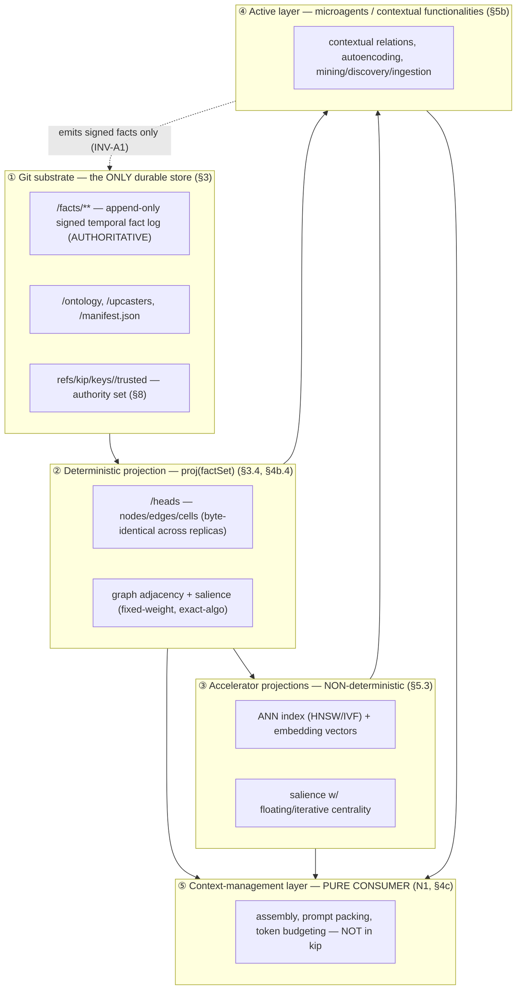
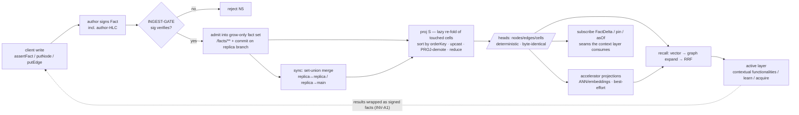
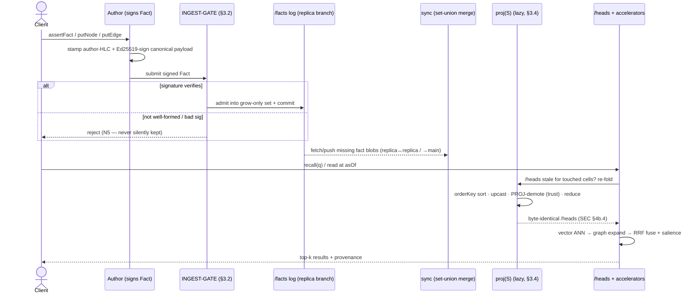
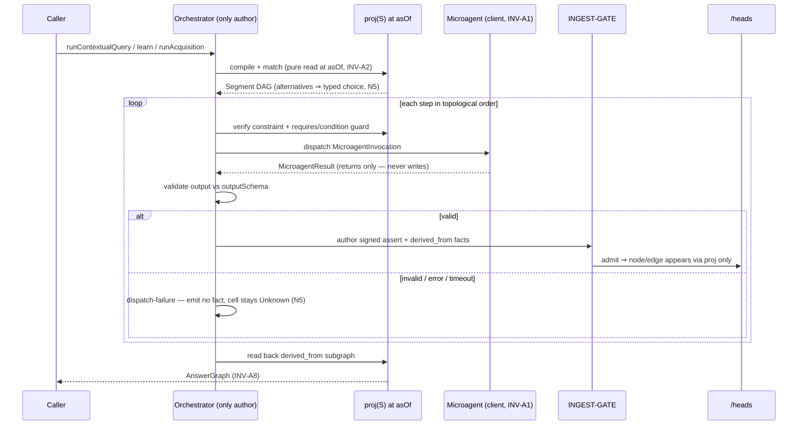

# Architecture overview

> Purpose: the layered architecture of kip — git substrate → deterministic projection → accelerator projection → active layer → context-management layer — with a component map and an end-to-end data-flow diagram.

**Source:** SPEC §2, §3, §4b, §5, §5b, §6 (synthesis). Convergence core is normative: §3.2 (signature-only gate), §3.4 (set-pure `proj`), §4b.4 (SEC), §5.3 (accelerator boundary), N5 (no fallbacks), INV-A1 (microagents are clients).

---

## 1. The thesis in one line

The one-line thesis is stated canonically in [00-vision-and-scope.md](./00-vision-and-scope.md#thesis) (§1): kip is a git-substrate, bitemporal, signed-fact property-graph memory whose unit of synchronization is an append-only signed temporal fact — coordinator-free replicas converge mechanically at the substrate and supersede semantically above it, and the context-management layer is built entirely on derived, rebuildable projections.

kip is a **library, not a runtime**: memory is the substrate; agents (and the context-management product) are **clients** of its seams (N1, INV-A1).

---

## 2. The layering

kip is a strict stack. Each layer is a **pure consumer** of the layer beneath it; nothing below ever depends on anything above.

### Layer ① — Git substrate (the convergent state, §3)
The git object/ref layout is the **only** durable store. `/facts/**` is the **authoritative append-only log** and the only thing `proj` reads; every memory write is a commit. The substrate is a **grow-only fact set** — a CRDT under set-union (associative, commutative, idempotent). The *only* admission predicate is the **INGEST-GATE**: well-formed ∧ Ed25519 signature verifies (§3.2). Signature validity is the **sole** membership predicate, a pure function of the fact's bytes, so every honest replica admits exactly the same set. Detail: [Git substrate](./22-git-substrate.md).

### Layer ② — Deterministic projection `proj` (the read model, §3.4)
`proj(S)` is a **single, total, pure function of the whole fact set** that materializes `/heads` (nodes/edges/cells). It is order-independent **by construction**: it imposes one global `orderKey` total order, groups by cell, applies versioned upcasters, then reduces each cell with a deterministic total reducer (sweep-line valid-time geometry). **All trust decisions — key-registration, namespace-authorization, revocation, and author-HLC causal plausibility — are made *inside* `proj`** (PROJ-demotion), keyed on author-HLC over the admitted set, **never** at the gate and **never** against any receiver clock. Equal sets ⇒ byte-identical `/heads` (the SEC convergence guarantee, §4b.4). Detail: [synchronization & convergence](./24-synchronization-and-convergence.md), [data model](./21-data-model.md).

### Layer ③ — Accelerator projections (best-effort, §5.3)
ANN indexes (HNSW/IVF), embedding vectors, and any salience whose centrality term uses a floating/iterative algorithm are **explicitly NOT byte-identical across replicas**. (Salience is a single concept whose layer membership is conditional — see its [single owning view in retrieval §5.4](./26-retrieval.md#54-salience-projection).) They are best-effort, recall-equivalent projections keyed by source-subtree hash **plus** embedding-model identity. This is the **accelerator boundary**: accelerators are a search/ranking aid, **never** a `proj` input and never inside the convergence guarantee (INV-5). Detail: [retrieval](./26-retrieval.md).

### Layer ④ — Active layer (microagents / contextual functionalities, §5b)
The active layer lets relations *carry computation*, answer by *traversal-and-execution*, and *learn new structure* (contextual functionalities §5b.1, knowledge autoencoding §5b.2, mining/discovery/ingestion §5b.3). It is bound by the single load-bearing rule:

> **INV-A1 (microagents are clients, never the substrate).** A microagent MUST NOT write to the graph. Every value it produces enters kip **only** as a signed, append-only fact authored by the orchestrator. The graph remains `proj(factSet)`; the active layer can change *what facts exist*, never *how facts fold*. (§5b intro)

The active layer leaves the convergence core (§3.2 gate, §3.4 `proj`, §4b.4) **byte-for-byte unchanged**. Detail: [active knowledge overview](./30-active-knowledge-overview.md), [contextual functionalities](./31-contextual-functionalities.md), [autoencoding](./32-knowledge-autoencoding.md), [mining/discovery/ingestion](./33-mining-discovery-ingestion.md).

### Layer ⑤ — Context-management layer (a pure consumer, N1, §4c)
The context-management product (assembly heuristics, prompt packing, token budgeting) is **out of scope** for kip (N1). kip specifies only the **seams** the layer consumes: `pin`/`asOf`/`recall`/`subscribe`/`provenanceOf`/`salience`/`summarizeRange` (§4c). The context layer is a pure consumer of the fact stream — it maintains a frontier cursor, pulls `FactDelta`s, and so distributed agents converge their *contexts*, not just their stores. Detail: [context-enablement seams](./25-context-enablement-seams.md).

---

## 3. The substrate / projection / client boundaries (N1, N2)

The whole architecture rests on three bright lines:

| Boundary | Statement | Source |
|---|---|---|
| **Substrate vs. projection** | Git `/facts` is the sole source of truth (G1). Every projection (`/heads`, adjacency, vector index, salience) is **droppable and rebuildable** from git objects alone. Nodes/edges/cells are *never* stored directly — they are the *fold* of facts. | §1 G1, §2.1, §3.1 |
| **Deterministic vs. accelerator projection** | Deterministic projections are byte-identical across replicas for equal sources (INV-5). Accelerators (ANN/embeddings/floating centrality) are **explicitly excluded** from byte-identity — recall-equivalent only (§5.3). | §5.3, §4b.4 |
| **Substrate vs. client (N1 / N2 / INV-A1)** | kip provides the fact log and seams; it does **not** implement the context layer (N1), the embedding model / LLM / extraction pipeline (N2), a query DSL (N3), or a network daemon (N4). Microagents, learners, importers, and the context layer are all **clients** that change state only by appending signed facts (INV-A1). | §1 N1–N5, §5b INV-A1 |

**No fallbacks (N5).** Ambiguous merges surface as typed `kip:conflict` cells; unverifiable facts are rejected; non-conforming facts are quarantined (never dropped). kip never silently "picks something" — this propagates through every layer. The full outcome taxonomy and its per-layer propagation are consolidated in the [failure & conflict model](./27-failure-and-conflict-model.md).

---

## 4. Component map

| Component | Layer | Responsibility | Detail |
|---|---|---|---|
| **Git object/ref layout** | ① substrate | `/facts` (authoritative log), `/heads` (derived cache, regenerate-not-merge), `/ontology`, `/upcasters`, `/manifest.json` (genesis-immutable), key authority refs, sharding, dual-id (EID/CID). | [22-git-substrate.md](./22-git-substrate.md) |
| **INGEST-GATE** | ①→ | Signature-validity-only admission (well-formed ∧ Ed25519 verifies). The **sole** membership predicate; a pure function of the fact's bytes. | [22](./22-git-substrate.md), [24](./24-synchronization-and-convergence.md) |
| **Fact envelope + data model** | ① substrate | Bitemporal signed temporal fact; nodes/edges/properties; cells/segments (value/unknown/conflict); schema/ontology + versioned upcasters; provenance envelope. | [21-data-model.md](./21-data-model.md) |
| **`proj`** | ② projection | The deterministic pure total fold `proj(S) → heads/graph`. Hosts **all** PROJ-demotions (key-reg, namespace, revocation, causal plausibility). | [24](./24-synchronization-and-convergence.md), [21](./21-data-model.md) |
| **Temporality / bitemporality** | ① / ② | Valid vs. transaction time, as-of reads, decay/salience/consolidation, forgetting (tombstone vs. excision). | [23-temporality-and-bitemporality.md](./23-temporality-and-bitemporality.md) |
| **Synchronization & convergence (HLC, SEC)** | ① / ② | HLC clock, append-only log, set-union merge, branch-per-agent, the SEC convergence guarantee. The correctness core. | [24-synchronization-and-convergence.md](./24-synchronization-and-convergence.md) |
| **Retrieval** | ② / ③ | Hybrid vector → graph-expansion → RRF fusion; typed as-of traversal; derived/incremental indexing; salience projection (single owning view: [§5.4](./26-retrieval.md#54-salience-projection)). | [26-retrieval.md](./26-retrieval.md) |
| **Accelerator projections** | ③ accelerator | ANN/embedding indexes and floating-centrality salience — best-effort, recall-equivalent, model-id-keyed. | [26](./26-retrieval.md), §5.3 |
| **Active knowledge** | ④ active | Contextual functionalities, knowledge autoencoding, mining/discovery/ingestion — all emit signed facts (INV-A1). | [30](./30-active-knowledge-overview.md), [31](./31-contextual-functionalities.md), [32](./32-knowledge-autoencoding.md), [33](./33-mining-discovery-ingestion.md) |
| **Context-enablement seams** | ④→⑤ | `pin`/`asOf`/`recall`/`subscribe`/`provenanceOf` — what the context layer consumes (kip provides seams, not the layer; N1). | [25-context-enablement-seams.md](./25-context-enablement-seams.md) |
| **SDK API surface** | all | The `Kip`/`Repo` interface: lifecycle, facts, reads, distribution, provenance/ops, and the §5b active-layer seams. | [40-sdk-api-surface.md](./40-sdk-api-surface.md) |
| **Security, trust & tenancy** | ① / ② | Root-of-trust, scoped authority, revocation, tenancy/scoping, privacy/redaction/erasure, auditability, DoS threat model. | [50-security-trust-tenancy.md](./50-security-trust-tenancy.md) |

---

## 5. End-to-end data flow

The canonical write → recall path (write → fact → commit → `proj` → heads/indices → recall/active-layer):

Notes on the flow (all normative):

- **Write is a commit; `/heads` is lazy.** `ingest(f)` verifies the signature, writes `/facts/<shard>/<id>.json`, and commits on the replica branch; `/heads` and projections are rebuilt **lazily** (on read, on snapshot, or by the merge driver), re-folding only the cells the new fact touched (§3.2 step 6). A commit is **transport, not trust**.
- **Membership is decided once, by signature; everything else is `proj`.** Key-registration, namespace authority, revocation, and anti-backdating (causal plausibility) are **never** gates — they are set-pure demotions inside `proj` keyed on author-HLC (§3.2, §3.6, §8.1). A demoted fact is `untrusted`/`quarantined`, never dropped, and re-evaluated monotonically as facts arrive.
- **Merge regenerates, never 3-way-merges `/heads`.** The `kip-regen` merge driver discards both sides of `/heads` and recomputes from the unioned `/facts`, so any merge topology converges to the same state (§3.1, §4b.5).
- **Determinism stops at the accelerator boundary.** `/heads` and fixed-weight/exact-algorithm salience are byte-identical; ANN/embeddings and floating-centrality salience are recall-equivalent only (§5.3). Salience's conditional layer membership has a [single owning view in retrieval §5.4](./26-retrieval.md#54-salience-projection).
- **The active layer feeds back only through the substrate.** Every microagent result re-enters as signed `assert`/`derived_from` facts authored by the orchestrator (INV-A1); it can change *what facts exist*, never *how facts fold*.

### 5a. End-to-end sequence — write → commit → sync → proj → recall

The flowchart above shows the data path; the sequence below shows the **temporal ordering across actors** — who calls whom, and where laziness and the signature gate sit. (`proj` is **lazy**: `/heads` is re-folded on read/snapshot/merge, not on write.)

### 5b. End-to-end sequence — the active-layer dispatch (INV-A1)

The active layer's defining ordering is **INV-A1**: a microagent only returns a result; the **orchestrator is the only author**, so every state change is attributable to an orchestrator-signed fact, and the new node/edge appears **only** via `proj`.

The full outcome taxonomy behind these `alt`/`else` branches (reject-at-gate, dispatch-failure, pending-guard, exhausted, …) is consolidated in the [failure & conflict model](./27-failure-and-conflict-model.md).

---

## 6. Why this architecture (the goals it serves)

- **G1 — git is the sole source of truth**: every projection is droppable and rebuildable (layers ②/③ derive purely from layer ①).
- **G3 — coordinator-free convergence**: the signature-only gate + set-pure `proj` give byte-identical deterministic projections regardless of ingestion order (§4b.4); accelerators are explicitly out (§5.3).
- **G5 — incremental projections** keyed off git object hashes — never a monolithic full rebuild.
- **G8 — a small, composable, well-typed core API** (the seams the context layer plugs into) — see [SDK API surface](./40-sdk-api-surface.md).

For the full goal/non-goal set and the hard problems resolved, see [vision & scope](./00-vision-and-scope.md) and [prior art & hard problems](./prior-art.md). For conformance, see [conformance & testability](./60-conformance-and-testability.md).
