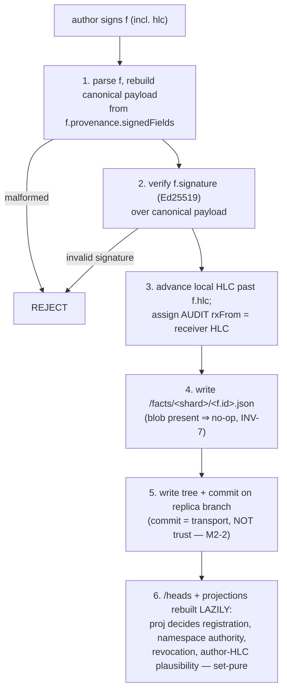
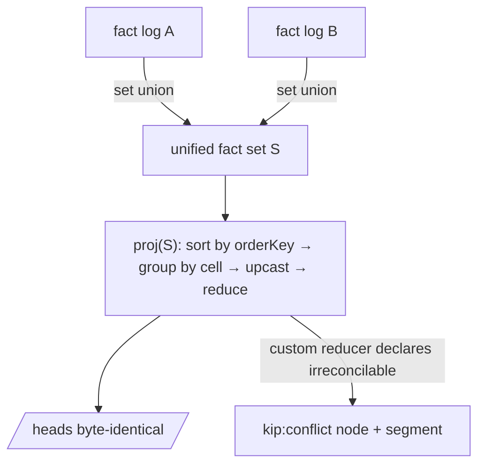

# Git substrate

> Purpose: how kip stores knowledge — the git object/ref layout, the write→commit ingest gate, branch/commit semantics, the set-union substrate with deterministic projection, GC/retention/admission-control, and the dual-id (EID/CID) scheme.

**Source:** SPEC §3 (lines ~413–921). The convergence-relevant statements here are kept exact, but the full convergence proof (HLC, append-only log, the SEC theorem) is **deferred** to [synchronization & convergence](./24-synchronization-and-convergence.md). This doc describes the substrate that proof relies on.

---

## 1. Object & ref layout (§3.1)

Git is the **only** durable store. Everything else — projections, indexes, salience — is derived and re-buildable from the git object set.

### 1.1 Refs

```
refs/
  heads/main                         # the trunk: canonical, merged history
  kip/replicas/<replicaId>           # one branch per replica/agent (T-2 hybrid)
  kip/sessions/<runId>               # short-lived per-session branch, pinned read-set (kradle snapshot)
  kip/projections/<name>@<srcHash>   # CACHE ref: a built projection keyed to its source tree hash
  kip/keys/<tenant>/trusted          # per-tenant authority set (root + delegated keys, §8) — append-only, signed
objects/                             # content-addressed: blobs, trees, commits (+ packs)
```

### 1.2 Tree layout inside a commit (the working tree of the memory)

```
/facts/<shardHi>/<shardLo>/<factId>.json     # the append-only fact log (one file per fact) — AUTHORITATIVE
/heads/nodes/<eidShard>/<eid>.json           # DERIVED projection cache of proj(facts)
/heads/edges/<eidShard>/<eid>.json           # DERIVED projection cache
/ontology/nodes/<kind>@<ver>.json            # schema as data, versioned
/ontology/edges/<kind>@<ver>.json
/upcasters/<factType>@<from>-<to>.json       # declarative upcaster descriptors (HP-8)
/manifest.json                               # repo format version, hash algo, clock epoch, genesis root keys, shard depth, ε_causal, regenBoundaryRule, quarantineTtlMs + quarantineKeyCapBytes + quarantinePoolBytes (per-key + GLOBAL-aggregate retention bounds, m5-1) + keyChainDurableCapBytes (per-registered-key chain cap, M6-1) — IMMUTABLE post-genesis (m2-5)
.gitattributes                               # binds /heads/** AND /manifest.json to the regenerate/reject-not-merge merge driver
```

- **`/facts/**` is the authoritative append-only log** and the **only** thing [`proj`](./24-synchronization-and-convergence.md) reads. One JSON blob per [fact](./23-temporality-and-bitemporality.md).
- **`/heads/**` is `proj(facts)` materialized** so a fresh clone answers point reads with **zero rebuild**. It is **advisory**: authoritative truth is always `proj(/facts)`, audited by `kip fsck` (INV-1).
- **`/ontology/**`** holds schema-as-data, versioned; **`/upcasters/**`** holds declarative upcaster descriptors (HP-8). See [data model](./21-data-model.md) §2.2.
- **`/manifest.json`** pins the genesis-immutable parameters (below).

### 1.3 Sharding (§3.1)

`<shardHi>/<shardLo>` = first 2 + next 2 hex of the fact/eid hash (default depth 2 ⇒ 65,536 leaves). Sharding keeps any single tree small so prolly-tree-style subtree-hash-skip diffs stay cheap and loose-object fan-out is bounded (HP-3).

- **Shard depth is a `manifest.json` parameter** (m-8). The fixed 2+2 layout is the valid band for ≲10⁷ facts; beyond that, `manifest.shardDepth` selects deeper sharding (e.g. 2+2+2).
- All replicas in a convergence group **MUST** agree on `shardDepth` and on the **hash algorithm** (SHA-1 *or* SHA-256, fixed in `manifest.json`). Cross-algo membership in one convergence group is a **hard error** — object CIDs are not portable across algos, so content-addressed transfer is impossible (m-6).

### 1.4 `/heads` is committed but NEVER merged (decision M-3)

This resolves the T-3 contradiction (committed *and* derived):

- **Merge rule — regenerate, not 3-way-merge.** The `.gitattributes` entry `'/heads/** merge=kip-regen'` binds a custom merge driver that **discards both sides and recomputes `/heads` from the unioned `/facts`**. `/heads` blobs are *never* text/3-way-merged; a naive `git merge` cannot produce a head conflict because the driver overwrites them from the re-fold. After any merge, `/heads == proj(merged /facts)` **by construction**.
- *Rejected alternative (a):* do not commit `/heads` at all; rebuild from `/facts` on clone. Viable and **halves write amplification** (M-6). The spec chooses (b) committed + regenerate-not-merge to keep the "self-contained clone" property, and exposes (a) to embedders via `manifest.headsCommitted=false`.

### 1.5 `/manifest.json` is genesis-immutable and NEVER 3-way-merged (m2-5)

The genesis parameters — hash algorithm, `shardDepth`, `ε_causal` (proj-time causal-plausibility slack, §4b.1; **not** a receiver-clock drift bound), `regenBoundaryRule` (deterministic commit-batching rule for DAG regeneration, §4.5/M3-3), clock epoch, and the **genesis** tenant root key set — are fixed at repo creation and bound to the same regenerate/reject driver as `/heads`. A `git merge` that would conflict on `manifest.json` is a **hard error (fork)**, never a silent 3-way merge of `shardDepth`/`hashAlgo`/root-keys.

- **Adding a new tenant is NOT a manifest edit.** It is either a new repo, or an append-only `tenants/` **fact log** entry signed by a super-root key (a key-authorization fact, §8.1) — so tenancy growth stays in the convergent fact substrate, not in the immutable genesis file.
- **Key rotation/revocation within a tenant never touches the manifest.** The genesis root is permanent; current signing authority moves via the key-authorization chain (§8.1, M2-3).

### 1.6 What is NOT committed

Vector/salience-accelerator projections are **NOT** committed (too large, too volatile, non-deterministic for ANN — see [retrieval](./26-retrieval.md) §5.3). They live under `refs/kip/projections/*` cache refs.

---

## 2. A memory write → a commit (§3.2)

The author constructs and **signs** `f` (including its author-stamped `hlc`, §4.1/M-4). kip on the receiving replica then runs `ingest(f)`.



### 2.1 THE INGEST-GATE = signature-validity ONLY

The gate is **signature-validity ONLY** — a pure function of `f`'s own bytes (C2-1, C3-1, M3-4):

1. parse `f` and rebuild the canonical payload from `f.provenance.signedFields` — **reject iff malformed**.
2. verify `f.signature` (Ed25519) over that canonical payload — **reject iff signature invalid**.
   - **THIS IS THE ONLY MEMBERSHIP PREDICATE.** Ed25519 verify is deterministic and reads ONLY `f`'s bytes.
   - NOTHING else gates admission: **NOT** drift, **NOT** key-registration, **NOT** namespace authority, **NOT** revocation. A signature-valid fact is **ALWAYS** admitted — even if old, even if its key is not yet registered here, even if its key is revoked. All of those become proj-time **demotions** (step 6), never drops (C3-1/C3-2/M3-4).
3. advance this replica's local HLC past `f.hlc`; assign the **AUDIT** annotation `rxFrom = receiver HLC` (§4.2) — this does **NOT** alter `f`, its CID, or any projected value. See [temporality](./23-temporality-and-bitemporality.md) for why `rxFrom` is audit-only.
4. write `/facts/<shard>/<f.id>.json` (new blob; if the blob is already present → **no-op**, INV-7).
5. write tree + commit on the replica branch — **commit = transport, NOT trust** (M2-2). The commit carries `message` (canonical fact summary), `author = f.provenance.author` (may differ from the commit signer on regenerated DAGs, M2-2), and trailers `Kip-Fact-Id`, `Kip-HLC`, `Kip-Sig-Fpr`, `Kip-Rx-Hlc` (audit).
6. `/heads` and projections are rebuilt **LAZILY** (on read, on snapshot, or by the merge driver) — **NOT** eagerly per fact (M-6). `proj` re-folds only the cells touched by the new fact(s), and it is **`proj` — NOT this gate — that decides key-registration, namespace-authorization, revocation, AND author-HLC causal plausibility** (anti-backdating), keyed on **author-HLC** over the admitted set (set-pure). A fact failing any trust question projects untrusted/quarantined and is re-evaluated automatically as more facts arrive (monotone).

> **The gate decides MEMBERSHIP by signature ALONE (C2-1, C3-1, M3-4, M3-5).** Steps 1–2 are a pure function of `f`'s own signed bytes, so every honest replica admits **the same set**: exactly the set of *received* signature-valid facts (a true G-Set). A fact admitted on one replica but not another would break `S_A = S_B`; therefore the gate **MUST NOT** consult `rxFrom`, the receiver's physical clock, the (partially-synced) key-registration log, namespace-at-time, or revocation status — each is replica-/time-local and would make membership diverge permanently. All of them are set-pure demotions inside `proj` (step 6), keyed on author-HLC. This is the bright line that makes `proj(S)` byte-identical across replicas, and what makes offline-first and convergence compatible: a fact authored offline and synced late still verifies by signature and is admitted everywhere (C3-2). The full theorem is in [convergence](./24-synchronization-and-convergence.md) §4b.4.

> **Schema is NOT a gate here (M-8).** There is no "validate against current ontology / reject on violation" step. Ontology is applied later, in `proj`, with non-conforming facts **quarantined** ([data model](./21-data-model.md) §2.2), never dropped.

### 2.2 Commit granularity (decision)

Default is **batched**: a `txn([...facts])` — a *memory transaction* — produces **one commit** containing many facts (resolving HP-3 / write-amplification M-6). `/heads` is **not** rewritten per commit; it is rebuilt lazily (step 6). *Rejected alternative:* one-commit-per-fact (Datomic-tx-like) — clean but pathological for git object count at agent write rates.

### 2.3 Durability (m-9)

`assertFact` returns `{ factId, status }` where `status ∈ {"pending","durable"}`. A buffered (not-yet-committed) fact returns `"pending"`; the caller **MUST** treat a `pending` id as non-durable until a `commit()`/`txn` resolves. `txn` returns only after the commit — the publish point — so all its facts are `"durable"`. There is **no path where a `"durable"` ack precedes the commit.**

---

## 3. Branch & commit semantics (§3.3)

```
trunk (refs/heads/main):  o──o──o───────────o (merge)
                               \             /
replica A:                      a1──a2──a3──/
                                     \
session S (pinned read-set):          (no writes; read snapshot @a2)
```

- **commit** = a durable, ordered set of facts on a branch. The commit DAG gives causal order at the *batch* level; HLC gives causal order at the *fact* level (see [convergence](./24-synchronization-and-convergence.md) §4b).
- **branch** = an independent timeline. `refs/kip/replicas/*` are long-lived (one per agent); `refs/kip/sessions/*` are short-lived read pins (kradle snapshot model) and normally carry **no writes** (read isolation), or carry session-scratch writes that merge back.
- **as-of a commit** = check out `/heads` at that commit → a complete, self-contained graph snapshot with zero rebuild. (Valid-time/transaction-time `asOf` semantics are in [temporality](./23-temporality-and-bitemporality.md) §4.3.)

---

## 4. Merge & conflict resolution — set-union substrate + deterministic `proj` (§3.4)

The central T-4 / HP-1 decision, re-stated soundly (C-1, C-2). Two cleanly separated things.

### 4.1 (a) The substrate state is a grow-only fact set; union is the merge

Facts are immutable and content-addressed; merging `/facts/**` between branches is **set union of fact blobs** — genuinely associative, commutative, idempotent. Two replicas that ingested the same facts in any order hold the *same set* `S`. **This — and only this — is the CRDT.** There is **no binary cell-merge operator**; the old `merge(base, a, b)` interface is **removed** (it could not express valid-time geometry and its ACI claim was unsound, C-1/C-2).

### 4.2 (b) Heads are a deterministic pure projection of the set

`proj(S)` materializes `/heads`. It is a **single total function of the whole fact set**, order-independent *by construction* because it sorts before it folds:

<a id="orderkey"></a>

```ts
// THE deterministic ordering key — used identically on EVERY replica so ties break the same way.
// Reads ONLY author-stamped, set-resident fields. NEVER rxFrom, commit-order, or wall-clock-at-read (C2-1).
type OrderKey = readonly [
  validFrom: bigint, hlcWall: bigint, hlcCounter: number,
  replicaId: string,            // author's stamped hlc.replicaId (signed)
  publicKeyFingerprint: string, // author/signer identity — distinguishes distinct-author identical-content facts (M2-1)
  factCID: string,              // final tiebreak; total because the canonical payload covers ALL author/replica fields (M2-1)
];
function orderKey(f: Fact): OrderKey;   // total order. publicKeyFingerprint precedes factCID so distinct signers never tie pre-CID.

// Per-property reducer: a PURE function over the WHOLE set of facts for ONE cell. NOT a binary op.
type CellReducerRef = "lww-hlc" | "max" | "min" | "gset" | "pncounter" | "custom:<id>";
interface CellReducer<V = PropValue> {
  id: string;
  // Deterministic, total over the fact subset for a cell. No `base`, no pairwise merge.
  reduce(facts: ReadonlyArray<Fact>): CellSegment<V>[];   // input pre-sorted by orderKey
}

// proj is the whole-set fold. Pseudocode (illustrative):
function proj(S: ReadonlySet<Fact>): Heads {
  const sorted = [...S].sort(byOrderKey);                 // ONE global deterministic order
  const byCell = groupBy(sorted, factCellId);            // (eid, prop) | (edge eid) buckets
  for (const [cellId, facts] of byCell)
    heads[cellId] = upcastThenReduce(facts);             // §2.2 upcast/quarantine, then CellReducer
  return heads;
}
```

**Why this converges (and the old version did not).** `proj` never folds pairwise and never depends on delivery order: it takes the *set*, imposes one total order, and reduces. Equal sets ⇒ identical sorted sequence ⇒ byte-identical `/heads`. **Valid-time geometry is computed inside `reduce` by a sweep-line over interval endpoints in `orderKey` order** — a pure function of the set, not "clip the loser as facts arrive." For `lww-hlc`: over the sorted asserts, at each elementary valid-time sub-interval the covering value is the `orderKey`-max assert whose `[validFrom,validTo)` contains it; retracts remove coverage. Three concurrent asserts A,B,C now yield the *same* arrangement regardless of fold order, because there **is no fold order** — there is one sort then one sweep (the direct fix to the C-1 `(A⊕B)⊕C ≠ A⊕(B⊕C)` counterexample). The full convergence argument is in [convergence](./24-synchronization-and-convergence.md) §4b.4.

### 4.3 Reducers, interval geometry, existence gating

- **Default reducer `lww-hlc`**: at each valid-time point, the `orderKey`-max covering assert wins. `gset` (grow-only set) and `pncounter` (positive-negative counter, the correct structure for retract/re-assert) are the multi-value reducers; `set-union` is an alias for `gset`. A `gset`/`pncounter` reducer carries per-member/per-increment **tags = the asserting FactId**, so a `retract` names the exact tags it removes (OR-Set semantics). All reducers **MUST** be deterministic, total, and a pure function of their fact subset (INV-3). Every reducer's final tiebreak **MUST** terminate in `orderKey`.
- **Interval geometry & gaps (M-9).** `reduce` produces **non-overlapping** segments; **gaps are legal and first-class** (`{kind:"unknown"}`) — a mid-interval `retract` *splits* the cell rather than leaving a "partition with a hole" (worked `[0,20)` example in the [cell/segment model](./21-data-model.md#retract-split-example)). Reads in a gap return `Unknown` (distinct from `null`, an asserted absence). INV-4 tests **no-overlap + gap-as-unknown**. (Detailed in [temporality](./23-temporality-and-bitemporality.md) §4.2.)
- **Existence gates properties — no ghost nodes (m2-2).** `node-existence` is the **gate** cell for an entity. `proj` evaluates existence first: for any valid-time sub-interval where `node-existence` is retracted/`unknown`, `proj` **suppresses** that entity's `node-prop` segments over the same sub-interval (they project to `unknown`, not a propertied-but-nonexistent ghost). A `node-prop` assert whose interval extends past an existence retract is clipped to the existence interval. Pure set function, tested by INV-4.

### 4.4 Conflict surfacing (no fallback) — the per-cell-type resolution table

kip distinguishes **commutative** cell types (where a total-order tiebreak is the *semantically defined* answer) from **non-commutative** ones (where an `orderKey` tiebreak among genuinely contradictory authored decisions would be an arbitrary winner — a fallback in disguise, banned by N5 and the repo "fallbacks are evil" rule). The **default** reducer per cell type, and whether it tiebreaks or surfaces a conflict, is **normative**:

| Cell type / reducer | Concurrent (neither author-HLC dominates) **same outcome** | Concurrent **different outcomes** |
|---|---|---|
| `lww-hlc` (scalar register) | identical value ⇒ one segment | **commutative-by-definition LWW**: the `orderKey`-max value wins. This *is* the documented semantics of a last-writer-wins register — not a hidden fallback — and is the ONLY cell type allowed to silently total-order contradictory scalar asserts. |
| `gset` / `set-union` | union (idempotent) | union (both members coexist; OR-Set) — no conflict possible |
| `pncounter` | sum (tags dedup) | sum — no conflict possible (commutative) |
| `supersede` (correction) | no-op (same CID, INV-7) | **NON-commutative ⇒ `kip:conflict` surfaced by the DEFAULT reducer** (C2-2). Never `factCID`-tiebroken. |
| `custom:<id>` | reducer-defined; final tiebreak MUST terminate in `orderKey` (m2-1) | reducer **declares** reconcilable (folds) or irreconcilable (`kip:conflict`); silent hash-tiebreak of contradictory outcomes is **forbidden**. |
| `kip:learn` (correction-class, §5b.2) | same accepted set ⇒ no-op (same CID, INV-7) | **NON-commutative ⇒ `kip:conflict`** for competing accepted sets at the same `(rawRef, ontologyAsOf, encode/decode/learner-manifest)` key. The recorded loss is **audit-only, EXCLUDED from `orderKey`/reducer** (like `rxFrom`, C2-1) — NEVER loss-tiebroken. Resolved by a dominating `resolve`-scoped supersede. |
| `kip:learn-exhausted` / `derived_from` (`gset`/append, §5b.2/§5b.1) | union (idempotent) | union (provenance/markers only accrete; no contradiction possible). |
| `same_as` (`gset` of equivalence *assertions* + a derived equivalence-closure, §5b.1) | union (idempotent) | union of the **asserted** edges (raw `same_as` facts never contradict — they only accrete). The **closure** `proj` derives is a separate, total read: reflexive/symmetric/transitive over the admitted `same_as` set, bounded, order-independent, with a **total canonical-EID rule** (min by `(namespaceId, localId)` byte-order). A `not_same_as`/distinct-EID assertion that **contradicts** a derived equivalence surfaces `kip:conflict` on a keyed correction cell for the disputed pair, **canonicalized to the ordered `(min, max)`** so both replicas rendezvous on one CONFLICTED cell — **never** a silent merge or split. |
| microagent-registration (`supersede`/correction-class on `(name,version)`, §5b.1) | **byte-identical** manifest (same `factCID`) ⇒ no-op (INV-7) | **NON-commutative ⇒ `kip:conflict`** if two registrations of the same `(name,version)` carry **divergent** manifests (a versioned descriptor is immutable) — **never** an `orderKey`-max silent LWW overwrite. This is a correction-class cell, **not** `lww-hlc`: the `(name,version)` key admits exactly one descriptor value; divergence is a hard conflict resolved only by a dominating `resolve`-scoped supersede (bump the `version` to publish a changed descriptor). |

A `conflict` segment therefore arises (1) when a **custom** reducer declares irreconcilability, **or** (2) — C2-2 — when the **default** `supersede` handling sees two concurrent supersede facts over overlapping `inputCids` asserting **different** outcomes. In both cases kip emits a `kip:conflict` node and the segment reads `CONFLICTED`; kip does **not** pick a value by hash. The resolution is itself a new authored fact (a dominating supersede), so it converges.

**Read semantics for `CONFLICTED` cells are defined (m-4):** `getNode`/`recall` return the cell with `kind:"conflict"` and the full `candidates: FactId[]`; callers **MUST** handle it explicitly (recall ranks a conflicted node by its salience but surfaces all candidate values rather than choosing one).

### 4.5 Semantic supersession is also a pure function of the set (C-3)

Supersession facts are *just more facts*; `proj` applies them by the same `orderKey`. If supersession is LLM-assisted, **the LLM's decision is recorded as a signed `supersede` fact** (naming the input fact CIDs it acted on and the corrective `retract`/`assert` it implies), keyed by that input-CID set. Therefore:

- All replicas fold the **same recorded decision** — they never independently re-run the LLM during `proj` (proj is pure and LLM-free).
- Re-running the supersession pass over the same input CID set producing the **same** outcome is a **no-op** (the corrective fact already exists, same CID, INV-7) — so two replicas running the pass converge instead of emitting contradictory corrections.
- **Concurrent CONTRADICTORY supersede (C2-2 — no silent hash tiebreak).** If two replicas emit *different* `supersede` facts over the same/overlapping `inputCids` asserting **different** outcomes, and **neither author-HLC dominates** (genuinely concurrent), the **default** supersede reducer does **not** pick one by `factCID`. It emits a typed `kip:conflict` cell/marker naming both candidates — byte-deterministic (a pure function of the set) **and** honest. **Convergence of the marker is contingent on admitted-set convergence** (M3-1): under the signature-only gate every signature-valid fact is admitted everywhere, which is exactly why the gate fix is load-bearing for conflict convergence too.
- **Resolution is SINGLE-WRITER per `inputCids` and provably terminating (M3-1).** A `kip:conflict` leaves `CONFLICTED` only via a new authored `supersede` over the same/overlapping `inputCids` **signed by a key holding the `resolve` scope** (the namespace-owner key or a key delegated `resolve`, §8.1). Among facts that strictly dominate both originals **and** carry the `resolve` scope, the cell takes the **`orderKey`-max** one — a total-order pick semantically defensible **only here**, because the authorized adjudicator explicitly claimed authority to override. This **terminates**: the set-pure `orderKey`-max among `resolve`-scoped dominators is the unique fixpoint. A dominating `supersede` **without** the `resolve` scope does **not** clear the conflict.
- There is **no** default total-order tiebreak for contradictory supersessions among non-adjudicators. The bytes of `/heads` are a function of the set only, never of which replica ran the pass when.



---

## 5. GC / packing / history bloat (§3.5)

**Honest storage model (M-6).** kip storage is **monotonically growing by design** — immutable history keeps every fact reachable. Two distinct axes must not be conflated:

- **Read latency** (how many facts `proj` traverses) — reclaimed by *rollup* and *snapshots*.
- **Bytes on disk** (reachable objects) — reclaimed **only by excision/gc of unreachable objects**. Rollup does **not** free bytes while old commits remain reachable.

| Mechanism | Reclaims | Notes |
|---|---|---|
| **Write amplification** | — | A memory transaction is *one* commit for *many* facts, and `/heads` is rebuilt **lazily** (not per fact), so per-fact churn is one fact blob + its path trees. `manifest.headsCommitted=false` avoids committing `/heads` entirely, **roughly halving** write amplification at the cost of a clone-time rebuild. |
| **Packing** | loose-object count | kip schedules `git repack`/`gc` after N commits or M loose objects. Delta compression across same-shard fact blobs is **modest** on differing payloads — do **not** assume it offsets growth; it does not. |
| **Snapshot / rollup** | **read latency only** | A **rollup** writes a `kip:rollup` marker fact recording the covered HLC range + the pre-rollup tip CID, and materializes a `/heads` snapshot so reads after the rollup **bound traversal cost**. The old fact blobs **remain reachable** (auditability) and are **not** freed. |
| **Excision vs gc** | bytes | Ordinary gc removes only *unreachable* objects. *Forgetting* (deliberate, byte-reclaiming fact removal) is the distinct, authorized, history-rewriting operation — see [temporality](./23-temporality-and-bitemporality.md) §4.5 — the **one** thing that frees the bytes of reachable facts, and the **only** operation that breaks pure append-only. |

---

## 6. Admission control & retention — bounding storage WITHOUT touching membership (§3.5a, C4-1)

The signature-only gate makes *logical membership* a pure function of bytes (what SEC needs) — but it must **not** force every replica to keep the bytes of unlimited facts from unlimited unregistered keys forever. v4 separates **two layers cleanly** and never lets the second touch the first.

### 6.1 Two layers, stated explicitly

1. **LOGICAL membership (the G-Set `proj` reads).** A fact is *logically* a member **iff** it is signature-valid (§3.2) **and** the replica currently holds it. Signature-validity is still the **sole** membership *predicate*; `proj` is still a pure function of whatever set the replica holds. **Nothing in this section changes `proj` purity or the [SEC theorem](./24-synchronization-and-convergence.md)'s form** — it only changes *which* signature-valid facts a replica chooses to replicate and durably store.
2. **ADMISSION CONTROL & RETENTION (transport/replication-layer policy — N4, NOT a `proj` input).** A replica applies a **local resource policy** to decide which signature-valid facts it **replicates / stores bytes for**, enforced when *accepting a push* or *fetching*, and **explicitly excluded from `proj`, `orderKey`, and every trust decision** (exactly as `rxFrom` is). A liveness/DoS control, distinct from convergence. A replica **MAY** admit-and-store based on a **per-key quota** (bytes/facts per signing key per epoch), a **capability token / proof-of-deposit / proof-of-work**, or a **trusted-author allowlist** (the set-resident registered-key set, tenant-scoped).

### 6.2 RetentionClass (set-pure eligibility, transport-local enforcement)

`proj` computes, as a pure function of `S`, a per-fact **`RetentionClass`** the transport layer reads to decide eviction. It is **not** a `proj` value and never feeds `/heads` — it is durability metadata, derived set-purely so every replica computes the *same class* for the same fact:

```ts
type RetentionClass =
  | "durable"             // trusted (registered, in-namespace, non-revoked, plausible) — NEVER evicted
  | "key-chain-durable"   // a KEY's OWN emission (any fact authored by registered key K, incl. its
                          //   quarantined/anachronistic facts) — PREFERENTIALLY retained up to a per-key
                          //   keyChainDurableCapBytes cap. Past the cap, oldest chain links may be evicted;
                          //   an evicted-then-needed link is re-fetched on demand, and dependent same-key
                          //   facts stay `pending` until re-fetch — SAFE, never silently trusted (M6-1).
  | "quarantined-ttl"     // signature-valid but proj-demoted, from an UNREGISTERED key: stored under a
                          //   BOUNDED ttl/byte-cap; eviction-eligible under pressure
  | "evicted";            // bytes reclaimed; re-fetchable on demand if it later becomes durable
```

- A **`durable`** fact (trusted author) is **never evicted**: its bytes are pinned in durable history.
- A **`key-chain-durable`** fact is any fact authored by a key `K` holding a set-resident `KeyAuthorization` (registered at *some* author-HLC), **whether or not that individual fact projects trusted** — including `K`'s pre-registration, anachronistic, or out-of-namespace facts. It is **preferentially retained up to a per-key `keyChainDurableCapBytes` cap (manifest-pinned); past the cap, the OLDEST chain links may be evicted** (M6-1 — bounded, not "never-evict"). Rationale: the per-key anti-backdating rule (§7.4) and its chain-completeness gate read `K`'s **own complete `(wall,counter)` chain** in `S`. **Safety does NOT require never-evicting it** — it rests on the **chain-completeness gate alone**: an evicted higher-stamped honest fact leaves a `(wall,counter)` gap, and a gap projects **`pending`** (never a silent trusted backdate). An evicted link is **re-fetched on demand** (content-addressed); until then dependents read `pending`. The cap therefore buys *liveness*, not *safety*. This pool is **authenticated and genuinely quota-bounded** (m5-4, M6-1 closed).
  - **Completed-chain-frontier pinning (keeps INV-19 non-reversal true under the cap — m6-2).** Eviction past `keyChainDurableCapBytes` follows the **frontier of completed-chain evidence**: a link that has **completed `K`'s chain for a currently non-`pending` dependent fact** is **pinned for as long as that dependent is non-`pending`**. Only *historical* links not currently backing a non-`pending` dependent are eviction-eligible. This bounds bytes while guaranteeing a fact that already left `pending` never re-opens its gap, so the `pending → trusted/demoted` transition is **monotone (at most once, never reverses)** even under cap-bounded retention (INV-19).
- A **`quarantined-ttl`** fact (signature-valid, from an **unregistered** key) is stored under a **bounded TTL and a per-key byte-cap** (`quarantineTtlMs`, `quarantineKeyCapBytes`) **and a GLOBAL aggregate byte budget** (next). When a cap/TTL/budget is exceeded or under disk pressure, its **bytes** become **`evicted`**. **Eviction removes bytes, not logical membership**: an evicted unregistered fact projected `quarantined` (which never covers a cell), so dropping its bytes **cannot change `proj`** of any *trusted* fact, and **cannot silently flip a same-key backdate to trusted** (the key is unregistered, and any later same-key evaluation across an evicted predecessor finds a `(wall,counter)` gap ⇒ **`pending`**, §7.4). If a registration later arrives, **all** the key's facts flip to `key-chain-durable` and are **re-fetched on demand**.
- **Aggregate quarantine ceiling — the unlimited-identity defense (m5-1).** A per-key cap alone is **not** a global bound: an attacker minting `N` fresh unregistered keys consumes `N × quarantineKeyCapBytes`. The policy therefore enforces a **manifest-pinned GLOBAL `quarantinePoolBytes` budget across ALL unregistered keys**, reclaimed by **LRU/TTL eviction over the whole `quarantined-ttl` pool**, independent of key count. The **TTL is the time-ceiling**; **`quarantinePoolBytes` is the space-ceiling**; the per-key `quarantineKeyCapBytes` is a *fairness* sub-limit, **not** the aggregate bound. With both, an `N`-key flood cannot refill the pool faster than TTL/LRU drains it.
- **Eviction is local and policy-driven, so two replicas may hold different SUBSETS** of the `quarantined-ttl` facts (and, past the cap, of a registered key's `key-chain-durable` chain). This is a **partial-replication** model. It is sound because (i) evicted facts are non-durable-or-not-currently-load-bearing and project nothing trusted, **and** (ii) per-key trust is gated on **chain completeness** (§7.4), so wherever a replica's held subset is *not* complete for a covering key, that key's dependent facts project **`pending`**, never a divergent *trusted* value. See the **per-shared-subset SEC restatement** in [convergence](./24-synchronization-and-convergence.md) §4b.4.

### 6.3 Why this bounds the C4-1 attack while preserving convergence

The unlimited-identity vector is **unregistered keys** (registration is proj-time). v4 makes their **bytes** the bounded resource: an unregistered key's flood is `quarantined-ttl`, capped per-key, bounded in aggregate by `quarantinePoolBytes`, and evicted under pressure — it can never force unbounded durable growth and never affects `/heads`. Registered honest authors are `durable`/`key-chain-durable` and converge as before. The quota is moved to **transport**, so **membership purity is preserved AND availability is bounded**. Excision/revocation still demote-not-delete in `proj`; **retention eviction** is the separate, *byte-reclaiming* path for non-durable facts.

**Guarantees:** **(a)** no UNREGISTERED key can force unbounded DURABLE growth on a replica applying the default retention policy; **(b)** no eviction or partial replication can flip a same-key backdate from `pending`/`demoted` to `trusted` (C5-1); **(c)** a REGISTERED key's durable chain is bounded by `keyChainDurableCapBytes`, so a registered/compromised key can no longer force unbounded non-evictable durable bytes (M6-1).

**What this does NOT do (honest bound).** A replica choosing a permissive policy (store everything) is still exposed to disk growth — admission control is a **MAY**, the mechanism not a mandate. It does not bound an insider with a *registered* key beyond the `keyChainDurableCapBytes` cap + revocation (§8.1) + the per-key chain-completeness gate. The residual: a registered key can self-date a *lone* fact at an author-HLC below all its own existing facts only if that fact begins a fresh contiguous chain segment (genuine first-emission) — the acknowledged §7.4 residual.

**Re-fetch liveness residual — stated honestly (m6-3).** Cap-bounded retention plus on-demand re-fetch introduces one narrow, *safe* liveness cliff: a key registered *after* its pre-registration facts have aged out of **every** replica's pool, or a chain link evicted past the cap on every replica, leaves **no peer to re-fetch from**, so the chain **cannot complete** and dependent same-key facts stay **`pending` permanently**. This is **safe** (never a wrong *trusted* value) but a genuine, honest **liveness loss**. **Mitigation:** preferentially retain `key-chain-durable` chains up to `keyChainDurableCapBytes`; operators **size the cap (and `quarantineTtlMs`) to the working set** and **register keys before their pre-registration facts' `quarantineTtlMs` elapses**. Listed as an accepted non-core bound in [open questions](./90-open-questions.md) (§8.3b/§9).

---

## 7. Content-addressing vs stable identity — the dual-id scheme (§3.6)

(HP-4, T-1, **C-5** — resolved.) kip maintains **both** layers and declares which is authoritative for equality.

### 7.1 CID vs EID

- **CID (content id)** = git object id. Authoritative for **integrity, dedup, and sync** (Noms: send only missing chunks). Identical fact/value content is stored once, repo-wide.
- **EID (entity id)** = a **namespaced, cryptographically anchored** stable id. Authoritative for **identity/equality over time** ("the same entity").

The mapping `EID → ordered list of (orderKey, CID)` (the entity's head history) is a derived projection rebuildable from the fact set. **Facts reference entities by EID, never by CID.** This resolves the Noms pitfall (content == identity) and T-1, and closes C-5 by binding identity namespaces to keys.

### 7.2 EID structure — identity is no longer a forgeable bare string (C-5)

```
EID = "<tenant>/<namespaceId>/<localId>"

  tenant       — the tenancy root (matches a key set under refs/kip/keys/<tenant>/trusted)
  namespaceId  — a STABLE namespace id == fingerprint of the GENESIS authority that created the
                 namespace, FROZEN at creation. NOT the current signing key's fingerprint, so key
                 rotation/revocation NEVER changes the EID (M2-3). Alternatively a registered
                 natural-key-class id whose collisions are intended.
  localId      — author-chosen local name, OR a content/natural-key HASH within the namespace
```

```ts
type IdentityPolicy =
  | { kind: "authority-local" }                  // localId minted by the owning authority; collisions impossible across authorities
  | { kind: "natural-key"; keyProps: PropKey[] } // localId = hash(canonical(keyProps)); collisions are INTENDED matches
  | { kind: "content-seeded-frozen" };           // localId = hash(seed content), frozen at creation
```

### 7.3 Namespace anchoring — a stable genesis id, not a revocable key fingerprint (M2-3)

`namespaceId` is the fingerprint of the **genesis** authority *frozen at namespace creation*, and **write authority over that fixed namespace moves across keys via the key-authorization chain** (§8.1). Rotating `Kfpr1 → Kfpr2` is a key-authorization fact granting `Kfpr2` `write` over the *same* `namespaceId`; the EID never changes, the namespace is never orphaned, and **revoking the old key never retroactively invalidates facts it signed before `effectiveFrom`** (those remain trusted up to the author-HLC cutoff, §8.1, M2-5). Cross-tenant references work iff a `grant` fact (§8.2) authorizes a tenant-A key to **reference** (read) tenant-B's namespace; writes remain namespace-gated.

**Equality requires same namespace.** Two references are the same entity **iff equal full EID** (tenant + namespaceId + localId all equal). Stable across key rotation/revocation. A bare `localId` collision across **different namespaces or tenants is NOT a match** — two distinct entities (kills the v1 "equal string ⇒ same entity across tenants" hazard, C-5.2). Where collision *is* desired (two records of the same real-world person), use a `natural-key` policy whose `keyProps` are explicit — intentional and auditable, not accidental.

### 7.4 Write authority is cryptographically bound, and demotion is SET-PURE (C-5.1, C-5.3, C2-1)

A fact asserting about an EID is **authoritative iff its signing key was authorized for that EID's `<tenant>/<namespaceId>` AT THE FACT'S OWN AUTHOR-HLC** — a pure question over the admitted set (key-authorization facts and their `effectiveFrom`/revocation are all in `S`, all in author-HLC space). The authorization decision is made **inside `proj`**, keyed on **author-HLC**, **never** on `rxFrom` (C2-1), so two replicas with the same admitted set make the **same** decision ⇒ byte-identical `/heads`.

- A fact whose signing key was **not** authorized-for-the-namespace at its author-HLC projects **`untrusted`**: `proj` marks its segments `untrusted` and the default `lww-hlc` reducer **ignores untrusted asserts** when a trusted assert covers the interval. The fact is still admitted and queryable (surfaced, never silently dropped — N5); it simply loses to trusted asserts. A low-privilege/cross-tenant key therefore **cannot overwrite** an entity's authoritative head (fixes the EID-hijack of C-5.1).
- **Key-registration is a `proj`-time demotion, not an ingest gate (M3-4).** A fact whose signing key has **no set-resident registration fact** projects `untrusted`/`quarantined` — exactly as an out-of-namespace fact does, still admitted. The moment the key's registration fact arrives, the fact **automatically becomes trusted** on re-fold (monotone, convergent): registration-ordering races resolve set-purely and **no fact is ever lost**.
- **Anti-backdating reads the author's INVOLUNTARY same-key footprint, not the voluntary `causedBy` field (C4-2/M4-2).** The **PRIMARY** bound is **per-key author-HLC monotonicity, gated on per-key chain completeness** (set-pure, involuntary, eviction-safe — C5-1 root fix):
  - **(i) Chain-completeness gate.** A fact `F` from key `K` may project **trusted** only if the replica holds the **complete, gap-free `(wall,counter)` chain of `K`'s facts up to `F`'s author-HLC** (the same per-key contiguity rule as pin-completeness, §4c/m4-1, INV-14). If any earlier same-key fact below `F` is **missing/evicted/not-yet-replicated** (a gap), `F` projects **`pending`** — not trusted, not rejected — and is re-evaluated monotonically as links arrive. So per-key trust is a function of `K`'s **complete-for-`K` durable chain**, **replica-independent once complete**: an evicted/withheld higher honest fact can **never silently flip a backdated lower fact to trusted**. "`K`'s chain" is **per-`(replicaId, key)`** (a key may emit from multiple replicaIds): completeness is the **union** over all of `K`'s `(replicaId,key)` chains (a gap on *any* ⇒ `pending`); the demotion (ii) is **key-wide**. A build that checks only one replicaId's chain is non-conformant (INV-19).
  - **(ii) Monotonicity demotion (involuntary).** Once the chain is complete up to `F`, `F` is demoted `untrusted-anachronistic` iff `S` contains another admitted fact `F'` from the **same key `K`** with `author-HLC(F') > author-HLC(F)` **and** `F` is **not** a causal ancestor of `F'`. `K` **cannot un-emit** its higher-stamped facts — **set-pure** and **not evadable by omitting an optional field**.
  - **SECONDARY — voluntary `causedBy` closure (tightening only).** If `F` declares `causedBy`, `F`'s author-HLC must also dominate every fact in its declared closure over `S`. Declaring `causedBy` can only *increase* the chance of a correct demotion; omitting it never causes a wrong one. A read-of an author-controlled field, so it is a **lower bound** — never relied on alone.
  - **`causedBy` well-formedness demotion (M4-2).** A fact whose any declared `causedBy` parent *resolved in `S`* has `author-HLC > F`'s own is **self-contradictory** and demoted `untrusted-malformed`; the closure walk requires **acyclicity** (a cycle is likewise demoted-malformed). A `causedBy` parent **not yet in `S`** leaves the closure **pending**, never silently trusted.
  - **Precise bound.** It bounds backdating relative to the key's own observed activity over its complete durable chain. It does **NOT** stop a key that has emitted **nothing higher in its chain** from self-dating a genuine first-emission fact — the acknowledged, acceptable residual (no conflicting same-key history to poison). The full anti-backdating treatment and its temporal framing are in [temporality](./23-temporality-and-bitemporality.md) §4.1–4.2 and the convergence core (§4b.1, §8.1).
- `withScope`/EID minting is a **client-side write guard** (C-5.3): the SDK refuses to *author* an EID outside the local key's authorized namespaces. But the authoritative *cross-replica* enforcement is the set-pure proj demotion above — never an ingest-time value decision. **The only ingest gate is signature validity (§2.1)**; key-registration, namespace authority, revocation, and author-HLC plausibility are all set-pure `proj` demotions.

---

## Cross-references

- [Data model](./21-data-model.md) — nodes/edges/cells/segments, ontology + upcasters, the provenance envelope.
- [Temporality & bitemporality](./23-temporality-and-bitemporality.md) — the fact envelope, valid vs transaction time, decay/salience, forgetting (tombstone vs excision).
- [Synchronization & convergence](./24-synchronization-and-convergence.md) — HLC, append-only log, two-layer reconciliation, the SEC theorem this substrate underpins.
- [Conformance & testability](./60-conformance-and-testability.md) — the INV-* catalog (INV-1/3/4/7/12/14/19 referenced here).
- [Open questions](./90-open-questions.md) — accepted non-core bounds (re-fetch liveness residual, etc.).
