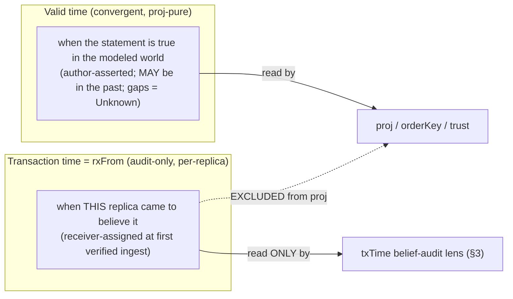

# Temporality & bitemporality

> Purpose: kip's two time axes — the fact envelope as the unit of change *and* sync, bitemporal soundness (valid time vs receiver-assigned audit-only transaction time), history & as-of queries, decay/salience/consolidation as operations over time, and forgetting (logical tombstone vs physical excision with deterministic DAG regeneration).

**Source:** SPEC §4 (lines ~1099–1379). The valid-time axis is convergent and proj-pure; the transaction-time axis (`rxFrom`) is **audit-only and excluded from `proj`/`orderKey`/trust** — the convergence core is in [synchronization & convergence](./24-synchronization-and-convergence.md) §4b.

---

## 1. The fact envelope — the unit of change *and* sync (§4.1)

A **fact** is the atom of kip: the unit that is authored, signed, content-addressed, stored, and synced. There is nothing smaller and nothing else durable.

```ts
type FactId = string;          // = CID of the canonical SIGNED fact payload (content-addressed, M-4)
type FactType = "assert" | "retract" | "supersede" | "revoke-key" | "excision" | "re-attest";
//   re-attest (m5-3): a trusted-key re-assertion of a kip:revoked-concurrent casualty's content, naming
//   the demoted fact via reAttests; projects the content as a trusted assert under the NEW key (§8.1).
type Target =
  | { kind: "node-prop"; eid: EID; nodeKind: NodeKind; prop: PropKey }
  | { kind: "edge"; eid: EID; edgeKind: EdgeKind; from: EID; to: EID }
  | { kind: "edge-prop"; eid: EID; prop: PropKey }
  | { kind: "node-existence"; eid: EID; nodeKind: NodeKind }
  | { kind: "schema"; ontologyRef: string }
  | { kind: "key"; keyFpr: string; namespace: string }            // authority/revocation facts (§8)
  | { kind: "control"; op: "rollup" | "tombstone" | "consolidate" | "excision" };

interface Fact {
  id: FactId;                  // CID of the canonical payload — payload INCLUDES hlc (so it is signed)
  v: number;                   // fact schema version → upcaster key (HP-8, event-sourcing)
  type: FactType;
  target: Target;
  value?: PropValue;           // present for assert (BlobRef for large values, m-1)
  // VALID-TIME axis (author-asserted, MAY be in the past):
  validFrom: HlcOrTime;
  validTo: HlcOrTime | null;   // null = still valid; a retract sets a bounded interval (gaps legal, M-9)
  // CAUSAL/ORDERING anchor — AUTHOR-STAMPED and SIGNED (M-4): part of the canonical payload & of id.
  hlc: HlcStamp;
  // Concurrency hints. Detection ALSO uses the git commit DAG (the causal history git already stores):
  causedBy?: FactId[];         // OPTIONAL same-replica causal parents. A LOWER BOUND on real causality
                               //   (author-supplied: may omit real predecessors, M4-2). Anti-backdating's
                               //   PRIMARY bound is the INVOLUNTARY per-key author-HLC rule (§3.6, C4-2),
                               //   NOT this field; well-formedness (acyclic + parent author-HLC ≤ child)
                               //   is enforced set-purely in proj (§4b.1, INV-15).
  // supersession metadata (only when type==="supersede"), pins the LLM/heuristic decision to its inputs:
  supersedes?: { inputCids: FactId[]; retract: FactId[]; assert?: PropValue }; // keyed by inputCids (C-3)
  reAttests?: FactId;          // present ONLY when type==="re-attest" (m5-3): the kip:revoked-concurrent
                               //   fact whose honest CONTENT this fact re-asserts under a trusted key (§8.1)
  provenance: Provenance;      // signed (§2.4); hlc above is the signed ordering field
}
```

> **Transaction time is NOT in the signed Fact, and NOT read by proj (M-4, M-5, C2-1).** The author stamps and signs `hlc` (so `FactId` is stable and idempotent ingestion holds — INV-7). Transaction time `rxFrom` is **assigned by the receiving replica** at ingest ([git substrate](./22-git-substrate.md) §3.2, and §2 below) and stored as a *post-hoc, AUDIT-ONLY annotation* (`FactAnnotation`), never in the payload, never in the CID, **never read by `proj`, `orderKey`, or any trust/revocation decision**. Its sole use is per-replica "believed-then" *audit* reads (§3), labeled non-convergent.

> **Backdating is defended INSIDE proj by a set-resident causal rule, NEVER by a receiver clock (C2-1, C3-1, C3-3).** v4 defends backdating with **set-resident rules** decided inside `proj`, whose **PRIMARY** form reads the author's *involuntary* footprint (§3.6, §8.1): (a) **per-key author-HLC monotonicity** — a fact `F` from key `K` is demoted if `S` holds a **higher-author-HLC, non-ancestor** fact from the **same** `K` (**not** evadable by omitting the optional `causedBy` field, the C4-2 root fix); (b) a *secondary tightening* check on `F`'s declared `causedBy` closure; (c) `causedBy` well-formedness (acyclic + parent author-HLC ≤ child, M4-2); and (d) once a key is revoked, the mode-dependent cutoff (§8.1, M4-1). **No receiver clock appears anywhere.** This distinguishes an honest old-but-causally-consistent fact (admitted *and* trusted — offline-first preserved, C3-2) from a forged backdate (admitted but demoted) **to the precise extent of the key's own observed activity** — a key that has emitted nothing higher can still self-date (acknowledged residual, §3.6), acceptable because such a fact has no conflicting same-key history to poison. Full anti-backdating mechanics are in [git substrate](./22-git-substrate.md) §7.4.

**Accretion-only (Datomic).** Facts are never updated or deleted in place. "Update" = a new assert; "delete" = a `retract` (closes/splits an interval, may leave an `unknown` gap, M-9). The single exception that physically removes bytes is **excision** (§5) — the one operation that breaks pure append-only, recorded as a signed `excision` fact. The **convergent** graph is `proj(S)` evaluated at `validTime` — a pure function of the admitted set, identical on every replica (see [convergence](./24-synchronization-and-convergence.md) §4b.4). The separate, **non-convergent audit** lens "what did *this* replica believe at transaction-time `rxTime`?" is `proj(facts with rxFrom ≤ rxTime)` evaluated at `validTime`, and is explicitly per-replica (§3).

---

## 2. Bitemporal soundness (§4.2)

(HP-5 — resolved.) Two **independent** axes:



- **Valid time** (`validFrom`/`validTo`): when the statement is true in the modeled world. Supports **late-arriving** ("yesterday X was true") and **corrected** ("we were wrong, X held [t0,t1)") facts. Valid time **may contain gaps** (intervals with no covering fact = `Unknown`, M-9).
- **Transaction time = `rxFrom`, RECEIVER-assigned, PER-REPLICA, and AUDIT-ONLY (M-5, C2-1).** When kip ingests a fact it stamps `rxFrom` = this replica's HLC at first verified ingest, recorded in the commit (`Kip-Rx-Hlc` trailer) and the `FactAnnotation`. This is **the actual order in which *this* replica came to believe things** — strictly monotone in this replica's own ingest order. A fact that arrives late via merge gets a *later* `rxFrom` on the replica that receives it late, correctly reflecting that the replica did not believe it earlier. **`rxFrom` is consumed ONLY by the per-replica `txTime` belief-audit lens (§3); it is excluded from `proj`, `orderKey`, and every trust/authorization/revocation decision** (C2-1), so it can never make `/heads` replica-dependent.

### 2.1 Two distinct read lenses — keep them separate (M2-4)

| Lens | Question | Reads | Convergent? |
|---|---|---|---|
| `asOf({validTime})` | "What was **true in the world** at valid-time V?" | the admitted set + author-HLCs only — **no `rxFrom`, no commit-DAG walk** | **YES** — equal sets ⇒ byte-identical answer on every replica (INV-11). This is the lens callers should use unless they explicitly want belief audit. |
| `asOf({txTime})` | "What did **replica R** believe at transaction-time T?" | R's `rxFrom` ingest order | **NO** — explicitly non-convergent (audit, not world-truth). Different replicas legitimately believed different things at the same instant. |

The validTime axis **MUST NOT** be routed through any replica-local quantity. The `txTime` lens resolves against the **fact frontier of R whose `rxFrom` ≤ T** (§3).

### 2.2 Interval invariant — NON-OVERLAP, gaps legal (M-9)

For a given (eid, prop) and `rxTime` slice, `proj` produces **non-overlapping** valid-time segments. **Gaps are legal and first-class**: a sub-interval covered by no non-retracted assert projects to `{kind:"unknown"}` and reads as `Unknown` (distinct from an asserted `null`). A `retract` of the middle of an interval **splits** it (leaving an `unknown` gap) — it does **not** violate any invariant. Concurrent overlapping asserts are resolved at each valid-time point by `orderKey`-max ([git substrate](./22-git-substrate.md) §3.4) — a pure function of the set, identical on every replica. **INV-4 tests non-overlap + gaps-read-as-unknown**, *not* "partition with no gaps" (the v1 invariant that `retract` itself violated). This resolves the Graphiti out-of-order pitfall *deterministically*, not via an LLM prompt — semantic/LLM supersession is recorded as a `supersede` fact (§1) and folded by the same pure `proj`.

```
valid-time →   [ades works_at A ........]
correction:    [.....](invalidated)[works_at B .......]        (validTo set on A, B asserted)
tx-time ↑      believed-then vs true-then are both reconstructable
```

---

## 3. History & as-of queries (§4.3)

```ts
interface AsOf {
  txTime?: HlcOrTime | "now";    // "what did REPLICA `believer` believe at txTime?" (default now)
  validTime?: HlcOrTime | "now"; // "what was true at validTime?"                    (default now)
  believer?: ReplicaId;          // whose belief order (M-5); default = the local replica
  excised?: "placeholder" | "error"; // how to read across an excised CID (§5); default placeholder
}
```

`asOf(...)` returns a **read-only graph view**. The two axes resolve completely differently (M2-4):

- **`validTime`-only reads are proj-pure and convergent.** `asOf({validTime: V})` = `proj(S)` filtered to segments covering `V`. It **never** walks a commit DAG and **never** reads `rxFrom`; it is a pure function of the admitted set `S`. Equal sets ⇒ identical answer across replicas (INV-11). This is the world-truth lens callers should use unless they explicitly want belief audit.
- **`txTime` reads are audit-only and replica-relative (M-5).** `asOf({txTime: T, believer: R})` selects the subset of `S` whose `rxFrom` (on R) ≤ T, then `proj`-folds *that subset* and filters by `validTime`. Because `rxFrom` differs per replica, this lens is **explicitly non-convergent** and is labeled belief-audit, not bitemporal world-truth. It addresses the **fact frontier** (the set of facts with `rxFrom ≤ T`), **NOT a commit CID** (C2-3).
- **Fact-frontier addressing, never commit-CID addressing (C2-3).** A post-merge history is a DAG, but `asOf` resolution depends only on the *fact frontier in author-HLC / `rxFrom` space*, **never** on which commit CIDs exist. After excision (even concurrent excision, §5) the commit DAG may be re-derived to different CIDs on different replicas, but the fact frontier converges, so `asOf` answers remain consistent. The commit DAG is **transport/storage**, not an addressable resolution target (M2-2).
- Reads that would resolve through an **excised** fact return a typed `"excised"` placeholder segment (or error if `excised:"error"`), never silently fabricated data (§5).

---

## 4. Decay, salience, consolidation as operations over time (§4.4)

Memory dynamics are **facts about facts**, so they are themselves auditable, signed, and as-of-queryable:

- **Salience** is a **derived projection** ([retrieval](./26-retrieval.md) §5.4), **not stored on the node**. It is a function of recency (HLC age), access frequency (read-event facts), confidence (provenance), and graph centrality.
- **Decay** = scheduled recomputation of salience with a time-discount; a node below a floor becomes a **consolidation/forgetting candidate**. Decay **writes no facts**; it only changes a projection.
- **Consolidation** (episodic→semantic; Letta sleep-time / Mem0 fact-extraction analog but *mechanical at the core*): a background pass MAY emit `consolidate` control facts that (a) assert semantic nodes/edges and (b) link them `derived_from` the source episodes. The *decision* of what to consolidate is an above-core (context-layer/LLM) concern — see [active knowledge](./30-active-knowledge-overview.md); the core only provides the `consolidate` fact type, the `derived_from` provenance edge, and **idempotent re-runnability** (cognee pitfall: ingestion MUST be replayable from the log — **same inputs ⇒ same consolidation facts, keyed by source CIDs**).

---

## 5. Forgetting vs immutable history (§4.5)

(HP-7, **C-4**, **m-11** — resolved.) Two **logical** mechanisms (append-only, signature-preserving) and one **physical** mechanism (the explicit, authorized history-rewrite). **Excision is the ONE operation that breaks pure append-only.**

| # | Mechanism | Layer | Reversible? | Breaks append-only / bytes? |
|---|---|---|---|---|
| 1 | **Soft-forget (decay/eviction)** | projection | yes | no — drop from hot projections; facts remain in git |
| 2 | **Tombstone (logical)** | append-only fact | yes | no — a signed `tombstone`/`retract` closes/splits valid-time and removes the entity from default reads. **Keeps the original fact, its bytes, and its signature.** History before the tombstone is still as-of-queryable. **The default for "forgetting."** |
| 3 | **Excision (physical, legal erasure — GDPR Art. 17)** | history rewrite | no | **YES** — a deliberate, authorized history rewrite producing a **new excision-root** |

### 5.1 Excision — the spec does not pretend this is free

- **It breaks the content hash of the excised blob** (bytes gone; CID no longer re-derivable) and, because git rewrite changes descendant commit hashes, produces a **new commit DAG**. Old commit CIDs downstream become invalid. **Tolerable because identity/as-of/pins address the FACT SET, never commit CIDs** (C2-3).
- **Authorization (m-11).** An `excision` fact **MUST** be signed by a key holding the **`excise` scope** for the target's tenant/namespace (§8). An unauthorized excision marker is **rejected** — a replica never deletes data on an unauthorized peer's say-so (closes the censorship/DoS vector).
- **Marker (C-4.3 — no PII fingerprint).** The signed `excision` fact records a **random nonce id** (or a tenant-salted HMAC of the removed CID), the **reason + actor + scope**, and the **set of `/heads` cells to re-fold** — it does **NOT** carry the raw content CID of low-entropy PII as a stable fingerprint. It proves *that* something was removed and *who authorized it*, without re-exposing *what*.
- **Heads re-fold (C-4.1).** Excision **re-runs `proj` over the remaining set and rewrites `/heads`** so no residue of the excised value survives in the materialized projection. A head that folded in the excised value is recomputed; if a cell loses its only covering assert it becomes `unknown`. A `pncounter`/aggregate cell that lost an input projects a **`kip:excised-input` provenance flag** so a reader knows the aggregate is post-erasure and possibly incomplete (m2-3).
- **Pins/as-of address the FACT SET, never commit CIDs (C-4.1, C2-3, M2-2).** Pins and `SnapshotRef`s content-address the **`factSetDigest` + author-HLC frontier** (§4c) — **`dagTips` is DROPPED from the durable pin contract.** `asOf` resolves against the *fact frontier* (§3), never a commit CID. So a pin survives any rewrite by re-resolving the fact frontier; it can never dangle on a stale or non-canonical commit CID. An `asOf` that resolves *through* an excised fact returns a typed `"excised"` placeholder (§3), never fabricated data.

### 5.2 Concurrent excision is confluent by DETERMINISTIC DAG REGENERATION (C2-3, M3-3)

The commit DAG is treated as a **deterministic, fully set-derived function of the ordered fact set**: after any excision, kip **regenerates** the canonical commit sequence by folding the remaining admitted set in `orderKey` order, rather than *rebasing* the old DAG. For the regenerated DAG to be **byte-identical** across replicas (INV-12), **every** field of every regenerated commit object **MUST** be a pure function of the ordered set — *no* per-replica or wall-clock field may appear:

| Commit field | Deterministic rule (M3-3 / M4-3) |
|---|---|
| **Commit/batch boundaries** | one commit per **author-HLC-contiguous batch** (a maximal run sharing `(replicaId, hlc.wall)` in `orderKey` order), or — equivalently — one commit per fixed `N` facts by `orderKey`. A deployment pins exactly one rule in `manifest.json` (`regenBoundaryRule`). Original transport batch membership is **never** reused. |
| **Commit timestamp** (author *and* committer date) | the **author-HLC `wall` of the batch's maximum fact** by `orderKey` — the only set-resident time — as **integer Unix seconds `floor(wall / 1000)`** with a FIXED `+0000` offset. **Never** "now", **never** local `$TZ`. |
| **Author == committer identity** | a **single fixed sentinel** (e.g. `kip-regen <regen@kip>`), byte-identical on every replica, for **both** lines. **Never** the regenerating replica's key/identity. |
| **Signature** | the regenerated DAG is **UNSIGNED — NO `gpgsig`/SSH-signature header**. No regenerator self-signing (it would make A-signed and B-signed commits differ in bytes — contradicts INV-12). |
| **Parent selection** | deterministic: a regenerated commit's parent is the immediately-preceding regenerated commit in `orderKey`-batch order (the excision-root has no parent). **Never** the pre-rewrite transport parents. |
| **Message** | a canonical, deterministic summary derived from the batch's facts, **UTF-8 with NO `encoding` header (LF-only, no trailing-whitespace variance)**. No free-form text, no locale/time formatting, no CRLF. |
| **Git env normalization (M4-3)** | fixed `TZ=UTC` (or explicit `+0000`), `core.autocrlf=false`/LF-only message bytes, `commit.gpgSign=false`, `i18n.commitEncoding=UTF-8` (no `encoding` header), and the fixed sentinel `user.name`/`user.email`. These are the exact "git env" residua INV-12 asserts away **by recipe**. |

Therefore two replicas that excise **concurrently** (A excises F1, B excises F2) converge: the excision *markers* are append-only and converge as a G-Set; the **remaining admitted set converges**; and re-deriving the canonical DAG from the **same** remaining ordered set by the rules above yields the **byte-identical** canonical commit sequence on both. Confluent by construction, with no path-dependent rebase. (git `filter-repo`/`replace-object` rewrites do not commute; **deterministic regeneration from the ordered set does**.)

### 5.3 Re-verification, cost, and the SEC bound

- **Fact signatures are the SOLE trust anchor; commits are transport (C-4.4, M2-2, M3-3).** After rewrite, remaining **fact** signatures still verify (each fact is self-signed; removing one does not invalidate others). **Commit-level signatures are NOT a trust anchor and `fsck` does not check them.** The regenerated DAG is **UNSIGNED** and uses the fixed sentinel committer; `commit-author ≠ fact-author` is **explicitly allowed**. The excision itself is recorded as a **signed `excision` fact**; commit regeneration is a deterministic side effect of the fact set, not an authored act. `fsck` checks **fact** signatures *and* `/heads == proj(remaining facts)` post-excision (INV-6), never commit signatures.
- **Regeneration cost — incremental from the excision point (m3-5).** Because commit boundaries are a deterministic function of `orderKey` position, only commits **at or after the earliest excised fact's `orderKey` position** can change; all commits strictly before it are byte-identical and reused. Regeneration is `O(facts after the earliest excision point)`, not whole-history; concurrent excisions regenerate from the **minimum** of their excision points.
- **SEC bound (C-4.2).** The convergence theorem (see [convergence](./24-synchronization-and-convergence.md) §4b.4) is stated over the **non-excised admitted fact set, after excision markers have propagated**. During the propagation window a replica that has not yet applied the excision still holds the fact and its `/heads` differ; this is an explicit, **bounded divergence window**, *not* a counterexample to SEC. Convergence is asserted on `proj` + the **regenerated** DAG (a function of the set), **not** on commit-CID equality, so concurrent excision converges (C2-3).

Secret redaction on export (adapters/tasks key-name regex) is the lightweight per-read form and does **not** rewrite history.

---

## Cross-references

- [Git substrate](./22-git-substrate.md) — object/ref layout, the signature-only ingest gate, set-union merge + deterministic `proj`, the `rxFrom` audit annotation, dual-id, and the full anti-backdating mechanics (§7.4).
- [Synchronization & convergence](./24-synchronization-and-convergence.md) — HLC clock, append-only log, two-layer reconciliation, and the SEC theorem over the admitted set.
- [Retrieval](./26-retrieval.md) — salience projection that decay recomputes.
- [Active knowledge — overview](./30-active-knowledge-overview.md) — where the consolidation *decision* lives (context layer), above the mechanical core.
- [Conformance & testability](./60-conformance-and-testability.md) — INV-4/6/7/11/12/15 referenced here.
