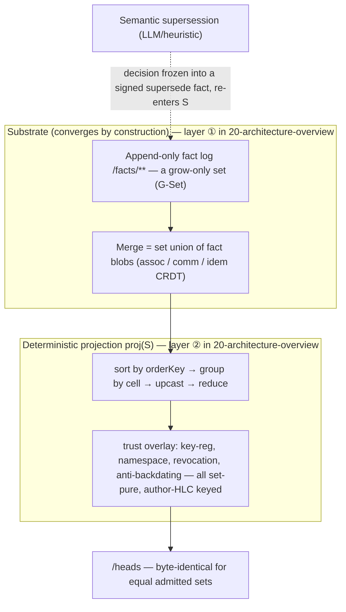
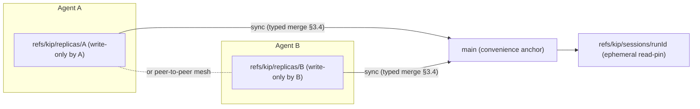

# Synchronization & convergence (correctness core)

> The load-bearing correctness document: how kip replicas converge to byte-identical state without a coordinator, and the precise guarantee (SEC) that holds.

**Source: SPEC §4b (1380–1669) + §7 (2811–2842).** Cross-cuts the [git substrate](./22-git-substrate.md) (§3 — `orderKey`, INGEST-GATE, retention) and [temporality & bitemporality](./23-temporality-and-bitemporality.md) (§4 — fact envelope, valid/transaction time).

RFC-2119 keywords (MUST / MUST NOT / SHOULD / MAY) are normative and carried over from the spec verbatim in meaning.

---

## 0. Why this doc exists

Synchronization & distribution is the core's **headline capability** (resolves hard-problem HP-6 and tensions T-2, T-4, T-5). Everything else in kip is built so that two replicas compute the **same bytes for the facts they both hold** — no coordinator, no quorum, no global lock. Under admission-control / partial replication this is the **per-shared-subset** guarantee (stated precisely as the SEC corollary in §4.2), **not** an unconditional full-universe byte-identity; with that qualifier in mind, this document states the guarantee exactly and MUST NOT be read as softening it.

The convergence core is two layers. **This is a zoom-in on layers ①–② of the five-layer stack in [architecture overview §2](./20-architecture-overview.md#2-the-layering), not a competing model:** the "Substrate" here is layer ① (Git substrate) and the "Deterministic projection `proj(S)`" here is layer ② (deterministic projection). Layers ③–⑤ (accelerators, active layer, context-management) sit *above* this core and never participate in the two layers shown below (they re-enter only as signed facts in the substrate, INV-A1). This doc deliberately collapses to the two layers that carry the SEC guarantee:

For the temporal ordering of this path across actors (write → commit → sync → lazy `proj` → recall), see the [end-to-end sequence diagram](./20-architecture-overview.md#5a-end-to-end-sequence--write--commit--sync--proj--recall).

The first layer **converges mechanically** (a CRDT). The second layer is **a pure total function of the converged set**. Any order-sensitive or model-driven decision (semantic supersession) is **recorded as a signed fact before it can affect convergence** and is then just another set member.

---

## 1. The clock — HLC (decision) — §4b.1

Every fact carries an **HLC stamp** `(wall: int64ms, counter: uint32, replicaId)`, **author-stamped and signed** (§4.1). (Resolves T-5.)

- **Rejected:** wall-clock alone (no causal order across replicas); Lamport (cannot be human-anchored, cannot bound drift); vector / dotted-version clocks (metadata grows O(replicas) — too heavy for high-fan-out agent fleets).
- **Chosen:** HLC — human-anchored *and* causally sound, O(1) metadata.

### 1.1 `orderKey` (the total order)

The exact field tuple of `orderKey` is defined canonically as the `OrderKey` type in [22-git-substrate.md](./22-git-substrate.md#orderkey); `proj` compares those fields in that order. It is a **deterministic total order over author-stamped, set-resident fields only** — it **never** reads `rxFrom` (receive metadata), commit-order, or any receiver clock (M2-1 / C2-1). Totality is genuine: the canonical payload covers **every** author/replica/version-distinguishing field (§2.4), so two **distinct** admitted facts can never tie on all components.

### 1.2 Counter width & overflow (M-2)

`counter: uint32`. Per canonical HLC, on overflow within a single `wall` millisecond the algorithm **carries into `wall+1` and resets `counter` to 0**. It **MUST NOT** wrap — wrapping would violate the total order and break SEC. `wall: int64ms` cannot realistically overflow.

### 1.3 Anti-poisoning is a SET-RESIDENT proj rule, NOT a receiver-clock ingest gate (M-2, C3-1)

HLC ordering *fairness* depends on bounding backdating / forward-poisoning (a replica that stamps a far-ahead `wall` would otherwise win all `lww-hlc` races forever; a compromised key could backdate). An earlier draft policed this with a **receiver-physical-clock drift-ε ingest gate** — that made set *membership* depend on the receiver's wall clock and delivery timing, so honest replicas could admit permanently-different sets (C3-1) and it dropped honest offline-authored facts (C3-2). **That gate is removed.**

kip polices drift **inside `proj` with set-resident causal rules, never at the gate and never against any receiver clock**:

- **PRIMARY rule (C4-2) — per-key author-HLC monotonicity, gated on per-key chain completeness (C5-1).** A fact `F` from key `K` projects **trusted** only over a gap-free `(wall,counter)` chain of `K` up to `F` (else `pending`, §3.6/§4c). `F` is **demoted** if `S` holds a **higher-author-HLC, non-ancestor** fact from the **same** `K`. This reads the author's *involuntary* footprint in `S` and is **not author-forgeable** — `K` cannot un-emit its own later-stamped facts. **Safety holds via the completeness gate alone**: an evicted / cap-evicted link yields a `(wall,counter)` gap ⇒ `pending`, never a silent trusted backdate.
- **SECONDARY rule (tightening only).** `F` is demoted if its author-HLC fails to dominate the author-HLC of every fact in its *declared* `causedBy` closure over `S`. `causedBy` is author-controlled ⇒ only a **lower bound** on real causality; this rule is **never relied on alone**.
- **WELL-FORMEDNESS rule (M4-2).** A fact with a forward (`> child`) or cyclic `causedBy` edge is demoted `untrusted-malformed` (§3.6).

`ε_causal` (manifest parameter, **ms in author-HLC `wall` units**) is a small slack applied **only** to the secondary `causedBy` comparison and the per-key comparison as a **same-`wall`-tie tolerance**. It is compared **only to set-resident author-HLCs, never to a physical clock**; `ε_causal = 0` is the strict (no-slack) setting.

> **Key consequence:** diligence in stamping `causedBy` only *tightens* the net; its absence never causes a wrong demotion. **Completeness does not depend on writer diligence.** The acknowledged residual: a key that has emitted nothing higher can self-date freely (no conflicting same-key history to poison).

### 1.4 Concurrency detection — commit DAG, not closure traversal (M-1)

kip does **not** claim "DVV-grade" detection. The honest rule:

- The **git commit DAG is the causal history git already stores.** Two facts are **causally ordered** iff one's recording commit is an ancestor of the other's — an **O(1)-amortized** ancestry check, *not* O(replicas) and *not* a per-fact `causedBy` closure walk.
- `causedBy` is an **optional, intra-batch hint** (same-replica facts in one commit have no DAG edge between them). It is **never required for correctness**.
- Two facts are **concurrent iff** neither's recording commit is a DAG ancestor of the other AND no `causedBy` edge orders them. **Absent information defaults to concurrent** — the *safe* direction, which invokes the deterministic reducer (`orderKey`-max) rather than assuming a linear supersession. A forgotten `causedBy` edge can only make two facts *look concurrent* (resolved deterministically by `orderKey`), never silently mis-linearize.
- **Concurrency detection NEVER changes a projected VALUE (C2-1, C2-3).** It is an *audit/diagnostic* signal only — **not** an input to `proj`'s value decision. `proj` resolves *every* cell purely by set-pure `orderKey`-max over the admitted set, whether or not two facts are "concurrent." (The transport commit-DAG is a transport detail and, post-excision, a *regenerated* projection of the set — were it allowed to flip a value, `proj` would become replica-dependent. It is not.)
- **The trust / revocation causal-plausibility rule reads SET-RESIDENT causal edges, not the transport DAG (C3-1/C3-3).** The anti-backdating and revocation-cutoff rules read **only** the signed `causedBy` field (a signed component of the canonical payload, §2.4) and the **deterministic transitive closure** of those edges over the admitted set — a pure function of `S`, so byte-identical on every replica. The `causedBy` ≤-author-HLC consistency constraint is **ENFORCED set-purely, not assumed** (M4-2), so the closure is acyclic, terminating, and can never contradict the set-pure `orderKey` ([INV-15](./60-conformance-and-testability.md)).

---

## 2. Append-only fact log over git — the convergence substrate — §4b.2

The fact set `/facts/**` is a **grow-only set (G-Set)** of immutable, content-addressed facts. **This is the load-bearing CRDT.**

**Terminology reconciliation (C-2):** the *substrate* is a pure G-Set — facts are only ever **added**, never removed (a `retract` is itself a new fact, **not** a set removal). "Removal" semantics live entirely in `proj`, which interprets `retract` facts. Where a *multi-value cell* needs remove semantics (e.g. a tag set), the reducer is an **OR-Set with explicit tags** (§3.4): each member carries the asserting `FactId` as its tag; a `retract` names the tag(s) it removes. So there is no "G-Set that nonetheless removes" contradiction — the **set of facts** is grow-only; the **projected collection value** uses OR-Set / PN-Counter semantics computed by `proj`.

- **Merge = set union of fact blobs** (§3.4). Trivially associative, commutative, idempotent.
- **Transport = git's content-addressed delta** (the Noms lesson): `sync` = `git fetch` / `push` of missing objects only. Sending a replica's new facts is sending its missing fact blobs — nothing more.
- **Idempotent ingestion (INV-7):** a fact's id *is* its content CID **including the author-stamped, signed `hlc`** (§4.1, M-4). Two delivery paths of the *same logical assertion* carry the *same* `hlc` (author-stamped once, before signing), so they have the *same* CID and re-ingesting is a strict no-op — no double-counting under `pncounter`, no duplicate valid-time intervals. (The rejected "receiver stamps HLC" design would have produced *different* CIDs per replica and broken this.)

---

## 3. Reconciliation — two layers (the core's central distinction) — §4b.3

Per T-4, kip splits resolution into a **converging substrate** and a **recorded semantic layer**:

| Layer | Where | Mechanism | Property |
|---|---|---|---|
| **Substrate state** | core | grow-only fact-**set** union | **CRDT** (assoc / comm / idem). Converges. |
| **Projection `proj`** | core | one deterministic pure total function of the set (sort by `orderKey` → group → upcast → reduce) | **Byte-identical** for equal sets. No LLM in this path, no order sensitivity. |
| **Semantic supersession** | above core | LLM/heuristic decides "this invalidates that" — but the decision is **recorded as a signed `supersede` fact** keyed by its input CIDs | Re-enters the substrate; `proj` folds the *recorded decision*, never re-runs the LLM. |

**Key invariant (C-3):** the semantic layer **MUST NOT mutate** a fact and **MUST NOT participate in `proj`**. An order-sensitive LLM decision is **frozen into a `supersede` fact** *before* it can affect convergence; that fact is then just another member of the set.

Because the corrective fact is **keyed by its input-CID set**, a re-run over the same inputs produces the **same CID** (a no-op, INV-7), so two replicas running the pass converge rather than emitting contradictory corrections. If two genuinely different `supersede` decisions are emitted concurrently (e.g. different model versions) over overlapping `inputCids`, the **default** reducer surfaces a deterministic `kip:conflict` (never a hash / `orderKey` tiebreak of contradictory adjudications, C2-2), resolved only by a `resolve`-scoped dominating supersede (§3.4, M3-1) — a pure function of the set either way.

> **Thus the bytes of `/heads` are a function of the set only** — never of which replica ran supersession or when. This is the precise resolution of T-4 and the C-3 / C2-2 fix.

---

## 4. The convergence guarantee (SEC) — §4b.4 — stated precisely

This is **the** correctness claim. It MUST NOT be softened or over-stated. Two parts: the full-universe theorem, and the strictly-weaker per-shared-subset corollary that is the price of bounded storage.

### 4.1 Theorem — Strong Eventual Consistency (full admitted set)

> **Theorem (SEC = G-Set convergence + `proj` determinism).** Let `S_A`, `S_B` be the non-excised **admitted** fact sets held by replicas A and B after excision markers (if any) have propagated. If `S_A = S_B = S`, then A and B compute **byte-identical `/heads` and byte-identical deterministic projections**, regardless of delivery order, batching, `rxFrom`, commit-order, wall-clock-at-read, or which replica authored which fact.

### 4.2 Corollary — SEC under PARTIAL REPLICATION (admission control & retention, C4-1)

When replicas apply admission-control / retention policies (§3.5a) they MAY hold *different subsets* of the signature-valid universe (some `quarantined-ttl` facts evicted on one replica, kept on another). SEC is then stated **per-shared-subset**:

> For any two replicas A and B, on the **INTERSECTION `S_A ∩ S_B`** of what they both currently store, **AND restricted to cells whose covering facts' authoring keys are chain-complete on both**, `proj` agrees — every such cell projects **byte-identically** on A and B.

This holds because: (i) `proj` is a pure function of the held set and reads no policy; (ii) eviction only ever removes facts that contribute **nothing trusted** to any cell's `/heads` value — `quarantined-ttl` facts (an *unregistered* key's facts), or `key-chain-durable` chain links beyond `keyChainDurableCapBytes` not currently backing a non-`pending` dependent (M6-1); and (iii) per-key trust is gated on **chain completeness** (§3.6 / C5-1), so wherever a replica's held subset is *not* complete for a covering key, that cell projects **`pending`** on that replica — never a divergent trusted value (the link is re-fetched on demand). **Divergence is surfaced as `pending`, never as two different trusted heads.**

> Equivalently: **every cell whose covering keys are chain-complete on both replicas converges byte-identically**; only not-yet-complete cells read `pending`, and only unregistered or cap-evicted non-load-bearing bytes may differ.

### 4.3 Value-neutrality exception (M5-1 / C5-1 — pinned, NOT over-claimed)

Be exact about what was relaxed. An earlier draft's SEC was: *equal received sets ⇒ byte-identical heads, full stop.* The current SEC is **strictly weaker**: *equal complete-durable subsets ⇒ identical heads on that subset*, and held subsets may legitimately differ on everything else. The earlier "the SEC core is not regressed" claim is **retracted as over-stated**.

> **Honest statement:** the SEC core is **PRESERVED ON THE COMPLETE DURABLE SUBSET**; full-universe byte-identity is **RELAXED to per-shared-subset** — a deliberate, weaker guarantee that is the price of bounded storage.

The premise "evicting a `quarantined-ttl` fact is value-neutral" holds **only** for facts **outside any key's relied-upon completeness chain**. The dangerous C5-1 case — evicting a **pre-registration same-key** fact that is the monotonicity-contradicting evidence for a *later* same-key fact, thereby flipping that later fact demoted↔trusted — is closed by the **chain-completeness gate**: the eviction produces a `(wall,counter)` gap, so the later fact projects **`pending`**, never a silently-flipped trusted value. The same reasoning extends to cap-evicted `key-chain-durable` links under M6-1.

With C5-1 in force, eviction is value-neutral for **every fact a replica may evict** (unregistered-key facts and cap-evicted registered links), always with **`pending`-on-gap** semantics for any dependent same-key fact. **[INV-19](./60-conformance-and-testability.md) holds under cap-bounded retention (m6-2):** trust is preserved once the chain is complete OR re-fetched, `pending` otherwise — the M6-1 cap does **not** contradict the monotone `pending → trusted/demoted` guarantee, because the completed-chain frontier is **pinned** while any non-`pending` dependent relies on it. Membership purity (signature-only) is preserved; availability is bounded; convergence is guaranteed **on the complete durable subset**.

### 4.4 Proof (four steps — carry the structure)

1. **The admitted set converges — admission is a pure function of the fact's bytes (C3-1, M3-4, M3-5).** The substrate is a G-Set; union is assoc / comm / idem. The **INGEST-GATE (§3.2)** admits a fact **iff it is well-formed and its Ed25519 signature verifies over the canonical payload — and nothing else** (not drift, not key-registration, not namespace authority, not revocation). Ed25519 verification is **deterministic and a function of the fact's bytes alone**: it reads no clock, no `rxFrom`, no partially-synced key log, no local state. Therefore the admitted set is exactly the set of *received* signature-valid facts — a true G-Set with an identical element universe on every replica, and **equal received sets ⇒ equal admitted sets**. *(This is the C3-1/M3-5 fix: the earlier step listed "the registered-key log and physical clock" as inputs — per-replica quantities that negated convergence; both are removed from membership and become proj-time demotions in step 2.)*
2. **`proj` is a deterministic total function of `S` alone (C2-1).** `proj(S)` (§3.4) imposes **one** global total order (`orderKey`, reading only author-stamped set-resident fields, ending in `publicKeyFingerprint` then `factCID`). Totality is genuine ([INV-3](./60-conformance-and-testability.md)). `proj` groups by cell, applies versioned upcasters (quarantining unknown versions, never failing), and decides **ALL trust questions by comparing each fact's signed AUTHOR-HLC** to set-resident evidence — **key-registration** (a `KeyAuthorization` for the signing key must be in `S`, M3-4), **namespace-authorization**, **revocation `effectiveFrom`** (mode-dependent, M4-1), and **author-HLC causal plausibility** (the involuntary per-key monotonicity rule C4-2 + secondary `causedBy` closure + well-formedness M4-2) — all keyed on AUTHOR-HLC over `S`, **never `rxFrom`, never the receiver clock, never the local key-log view, never ingest order, never wall-clock-at-read**. A fact failing any trust question projects `untrusted` / `quarantined` (surfaced, never dropped) and is re-evaluated monotonically as facts arrive. `proj` then reduces each cell with a **deterministic total reducer** (valid-time geometry by a sweep-line over the *set*). Therefore `proj(S)` depends **only** on `S`: equal sets ⇒ identical sorted sequence ⇒ identical trust demotions ⇒ **byte-identical `/heads`**.
3. **Downstream deterministic projections** (graph adjacency, salience with fixed weights / seeds) are pure functions of `proj(S)` + `S` (§5), keyed by source hashes ⇒ equal sources ⇒ equal projections. **Accelerator projections — ANN / embeddings — are explicitly EXCLUDED from byte-identity** (§5.3; recall-equivalent only).
4. **Identity / as-of / pins address the fact set, not commit CIDs (C2-3).** `asOf({validTime})` and durable pins resolve against `factSetDigest` + author-HLC frontier; the commit DAG is a deterministic *regeneration* of the ordered set. So even after **concurrent** excision (where commit CIDs may differ per replica) the resolution targets converge. Commit CIDs are **never** an addressable identity. ∎

**Independence corollary (INV-1 / INV-2).** `proj` output is **independent of `rxFrom`, commit-order, and wall-clock-at-read** — these never appear in `orderKey`, in any reducer, or in any trust / authorization decision. (The v2 defect — revocation demotion reading `rxFrom` — is eliminated at the root: revocation / authorization are author-HLC comparisons over `S`, §8.1.) The conformance suite tests this by random-order, random-partition replay equality ([INV-2](./60-conformance-and-testability.md)).

### 4.5 Divergence window (C-4.2)

SEC is bounded to the **non-excised** set *after markers propagate*. While an excision marker is in flight, a replica still holding the excised fact computes a different `/heads` — an **explicit, bounded, expected window**, not a counterexample. Equality is restored once the excision has propagated and `/heads` has been re-folded on both sides. (See [temporality & bitemporality](./23-temporality-and-bitemporality.md) for tombstone-vs-excision semantics.)

### 4.6 Partition tolerance — offline-first and convergence are COMPATIBLE (C3-2)

Replicas operate fully offline (local branch writes). On reconnect, `sync` exchanges missing objects; because **signature-valid facts are never dropped** (admission is signature-only, §3.2), an offline replica that reconnects after an arbitrarily long partition has **all** its locally-authored facts accepted by every peer — verified by signature regardless of age, with **no clock-skew / delivery-timing window** that could reject them. Convergence holds the moment fact-sets equalize.

Any fact still *causally implausible* given currently-received facts is **quarantined** (`untrusted-anachronistic`) and **re-evaluated as more facts arrive** — its *logical membership* is never lost while it can still be cleared. **Retention of its BYTES is bounded** (§3.5a):

- A quarantined fact from a **trusted (registered) key** is `key-chain-durable` — preferentially retained up to `keyChainDurableCapBytes`; past the cap the oldest chain links MAY be evicted and **re-fetched on demand** (dependents read `pending` until then — safe).
- A quarantined fact from an **unregistered** key is `quarantined-ttl` — kept under a bounded TTL + per-key byte-cap + **global `quarantinePoolBytes` aggregate budget** (m5-1), eviction-eligible thereafter (re-fetchable on demand if it later becomes durable). So a permanently-partitioned *unregistered* author's never-clearing quarantine has a **storage ceiling** rather than unbounded growth.

**Honest bound (m5-4 / M6-1):** for a **registered** key the durable chain is bounded per registered key by quota — and this is now *true*, because `keyChainDurableCapBytes` is an actual eviction cap (M6-1), not a never-evict promise. A registered or compromised key can **no longer** force unbounded non-evictable durable bytes; the only cost of the cap is the **re-fetch liveness residual**: if an evicted chain link is unavailable on every peer, dependent same-key facts stay `pending` (never wrong-trusted). **No coordinator, no quorum, no global lock** (T-2 resolved toward *coordinator-free*).

---

## 5. Branch-per-agent vs trunk (decision) — §4b.5

**Decision: hybrid** — long-lived `refs/kip/replicas/<id>` per agent, a shared `main` trunk, and short-lived `refs/kip/sessions/<runId>` read-pins. (Resolves T-2.)

- Each agent writes only to *its own* replica branch (no write serialization across agents → no coordinator).
- `sync` performs the typed merge (§3.4) replica↔replica or replica→main. Because merge is mechanically convergent, *any* merge topology (star via main, or peer-to-peer mesh) converges to the same state — the trunk is a **convenience anchor, not a correctness requirement**.
- Branch proliferation (the T-2 cost) is bounded: session branches are ephemeral (deleted after rollup); replica branches are O(agents), not O(writes); gc reclaims merged session branches.
- **Rejected:** pure single-trunk (Datomic) — serializes writes, cannot branch-from-past. **Rejected:** unbounded branch-per-memory — gc / merge nightmare. The hybrid keeps as-of *and* divergent timelines.

---

## 6. Consistency & concurrency model — §7

> The substrate/`proj` outcomes below (reject-at-gate, proj-demotion/quarantine, `kip:conflict`, pending/pin-incomplete) are the layer-①/② rows of the consolidated [failure & conflict model](./27-failure-and-conflict-model.md); this section keeps the convergence-local detail.

- **Multi-writer model:** branch-per-replica (§5 above). Within a replica, writes are serialized by the commit buffer; across replicas, **no serialization** — convergence handles divergence.
- **Conflict policy:** per-property `CellReducer` (default `lww-hlc`); conflicts surfaced as `kip:conflict` nodes, **never silently resolved** (N5). A custom reducer **MUST be a deterministic, total, pure function of its fact subset** (it has no binary `merge` op to be "ACI" — the **set-fold** is what converges, §3.4). The conformance suite tests determinism by **folding random permutations of the full fact multiset** for a cell and asserting byte-identical output ([INV-3](./60-conformance-and-testability.md)) — not a binary-triple ACI test, which proves nothing about the real fold.
- **Signing / provenance & trust — signature-only gate vs proj (C-6, C2-1, C3-1, M3-4):** every fact is Ed25519-signed over the canonical payload **including the author HLC and `publicKeyFingerprint`** (M2-1). The **ingest gate** verifies **only** signature validity (well-formed ∧ Ed25519 verifies) — the sole predicate that is a pure function of the fact's bytes (§3.2). A fact failing it is **not admitted** (objective, identical on every replica); a signature-valid fact is **always admitted**.
  - **Key-registration, namespace-authorization, revocation, AND author-HLC causal-plausibility are NOT ingest gates** — they are **set-pure demotions inside `proj`** comparing each fact's signed **author-HLC** to set-resident evidence (key-authorization / revocation `effectiveFrom`, causal ancestry). A fact whose key is unregistered, unauthorized-for-namespace, revoked **at its author-HLC**, or causally anachronistic projects `visible-but-untrusted` / `quarantined` and loses to trusted asserts — surfaced, never silently dropped (N5), re-evaluated as facts arrive, and **never decided by `rxFrom` or any receiver clock**.
  - **Verifiability ≠ trustworthiness:** a revoked or unregistered key's facts remain *verifiable* but are *demoted* by `proj` deterministically. This makes convergence and trust composable *without* injecting any replica-local quantity into membership or `proj`.
- **Isolation:** sessions read from **pinned (frontier-addressed) snapshots**, so a long-running agent run sees a stable graph even as other replicas write.
- **Atomicity:** a `txn` is one commit (all-or-nothing at the git level). A partially-written buffer is never visible (the commit is the publish point; `assertFact` reports `pending` until then, m-9).

---

## 7. Invariants this doc is responsible for

The convergence claims here are mechanized as conformance invariants whose canonical titles + bodies live in [conformance & testability](./60-conformance-and-testability.md) — referenced here by bare id (not re-glossed): **INV-1**, **INV-2**, **INV-3**, **INV-7**, **INV-13**, **INV-16 / INV-19**, **INV-18**.

The active layer ([active knowledge overview](./30-active-knowledge-overview.md)) sits **above** this core and **never** participates in `proj` (INV-A1) — its order-sensitive decisions are recorded as signed facts and folded like any other, leaving §3.2 / §3.4 / §4b.4 untouched.
