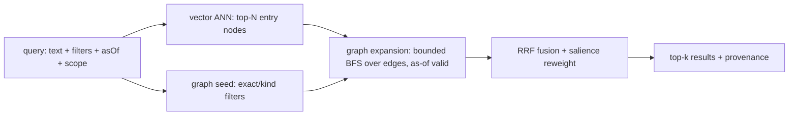

# Retrieval

Purpose: the hybrid recall pipeline (vector ANN candidates → bounded graph expansion → RRF fusion with
salience reweight), typed as-of traversal, the derived/content-addressed/incremental indexing
strategy, and the salience projection.

Source: SPEC §5 (1762–1869).

---

## 5.1 Hybrid pipeline (vector candidates → graph expansion → RRF)



```ts
interface RecallQuery {
  text?: string;                      // → embedding → ANN candidates
  filters?: { kind?: NodeKind[]; props?: Record<PropKey, PropValue>; edgeKinds?: EdgeKind[] };
  scope?: ScopeRef;                   // tenant / namespace / pinned snapshot
  asOf?: AsOf;
  expand?: { hops: number; edgeKinds?: EdgeKind[]; maxFanout?: number }; // bounded — Mem0 precision pitfall
  k: number;
  rank?: { rrfK?: number; salienceWeight?: number; recencyWeight?: number };
}
```

This is the shape consumed by `recall(q)` on the [SDK `Repo` surface](./40-sdk-api-surface.md) and by
the [context-enablement `recall` seam](./25-context-enablement-seams.md).

- **Vector half** (the gap kip fills): ANN over an embedding projection (HNSW or IVF; pluggable index,
  **embeddings supplied by the caller — N2**). Returns candidate entry nodes.
- **Graph half**: bounded BFS expansion from candidates over `as-of`-valid edges, with
  `maxFanout` / `hops` caps to fight context dilution. Graph expansion injects tangential noise, so
  expansion **MUST be bounded and opt-in, never unbounded**.
- **Fusion**: **Reciprocal Rank Fusion** `score(d) = Σ_r 1/(rrfK + rank_r(d))` over the vector rank,
  graph-proximity rank, and salience rank. RRF avoids score-scale mismatch between cosine similarity
  and graph distance. The final reweight applies salience/recency knobs.

---

## 5.2 Graph traversal

Typed, directional, **as-of** BFS/DFS with a seen-set (a bitemporal adjacency model). Traversal
**only** crosses edges **valid at the query's `validTime`** and **known as-of its `txTime`**. The
bitemporal axes are defined in
[Temporality & bitemporality](./23-temporality-and-bitemporality.md).

---

## 5.3 Indexing strategy — derived, content-addressed, incremental

(HP-2, T-3, **M-7** — resolved.) **All indexes are projections; none is the source of truth.** kip
splits projections into two classes with **different reproducibility contracts**:

| Class | Members | Reproducibility |
|---|---|---|
| **Deterministic** | `/heads`, graph adjacency, salience-with-fixed-weights **over an exactly-specified integer/rational centrality algorithm** | **Byte-identical** across replicas for equal source (INV-5 applies). |
| **Accelerator (non-deterministic)** | ANN index (HNSW/IVF), embedding vectors, **and any salience whose centrality term uses a floating/iterative-tolerance algorithm** (e.g. power-iteration PageRank) | **Best-effort ranked**; reproducible *only* given the same build. Byte-identity is **explicitly NOT guaranteed** (INV-5 excludes these). |

This deterministic-vs-accelerator boundary is load-bearing for convergence — see §3.5a/§5.3 in
[the git substrate](./22-git-substrate.md) and
[non-functional requirements](./11-non-functional-requirements.md).

- **Keying.** Each projection chunk is keyed by the **git hash of its source subtree** (a shard) or
  the source fact CIDs, cached under `refs/kip/projections/<name>@<srcHash>`. **For accelerators, the
  key MUST also include the embedding-model identity** (model id + version, recorded as a fact, §5.4)
  so "same source, different embedding model" is a cache miss, not silent staleness (M-7.2).
- **Incremental rebuild.** On a new commit, diff the tree (prolly-style subtree-hash skip): only
  changed shards reproject. Embeddings recompute only for entities whose embedded content changed.
- **ANN is not byte-deterministic (M-7.1).** HNSW layer assignment and IVF k-means init are
  order/seed-dependent; two builds over the same vectors can yield different graphs. kip does **NOT**
  claim byte-identity for the ANN index. Its conformance test is **recall-based** ("equivalent up to
  index nondeterminism"), not byte equality. A *fixed-seed* build is reproducible only on the same
  builder; cross-replica ANN indexes are expected to differ in bytes while agreeing in ranked recall.
- **Cache invalidation = key mismatch.** A chunk is valid **iff** its key (source hash *and*, for
  accelerators, embedding-model id) matches. Staleness of a *deterministic* projection is structurally
  impossible; staleness of an *accelerator* is **detectable** via the model-id component of the key —
  **not** "structurally impossible" (the v1 claim was too strong; corrected, M-7).
- **Rebuildability invariant (INV-5).** Dropping and rebuilding all **deterministic** projections
  yields byte-identical results. Accelerators rebuild to **recall-equivalent**, not byte-identical.
  See [conformance & testability](./60-conformance-and-testability.md).

---

## 5.4 Salience projection

> **Salience ownership (single owning view).** Salience is **one** derived projection with a **conditional layer membership**, and this section is its single owning view. Where it is *computed*: salience is folded from `proj(S)` + `S` (centrality over `/heads` adjacency; recency/access/confidence over `read`-event and value facts). Which *layer* it lives in depends solely on its centrality term — **layer ② (deterministic)** when the centrality algorithm is exactly-specified integer/rational (byte-identical), or **layer ③ (accelerator)** when it uses a floating/iterative algorithm (recall-equivalent only); this is the §5.3 deterministic-vs-accelerator split below, *not* two different salience concepts. Where it is *consumed*: the [recall pipeline](#51-hybrid-pipeline-vector-candidates--graph-expansion--rrf) (RRF salience rank + `rank.salienceWeight` reweight) and the [context-enablement seams](./25-context-enablement-seams.md) (compaction hints). The [architecture overview](./20-architecture-overview.md) layer diagram and component map reference this view rather than restating the split.

```ts
interface SalienceModel {
  // salience(eid) = w_r·recency(hlcAge) + w_a·accessFreq + w_c·confidence + w_g·centrality
  // recompute incrementally as access-event facts and edges arrive; decay applies time-discount
  weights: { recency: number; access: number; confidence: number; centrality: number };
  halfLifeMs: number;                 // decay constant
}
```

Salience is a **derived projection** (never an authored property), so it is rebuildable and **cannot
drift from the facts**. Access events are themselves **facts** (`read` events), keeping the salience
input auditable and as-of-queryable.

**Centrality is byte-identical ONLY under an exactly-specified algorithm (m2-7).** Centrality is a
global graph property; an iterative, tolerance-dependent algorithm (power-iteration PageRank,
approximate betweenness) is **not** byte-reproducible — two incremental update paths can differ in the
last ULP — so it cannot be both "byte-identical" and "centrality-based." kip therefore requires:

- If the centrality term is in the **deterministic** salience class, it **MUST** use an
  **exactly-specified integer/rational** algorithm (e.g. fixed-point PageRank to a pinned rational
  tolerance, or an exact combinatorial centrality), full-recompute-equal to incremental-recompute by
  construction.
- Otherwise the centrality-bearing salience **MUST** be declared an **accelerator** projection
  (recall-equivalent, not byte-identical, §5.3).
- It is **never** permitted to claim byte-identity over a floating/iterative centrality.

**Reproducible recall (m-7).** Reads emit `read` facts that feed `accessFreq`, which would make recall
**observer-effecting** (two identical `recall(asOf=T)` calls ranking differently). kip closes this:
**salience inputs for a query are bounded by `asOf.txTime`** — only `read` facts with
`rxFrom ≤ asOf.txTime` count. A `recall` at a fixed `asOf` is therefore a **pure function of the
as-of fact-set** and reproducible; the read-event a `recall` itself emits has a *later* `rxFrom` and so
**cannot affect its own (or any equal-`asOf`) ranking**. With fixed reducer weights/seeds, salience is
a *deterministic* projection (§5.3).

**Embedding-model identity is a fact (M-7.2).** The embedding model id + version used to build the
vector projection is recorded as a `kip:embedding-model` fact, so the accelerator projection's cache
key covers the embedding identity and a model change is a **detectable cache miss** rather than
invisible incomparable vectors.

---

## Cross-links

- [SDK API surface](./40-sdk-api-surface.md) — `recall(q)`, `query(spec)`, `asOf`.
- [Context-management enablement seams](./25-context-enablement-seams.md) — the `recall` seam and
  salience compaction hints.
- [Temporality & bitemporality](./23-temporality-and-bitemporality.md) — the `asOf` / valid-time /
  tx-time axes that bound traversal and salience.
- [Git substrate](./22-git-substrate.md) — projections, content-addressed caching, the accelerator
  boundary.
- [Conformance & testability](./60-conformance-and-testability.md) — INV-5 rebuildability.
