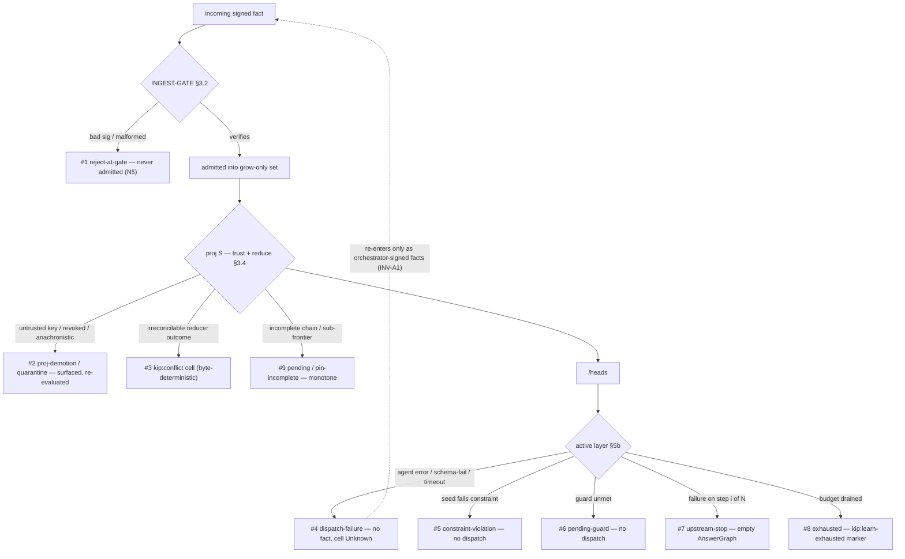

# Failure & conflict model

> Purpose: the single architectural home for kip's failure / outcome taxonomy. It enumerates every
> canonical failure class once, says which layer owns it, and shows how each propagates up the stack —
> so the per-subsystem failure tables can link here instead of re-deriving the model.

**Source:** SPEC N5 (§1, no fallbacks), §3.2 (ingest gate), §3.4/§3.6 (`proj`, demotion, `kip:conflict`), §4b.4 (SEC under partial replication), §5b.1 (step outcomes), §5b.2 (autoencoding loop), §8.x (pin completeness). Synthesis — introduces no new claims.

---

## 0. The one rule everything specializes — N5 (no fallbacks)

kip's whole correctness story is its **failure handling**. The governing rule is **N5 — no fallbacks**:

> kip never silently "picks something." Ambiguous merges surface as typed `kip:conflict` cells;
> unverifiable facts are rejected; non-conforming facts are quarantined (never dropped). (§1 N5,
> [20-architecture-overview §3](./20-architecture-overview.md))

Every outcome below is a specialization of N5 at a particular layer. Two structural properties hold across all of them:

- **Surfaced, never silent.** A failure is always *observable* — a rejection at the gate, a demoted/quarantined projection, a typed conflict cell, an empty `AnswerGraph`, or a `pending`/`pin-incomplete` status. There is no "best-effort guess."
- **Monotone re-evaluation.** Failure classes that are a function of the *current* fact set (`pending`, quarantine, `pin-incomplete`) are **re-evaluated as more facts arrive** and resolve monotonically — they are never terminal until the inputs are.

---

## 1. The canonical outcome taxonomy

| # | Outcome | Owning layer | Trigger | Effect / propagation | Source |
|---|---|---|---|---|---|
| 1 | **reject-at-gate** | ① INGEST-GATE (§3.2) | fact not well-formed, **or** Ed25519 signature does not verify over the canonical payload | **Not admitted** to the fact set (objective, identical on every replica). The only place a fact is ever *refused*; nothing downstream sees it. | [§3.2](./22-git-substrate.md), [§4b.4 proof step 1](./24-synchronization-and-convergence.md) |
| 2 | **proj-demotion / quarantine** | ② `proj` (§3.4/§3.6) | admitted fact fails a **trust** question — key-registration, namespace-authorization, revocation-at-author-HLC, or author-HLC causal plausibility | Fact projects `untrusted` / `quarantined` (`untrusted-anachronistic`, `untrusted-malformed`), **loses to trusted asserts, never dropped**, re-evaluated monotonically. Bytes bounded by retention class (`quarantined-ttl` / `key-chain-durable`). | [§3.6/§8.1](./24-synchronization-and-convergence.md), [glossary PROJ-demotion](./glossary.md) |
| 3 | **`kip:conflict`** | ② `proj` reducer (§3.4) | a reducer faces a **non-commutative / irreconcilable** decision (competing `supersede`/`kip:learn` accepted sets over the same key; a `custom` reducer declaring irreconcilable; `same_as` vs `not_same_as`) | A typed `kip:conflict` cell/node naming both candidates — **byte-deterministic**, never hash/`orderKey`-tiebroken among contradictory outcomes (C2-2). Resolved only by a dominating `resolve`-scoped supersede. | [§3.4](./24-synchronization-and-convergence.md), [§5b.2](./32-knowledge-autoencoding.md) |
| 4 | **dispatch-failure** | ④ active layer (§5b.1/§5b.2) | a microagent returns non-zero `exitCode`, fails `outputSchema` validation, **or** exceeds `runtime.timeout` (all three identical) | **Emit no fact**; target cell stays `Unknown`. A fabricated plausible output is the banned fallback (N5). In autoencoding the failed iteration is scored **infinite loss** and consumes one budget unit. | [§5b.1](./31-contextual-functionalities.md), [§5b.2](./32-knowledge-autoencoding.md) |
| 5 | **constraint-violation** | ④ active layer (§5b.1) | a binding declares a `constraint` (claim 8) and the seed/input fails it over `proj` (or is `unknown`) | **No dispatch, no fact**, target cell `Unknown`, violated `constraint` recorded in provenance. | [§5b.1](./31-contextual-functionalities.md) |
| 6 | **pending-guard** | ④ active layer (§5b.1) | a `requires`/`condition` guard (claim 12) is not yet satisfied over `proj` | **No dispatch**, target cell `Unknown`; differs from dispatch-failure **only in provenance** (the unmet `EdgeKind`/`ConditionNode` is recorded). | [§5b.1](./31-contextual-functionalities.md) |
| 7 | **upstream-stop** | ④ active layer (§5b.1) | any of #4–#6 on step *i* of an *N*-step segment | Orchestrator **stops the segment**; emits **no result-instance facts** for `target`; `runContextualQuery` returns an `AnswerGraph` with `result = []`. Intermediates committed through step *i−1* remain as ordinary facts; no terminal answer fabricated (N5). | [§5b.1](./31-contextual-functionalities.md) |
| 8 | **exhausted** | ④ autoencoding (§5b.2) | the bounded disjunctive budget (`maxIterations`/`maxWallMs`/`maxInvocations`) is drained before the loss threshold is met | **No `accept` fact**; the loop authors one signed `kip:learn-exhausted` marker (auditable, names inputs + best loss seen); cells stay `Unknown`. No best-effort accept (N5). | [§5b.2](./32-knowledge-autoencoding.md) |
| 9 | **pin-incomplete / pending** | ②/seam (§4c/§8) | a read/pin resolves against a sub-frontier the replica has **not** fully received, **or** a per-key trust chain has a `(wall,counter)` gap (chain-incomplete) | Resolution returns `pin-incomplete` / the cell projects `pending` — **never a silent partial read** (N5). Completion is **monotone**: re-evaluated as the missing links arrive; the missing chain link is re-fetched on demand. | [§4b.4 corollary](./24-synchronization-and-convergence.md), [§5.4 pin](./26-retrieval.md) |

---

## 2. How each propagates up the layers

The taxonomy is **layered**: a fact is refused at most once (the gate), and everything after the gate is *projection-time* and therefore set-pure and convergent.

- **Layer ① (gate)** owns exactly one outcome: **reject-at-gate**. Membership is signature-only, so rejection is objective and identical on every replica — it is the only failure that removes a fact from consideration entirely.
- **Layer ② (`proj`)** owns the *set-pure* outcomes: **proj-demotion/quarantine**, **`kip:conflict`**, and **pending/pin-incomplete**. All three are pure functions of the admitted set and re-evaluate monotonically as facts arrive, but they split on the SEC guarantee (§4b.4):
  - **proj-demotion/quarantine** and **`kip:conflict`** are **byte-identical for equal admitted sets** — for any two replicas holding the same set they reach the identical verdict.
  - **pending/pin-incomplete** is the **per-replica divergence-absorber**: by its row-#9 trigger it is a function of *what a given replica currently holds* (a sub-frontier not yet received, or a per-key chain `(wall,counter)` gap). One replica projects `pending` while another holding the complete chain reads the trusted value; the two converge once their admitted sets equalize. It is byte-identical only on the **shared complete-durable subset** ([24 §4.2](./24-synchronization-and-convergence.md)) — divergence is **surfaced as `pending`, never as two different trusted heads** ([§4b.4](./24-synchronization-and-convergence.md)), not attributed to full-universe byte-identity.
- **Layer ④ (active layer)** owns the *dispatch-time* outcomes: **dispatch-failure**, **constraint-violation**, **pending-guard**, **upstream-stop**, **exhausted**. These never touch `proj`'s fold (INV-A1) — a failed step authors **no fact**, so the convergence core is byte-for-byte unchanged. Any value that *does* survive re-enters only as an orchestrator-signed fact and is then subject to layers ①–② again.

**Why the layering matters:** because the gate refuses only on signature, and every richer judgment (trust, conflict, completeness) is a *projection-time* decision over the set, two honest replicas always admit the same set and reach the same failure verdicts — failures are part of the deterministic read model, not a source of divergence.

---

## 3. Where the per-subsystem tables live

This doc is the canonical taxonomy; each subsystem keeps its *local detail* table and links back here rather than re-deriving the model:

- [20-architecture-overview §3](./20-architecture-overview.md) — the N5 one-sentence summary (reject / quarantine / `kip:conflict`).
- [24-synchronization-and-convergence §6](./24-synchronization-and-convergence.md) — conflict policy + the signature-gate-vs-`proj` split (outcomes #1–#3, #9).
- [31-contextual-functionalities — the five N5-safe step outcomes](./31-contextual-functionalities.md) (#4–#7).
- [32-knowledge-autoencoding — per-iteration failure / exhausted](./32-knowledge-autoencoding.md) (#4, #8) and the §5b cell reducer table (#3).
- [50-security-trust-tenancy](./50-security-trust-tenancy.md) — revocation / unregistered-key demotion (#2) and resource-exhaustion quarantine bounds.

See also [conformance & testability](./60-conformance-and-testability.md) for the INV-* that mechanize these outcomes.
