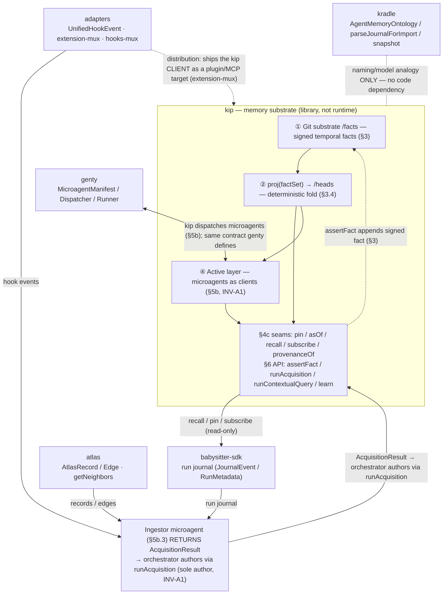
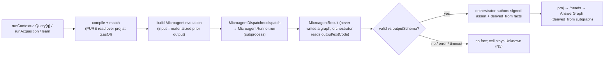

# Stack integration — kip in the a5c stack

> Purpose: how kip integrates with the rest of the a5c stack — **babysitter-sdk**, **genty**,
> **adapters**, **atlas**, **kradle** — and, for each, what kip CONSUMES, what kip PROVIDES back,
> which kip seams carry the integration, and whether the integration point is already specified,
> newly grounded in real code, or still speculative. kip is the **memory substrate**; every other
> component is a producer, consumer, or client of its seams (N1, INV-A1).

**Source:** SPEC + real packages (cite paths). kip-side seams are normative from
[`../SPEC.md`](../SPEC.md) (§4c context-enablement seams, §5b active layer, §6 SDK API surface) and
the decomposition docs cited inline. The component-side entities/APIs are grounded in the real
packages: `packages/babysitter-sdk/src/`, `packages/genty/{core,platform}/src/`,
`packages/adapters/{codecs,extensions,hooks}/`, `packages/atlas/src/`, and
`packages/kradle/{core,sdk}/src/`. Every type/path below was read in those packages.

> **Status tags.** Each integration point is tagged:
> **ALREADY-IN-SPEC** — `../SPEC.md` already names it (line cited);
> **GROUNDED-NEW** — a real code seam exists in the package, but the kip wiring is not yet in SPEC;
> **SPECULATIVE** — plausible but not in code or SPEC; labeled as such, never presented as fact.

---

## Table of contents

- [Where kip sits in the stack](#where-kip-sits-in-the-stack)
- [Integration: babysitter-sdk](#integration-babysitter-sdk)
- [Integration: genty](#integration-genty)
- [Integration: adapters](#integration-adapters)
- [Integration: atlas](#integration-atlas)
- [Integration: kradle](#integration-kradle)
- [Integration invariants](#integration-invariants)
- [Cross-links](#cross-links)

---

## Where kip sits in the stack

**Thesis.** kip is the **bitemporal signed-fact memory substrate**; every other component in the
stack is a **producer**, **consumer**, or **client** of its seams — never a writer of its graph.
Producers (babysitter run journals, atlas catalog records, adapter hook-event streams) supply raw
material that an Ingestor microagent turns into signed episodic/semantic facts. Consumers (the
context-management layer, a babysitter process step) read through `recall`/`query`/`pin`/`subscribe`
at the §4c seams. Clients (genty microagents) realize kip's active layer (§5b) but only ever
*return a result* — the orchestrator is the sole author (INV-A1). kradle is a **conceptual peer**:
kip borrows its naming/model (ontology, snapshot, journal import) as analogies, with **no code
dependency in either direction**. The three kip strata — git substrate (§3), the deterministic
projection `proj` (§3.4), and the active layer (§5b) — present exactly the seams each neighbour
touches, and nothing below ever depends on anything above.



---

## Integration: babysitter-sdk

### (a) The component's real entities / capabilities

`@a5c-ai/babysitter-sdk` (`packages/babysitter-sdk/src/`) is the event-sourced run/journal/task
substrate. The episodic unit kip ingests is a **run journal**:

- `JournalEvent` — `src/storage/types.ts:99` — one persisted episodic record
  `{ seq, ulid, filename, path, type, recordedAt, sdkVersion?, data, checksum? }`, read back by
  `loadJournal` (`src/storage/journal.ts:111`), appended by `appendEvent` (`:51`).
- `RunMetadata` — `src/storage/types.ts:10` — the `run.json` header (`runId`, `request`, `harness`,
  `entrypoint`, `processCodeHash`, `createdAt`, …).
- `StoredTaskResult` — `src/storage/types.ts:111` — per-effect result file with
  `status: "ok"|"error"|"cancelled"`, `result?`, `metadata?`.
- Real event-`type` vocabulary: `RUN_CREATED` (`src/runtime/createRun.ts:101`), `EFFECT_REQUESTED`
  (`src/runtime/orchestrateIteration.ts:230`), `EFFECT_RESOLVED` / `EFFECT_CANCELLED`
  (`src/runtime/commitEffectResult.ts:84`, `:163`), and the lifecycle terminals in
  `RUN_LIFECYCLE_TYPES` (`src/runtime/runLifecycleState.ts:5`). So one episodic unit is an ordered,
  checksummed, ULID-sequenced log:
  `RUN_CREATED → (EFFECT_REQUESTED → EFFECT_RESOLVED|EFFECT_CANCELLED)* → RUN_COMPLETED|HALTED|FAILED`.
- `defineTask` (`src/tasks/defineTask.ts:42`) + `TaskDef` (`src/tasks/types.ts:96`) with an
  `agent:` block (`AgentTaskOptions`, `:33`) — a process step that may target an agent. (kip ingests
  the *result* of such a step, not its routing block; the `agent:` responder-routing sub-fields are
  out of scope here.) `TaskBuildContext.createBlobRef` (`src/tasks/types.ts:130`) externalizes large
  effect payloads to blob refs — the substrate counterpart of kip's summary-only, never-raw ingest rule.

### (b) What kip CONSUMES

kip ingests the run journal as **episodic** facts (`episode`/`observation`/`run`/`event` node kinds,
[21-data-model.md §4](./21-data-model.md)). The concrete source unit is `JournalEvent[]` +
`RunMetadata` read via `loadJournal(runDir)`. Per SPEC the import is **summary-only, never raw**
(`../SPEC.md:352`): kip maps the summary onto `StoredTaskResult.result`/`metadata` plus the
lifecycle event types — never full effect blobs.

### (c) What kip PROVIDES back

- **A read-only recall surface (SPECULATIVE — no wiring today).** A process step *could* read kip via
  §4c `recall` / `pin` (plus the §6 `query` traversal) to fetch prior run context (the seams in
  [25-context-enablement-seams.md](./25-context-enablement-seams.md)). kip never writes into the
  journal; it would only expose facts the run consumes. No babysitter-sdk↔kip-sdk code path exists yet
  (see (f)).
- **Reachable as an MCP/agent effect (GROUNDED-NEW).** babysitter-sdk ships an MCP tool surface
  (`src/mcp/`, e.g. `tools/runs.ts`, `tools/tasks.ts`) through which a run can call external tools as
  effects. kip could be surfaced there as an MCP tool a run invokes — the delivery channel exists,
  though **no kip-specific tool is wired yet**. This is a distinct, grounded surface from the
  SPECULATIVE recall→prompt path above.

### (d) The seams used

- Ingest path: an **Ingestor** microagent (§5b.3, [33-mining-discovery-ingestion.md](./33-mining-discovery-ingestion.md))
  reads the journal, returns an `AcquisitionResult`; the orchestrator commits it via
  **`runAcquisition`** (§6, [40-sdk-api-surface.md](./40-sdk-api-surface.md)) as signed episodic
  `assert` facts (quarantined-until-trusted), with later episodic→semantic consolidation linked by
  `derived_from`.
- Read-back path: §4c **`recall` / `pin`** plus the §6 **`query`** traversal (read-only; a pure
  consumer of the fact stream).
- Effect-surface path: kip surfaced as an MCP tool a run can call via babysitter-sdk's MCP surface
  (`src/mcp/`) — GROUNDED-NEW, not yet wired to a kip-specific tool.

### (e) Data flow

```
babysitter run → orchestrate loop emits EFFECT_REQUESTED/EFFECT_RESOLVED
  → journal/<seq>.<ulid>.json (JournalEvent) + StoredTaskResult + RunMetadata
    → kip Ingestor: loadJournal(runDir) → AcquisitionResult { proposed: summary-only }
      → orchestrator runAcquisition → signed episodic assert facts (INV-A1)
        → proj → /heads → episodic→semantic consolidation (derived_from)
          → process step recalls via recall/query/pin (read-only)
```

### (f) Status

- Journal → episodic facts, **summary-only** — **ALREADY-IN-SPEC** as a generic reference
  (`../SPEC.md:352`, `:2615` Ingestor turns artifact into episodic facts; `derived_from` for
  consolidation).
- The exact event-`type` vocabulary (`RUN_CREATED` / `EFFECT_REQUESTED` / `EFFECT_RESOLVED` / …) —
  **GROUNDED-NEW**: real in `babysitter-sdk/src/runtime/` and `src/storage/`, not enumerated in SPEC.
- kip surfaced as an MCP/agent effect a run can call — **GROUNDED-NEW**: babysitter-sdk's MCP tool
  surface (`src/mcp/`, `tools/runs.ts`/`tools/tasks.ts`) is real and could host a kip tool, but **no
  kip-specific tool is wired** today.
- kip recall feeding a babysitter `agent:` task input — **SPECULATIVE**: no babysitter-sdk↔kip-sdk
  wiring exists in code today; a process step *could* populate a `defineTask({ kind:"agent" })` prompt
  from a kip recall result, but that path is a design idea only.

---

## Integration: genty

### (a) The component's real entities / capabilities

genty supplies the **microagent contract** kip's active layer is built on. genty-core
(`packages/genty/core/src/microagents/`):

- `MicroagentManifest` — `core/src/microagents/types.ts:36` — `name`, `version`, `description`,
  `inputSchema`/`outputSchema`, `isolation` (`IsolationMode` `:29` = `subprocess|worker|container`),
  `runtime{ entrypoint, skills?, tools?, scripts?, processes?, model?, timeout?, env? }`, `tags`,
  `builtIn`. Note `runtime.processes`: a functionality (microagent) can **bundle babysitter process
  definitions** — relevant given that kip treats genty microagents as its functionalities. This is
  live, not hypothetical: the shipped `code-analyzer` built-in
  (`core/src/microagents/builtin/code-analyzer.ts`) exercises it, bundling a process and declaring
  `skills: ["code-review"]`.
- `MicroagentInvocation` — `types.ts:94` — `{ microagentName, input, correlationId?, parentAgentId?,
  timeout? }`.
- `MicroagentResult` — `types.ts:112` — `{ output, exitCode, durationMs, logs?, error? }`.
- `MicroagentRunner` — `core/src/microagents/runner.ts:21` — spawns `runtime.entrypoint` as a node
  subprocess, validates input against `inputSchema`, parses stdout, validates against `outputSchema`,
  returns a `MicroagentResult` (`runner.ts:179`) — never writes a graph. The orchestrator then consumes
  only `output`/`exitCode`/`input`/effective `timeout` from it (`../SPEC.md:1918`).

genty-platform (`packages/genty/platform/src/`):

- `MicroagentDispatcher` — `platform/src/microagents/dispatch.ts:27` — `dispatch(name, input, opts)` +
  `dispatchBatch`.
- `createMicroagentSystem(options)` — `platform/src/microagents/index.ts:52` — bootstraps
  `{ registry, runner, dispatcher }`.
- `OrchestrationProvider` / `JournalProvider` — `platform/src/orchestration/interfaces.ts:89`, `:137`
  — the **pluggable backend seam**. `OrchestrationProvider` (`createRun`/`iterateRun`/
  `postEffectResult`/`getRunStatus`/`getRunEvents`/`getPendingEffects`/`resolveRunsDir`) and
  `JournalProvider` (`loadEvents`/`appendEvent`) let any backend plug in **without importing
  babysitter-sdk** (`interfaces.ts:1-9` forbids that import). This is the seam by which a
  non-babysitter backend (or kip) could register as an orchestration/journal provider. The same
  `interfaces.ts` module exposes four sibling pluggable backends — `GovernanceProvider` (`:126`),
  `ProcessDefinitionProvider` (`:152`), `ExternalAgentProvider` (`:167`), `SessionProvider` (`:174`) —
  rounding out the provider-seam family, though only Orchestration + Journal are kip-relevant today.
- `OrchestrationRegistry` — `platform/src/orchestration/registry.ts:58` — named `ProviderMap`s where
  `get(name)` **throws for an unregistered name** (no fallback, `:99`); `get()` with **no name** returns
  the **first-inserted** provider among distinct names (`:107`); and a duplicate registration under the
  **same name overwrites** (`register()` is `Map.set`, last-write-wins, `:92`).
  `createOrchestrationRegistry()` (`:128`) pre-registers `journal:"fs"` + `orchestration:"babysitter"`
  (the `register()` calls at `:135`/`:136`).
  This is *analogous to* kip's N5 posture — but not identical: N5 forbids silently choosing among
  **competing realizers** for a hop (the `Segment.alternatives`/INV-A7 case), whereas the registry's
  no-name first-of-many is ordinary provider defaulting.
- Confirmed wiring (gated): a babysitter `agent:` effect dispatches a registered microagent —
  `tryDispatchMicroagent` (`platform/src/harness/internal/createRun/orchestration/effects.ts:425`,
  invoked at `:372`, `kind === "agent"` at `:367`). This fires **only when `BABYSITTER_CROSS_SUBAGENTS`
  is enabled** (`crossSubagentsEnabled()`, `effects.ts:249`); when off, the agent effect is emitted
  pending and **no microagent dispatch occurs**. Note the asymmetry: `EffectKind`
  (`interfaces.ts:27`) is `"agent"|"skill"|"shell"|"breakpoint"|"sleep"`, and the
  `BABYSITTER_CROSS_SUBAGENTS` gate fires on `kind === "agent" || kind === "skill"` (`effects.ts:249`),
  but **only `kind === "agent"` reaches `tryDispatchMicroagent`** (`:367` → `:372`); a `skill:` effect
  is gated identically yet is **not** routed to microagent dispatch (it falls through to the skill
  path, `:412`). So microagent dispatch is an `agent:`-effect-only path today — not a `skill:` one. The
  dispatch surface is formally declared by the seam manifest (`platform/src/seams/contract.ts:122`),
  which assigns `microagents/` to the `platform-capabilities` slice (packageExport `./microagents`,
  `:128`) — the seam kip reuses.

### (b) What kip CONSUMES

The genty-core microagent **contract types** — `MicroagentManifest` / `MicroagentInvocation` /
`MicroagentResult` / `IsolationMode` — *are* kip's "functionality" / "functionality descriptor"
([glossary](./glossary.md), [30-active-knowledge-overview.md](./30-active-knowledge-overview.md)).
SPEC reuses these names verbatim and pins the field lists to `@a5c-ai/genty-core` (`../SPEC.md:229`,
`:1914`), instructing "do not invent fields" and that the execution path reads ONLY `output`,
`exitCode`, `input`, and the effective `timeout` — verified against `core/src/microagents/types.ts`.

### (c) What kip PROVIDES back

kip dispatches microagents the *same way* genty does, but wrapped by INV-A1: the **genty runner**
validates `MicroagentResult.output` against the manifest `outputSchema` (`runner.ts:165-179`,
`SCHEMA_MISMATCH` on failure), and the orchestrator then receives the validated `output` and authors
signed `assert` + `derived_from` facts. Per SPEC the orchestrator's execution path reads ONLY
`output`/`exitCode`/`input`/effective `timeout` (`../SPEC.md:1918`); it does not re-run schema
validation. The microagent gains a **substrate-backed, signed, bitemporal**
home for its outputs — and a `FunctionalityBinding` ([31-contextual-functionalities.md](./31-contextual-functionalities.md))
that binds it to an `EdgeKind` so traversing a relation can dispatch it.

### (d) The seams used

- §6 **`registerFunctionality(edgeKind, manifest)`** — binds a `MicroagentManifest` to an `EdgeKind`
  (additive; N realizers enumerated as `Segment.alternatives`, never auto-picked, N5/INV-A7).
- §6 **`runContextualQuery`** — compiles to pure `proj` reads, then dispatches bound microagents.
- §6 **`runAcquisition`** — dispatches a standalone Miner/Discoverer/Ingestor/RDF-family microagent.
- §6 **`learn`** — selects encode/decode/learner/loss manifests explicitly via `LearnOptions`.
- §5b active layer — all four are thin clients that compile to `assertFact` (INV-A1), but in two
  distinct shapes: `registerFunctionality` is a **binding → fact** (a `putEdge`/registration that
  compiles to a fact; it dispatches no microagent), whereas `runContextualQuery`/`runAcquisition`/
  `learn` are **dispatch seams** that turn a `MicroagentResult` into a signed `assert` + `derived_from`
  (cf. the Integration invariants below).

### (e) Data flow



### (f) Status

- genty microagents as kip "functionalities"; dispatch on a hop — **ALREADY-IN-SPEC** (contract
  verified, `../SPEC.md:229`, `:1914`; `FunctionalityBinding` at `../SPEC.md:1924`).
- Reuse of the genty-platform **dispatch/registry symbols** (`MicroagentDispatcher`,
  `createMicroagentSystem`, `OrchestrationProvider`/`JournalProvider`/`OrchestrationRegistry`) and the
  `agent:`-effect → `tryDispatchMicroagent` path — **GROUNDED-NEW**: real in `genty/platform/src/`, but
  SPEC cites only the genty-core contract types, not the platform dispatch/provider symbols. Note the
  `agent:`-effect dispatch is **gated behind `BABYSITTER_CROSS_SUBAGENTS`** (`effects.ts:249`); the
  wiring is confirmed-present but off by default for embedded/host runs — genty's autonomous
  entrypoint flips the flag ON for standalone runs (`createRun/index.ts:63`).
- Learner/encode/decode/loss **manifests** for autoencoding (§5b.2) — **SPECULATIVE**: the
  `MicroagentManifest` contract is grounded and the five built-ins exist
  (`core/src/microagents/builtin/index.ts:24`: format-converter, system-integrator, code-analyzer,
  schema-generator, diff-applier), but **no learner manifests exist in genty's `builtin/` today**;
  they are to-be-authored on the grounded contract.

---

## Integration: adapters

### (a) The component's real entities / capabilities

`packages/adapters` is the harness adapter/extension/hooks family:

- **codecs** (`packages/adapters/codecs/src/`) — per-harness adapter classes over
  `BaseAgentAdapter`/`BaseRemoteAdapter` (`base-adapter.ts`), with a **runtime-hooks socket**:
  `startClaudeHookSocketServer({ socketPath, secret, dispatcher })`
  (`codecs/src/claude-code/runtime-hooks/hook-socket-server.ts`) maps native events via `HOOK_EVENT_MAP`
  to a `RuntimeHookDispatcher`. codecs also carries the **provider-translation (proxy) layer**:
  `translateForHarness` + `HarnessProviderTranslation` (`codecs/src/translate-for-harness.ts`) rewrite
  requests per harness API family (anthropic/openai/google/…). It is orthogonal to kip's seams (a
  request-rewrite concern, not a fact/recall surface); the kip-facing detail of this layer lives in the
  separate adapters-unified spec.
- **hooks-mux** (`packages/adapters/hooks/core/src/`) — the canonical hook model: `CANONICAL_PHASES`
  + `SupportLevel` (`types/lifecycle.ts`), the `UnifiedHookEvent`
  (`{ version:'a5c.hooks.v1', adapter, phase, supportLevel, execution, payload, env, raw }`,
  `types/event.ts`) and `UnifiedExecutionContext` (`sessionId, turnId?, adapter, transcriptPath?,
  model?, toolName?, …`); `normalizeEvent`/`resolvePhaseMapping`/`runPlan`; `detectHarness(env)`
  (`discovery/detector.ts`, driven by atlas `getHooksMuxDetectionRules()`); the session store +
  PID-marker session-id recovery (`session-store/markers.ts`).
- **extension-mux** (`packages/adapters/extensions/src/compiler.ts`) — `compile(...)` /
  `compileAll(source, outputBaseDir)`: a 5-stage VALIDATE→RESOLVE→TRANSFORM→EMIT→VERIFY pipeline with
  a per-harness `HarnessOutputAdapter` (`generateMcpConfig`, `generateProgrammaticExtension`, …) that
  ships a skill/command/MCP bundle to every harness target.

### (b) What kip CONSUMES

A `UnifiedHookEvent` stream is a ready-made **episodic source**: each canonical hook event
(turn/tool/session phase) maps to a kip episodic `event`/`observation` fact, with
`UnifiedExecutionContext.sessionId`/`turnId` as episode keys and `transcriptPath`/`model`/`toolName`
as props. `detectHarness` + the PID session markers supply the `sessionId`/`adapter` kip would stamp
into `Provenance.author` / `source.uri` ([21-data-model.md §5](./21-data-model.md)).

### (c) What kip PROVIDES back

- A signed, bitemporal home for hook-derived episodic facts (the same INV-A1 Ingestor path).
- A recall surface a harness could surface back into a turn — **SPECULATIVE, no wiring today**: the
  hooks propagation seam (`addContextFragment`/`adaptOutput` on `turn.before_prompt`) is real, but no
  kip handler exists (see (f)).

> **Delivery, not a kip "provide back."** Separately from the seam directions above, the kip *client
> itself* (a `/skill:kip-recall` command or a kip MCP server) is **delivered** to every harness through
> the extension-mux — the same `compile`/`compileAll` + `generateMcpConfig` path atlas already feeds.
> This is deployment of a *consumer* of kip (how the client reaches harnesses), orthogonal to kip
> providing a fact/recall surface; it is GROUNDED-NEW (see (f)).

### (d) The seams used

- §6 **`runAcquisition`** for hook-event ingest (orchestrator commits the Ingestor's
  `AcquisitionResult`).
- §4c **`recall`** for the recall a harness would surface.
- Note on transport: kip's **own** replication transport is **git** (`../SPEC.md:205`, `:1488`); the
  adapter transport layer is a **delivery/ingest channel**, not kip's convergence transport.

### (e) Data flow

```
harness process → adapter (codecs) → runtime-hooks socket / hooks-core normalizer
  → UnifiedHookEvent (canonical phase) → kip Ingestor
    → runAcquisition → signed episodic assert facts (author = adapter + harness PID marker)
      → proj → consolidate (derived_from)
        → (SPECULATIVE — no kip handler today) on next turn.before_prompt, kip recall
          via addContextFragment/adaptOutput injects context back into the harness
  (distribution of the kip CLIENT: kip plugin manifest → extension-mux compile/compileAll
   → per-harness plugin/MCP bundles)
```

### (f) Status

- kip's transport is git, not the adapter transport; adapters are a client-side delivery concern —
  **ALREADY-IN-SPEC** (`../SPEC.md:205`, `:1488`); the adapters-as-channel mapping is **GROUNDED-NEW**.
- `UnifiedHookEvent` → episodic facts, and harness/session identity for provenance — **GROUNDED-NEW**:
  real `hooks/core` seams (`UnifiedHookEvent`, `detectHarness`, session markers), mirroring SPEC's
  "journal → episodic" intent (`../SPEC.md:352`) but via the hook stream rather than the journal file;
  not explicitly in SPEC.
- kip delivered as a plugin/MCP target via the extension-mux — **GROUNDED-NEW** (real `compile`/
  `compileAll`, `generateMcpConfig`; not yet in SPEC).
- kip recall injected into a prompt via hooks propagation (`addContextFragment` / `adaptOutput` on
  `turn.before_prompt`) — **SPECULATIVE**: the propagation seam is real, but no kip handler exists.

---

## Integration: atlas

### (a) The component's real entities / capabilities

`packages/atlas/src/types.ts`:

- `Edge` — `{ from, to, kind, attributes? }`. Directed, typed, attributed. **No temporality.**
- `AtlasRecord` — `{ id, _kind, _file, _cluster, [key]: unknown }`. A node = id + kind + source-file +
  cluster + open property bag.
- `NodeKindDef` / `EdgeKindDef` — descriptive schema defs; `EdgeKindDef` carries `cardinality` /
  `inverse` that the indexer **never enforces** (`types.ts:34`,`:35`).
- `buildIndex({ catalogDir, outFile? }): IndexShape` (`packages/atlas/src/indexer.ts`) — walks YAML →
  prebuilt `dist/index.json`; `deriveAttributeEdges` already synthesizes
  `RunJournalEvent → aliases_journal_event → journal-event:babysitter-<event>`
  (`indexer.ts:239`).
- `AtlasGraph.getNeighbors(id, depth=1): NeighborResult` (`packages/atlas/src/index.ts`) — a bounded
  BFS over in+out adjacency with a `seen` set — the exact "lineage" kip cites; plus
  `searchRecords(query, …)`.

### (b) What kip CONSUMES

- atlas is a **source corpus**: the prebuilt `IndexShape` (records + edges) can be ingested as
  **semantic** facts via an Ingestor microagent (atlas already derives `journal-event:babysitter-*`
  aliases that kip can key on).
- atlas is also the **conceptual model** kip's property graph mirrors: kip's `NodeView`/`EdgeView`/
  `NodeKindDef`/`EdgeKindDef` ([21-data-model.md](./21-data-model.md)) are deliberate supersets of
  atlas `AtlasRecord`/`Edge`, with `Edge.kind` → kip `EdgeKind` and the `AtlasRecord.[key]` bag → kip
  `props: Record<PropKey, PropCell>`. kip **adds** bitemporality (`validFrom`/`validTo`, `PropCell`
  segments) and provenance that atlas lacks. (Cite the raw `types.ts` shapes for the mirror, not the
  `catalog/` `GraphNode`/`GraphRelationship` re-projection.)

### (c) What kip PROVIDES back

The same shapes made **bitemporal + provenance-bearing + as-of-queryable**, across two distinct
seams. Atlas `getNeighbors` is a flat bounded BFS; kip's §6 `query(spec: TraversalSpec)`
([40-sdk-api-surface.md](./40-sdk-api-surface.md):64) is its **bitemporal as-of analogue** (typed,
directional, seen-set traversal made `as-of`-valid, §5.2). The bounded-expansion knobs themselves live
on `recall`'s `RecallQuery.expand{ hops, edgeKinds?, maxFanout? }`
([26-retrieval.md](./26-retrieval.md):29, `../SPEC.md:1782`, §5.1) — the graph half of hybrid recall,
fanout-capped to fight context dilution. Where atlas `EdgeKindDef.cardinality`/`inverse` are
descriptive, kip treats them the same way — **descriptive, not a write gate** (`../SPEC.md:336`;
[21-data-model.md §3](./21-data-model.md)).

### (d) The seams used

- §6 **`runAcquisition`** (Ingestor commits atlas records/edges as semantic `assert` facts).
- §6 **`query`** (`TraversalSpec`) — the bitemporal analogue of atlas `getNeighbors`.
- §4c **`recall`** for the hybrid graph-half expansion.

### (e) Data flow

```
graph/**.yaml → buildIndex → dist/index.json (IndexShape) → AtlasGraph records/edges
  → kip Ingestor → runAcquisition → signed assert facts (NodeKind/EdgeKind + instances)
    → proj → kip NodeView/EdgeView, recalled via query / recall (bounded as-of BFS)
```

### (f) Status

- kip property-graph mirrors `AtlasRecord`/`Edge`; cardinality/inverse "descriptive like atlas";
  `getNeighbors` lineage = kip graph-half retrieval — **ALREADY-IN-SPEC** (`../SPEC.md:246`, `:336`,
  `:1790`, `:1799`).
- kip ingesting the prebuilt `IndexShape` as semantic facts — **GROUNDED-NEW**: the alias machinery
  (`indexer.ts:239`) is real; the kip ingestion of it is not yet in SPEC.
- kip `/heads` re-emitted as atlas YAML records — **SPECULATIVE**: atlas is build-time / read-only
  (`assertGraphFileCoverage` is a no-op); there is no write-back API.

---

## Integration: kradle

> **kradle is a conceptual peer, not a wired dependency.** The named kradle symbols are **real,
> exported, tested code** — but the kip SPEC references them **only as analogies** ("cf." / "à la" /
> "(kradle …)"). **No code in kip imports kradle, and no code in kradle imports kip.** Treat every
> integration point in this section as a *naming/model* alignment, not an importable API.

### (a) The component's real entities / capabilities

`packages/kradle/core/src/` (re-exported via `packages/kradle/sdk/src/index.js`):

- `AgentMemoryOntology` — real CRD kind, `resource-model.js:70`; validated by `validateOntology`
  (`agent-memory-import.js:258`; controller `agent-memory-controller.js:301`). Declares
  `nodeKinds`/`edgeKinds`/required fields/allowed edge kinds.
- `parseJournalForImport(journal)` — real exported function, `agent-memory-import.js:32`
  (SDK `index.js:253`) — parses a babysitter `.a5c` journal into a **summary-only** payload
  `{ summary, keyEvents, effectSummary }`, stripping raw effect payloads to `{ kind, result }`.
- `AgentMemorySnapshot` — real CRD kind, `resource-model.js:72`; pure `createMemorySnapshot`
  (`agent-memory-import.js:201`) + controller variant (`agent-memory-controller.js:32`). An immutable
  dispatch-time pin = a resolved **Git commit CID** + record/doc/query digests.
- `resolveTimeTravel({ mode, requestedRef, … })` — `agent-memory-controller.js:176` — `current |
  explicit-ref | ref-at-time | snapshot-tag`.
- `queryMemory` / `searchGraph` / `searchGrep` — `agent-memory-query.js`; graph+grep, scored.
- Org path-scoping — `org-scoping.js` (`orgNamespaceName` / `normalizeOrgSlug`, SDK `index.js:47`).

### (b) What kip CONSUMES (by analogy — no code path)

- kradle's **`AgentMemoryOntology`** is the model kip's per-tenant mutable ontology is *modeled on*
  (`../SPEC.md:293`) — kip stores schema *as facts*; kradle stores it as a CRD pointer to an
  `ontologyPath` in Git ([21-data-model.md §3](./21-data-model.md)).
- kradle's **`parseJournalForImport` summary-only contract** is the same shape kip's babysitter
  episodic import echoes (`../SPEC.md:352`) — both consume the same `.a5c` journal
  (run_start/task_completed/run_end + effect kind/result). This is the strongest concrete *alignment*,
  but it is shape-alignment, not a wired import.
- kradle's **snapshot/time-travel** model inspires kip's pin/asOf seams.

### (c) What kip PROVIDES back (the contract divergence to flag)

kip proposes itself as the **bitemporal fact substrate beneath** kradle's ontology+snapshot model.
The load-bearing divergence: kradle's `AgentMemorySnapshot` pins a **commit CID + content digests**;
kip's `pin()`/`SnapshotRef` deliberately content-addresses the **fact-set frontier (author-HLC) and
drops commit CIDs** (`../SPEC.md:1693`; [25-context-enablement-seams.md](./25-context-enablement-seams.md)),
so a kip pin **survives excision rebase** where a kradle commit-pin would dangle. Same concept,
stronger kip contract.

### (d) The seams used (the analogous kip seams)

- §4c **`pin(scope, asOf) → SnapshotRef`** ↔ kradle `AgentMemorySnapshot` (frontier-addressed vs
  commit-CID).
- §4c **`asOf`** ↔ kradle `resolveTimeTravel` (kip pins a frontier; kradle resolves a commit).
- §4c **`recall`** ↔ kradle `queryMemory`/`searchGraph`/`searchGrep`.
- §6 **`runAcquisition`** (Ingestor) ↔ kradle `parseJournalForImport` + `AgentRunMemoryImport`.
- Tenancy: §6 kip `withScope(ScopeRef)` (scoping semantics defined in §8) ↔ kradle org path-scoping.

### (e) Data flow

```
babysitter run journal (.a5c)
  ── kradle (real, separate system): parseJournalForImport → summary-only
       → AgentRunMemoryImport (review-gated) → AgentMemoryRepository (Git, AgentMemoryOntology-typed)
         → AgentMemorySnapshot pins a COMMIT CID + digests → queryMemory

  ── kip PROPOSED substrate role (SPEC analogy only — NOT wired):
     same journal → kip episodic facts (summary-only, à la parseJournalForImport)
       → pin(scope, asOf) → SnapshotRef (FRONTIER-addressed; survives excision)
       → recall(query,{scope,asOf,k,rank}) salience-ranked, conflicts surfaced
```

### (f) Status

- Ontology analogy, journal-import analogy, snapshot/pin analogy, path-scoping analogy —
  **ALREADY-IN-SPEC (as analogy)** (`../SPEC.md:293`, `:352`, `:423`, `:549`, `:1677`, `:3033`). The
  named kradle symbols are real code (verified), but the *integration* is conceptual; cite them as
  analogies, never as an importable kip dependency.
- `recall` ↔ kradle `queryMemory` role correspondence — **GROUNDED-NEW**: the kradle capability is
  real and plays the same retrieval role; SPEC does not attribute it to kradle.
- kip frontier-pins replacing kradle commit-CID pins (kip→kradle), or kradle's
  `AgentRunMemoryImport` payload as the canonical kip ingest envelope (kradle→kip) — **SPECULATIVE**:
  no code path exists in either direction; wiring would require a new adapter.

---

## Integration invariants

Every integration above is bounded by the same load-bearing rules. They are not per-component
courtesies — they are the conditions under which an integration is *conformant*.

- **INV-A1 — microagents (and therefore every producer/client) are clients, never the substrate.**
  An Ingestor reading a babysitter journal, a hooks-mux event stream, or an atlas `IndexShape`, and a
  genty microagent realizing a contextual hop, **MUST NOT** write the graph. Each only *returns a
  result*; the **orchestrator is the sole author**, and the value enters kip **only** as a signed,
  append-only fact ([30-active-knowledge-overview.md](./30-active-knowledge-overview.md),
  [40-sdk-api-surface.md](./40-sdk-api-surface.md)). The graph remains `proj(factSet)`.

- **N5 — no fallbacks** (`../SPEC.md:206`). No integration silently "picks something." Competing realizers for a hop are
  enumerated as `Segment.alternatives` (never auto-collapsed, INV-A7); a microagent dispatch that
  errors/times-out emits **no** fact and the cell stays `Unknown`; tied reducer candidates surface as
  `kip:conflict`; non-conforming ingested facts project to `kip:schema-violation`/quarantined, never
  dropped ([27-failure-and-conflict-model.md](./27-failure-and-conflict-model.md)).

- **Facts are the only writable substrate.** babysitter journals, atlas records, hook events, and
  kradle-shaped imports all become **signed `assert`/`retract`/`derived_from`/`same_as` facts** —
  there is exactly one way to change state: append a signed fact. `assertFact`/`retractFact` are the
  substrate; `putNode`/`putEdge`/`registerFunctionality`/`runContextualQuery`/`runAcquisition`/`learn`
  are thin clients that compile to facts ([40-sdk-api-surface.md](./40-sdk-api-surface.md)).

- **Integrations never bypass `proj`.** Trust (key-registration, namespace authority, revocation,
  causal plausibility) is decided **inside `proj`** keyed on author-HLC, never at an ingest boundary;
  the **only** hard ingest gate is Ed25519 signature validity. An ingested atlas/journal/hook fact is
  admitted on signature alone and then **quarantined-until-trusted** by `proj` — it is never
  trusted-on-import (the §5b.3 D-5b.3 decision; [33-mining-discovery-ingestion.md](./33-mining-discovery-ingestion.md)).
  Equal **admitted** fact sets ⇒ byte-identical `/heads` projection (SEC, §4b.4), regardless of which
  component produced them; under partial replication, replicas holding the same subset agree on that
  shared subset (SPEC restatement, `../SPEC.md:19`, `:54-55`, `:74-76`).

---

## Cross-links

- [20-architecture-overview.md](./20-architecture-overview.md) — the layering these integrations plug into.
- [21-data-model.md](./21-data-model.md) — episodic vs. semantic, the atlas mirror, the kradle ontology analogy.
- [25-context-enablement-seams.md](./25-context-enablement-seams.md) — `pin`/`asOf`/`recall`/`subscribe`/`provenanceOf`.
- [33-mining-discovery-ingestion.md](./33-mining-discovery-ingestion.md) — the Ingestor path every producer rides.
- [40-sdk-api-surface.md](./40-sdk-api-surface.md) — `runAcquisition`/`runContextualQuery`/`learn`/`registerFunctionality`.
- [glossary.md](./glossary.md) — the cross-stack terms (AtlasRecord/Edge, AgentMemoryOntology, MicroagentManifest, OrchestrationProvider/JournalProvider/OrchestrationRegistry, extension-mux).
