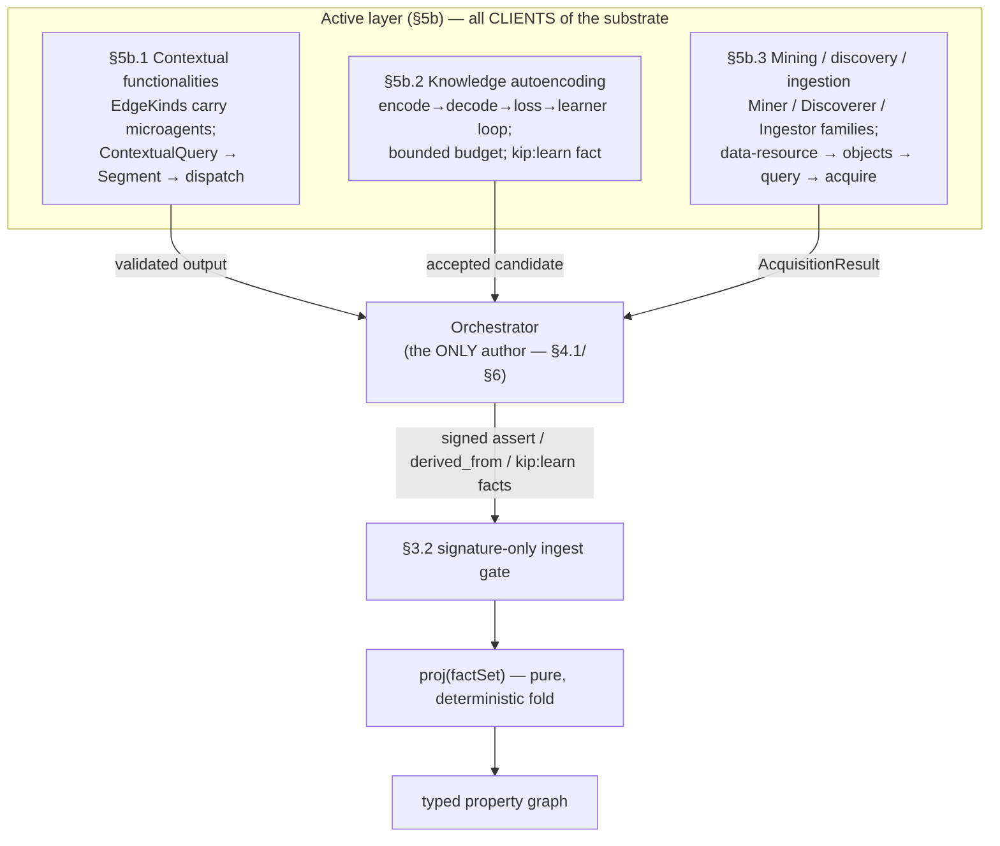

# Active knowledge — overview

Purpose: how the three active-layer subsystems (contextual functionalities, knowledge autoencoding, and mining/discovery/ingestion) fit together, and the single load-bearing rule that keeps them outside the convergence core — INV-A1 (microagents are clients, never the substrate).

Source: SPEC §5b intro (1871-1890).

---

## What the active layer is

§§1–5 specify a **passive** substrate: facts go in, [`proj`](./22-git-substrate.md) folds them into a graph, and [retrieval](./26-retrieval.md) reads the fold. §5b adds an **active** layer — mechanisms adapted from the contextual-relation map of patent US9311402 (extracted and re-grounded in kip, not its wording). The active layer lets relations *carry computation*, lets the system *answer by traversal-and-execution*, and lets it *learn new graph structure* — all while leaving the convergence core ([§3.2 signature-only gate, §3.4 `proj`, §4b.4 SEC](./24-synchronization-and-convergence.md)) **byte-for-byte unchanged**.

The active layer adds **no new store**. It introduces only new *kinds of facts* the existing `proj` already knows how to fold (see the [data model](./21-data-model.md)).

## The three subsystems

The three subsystems are detailed in their own docs:

- **[Contextual-relation functionalities](./31-contextual-functionalities.md)** (§5b.1) — an `EdgeKind` MAY carry one or more microagent `FunctionalityBinding`s; a `ContextualQuery` compiles (pure read over `proj`) into a `Segment` dependency DAG, executes by ordered dispatch, and the results land as signed facts whose `derived_from` subgraph **is** the `AnswerGraph`.
- **[Knowledge autoencoding](./32-knowledge-autoencoding.md)** (§5b.2) — an autoencoder-shaped `encode → decode → reconstruction-loss → learner` loop under a **bounded disjunctive budget**, whose accepted output is recorded as a single signed `kip:learn` fact so replicas fold the result rather than re-running the loop.
- **[Mining, discovery & ingestion](./33-mining-discovery-ingestion.md)** (§5b.3) — Miner / Discoverer / Ingestor microagent families realizing the patent's `data-resource → objects-of-interest → query → acquire` pipeline, all emitting signed, source-provenanced facts.

The [SDK seams](./40-sdk-api-surface.md) that drive them — `registerFunctionality`, `runContextualQuery`, `runAcquisition`, and `learn` — are themselves thin clients in exactly this sense.

## How the three subsystems relate

The three subsystems are not parallel silos; they sit on a shared lifecycle and differ only in *what kind of fact* they ultimately ask the orchestrator to author:

- **Contextual functionalities** (§5b.1) make a *relation* executable: a `ContextualQuery` compiles to a `Segment` DAG over `proj`, dispatches the bound microagents in topological order, and the orchestrator records the answers as `assert` + `derived_from` facts. It answers questions over existing structure.
- **Knowledge autoencoding** (§5b.2) makes *learning new structure* a bounded search: the `encode → decode → loss → learner` loop proposes graph structure for a raw artifact, and the orchestrator records the accepted result as one `kip:learn` fact (or a `kip:learn-exhausted` marker). It is itself frequently driven *by* a contextual functionality dispatch — the §5b.1 execution loop is the natural caller of the §5b.2 learner.
- **Mining / discovery / ingestion** (§5b.3) brings *new raw material* in: Miner/Discoverer/Ingestor microagents realize `data-resource → objects-of-interest → query → acquire`, each emitting signed, source-provenanced facts that then feed §5b.1 traversal and §5b.2 learning.

So the dependency is layered, not circular: **acquisition (§5b.3) supplies raw facts → autoencoding (§5b.2) learns structure over them → contextual functionalities (§5b.1) answer over that structure** — and every arrow lands in the substrate as orchestrator-signed facts, never as a direct write.

## Cross-cutting contracts (shared by §5b.1–.3)

Three contracts are common to all three subsystems and are detailed once in each subsystem doc; they are summarized here as the active layer's shared spine:

1. **Orchestrator-authoring lifecycle.** A microagent only ever *returns a result*; the **orchestrator is the only author** (§4.1, [§6](./40-sdk-api-surface.md)). It validates the result against the manifest `outputSchema`, then wraps it as signed `assert` / `derived_from` / `kip:learn` facts. This is INV-A1 made operational — see [§5b.1 execution](./31-contextual-functionalities.md) and [§5b.2 accept/exhaust](./32-knowledge-autoencoding.md).
2. **`asOf`-reproducibility residual (R5).** Every active-layer run is reproducible **only against the `asOf` frontier pinned in its provenance**. Default-`now` produces a still-convergent but replica-local (hence irreproducible) answer; callers wanting a reproducible run MUST pass an explicit `asOf`. This residual recurs identically in [contextual-query execution](./31-contextual-functionalities.md), the [autoencoding `ontologyAsOf` key](./32-knowledge-autoencoding.md), and acquisition.
3. **Typed-choice rule (N5 / INV-A7).** Wherever the active layer faces a choice — among competing realizers (`Segment.alternatives`), among matching segments, or among learned results — it surfaces a **typed choice** mirroring `kip:conflict` rather than auto-collapsing to a winner. No silent picks.

The full taxonomy of how an active-layer step can fail (dispatch-failure, constraint-violation, pending-guard, upstream-stop, exhausted) and how each propagates is consolidated in the [failure & conflict model](./27-failure-and-conflict-model.md).

## INV-A1 — the single load-bearing rule

The whole section rests on one invariant:

> **INV-A1 (microagents are clients, never the substrate).** A microagent MUST NOT write to the graph. Every value it produces enters kip **only** as a signed, append-only fact authored by the orchestrator (§4.1, [§6](./40-sdk-api-surface.md)). The graph remains `proj(factSet)`; the active layer can change *what facts exist*, never *how facts fold*. A microagent that mutates state directly is non-conformant.

This is the Letta pitfall (N2) restated for executable relations: binding an executable to an edge tempts the executable to write the resulting edge/node itself. It MUST NOT. It returns a result; the orchestrator wraps that result as signed `assert` facts; the edge/node appears **only** via `proj`.

Two consequences flow from INV-A1 and recur throughout §5b:

- **No silent picks (N5).** Wherever the active layer faces a choice among realizers, segments, or learned results, it surfaces a **typed choice** (mirroring `kip:conflict`) rather than auto-collapsing to a winner.
- **Accelerator boundary ([§5.3](./26-retrieval.md)).** Non-deterministic, model-relative computation (encode/decode/loss/embedding/search) runs **outside** `proj`; only the *recorded* fact is substrate.

The active-layer conformance invariants **INV-A1**–**INV-A14** are catalogued as a test plan in [Conformance & testability](./60-conformance-and-testability.md). INV-A1 itself is asserted by running each active seam against a substrate harness whose only mutation primitive is `assertFact`, and checking that every state change is attributable to an orchestrator-signed fact.
