# Contextual-relation functionalities

Purpose: how `EdgeKind`s carry one-or-more microagent `FunctionalityBinding`s, how a `ContextualQuery` compiles (pure read over `proj`) into a `Segment` dependency DAG, executes by ordered dispatch into signed facts, and how the resulting `derived_from` subgraph forms the `AnswerGraph`.

Source: SPEC §5b.1 (1891-2370). See also the [active-knowledge overview](./30-active-knowledge-overview.md) and INV-A1.

---

## The map is the ontology graph (already facts)

The patent's "type map" — a directed graph whose vertices are instance *types* and whose edges express how one type reaches another — **is** kip's per-tenant ontology/schema graph (§2.2, see the [data model](./21-data-model.md)): each type is a `NodeKindDef`, each typed reachability an `EdgeKindDef`, all stored as facts under `/ontology` and therefore versioned and [as-of-queryable](./23-temporality-and-bitemporality.md) like any other graph state. The active layer adds **no new store** — only new *kinds of facts* the existing [`proj`](./22-git-substrate.md) already folds.

## A contextual relation carries one or more functionalities

An `EdgeKind` MAY declare **one or more** `FunctionalityBinding`s. Each references a microagent (by `MicroagentManifest.name` + `version`) whose `inputSchema`/`outputSchema` are compatible with the edge's source/target `NodeKind`s. The edge is then both a navigation hop *and* a unit of computation: traversing it MAY be realized by **dispatching the bound microagent** rather than by reading a pre-existing adjacency.

The patent's "one or more functionalities" (selection AMONG competing realizers for one relation — e.g. a REST realizer *and* a SQL realizer for the same hop) is expressed by binding **N** `FunctionalityBinding`s to the same `(edgeKind, sourceKind, targetKind)`. When a segment match reaches that hop, **all** compatible bindings are enumerated as `Segment.alternatives` ordered by `weight` (then the [§3.4](./24-synchronization-and-convergence.md) `orderKey`/`factCID` tiebreak), and the caller chooses — kip NEVER silently picks one realizer over another (N5, INV-A7). `registerFunctionality` is therefore **additive**: registering a second realizer for the same hop ADDS an alternative; it does not overwrite the first.

### `FunctionalityBinding` (normative shape)

All microagent identifiers (`MicroagentManifest`, `MicroagentInvocation`, `MicroagentResult`, `IsolationMode`) are the `@a5c-ai/genty-core` types; do not invent fields. The execution path reads ONLY `MicroagentResult.output`, `MicroagentResult.exitCode`, `MicroagentInvocation.input`, and the EFFECTIVE timeout. **Timeout rule:** the orchestrator MUST set `MicroagentInvocation.timeout` to the bound manifest's `runtime.timeout`; that single value is the EFFECTIVE timeout the dispatch-failure outcome is evaluated against (one field is derived from the other, so they never disagree).

```ts
/** Binds a contextual functionality (microagent) to an EdgeKind in the ontology. */
interface FunctionalityBinding {
  edgeKind: EdgeKind;                 // the contextual relation this realizes
  microagentName: string;            // MicroagentManifest.name (registered descriptor)
  version: string;                   // MicroagentManifest.version (semver)
  /** Source/target NodeKinds the hop connects; MUST be compatible with the manifest schemas. */
  sourceKind: NodeKind;
  targetKind: NodeKind;
  /** CLAIM-12 CONDITIONAL relation: EdgeKinds whose instances MUST be PRESENT (projected) before this
   *  hop may fire — gates on the presence of a required OTHER instance. PURE READ over proj, never
   *  against sync state. Distinct from `constraint` (which validates the SEED itself). */
  requires?: EdgeKind[];
  /** CLAIM-8 CONSTRAINT relation: a predicate the SEED/INPUT (the patent's "known instance") MUST
   *  satisfy as a precondition of the hop firing — proj VERIFIES the known instance complies. Reads the
   *  seed's OWN projected PropCells. A non-compliant seed yields the N5-safe `constraint-violation`
   *  outcome (no dispatch, no fact, Unknown cell, violated constraint in provenance). `unknown`
   *  PropCells ⇒ predicate `unknown` ⇒ NOT satisfied (never defaulted, N5). */
  constraint?: ConditionNode;
  /** CONDITION NODE — a graded/complex condition gating the hop, a PURE READ over one or more projected
   *  PropCells. A declared DATA value (a fact under /ontology), never a runtime float, so two replicas
   *  evaluate it identically. `unknown` PropCells ⇒ predicate `unknown` ⇒ guard NOT satisfied (N5). */
  condition?: ConditionNode;
  /** WEIGHTED relation — a deterministic priority totally ordering competing bindings/segments at the
   *  SAME asOf. A declared /ontology fact (never a runtime score), byte-identical on every replica; ties
   *  fall to the §3.4 orderKey/factCID tiebreak. Advisory only: it orders the PRESENTED choice, never
   *  auto-collapses a multi-segment match (N5, INV-A7). MUST be FINITE: NaN/±Infinity are MALFORMED and
   *  rejected at registration (a NaN weight makes the sort NON-TOTAL — a silent default in disguise, N5). */
  weight?: number;
  /** CLAIM-7 RELATION-TYPE TAXONOMY — the semantic category a relation describes. ADVISORY, set-resident
   *  /ontology metadata used ONLY for selection/presentation (like weight/tags); it NEVER gates fact
   *  membership or hop firing. An open free `tag` (manifest `tags`) is also permitted, so the taxonomy is
   *  illustrative, not closed. */
  relationClass?: "social" | "characterizing" | "ownership" | "property" | "identifying";
  /** Cardinality the hop produces, for DSL `?`/`/` expectation checking. */
  cardinality: "one" | "many";
}

/** A graded range and/or a complex predicate over several projected PropCells. Pure over proj; `unknown`
 *  cells propagate `unknown` (never defaulted). A `range` with NEITHER min NOR max is MALFORMED and MUST
 *  be rejected at registration (never an always-true gate — that is a silent default, N5). Any NUMERIC
 *  min/max/value leaf MUST be FINITE: a NaN/±Infinity comparand is MALFORMED and rejected (a NaN makes
 *  the guard's order non-total — the same silent-default hazard as a NaN weight, N5). */
type ConditionNode =
  | { kind: "range"; prop: PropKey; min?: PropValue; max?: PropValue }   // ≥1 of min/max REQUIRED
  | { kind: "cmp"; prop: PropKey; op: "=" | ">" | "<" | ">=" | "<="; value: PropValue }
  | { kind: "all"; of: ReadonlyArray<ConditionNode> }                    // complex multi-node AND
  | { kind: "any"; of: ReadonlyArray<ConditionNode> };                   // complex multi-node OR
```

### The claim-8 / claim-12 / claim-7 taxonomy (Decision D-5b.7)

The spec keeps three patent facets — previously conflated — orthogonal as separate, set-resident binding fields:

| Facet | Field | What it reads / gates |
|---|---|---|
| **Constraint (claim 8)** | `constraint?: ConditionNode` | the **seed/known instance's OWN** projected PropCells, VERIFIED before dispatch; a non-compliant seed ⇒ `constraint-violation` outcome (no dispatch, no fact, Unknown, violated constraint in provenance). |
| **Conditional (claim 12)** | `requires?` / `condition?` | the **presence/props of a REQUIRED OTHER instance**, not the seed itself. |
| **Relation type (claim 7)** | `relationClass?` | ADVISORY selection/presentation metadata (like `weight`/`tags`); **never** gates fact membership or hop firing. Open `tags` escape hatch keeps the taxonomy illustrative, not closed. |
| **One-or-more functionalities** | N `FunctionalityBinding`s per hop | enumerated as `Segment.alternatives` (descriptor selection AMONG competing realizers). |

INV-A3 covers `constraint-violation`; INV-A7 covers the multi-realizer choice.

## Query → Segment → AnswerGraph (normative shapes)

```ts
/** A contextual query: a known seed instance + a desired target type + a linkage expression. */
interface ContextualQuery {
  seed: EID;                          // a concrete instance of a known NodeKind the caller already has
  target: NodeKind;                   // the type of instance the caller wants
  /** Ordered, possibly-PARTIAL linkage constraint. `via` lists EdgeKinds that MUST appear, IN ORDER, as a
   *  SUBSEQUENCE of any matched Segment.steps (not necessarily contiguous, not a prefix); segments not
   *  containing the subsequence are EXCLUDED before alternatives enumeration. Empty/omitted ⇒ no
   *  constraint and matching discovers a path. */
  via?: EdgeKind[];
  /** Deterministic filters over PROJECTED PropCell values (Unknown cells excluded, never defaulted). */
  filters?: ReadonlyArray<{ prop: PropKey; op: "=" | ">" | "<" | ">=" | "<="; value: PropValue }>;
  /** Compiled & matched against this fact-set frontier and RECORDED in every emitted fact's provenance.
   *  Default `now` ⇒ a still-convergent but replica-local (irreproducible) answer (R5); pass an explicit
   *  pinned asOf for a reproducible mining run. */
  asOf?: AsOf;
}

/** A matched segment of the ontology graph: the ordered chain of contextual EdgeKinds connecting the
 *  seed's NodeKind to `target`. Produced by a PURE READ over proj (no dispatch yet). */
interface Segment {
  /** The patent's "number of SINGLE-STEP QUERIES" (claim 1(d)): one entry = one single-step query = one
   *  MicroagentInvocation. For the LINEAR case `deps` is empty and `steps` is a chain where for every
   *  adjacent pair steps[i].targetKind MUST equal — or be an `is_a` supertype-compatible match of —
   *  steps[i+1].sourceKind. A Segment violating its chaining rule is ILL-TYPED and MUST NOT be compiled
   *  or surfaced (this is what makes composition well-typed; INV-A2). */
  steps: FunctionalityBinding[];
  /** CLAIM-4 "ordered graph comprising a PLURALITY OF SUB-GRAPHS" / CLAIM-1(e)+24 "in an order matching
   *  DEPENDENCIES": the segment MAY be a DEPENDENCY DAG, not merely the linear chain. Each
   *  [producer, consumer] pair (indices into steps) declares that step `consumer` consumes the
   *  materialized instance(s) of step `producer`; a step MAY consume MORE THAN ONE upstream instance
   *  (multi-input join) and two branches MAY converge. Producer→consumer kind-compatibility is the SAME
   *  `is_a`-compatible match. Execution order is the DETERMINISTIC TOPOLOGICAL order over this DAG (ties
   *  broken by ascending steps[] index, then the §3.4 orderKey/factCID tiebreak), read PURELY over proj.
   *  EMPTY deps ⇒ the linear case (topo order = steps[] index order). A deps with a CYCLE or an
   *  out-of-range index is MALFORMED and rejected at compile (no topological order — a silent
   *  re-entry/non-termination hazard, N5). */
  deps?: ReadonlyArray<readonly [producer: number, consumer: number]>;
  /** The OTHER segments that also satisfied the query, ENUMERABLE so the caller can present them.
   *  alternatives.length > 0 ⇒ a typed CHOICE surfaced to the caller, NEVER an arbitrary pick (N5);
   *  mirrors how §3.4 surfaces kip:conflict as the candidate set. `weight` deterministically ORDERS this
   *  list for presentation but never collapses it (INV-A7). */
  alternatives: Segment[];
}

/** The patent's "answer graph": requested + intermediate instances and the relation edges that produced
 *  them, expressed PURELY as derived_from provenance over the emitted facts. A READ view (recall over the
 *  derived facts), never a separately-authored authoritative artifact. */
interface AnswerGraph {
  result: EID[];                      // requested-type instances; empty ⇒ no answer (N5, never fabricated)
  intermediates: EID[];              // every in-between instance materialized along the chain
  /** The ORDERED relation-edge chain seed → intermediate[0] → … → result, one entry per executed step,
   *  naming WHICH EdgeKind (and the binding's realizer) connected each pair and the derived_from fact that
   *  recorded it. This is the topology the DSL `~` back-steps over. A pure READ over emitted
   *  derived_from/edge facts (INV-A8). */
  edges: ReadonlyArray<{ from: EID; to: EID; edgeKind: EdgeKind; viaFactId: FactId }>;
  /** Every node/edge linked back to seed and its asserting factId via derived_from. `producedBy` is the
   *  FACT-RESIDENT Provenance (provenance.source on the emitted fact, naming the MicroagentInvocation by
   *  id), NOT the ephemeral runtime object — so the whole AnswerGraph is a pure READ over facts (INV-A8). */
  derivedFrom: ReadonlyArray<{ eid: EID; factId: FactId; producedBy: Provenance }>;
}
```

## Execution = two phases with a hard determinism boundary

> For the temporal ordering across actors (orchestrator → microagent → `proj` → gate → AnswerGraph), see the [active-layer dispatch sequence diagram](./20-architecture-overview.md#5b-end-to-end-sequence--the-active-layer-dispatch-inv-a1).

```mermaid
flowchart LR
    Q["ContextualQuery<br/>(seed, target, via, filters, asOf)"] --> C
    subgraph phase1["1. Compile + match — PURE READ over proj at asOf (INV-A2)"]
        C["compile to query graph"] --> M["match against /ontology<br/>resolve inheritance via is_a;<br/>order alternatives by weight then §3.4 tiebreak"]
    end
    M -->|"multi-segment ⇒ TYPED CHOICE (Segment.alternatives)"| CHOICE["caller chooses<br/>(never auto-collapsed, N5/INV-A7)"]
    CHOICE --> E
    subgraph phase2["2. Execute — ONLY side effect: signed facts"]
        E["walk steps in topological order over deps"] --> G["verify constraint (claim 8) +<br/>requires/condition guard (claim 12) over proj"]
        G --> D["dispatch microagent;<br/>validate output vs outputSchema"]
        D --> F["author signed assert + derived_from facts<br/>(provenance names invocation + resolved asOf)"]
    end
    F --> AG["AnswerGraph = derived_from subgraph read back (INV-A8)"]
```



**Phase 1 — Compile + match (pure read over `proj`).** Path/guard/filter resolution reads **only** the deterministic projection of `/ontology` and existing facts at `asOf` — never replica-local sync state or a wall clock. Two replicas at the same `asOf` MUST compile the **byte-identical** segment set (INV-A2). If more than one segment satisfies the linkage, the result set surfaces **all** of them as a typed choice (`Segment.alternatives`); kip MUST NOT auto-collapse the match (N5, INV-A7). The deterministic presentation order is `weight` desc, then the [§3.4](./24-synchronization-and-convergence.md) `orderKey`/`factCID` tiebreak; `tags` is an advisory pre-sort *within* an exact `weight` tie and is **never** the tiebreak. **Inheritance** (patent inherence) is resolved here: discovery traversal walks `is_a` subtype `EdgeKind`s so a relation defined on a parent `NodeKind` is reachable from a child — a pure function of ontology facts, never an ambient in-code class hierarchy.

**Phase 2 — Execute (the only side effect: signed facts).** The orchestrator owns the loop, walking the steps in the **deterministic topological order over `Segment.deps`** (the linear `steps[]` order when `deps` is empty). For each step it builds a `MicroagentInvocation` whose `input` is the materialized output of its `deps` producer(s), first **verifies the seed/input complies with the binding's `constraint`** (claim 8) and enforces any `requires`/`condition` guard (claim 12) as pure `proj` reads, dispatches the bound microagent, and **validates `MicroagentResult.output` against the manifest `outputSchema`** before minting anything.

### The N5-safe step outcomes

> The active-layer step outcomes — **dispatch-failure** (#4), **constraint-violation** (#5),
> **pending-guard** (#6), and **upstream-stop** (#7) — are defined canonically in the consolidated
> [failure & conflict model](./27-failure-and-conflict-model.md#1-the-canonical-outcome-taxonomy);
> their triggers/effects are not re-derived here. A successful step authors signed `assert` +
> `derived_from` facts (below).

The §5b.1-local specifics not carried by the canonical taxonomy: **constraint-violation** validates the
*known instance itself* (claim 8) over `proj`; **pending-guard** differs from dispatch-failure **only in
provenance** (the unmet `EdgeKind`/`ConditionNode` is recorded, claim 12); and **upstream-stop** leaves
intermediates committed through step *i−1* as ordinary facts while `runContextualQuery` returns an
`AnswerGraph` with `result = []` (no terminal answer fabricated, N5). These mechanize INV-A3/INV-A7.

On success the orchestrator authors signed `assert` facts for the intermediate/result instances, each with `provenance.source` naming the `MicroagentInvocation` (by id) **and recording the resolved `asOf` frontier**, plus signed `derived_from` edge facts linking them back to the seed. The union of those `derived_from` facts, read back via `proj`, **is** the `AnswerGraph` (INV-A8).

**Reproducibility is relative to the recorded `asOf`.** An `AnswerGraph` is reproducible only against the frontier pinned in its provenance. Callers wanting a reproducible mining run MUST pass an explicit `asOf`; default-`now` produces a still-convergent but replica-local (hence irreproducible) answer — an explicit residual (R5, §9), never a determinism guarantee on the active layer.

## Composition — the patent's combine-relations technique

A `Segment` **is** a *composed/chained* contextual relation: the patent's "a contextual relation may combine any number of contextual relations," realized as an ordered chain of functionalities where `steps[i].targetKind` feeds `steps[i+1].sourceKind`. Schema-type compatibility (`targetKind → sourceKind`) is what makes the composition **well-typed**. **Normatively:** for every adjacent pair, `steps[i].targetKind` MUST equal (or be an `is_a` supertype-compatible match of) `steps[i+1].sourceKind`; a `Segment` violating this is ill-typed and MUST NOT be compiled or surfaced (folded into INV-A2's compile-determinism check).

### Single-step decomposition + dependency-ordered DAG execution (Decision D-5b.8)

The patent names a technique: "dividing said query to a NUMBER OF SINGLE-STEP QUERIES" and "iteratively executing … in an ORDER MATCHING DEPENDENCIES." kip adopts it exactly:

- **Compile divides** the `ContextualQuery` into a number of single-step queries — one per `Segment.steps` entry, each a single `MicroagentInvocation`.
- **Execute dispatches** them in a **deterministic topological order over the dependency DAG (`Segment.deps`)**, NOT merely the linear `steps[]` index. A step MAY consume more than one upstream instance (multi-input join), and two branches MAY converge — the linear chain is the degenerate DAG whose only edges are `[i, i+1]`.
- The topological order is a **pure read over `proj`** (ties broken by ascending `steps[]` index then the §3.4 tiebreak), so **two replicas at the same `asOf` pick the byte-identical execution order** (folded into INV-A2).
- A computed intermediate feeds **every** downstream step that declares it as a producer — fan-out without re-dispatch.
- A `deps` with a **cycle** (no topological order) or an out-of-range index is **malformed and rejected at compile** (N5).

> **Rejected alternative** — keep execution strictly linear, or topologically sort using a replica-local heuristic / dispatch order. A strictly-linear chain cannot express a multi-input join or converging branches; a replica-local sort makes which intermediate facts get authored first replica-dependent. Rejected: the DAG is declared map data and the topological order is a pure, total function of `proj`.

### Composition-discovery across DIFFERENT contextual relations (Decision D-5b.9)

The patent's functionality DB lets the engine **DISCOVER a CHAIN of functionalities spanning DIFFERENT contextual relations** to satisfy a linkage that **no single functionality covers** — its canonical example chains a *search* relation into a *currency-exchange* relation to answer "the price in **any** currency." kip realizes this during **compile**: when no single registered `FunctionalityBinding` realizes the requested `(seed → target)` linkage, the compiler MAY **search the ontology graph** for an ordered chain of bindings — each drawn from a possibly **different** `EdgeKind` — whose `targetKind → sourceKind` types compose end-to-end into a well-typed `Segment`.

This is **distinct from intra-segment chaining** (which composes steps *within one already-matched relation's* declared path): composition-discovery *constructs* the multi-relation `Segment` by linking **separate** functionalities the author never declared as one path. The search is a **pure, `proj`-total compile-time read over the ontology graph** at `asOf` (a deterministic shortest-/all-paths walk, ties broken by `weight` desc then the §3.4 tiebreak), reads no replica-local state, and emits **no fact** until the discovered chain is executed; on execution it follows the ordinary `assert`/`derived_from` signing path (INV-A1). Multiple discovered chains are surfaced as a typed choice (`Segment.alternatives`), never auto-collapsed (N5, INV-A7). Because discovery yields an ordinary well-typed `Segment`, it is covered by INV-A2 (byte-identical chain set) and INV-A7 (multi-chain typed choice) — adding no new substrate input and no new determinism surface.

> **Rejected alternative** — require every cross-relation linkage to be hand-declared as a single functionality, or run the chain search at dispatch time as a live heuristic. Hand-declaration cannot answer linkages the patent composes from separate relations; a dispatch-time heuristic makes the chosen chain replica-local and irreproducible. Rejected: the functionality DB is set-resident map data and the chain search is a pure, total function of `proj`.

## Linkage SELECTION from context — a client-layer step (claims 5/6/27/28/30)

The patent lets the contextual linkage *itself* be **selected from context** (the document the known instance appears in, a user profile, a browsing history, the object of interest). kip realizes this **above** the substrate: an upstream microagent (a Discoverer/Ingestor, [§5b.3](./33-mining-discovery-ingestion.md), or a thin DSL client) MAY **formulate the `ContextualQuery`** — choosing its `seed`/`via`/`filters` — from such an artifact. This is **pure client-layer linkage construction**: it produces a `ContextualQuery` value, emits **no fact** until that query is dispatched, and is therefore **advisory selection only** — it steers *which* linkage is formulated, never what the substrate admits (INV-A1). The profile/document/object-of-interest is **not a new substrate input** and carries **no projection privilege**: if persisted, it is ordinary facts folded by the same `proj`, exactly like any other instance (parity with `weight`/`tags` advisory selection, C2-1).

## Intermediates and dedup are free — patent node-merge (Decision D-5b.6)

Every hop's output is persisted as ordinary signed facts, so intermediates are reusable: re-running the same hop on the same input is an idempotent no-op (byte-identical facts share a `factCID` and merge by set-union, INV-7, INV-A6). Identical instances resolve to the **same namespaced EID** (identity anchored by `IdentityPolicy`, §3.6). Semantic same-as is **never** an in-place rewrite: it is a signed `same_as`/`supersede` fact all replicas fold identically; genuinely contradictory concurrent merges surface as `kip:conflict`, never a hash-chosen winner.

`same_as` node-merge is a deterministic equivalence **closure** with a total canonical-EID rule:

- **Closure.** Treat each signed `same_as(a,b)` as an undirected edge and compute the reflexive/symmetric/transitive closure (union-find over the `same_as` gset). The fold is set-pure, order-independent, and bounded/terminating.
- **Canonical EID.** Each equivalence class projects under a **total, order-independent canonical EID = the class member minimum by `(namespaceId, localId)` byte-order**. The `tenant` component is deliberately omitted: `namespaceId` is a globally-unique frozen genesis fingerprint (M2-3), so `(namespaceId, localId)` is already total across tenants. Every replica picks the identical canonical EID with **no hash-tiebreak and no LWW**.
- **Contradiction ⇒ typed conflict.** A signed `not_same_as(a,b)` contradicting a derived `a~b` surfaces a `kip:conflict` on a keyed correction cell for the disputed pair, **canonicalized to the ordered pair `(min, max)`** under the same byte-order (so replicas keying `(a,b)` and `(b,a)` rendezvous on **one** conflicted cell), read as `CONFLICTED` until a dominating `resolve`-scoped supersede settles it (N5).

INV-A11 exercises both the closure's totality (random-permutation fold) and the disputed-merge conflict.

## The map is dynamic — and that, too, is facts

New types/relations/functionalities are introduced by emitting **signed schema facts** (`NodeKindDef`/`EdgeKindDef` assert) and **microagent-registration facts** (the `MicroagentManifest` recorded as a fact). A microagent MUST NOT write `/ontology` directly: it *proposes* a schema fact; `proj` applies it as-of `validFrom` via upcasters; a non-conforming instance **quarantines** (visible-but-untrusted) rather than being silently dropped. A learner/miner/ingestor's own emitted facts carry **no schema-write privilege**: they are demoted by the ordinary `proj` authority/namespace/revocation rules (§3.6/§8.1) keyed on the orchestrator's signing-key author-HLC authority. The active layer grants exactly the authority the signing key already holds, nothing more.

**Who may grow the map** (patent operator/learning-module/user breadth): a schema/relation/functionality update is a signed fact of the *same shape* and folds through the *same* `proj`, whether authored by a learner microagent ([§5b.2](./32-knowledge-autoencoding.md)) or a human operator out-of-band. There is no privileged map-writer; effectiveness is decided by `proj`, not by who proposed it.

### Functionality descriptor = `MicroagentManifest`

The patent's descriptor record maps onto manifest fields exhaustively: publisher → `builtIn`/provenance; testing/health → a `runtime.scripts` self-check + `outputSchema` validation; documentation/help file → `description`; identification tags → `tags`; and the descriptor's "list of links to databases and references" → the manifest's data-resource/source bindings (`runtime.tools`/`env` resource refs — the `data-resource` references a Miner consumes in [§5b.3](./33-mining-discovery-ingestion.md)). **None of these gate fact membership** — only the Ed25519 signature does (C2-1). Manifest metadata is *advisory selection*. The patent's parallel realizer-type taxonomy (claim 16 search-module, 17 conversion-module, 18-19 web-service {REST/SOAP/SQL} and code-script {XSLT/regex/Python/…}) is fully GENERALIZED by `MicroagentManifest.runtime{entrypoint}` + `IsolationMode`: the realizer *kind* is just which executable the `entrypoint` names under which `IsolationMode` — advisory selection metadata, never a gate. No realizer enum is reified.

## A kip-flavored query DSL (client-layer sugar)

kip's core stays DSL-free (N3); the DSL lives in the microagent/client layer and **compiles to the `ContextualQuery` above** — pure reads plus signed-fact-emitting dispatches, never a direct-write escape hatch.

```text
person:tal -> employed_by ? = name>"A"
# seed = person:tal; -> hop the employed_by EdgeKind (dispatch its bound microagent);
# ? expect a LIST (recall returns all matching projected org instances);
# = filter on the projected `name` PropCell (>"A"); Unknown segments excluded, never defaulted.
# Result: an AnswerGraph (derived_from subgraph), not a flat value.
```

| Token | Meaning |
|---|---|
| `->` | forward hop along an `EdgeKind` (dispatch its bound microagent; output feeds the next step) |
| `~` | back-step along the `EdgeKind`'s declared inverse (proj-materialized reciprocal adjacency) |
| `?` | expect a **list** — `recall` returns all matching projected instances (`NodeView[]`) |
| `/` | expect a **single** — **error/conflict** if the projected result set is not singular (never silently pick one, N5) |
| `=` `>` `<` `>=` `<=` | deterministic comparison filters over **projected** scalar `PropCell` values (Unknown ⇒ excluded) |
| `/N` (list-iteration) | the patent's iterate-over-the-gathered-list step: **each** `NodeView` in the prior `?` result becomes the seed of the next hop (fan-out), compiling to **N** `ContextualQuery` executions whose `AnswerGraph`s **union**. Client sugar (N3); **N3-deferred** — pure segment composition, no core change |

```text
org:acme ~ employed_by / >= founded_year>=2000
# seed = org:acme; ~ back-step along employed_by's declared inverse (the person instances employed_by
#   org:acme); / expect a SINGLE — if the projected set is not singular this is an ERROR/kip:conflict,
#   never a silent pick (N5); >= filter on the projected `founded_year` PropCell (>=2000).
```

## Key decisions

- **D-5b.1** — an `EdgeKind` MAY carry executable functionalities, but traversal results enter kip only as orchestrator-authored signed facts. *Rejected:* let the bound microagent write the edge/node directly (bypasses the §3.2 ingest gate, lets replicas diverge by execution order, re-introduces the Letta pitfall, N2).
- **D-5b.4** — weighted relations and condition nodes are declared `/ontology` FACTS, not runtime floats; both reject MALFORMED declared data (a `range` with neither `min` nor `max`; any `NaN`/`±Infinity` `weight` or numeric leaf) at registration so the presentation/guard order stays TOTAL. *Rejected:* evaluate weight/condition at dispatch time as a live runtime score (replica-local, irreproducible).
- **D-5b.6** — `same_as` node-merge is a deterministic equivalence closure with a total canonical-EID rule, never a silent pick (see above).
- **D-5b.7** — kip adapts THREE distinct patent facets (claim-8 constraint, claim-12 conditional, claim-7 relation-type) as separate, set-resident binding fields (see taxonomy table above).
- **D-5b.8** — a matched segment is a dependency DAG of single-step queries executed in deterministic topological order, not merely a linear chain.
- **D-5b.9** — the engine MAY discover a multi-relation chain of functionalities to satisfy a linkage no single relation covers, as a pure compile-time `proj`-search over the ontology graph.

Full ADR-format records are in [Architecture decision records](./70-decision-records-adr.md); the relevant conformance invariants (INV-A1, INV-A2, INV-A3, INV-A6, INV-A7, INV-A8, INV-A11) are catalogued in [Conformance & testability](./60-conformance-and-testability.md). The driving seams `registerFunctionality` and `runContextualQuery` are in the [SDK API surface](./40-sdk-api-surface.md).
