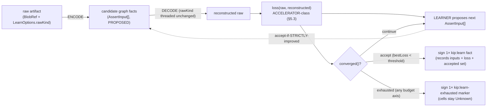

# Knowledge autoencoding

Purpose: the `encode → decode → reconstruction-loss → learner` loop that learns graph structure from a raw artifact under a bounded disjunctive budget, records its accepted output as a signed `kip:learn` fact (so replicas fold the result rather than re-run the loop), and keeps the loss/search strictly on the accelerator side of the substrate boundary.

Source: SPEC §5b.2 (2371-2569). See also the [active-knowledge overview](./30-active-knowledge-overview.md) and INV-A1.

---

## Goal

Learn graph structure from a raw artifact (markdown, image, transcript, …) by an **autoencoder-shaped loop**: encode the artifact into candidate graph facts, decode those facts back into a reconstructed artifact, measure the **reconstruction loss**, and have a **learner** propose graph edits — iterating until the loss is small enough or a budget is spent.

```text
   raw ──ENCODE──▶ candidate graph facts ──DECODE──▶ reconstructed raw
                              ▲                              │
                              └────── LEARNER proposes ◀──── loss(raw, reconstructed)
                 (iterate until loss < threshold OR budget cap — never unbounded)
```



## The microagents and loop state (normative shapes)

`EncodeAgent`/`DecodeAgent`/`LearnerAgent`/`LossMetric` are all genty microagents (`MicroagentManifest` descriptors). The declared input/output object shapes are **binding** — these are FUNCTION-TYPE aliases (the normative content is the parameter/return shape).

```ts
type EncodeAgent =  // raw → candidate facts (PROPOSED, not yet committed)
  (input: { rawRef: BlobRef; ontologyAsOf: AsOf }) => Promise<{ candidateFacts: AssertInput[] }>;

type DecodeAgent =  // candidate facts → reconstructed raw
  // `rawKind` is the raw artifact's media/content kind (e.g. "text/markdown", "image/png"). It is SOURCED
  // ONCE by the orchestrator at learn() entry from LearnOptions.rawKind (a bare BlobRef is { blob: CID }
  // only, §255), and the SAME value is threaded into every iteration's decode — never re-inferred
  // per-iteration or caller-asserted mid-loop, so encode and decode always agree on the kind. A wrong
  // declared rawKind is benign and N5-safe: decode reconstructs against the wrong kind, scores high loss,
  // and the loop never converges (it never silently "accepts" a mismatched reconstruction).
  (input: { candidateFacts: AssertInput[]; rawKind: string }) => Promise<{ reconstructed: BlobRef }>;

/** The LEARNER microagent itself — proposes the NEXT candidate given the current one + its loss. */
type LearnerAgent =
  (input: { rawRef: BlobRef; current: AssertInput[]; loss: number; ontologyAsOf: AsOf })
    => Promise<{ next: AssertInput[] }>;

/** Reconstruction loss — ACCELERATOR-class (non-deterministic, model-relative; §5.3). NOT a proj input. */
type LossMetric = (rawRef: BlobRef, reconstructed: BlobRef) => Promise<number>; // 0 = perfect; lower is better

/** Bounded loop state owned by the orchestrator (the learner is the proposing microagent). */
interface LearnerLoopState {
  iteration: number;
  elapsedMs: number;               // wall-time consumed so far (counter, wired into converged)
  invocations: number;             // total encode/decode/loss/learner dispatches so far (counter)
  bestLoss: number;                // lowest loss seen so far (init +Infinity)
  candidate: AssertInput[];        // best candidate fact set so far (the one that achieved bestLoss)
  threshold: number;               // converge when bestLoss < threshold
  budget: { maxIterations: number; maxWallMs: number; maxInvocations: number };
}
```

`learn()` initializes `threshold` from `LearnOptions.threshold` and `budget` from `LearnOptions.{maxIterations,maxWallMs,maxInvocations}`; the two shapes name **one** contract and MUST agree (INV-A12 asserts the seeded values equal the `LearnOptions` fields).

### Accept-if-strictly-improved update rule

Each iteration computes `l = loss(raw, decode(encode-or-learner-output))`. If `l < s.bestLoss` then `s.bestLoss := l` and `s.candidate := this proposal`, ELSE retain the prior best — a non-improving (or failed/infinite-loss) proposal **NEVER** overwrites `candidate`, so `bestLoss` is **monotone non-increasing**. Either way `s.invocations` and `s.elapsedMs` are incremented, so a worsening proposal still drains budget toward "exhausted" without regressing the accepted candidate (INV-A12 exercises an improve-then-worsen sequence and asserts `candidate == best`).

## Bounded DISJUNCTIVE budget — the loop ALWAYS terminates

`converged` is a **TOTAL predicate over ALL THREE budget axes**, so any axis tripping yields "exhausted" — there is **no declared-but-unchecked budget knob, and no unbounded loop**.

```ts
function converged(s: LearnerLoopState): "accept" | "exhausted" | "continue" {
  if (s.bestLoss < s.threshold) return "accept";                    // good enough
  if (s.iteration   >= s.budget.maxIterations)  return "exhausted"; // iteration cap
  if (s.elapsedMs   >= s.budget.maxWallMs)      return "exhausted"; // wall-clock cap (bounds slow/hung calls)
  if (s.invocations >= s.budget.maxInvocations) return "exhausted"; // invocation cap (bounds per-iter fan-out)
  return "continue";
}
```

INV-A5 forces `loss ≥ threshold` forever under each of (a) tiny `maxIterations`, (b) tiny `maxWallMs` with a slow/hung decode, (c) tiny `maxInvocations` with high fan-out, and asserts `converged()` returns `"exhausted"` in every case. A build whose `converged` ignores `maxWallMs` or `maxInvocations` **fails**.

## Manifest selection is explicit (N5)

Before the loop runs, the orchestrator MUST know *which* encode/decode/learner/loss microagents realize it for this artifact. kip does **not** infer them from `rawKind` or any heuristic — the caller **names** each by `(name, version)` via `LearnOptions.{encode,decode,learner,loss}` (the §5b.2 dual of [§5b.1's](./31-contextual-functionalities.md) explicit `registerFunctionality` binding). Those selected `(name,version)` pairs are exactly the ones the `kip:learn` fact records in its key `(rawRef, ontologyAsOf, encode/decode/learner-manifest)`, so the recorded result is reproducible against the *same named agents*. A named manifest that is unregistered/unsigned is **rejected**, never silently substituted (N5). The artifact's content-kind is likewise declared once (`LearnOptions.rawKind`) and threaded unchanged into every `DecodeAgent.rawKind`, so encode and decode always agree on the kind.

The full `LearnOptions` interface is declared canonically in the [SDK API surface](./40-sdk-api-surface.md#learnoptions); autoencoding-relevant points: `rawKind` is the content-kind threaded UNCHANGED into every decode, and `{encode,decode,learner,loss}` are the explicit `(name,version)` manifest SELECTION — never a heuristic pick (N5) — recorded in the `kip:learn` fact's key.

INV-A13 asserts the loop dispatches **exactly** the named manifests (perturbing `rawKind` while holding selectors fixed) and that an unregistered/unsigned named manifest is **rejected before the loop runs** (no dispatch, no `kip:learn`/`kip:learn-exhausted` fact, cells stay `Unknown`). INV-A14 asserts `rawKind` is captured once and byte-identical across every `DecodeAgent` invocation.

### Per-iteration failure is treated as infinite loss (N5)

> This is the autoencoding specialization of **dispatch-failure** (#4) and **exhausted** (#8) in the consolidated [failure & conflict model](./27-failure-and-conflict-model.md).


An encode/decode/learner dispatch that errors (non-zero `exitCode`) or returns `outputSchema`-invalid output **consumes one `invocation` (and its `elapsedMs`) against budget** and is scored as an **infinite-loss** iteration — the loop NEVER converges on a failed candidate (`bestLoss` is not improved by it). Persistent failure drains the budget and terminates via `converged → "exhausted"`; there is **no best-effort accept** of a failed candidate (N5). This mirrors the [§5b.1](./31-contextual-functionalities.md) dispatch-failure rule: a failed agent yields no trusted output, ever.

## The determinism boundary — the whole point (Decision D-5b.2)

Encode/decode/loss/embedding/search are **accelerator-class** ([§5.3](./26-retrieval.md)): they are non-deterministic, model-relative, and MUST NOT run inside [`proj`](./22-git-substrate.md). What crosses the boundary into the substrate is the **learner's accepted output**, recorded as **deterministic signed facts**. Mirroring the [§3.4 / C-3](./24-synchronization-and-convergence.md) supersession pattern:

- While iterating, candidate facts are held **in memory** (or emitted as `quarantined`/untrusted proposals); the loop reads loss but commits nothing authoritative.
- On **`"accept"`**, the orchestrator authors a single signed **`kip:learn` fact** (a reserved `kip:*` system-kind, cf. `kip:conflict`/`kip:schema-violation`/`kip:embedding-model`) that *names its inputs* (`rawRef` CID, encode/decode/loss `MicroagentManifest` name+version, `ontologyAsOf`), *records the achieved loss value* and the accepted `AssertInput[]`, then commits those facts. Replicas **fold the recorded result**; they **never re-run the learner inside `proj`**. The learned graph is byte-identical on every replica even though the *search that found it* was not (INV-A4).
- On **`"exhausted"`**, **no `accept` fact is authored** — the loop authors a single signed **`kip:learn-exhausted`** marker (also a reserved `kip:*` kind; auditable, names the same inputs + best loss seen), and the cells stay `Unknown`. There is no "best-effort accept" fallback (N5).

> **Rejected alternative** — make `proj` re-run encode/decode to recompute the learned graph (or its loss) on demand. This would embed a non-deterministic, model-versioned, possibly-network-bound computation inside the pure projection, instantly breaking byte-identical determinism (§5.3) and letting replicas with different model builds diverge. Rejected: `proj` reads recorded facts only.

## The recorded loss is audit-only — EXCLUDED from `orderKey` and every reducer/trust decision

Although the achieved loss value lives inside the signed `kip:learn` fact bytes, it is treated exactly as `rxFrom` is (C2-1): it is **never** an `orderKey` input and **never** an input to any reducer or trust decision. The `kip:learn` winner among competing facts is chosen by the **ordinary author-HLC `orderKey`**, never by "lowest loss." Routing the recorded loss into a "lowest-loss-wins" reducer is **forbidden** — it would make the winner depend on a non-deterministic (model-relative, §5.3) quantity and silently break byte-identity, the same trap [§3.4](./24-synchronization-and-convergence.md)/C2-1 closes for `rxFrom`.

### Reducer / orderKey treatment of the new §5b cells (so `proj` is provably total — INV-3/INV-A9)

The per-cell-type reducer/conflict behavior for `kip:learn`, `kip:learn-exhausted`/`derived_from`, `same_as`, and microagent-registration is defined canonically in the [§4.4 per-cell-type resolution table](./22-git-substrate.md#44-conflict-surfacing-no-fallback--the-per-cell-type-resolution-table). The autoencoding-specific point: a `kip:learn` cell is a `supersede`/correction-class cell keyed on `(rawRef, ontologyAsOf, encode/decode/learner-manifest)` whose recorded **loss is audit-only — EXCLUDED from `orderKey` and the dedup key** (exactly as `rxFrom` is, C2-1), so competing accepted sets surface a `kip:conflict` and are **never** loss-tiebroken, while a same-set re-author is a no-op *regardless of a divergent recorded loss*.

**Keying caveat (the same-key conflict guarantee is conditional on a PINNED `ontologyAsOf`).** The `ontologyAsOf` in the key is the **author-resolved frontier recorded in the fact** (set-resident), not the receiver's `now` — so the key is itself convergent. But `ontologyAsOf` **defaults to the authoring replica's local `now`** (R5): two replicas learning the **same** artifact under default-`now` resolve **different** frontiers ⇒ **different** keys ⇒ their `kip:learn` facts land in **separate** cells and **both** project trusted (dual-acceptance) — convergent, but the intended same-key `kip:conflict` **never fires**. This is benign (each cell folds deterministically; no byte-divergence) but it is *not* contradiction-surfacing: the "competing accepted sets ⇒ `kip:conflict`" guarantee holds **only** when `ontologyAsOf` is an **explicitly pinned frontier**. Callers wanting a single authoritative learned result per artifact MUST pin `LearnOptions.asOf` (cross-ref R5/R6, §9).

INV-A9 instantiates INV-3 for each new cell (random-permutation fold, every tiebreak terminating in `orderKey`) and explicitly proves the loss-exclusion: two competing `kip:learn` facts (same key, different set, the **lower-loss one given a LOWER `orderKey`**) resolve to the **`orderKey`-max** fact (or a `kip:conflict`), **never** the lower-loss one; and two same-key, **same-set**, **different-loss** facts fold as **one no-op**, **not** a `kip:conflict`.

## Accelerator-class residual on accept vs exhausted (R6, §9)

Because `budget` includes `maxWallMs`, whether a single `learn()` run returns `accept` or `exhausted`, and *which* candidate it accepts, are themselves accelerator-class, model-speed-dependent search outcomes — correctly **outside `proj`**. Two replicas independently invoking `learn()` on the **same** raw artifact MAY legitimately commit **different** `kip:learn` facts (or one `accept` + one `kip:learn-exhausted`). This does **not** break convergence; both fold into the union, with resolution by sub-case:

- **two competing `accept`s, same pinned key** ⇒ they land in the same `supersede`/correction cell and `proj` surfaces a `kip:conflict` (resolved by a dominating `resolve`-scoped supersede) — never loss-tiebroken, never re-run.
- **one `accept` + one `kip:learn-exhausted`, same key** ⇒ these land in **different** cells (accept is a correction cell, exhausted-marker is a `gset`), so there is **no** cell in which they conflict: the `accept` takes the trusted head, the `kip:learn-exhausted` marker **coexists as inert, accreting provenance**. (Under default-`now` keying even two `accept`s occupy different cells and both project trusted — see the keying caveat.)

A reader MUST NOT mistake the search outcome for a determinism guarantee on the active layer; only the *recorded* fact is substrate, and `proj` **never** re-runs the loop.

## Reversibility, audit & residuals

A learned fact set is **ordinary substrate**: it is revertible via [`tombstone`](./23-temporality-and-bitemporality.md) (§4.5) and fully auditable via `provenanceOf` — the `kip:learn` fact's provenance names the artifact, the agents+versions, and the loss achieved, so any later reviewer can re-examine (or re-run) the derivation out-of-band.

**Residuals stated plainly.** Loss is **model-relative**: a low loss means "this graph reconstructs the artifact *under this decode model*," not "this graph is true." A different decode/loss model may rank differently — which is why loss never enters `proj` and the *achieved value + model identity* are recorded in the fact for honest comparison. Convergence to `loss < threshold` is **not** a truth guarantee; it is a recorded, reproducible-from-the-fact claim about a specific encode/decode pair.

---

The driving seam `learn()` and the `LearnOptions` shape are in the [SDK API surface](./40-sdk-api-surface.md); the full ADR-format record for D-5b.2 is in [Architecture decision records](./70-decision-records-adr.md); the conformance invariants INV-A4, INV-A5, INV-A9, INV-A12, INV-A13, INV-A14 are catalogued in [Conformance & testability](./60-conformance-and-testability.md).
