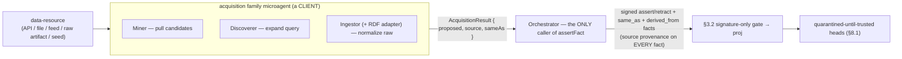

# Mining, discovery & ingestion

Purpose: the Miner / Discoverer / Ingestor microagent families that realize the patent's `data-resource → objects-of-interest → query → acquire` acquisition pipeline as privilege-equal clients — all emitting signed, source-provenanced facts, all deduping by EID, none mutating the graph.

Source: SPEC §5b.3 (2570-2693). See also the [active-knowledge overview](./30-active-knowledge-overview.md) and INV-A1.

---

## The acquisition pipeline maps onto microagent families

The patent's acquisition pipeline — `data-resource → objects-of-interest → query → acquire` — maps onto three **core** microagent families (Miner / Discoverer / Ingestor), with **RDF import/export** as an Ingestor specialization and the **Learner** ([§5b.2](./32-knowledge-autoencoding.md)) as a peer grow-the-map family. All are clients (INV-A1); all emit **signed** facts with source provenance; all dedup by EID (patent node-merge); none mutate the graph.



A **standalone** (sourceless, non-edge-bound) family member is invoked via the **`runAcquisition` seam** ([§6](./40-sdk-api-surface.md)): the orchestrator dispatches the family microagent and commits its `AcquisitionResult.proposed` as signed facts (quarantined until trusted). An **edge-bound** family member is instead reached as a contextual hop via `runContextualQuery` ([§5b.1](./31-contextual-functionalities.md)). Either way the orchestrator, never the agent, calls `assertFact` (INV-A1).

These families author the same **map-update facts** a human operator/user may author by hand ([§5b.1](./31-contextual-functionalities.md) "who may grow the map"): the acquisition path is one privilege-equal client among several, never a back door to authoritative writes.

## Open-set rule — the "…and more" is specified, not just asserted

The Miner/Discoverer/Ingestor enumeration is **illustrative, not closed**. The mechanical extension rule for an **unforeseen** family is:

> **ANY `MicroagentManifest` whose output validates as an `AcquisitionResult`** (or, for an edge-bound member, against an `EdgeKind` binding's `outputSchema`) **is a valid acquisition family member** — no core change is required to add one.

The single dispatch decision is the **edge-bound-or-not** test: a member that realizes a contextual hop (it has a source/target `NodeKind` and an `EdgeKind` to ride) is invoked via `runContextualQuery`; a **sourceless/standalone** member (no hop to ride) is invoked via `runAcquisition`. Either path keeps INV-A1 (orchestrator-only `assertFact`). The families are thus a **recognizer over manifest I/O types**, not a fixed registry.

## `AcquisitionResult` → facts data flow (pinned)

```ts
/** Family-agnostic shape: every family is a MicroagentManifest whose output the orchestrator wraps as
 *  signed facts. The orchestrator — never the agent — calls assertFact (§6). */
interface AcquisitionResult {
  /** Proposed facts (assert/retract), each signed & committed by the orchestrator IN ORDER, with each
   *  entry's own kind preserved — a mixed assert/retract batch is committed verbatim, never coerced. The
   *  discriminated union (each entry is its own AssertInput OR RetractInput, §6) makes the mixed batch
   *  expressible: an AssertInput entry mints a signed `assert`, a RetractInput entry a signed `retract`;
   *  the orchestrator preserves the kind (INV-A10). */
  proposed: ReadonlyArray<AssertInput | RetractInput>;
  /** Source provenance recorded on EVERY emitted fact (data-resource id, fetch time, agent id+ver). */
  source: Provenance;
  /** EIDs the agent believes are duplicates of existing instances (patent node-merge) — emitted as signed
   *  same_as facts, NEVER an in-place rewrite; contradictions surface as kip:conflict. */
  sameAs?: ReadonlyArray<{ candidate: EID; existing: EID }>;
}
```

On a `runAcquisition` dispatch the orchestrator commits, **in order**:

1. each `AcquisitionResult.proposed` entry — typed `AssertInput | RetractInput` — → one signed `assert` (for an `AssertInput`) **or** `retract` (for a `RetractInput`) fact (the entry's own kind is **preserved** — a mixed batch is committed verbatim, never coerced);
2. each `AcquisitionResult.sameAs` entry → exactly one signed `same_as(candidate, existing)` fact (never an in-place rewrite; a contradiction surfaces `kip:conflict` per the [§5b.1](./31-contextual-functionalities.md) closure rule);
3. `AcquisitionResult.source` is recorded as `provenance.source` on **every** fact minted in (1)–(2).

The returned `{ facts: FactId[] }` lists all of (1)+(2) **in that exact order** (the `proposed` order, then the `sameAs` order). **INV-A10** asserts this mapping — the kind-preservation and the (1)→(2) ordering of the returned `FactId[]`.

## The family → primitive table

| Family | Patent pipeline stage | kip primitive it uses |
|---|---|---|
| **Miner** | data-resource → objects-of-interest | signed `assert` facts (often `quarantined`, §8.1); EID dedup (§3.6) |
| **Discoverer** | query → contextually related instances | `recall` hybrid pipeline + **bounded** `query` traversal (§5.1/§5.2); `derived_from` provenance |
| **Ingestor** | acquire / normalize a raw resource | episodic `assert` facts (§2.3); `derived_from` for episodic→semantic consolidation |
| **RDF adapter** (Ingestor specialization) | external semantic-web exchange | `NodeKindDef`/`EdgeKindDef` + instance `assert` facts; heads projected back out as RDF |
| **Learner** ([§5b.2](./32-knowledge-autoencoding.md)) | grow the map & functionality DB | signed `kip:learn` + schema-proposal + microagent-registration facts; `proj` decides effectiveness |

### Per-family detail

- **Miner** — *pull candidate instances from external sources.* Given a `data-resource` reference (API, file, feed), a Miner extracts candidate objects-of-interest and emits them as signed `assert` facts (often `quarantined`/untrusted until trusted, §8.1). It surfaces *candidates*; it never asserts truth, and it **fails loudly rather than fabricating** (N5).
- **Discoverer** — *expand a query to contextually related instances.* A Discoverer runs the hybrid-retrieval expand step (vector recall → **bounded** graph traversal, see [retrieval](./26-retrieval.md) §5.1/§5.2) to find instances contextually linked to a seed, then emits `derived_from` facts recording *why* each was surfaced. Traversal is **bounded** (no unbounded crawl) and reads are pure over `proj`.
- **Ingestor** — *normalize a raw resource into episodic facts.* An Ingestor turns a raw artifact into **episodic** facts (§2.3) with source provenance; later **episodic→semantic consolidation** links the distilled semantic instances back to their episodes via `derived_from` (it is itself a learner pass, [§5b.2](./32-knowledge-autoencoding.md)). An **RDF/RDFS** import/export adapter is a specialization of Ingestor: it translates triples/vocabularies into signed `NodeKind`/`EdgeKind` + instance facts (and projects heads back out as RDF). Unsigned/unverifiable external data is **rejected**; triples that violate the current ontology **quarantine** rather than being coerced.

## Provided-member types & display-association (patent claims 15/31/32)

Claim 15 enumerates the **provided-member** types a functionality may return "contextually related to said known instance" — an advertisement, an RSS summary, a media file, a link to related content, a website. In kip these are **not special-cased**: each is an ordinary instance `NodeKind` an acquisition or contextual hop MAY yield, materialized as the same signed `assert` + `derived_from` facts every other hop emits (all dedup by EID, all quarantined-until-trusted, no new fact type). **Which `NodeKind`** an instance is carries no projection privilege.

Claims 31/32 cover the **output/display stage** — "enhancing a display of said website with said acquired instance" and the member "displayed in association with said object of interest." That display-association is an **application-layer consumer of the `AnswerGraph`**, explicitly **out of substrate scope** (like the DSL is client sugar, N3): the substrate's job ends at recording the signed facts; the answer's `derived_from` subgraph — keyed back to the object-of-interest `seed` — is exactly the linkage an application reads to render a member *in association with* that seed. kip provides the keyed-back-to-seed provenance (INV-A8); it does **not** render, place, or rank ads/media for display (N1) — that is a client concern, recorded faithfully but never executed inside the substrate.

## Key decisions

> **Decision (D-5b.3): acquisition is a family of clients that emit signed, source-provenanced facts; kip provides the recall/traversal/dedup primitives, not the crawlers.** Mining, discovery, and ingestion are realized as microagents whose outputs the orchestrator commits as facts (quarantined until trusted, deduped by EID), keeping kip a substrate, not an ETL engine (N1/N2).
>
> **Rejected alternative — a built-in ingestion daemon that writes "trusted" graph state on import.** This would make an unsigned external boundary an authoritative writer (breaking §3.2) and bake source-specific ETL into the core (N1/N2/N4). Rejected: ingestion is a client; trust is a `proj` demotion keyed on signature + authority, not an import flag.

> **Decision (D-5b.5): a standalone acquisition family gets a callable `runAcquisition` seam; only the orchestrator commits its facts.** A Miner/Discoverer/Ingestor/RDF agent that is **not** edge-bound has no contextual hop to ride, so [§6](./40-sdk-api-surface.md) exposes `runAcquisition(manifest, input, opts?: { asOf?: AsOf })`: the orchestrator dispatches the family microagent and commits its `AcquisitionResult.proposed` as signed facts (quarantined until trusted, deduped by EID), keeping INV-A1 intact for sourceless acquisition. The `opts.asOf` is the same reproducibility pin the active layer insists on elsewhere (R5): a caller wanting a reproducible mining run passes an explicit frontier; default-`now` yields a still-convergent but replica-local answer.
>
> **Rejected alternative — force every acquisition agent to be modeled as an EdgeKind-bound functionality.** This would require fabricating a synthetic seed/EdgeKind for a genuinely sourceless Miner, contorting the ontology to fit the invocation surface. Rejected: a standalone family is a first-class client with its own seam; the orchestrator-commits-the-facts lifecycle is the same either way.

## Conformance — INV-A10 / INV-A11

**INV-A10 (acquisition family lifecycle + ordering/kind-preservation + divergent-registration conflict)** asserts, for a Miner/Discoverer/Ingestor run:

- (a) `AcquisitionResult.proposed` lands **quarantined-until-trusted** — committed facts project `untrusted`/`quarantined` and become trusted only via the ordinary §8.1 authority path, never trusted-on-import;
- (b) each `sameAs` entry becomes exactly one signed `same_as` fact (never an in-place rewrite), a contradicting merge surfacing `kip:conflict`;
- (c) Discoverer traversal **terminates within its declared bound** (a fixture graph that would crawl unbounded is cut off);
- (d) a family microagent that writes `/heads` directly **fails** the suite (INV-A1 parity for the sourceless Miner);
- (e) a **mixed `proposed` batch** preserves kind (each `AssertInput` → `assert`, each `RetractInput` → `retract`; no coercion);
- (f) the returned `{ facts: FactId[] }` is **exactly** the `proposed` order followed by the `sameAs` order;
- plus: two microagent-registrations of the same `(name,version)` with divergent manifests read `CONFLICTED` (a LWW-overwrite **fails**).

**INV-A11** exercises the `same_as` equivalence-closure totality (random-permutation fold yielding a byte-identical canonical EID) and the disputed-merge `kip:conflict` (with `(min,max)` canonicalization so opposite-order replicas rendezvous on the same cell).

---

The driving seam `runAcquisition` (and `runContextualQuery` for edge-bound members) is in the [SDK API surface](./40-sdk-api-surface.md); the full ADR-format records for D-5b.3 / D-5b.5 are in [Architecture decision records](./70-decision-records-adr.md); the conformance invariants INV-A8, INV-A10, INV-A11 are catalogued in [Conformance & testability](./60-conformance-and-testability.md).
