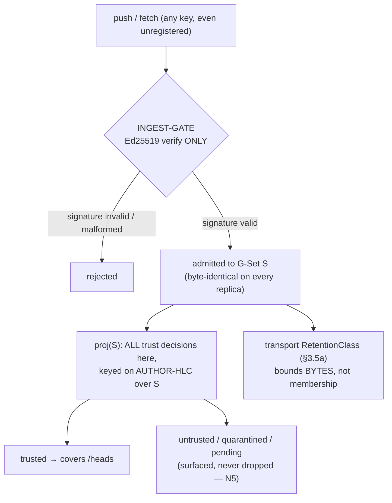

# Security, trust & tenancy

> PKI-style trust (root-of-trust → scoped delegation → revocation), multi-tenant scoping, privacy/redaction/erasure, auditability, and the resource-exhaustion/DoS threat model — all expressed as **set-pure `proj` decisions** keyed on author-HLC, never as ingest-time value rejections.

**Source:** SPEC §8.1–§8.3b (root-of-trust/scoped-authority/revocation, tenancy, privacy, auditability, DoS). Cross-cuts §3.2 (signature-only gate), §3.4/§3.6 (set-pure `proj`), §3.5a (admission control & retention), §4.5 (forgetting), §4b.4 (SEC).

---

## 0. The bright line

kip has **exactly one** membership predicate — a fact is admitted **iff** it is well-formed and its
Ed25519 signature verifies over its canonical payload (§3.2, the [convergence core](./24-synchronization-and-convergence.md)). **Everything else in this document — key-registration, namespace authority, revocation, anti-backdating, scope — is a `proj`-time DEMOTION keyed on the fact's own signed AUTHOR-HLC, never an ingest gate.** A demoted fact is `untrusted`/`quarantined`/`pending`, never silently dropped (N5) and never silently trusted; it is re-evaluated monotonically as more facts arrive. Because every demotion reads only set-resident quantities, two replicas holding the same admitted set make byte-identical trust decisions.



The security outcomes here — reject-at-gate, and `proj`-time demotion/quarantine (including `kip:revoked-concurrent`) — are the trust rows of the consolidated [failure & conflict model](./27-failure-and-conflict-model.md) (outcomes #1–#2); this doc keeps the trust-local detail.

---

## 8.1 Trust model — root of trust, scoped authority, revocation (C-6)

The trust set is **not** a flat, freely-writable global ref. kip defines a real PKI-style model.

### Root of trust (C-6.4)

- Each tenant has a **genesis root key set** pinned in the immutable `manifest.json`, established at repo creation and **never edited thereafter** (M2-5/M2-3).
- The trusted-key ref `refs/kip/keys/<tenant>/trusted` is **append-only and itself a fact log**. A key-authorization fact (`type:"assert"`, `target:{kind:"key"}`) is **valid (trusted by `proj`) only if its *authorizing* key chains, at the key-add fact's author-HLC, to the genesis root** for that namespace. A key-add whose chain does not reach the genesis root is **demoted-untrusted by `proj`** (set-pure, author-HLC keyed) — so a key authorizing a forger key never *grants* authority, identically on every replica.
- A fact signed by an **unregistered** key (no set-resident `KeyAuthorization` chaining to the genesis root at the fact's author-HLC) is **NOT rejected at ingest**; it is **admitted by signature alone** and **demoted `untrusted`/`quarantined` by `proj`** (M3-4), becoming trusted automatically if/when a valid registration for that key arrives — so a data-fact racing ahead of its key's registration is never lost.
- A replica that can merely `push` therefore **cannot self-authorize forgery**: its key-add is admitted to the set but folds to *no authority*. The genesis root set is permanent (manifest-frozen); routine **rotation** moves *current* signing authority along the chain without ever touching the genesis root.

### Scoped authority (C-6.3, C-5, M3-1)

A key authorization binds `key → { namespaces; ops }`. A key may write only EIDs in its authorized namespaces (the C-5 write-authority binding); `excise`/`revoke`/`resolve` are **separately scoped capabilities** (a write key cannot excise, revoke, or adjudicate conflicts). `resolve` is the **single-writer adjudication scope** that lets a key author a *dominating* `supersede` clearing a `kip:conflict` (§3.4, M3-1) — so contradictory concurrent resolutions cannot both be authoritative. Multi-tenant isolation is **structural**: a tenant-A key is never an authority for a tenant-B namespace.

#### Normative interfaces (carried over verbatim)

```ts
interface KeyAuthorization {                 // recorded as a signed fact, target.kind === "key"
  keyFpr: string;                            // SHA-256 of the authorized pubkey
  namespaces: string[];                      // STABLE namespaceIds this key may write (M2-3); authority transfers across keys for a FIXED namespace
  ops: ("write" | "delegate" | "excise" | "revoke" | "resolve")[]; // resolve = single-writer conflict adjudication (M3-1)
  authorizedBy: string;                      // fingerprint of the delegating key (chains to genesis root)
  effectiveFrom: HlcStamp;                   // AUTHOR-HLC: a fact is authorized iff its author-HLC ≥ this and < any later revocation (set-pure, proj decision)
}
interface KeyRevocation {                    // type:"revoke-key" fact; demotes, does not delete (N5)
  keyFpr: string;
  effectiveFrom: HlcStamp;                   // AUTHOR-HLC (M2-5, C2-1): trust cutoff. Compared to author-HLC, NEVER to receiver rxFrom.
  mode: "ordinary-cutoff" | "causal-cutoff"; // REVOKER INTENT (M4-1). Default SHOULD be "ordinary-cutoff".
  reason: string;
  revokedBy: string;                         // must hold `revoke` scope (chains to genesis root)
}
```

**Key invariants:**
- A `KeyAuthorization` MUST chain to the genesis root at the **key-add fact's** author-HLC, else `proj` demotes it.
- `effectiveFrom` is in **author-HLC space** and is compared **only** to author-HLCs in `S` — **never** to a receiver `rxFrom` or physical clock.
- `namespaceId` is a **frozen genesis fingerprint** (M2-3): rotating `Kfpr1 → Kfpr2` is a `KeyAuthorization` granting `Kfpr2` `write` over the *same* namespace; the EID never changes, the namespace is never orphaned (§3.6, [data model](./21-data-model.md)).

### Revocation — a SET-PURE `proj` decision on AUTHOR-HLC, with revoker-chosen intent (C-6.1, C2-1, M2-5, C3-3, M4-1)

Key compromise is recoverable **without rewriting history**. A signed `revoke-key` fact carries `effectiveFrom` (author-HLC) and a `mode`:

| Mode | Demotes | Honest-concurrent cost | Use |
|---|---|---|---|
| **`ordinary-cutoff`** (SAFE DEFAULT) | facts with own author-HLC ≥ `effectiveFrom` | **none** — preserves honest concurrent pre-`effectiveFrom` work | suspected misuse-going-forward |
| **`causal-cutoff`** (OPT-IN) | also facts **not** a causal ancestor of the `revoke-key` fact (via the set-resident `causedBy` closure, §4b.1) | demotes honest concurrent work too | genuine key **COMPROMISE** (closes the ε-width sub-`effectiveFrom` backdating band, C3-3) |

- The revoker MUST choose `causal-cutoff` **deliberately**; it is never the default. A `causal-cutoff` revoke SHOULD stamp `causedBy` to pin the exact causal frontier observed at revocation time.
- **Honest-loss cost (M4-1), stated explicitly.** `causal-cutoff` cannot distinguish a malicious concurrent backdate from an honest concurrent write — both are "past-stamped, non-ancestor-of-the-revocation." It therefore demotes honest concurrent authorship that the revoker had not yet observed; the loss is proportional to partition/propagation delay.
- Honest-concurrent casualties of `causal-cutoff` carry a **DISTINCT** projected status **`kip:revoked-concurrent`** (NOT the generic `untrusted` bucket), so a reader/operator can SEE them in `recall` and re-adjudicate via a **`re-attest` fact** (below) rather than the value silently vanishing from `/heads` (N5). Facts demoted by author-HLC ≥ `effectiveFrom` carry the ordinary `untrusted` status.
- Both modes compare **only set-resident** quantities (author-HLCs and the signed `causedBy` closure, all in `S`), so the demotion is **byte-identical across replicas** (C2-1/C3-3). Pre-`effectiveFrom` facts the revoker **causally observed remain trusted forever** under both modes — revocation never retroactively invalidates honest facts in its ancestry (M2-3), so key rotation is safe.

**Impossibility (M5-2), stated honestly.** No **set-pure** revocation mode can simultaneously (a) demote a compromised key's **sub-`effectiveFrom` backdates** and (b) **preserve that key's honest concurrent sub-`effectiveFrom` work** — both are set-indistinguishable. The two modes are the two horns of this impossibility, shipped as an explicit tradeoff, not a defect. `ordinary-cutoff` chooses (b); `causal-cutoff` chooses (a). (See [open questions R2](./90-open-questions.md).)

### Backdating defense — a SET-RESIDENT CAUSAL rule inside `proj`, NOT any clock gate (C-6.2, C2-1, C3-1, C3-3, C4-2, C5-1)

Every clock is removed from the defense. `proj` decides backdating by set-resident rules, in this order:

1. **PRIMARY — per-key author-HLC monotonicity, GATED ON CHAIN COMPLETENESS (§3.6, §4b.1, C4-2 + C5-1).** A fact `F` from key `K` projects **trusted** only over a **complete, gap-free `(wall,counter)` chain of `K` up to `F`** (the §4c/m4-1 contiguity rule). If a lower same-key fact is missing/evicted/unreplicated, `F` is **`pending`** (not trusted, not rejected) until the chain completes (C5-1). Once complete, `F` is demoted `untrusted-anachronistic` iff `S` holds a **higher-author-HLC, non-ancestor** fact from the **same** `K` in that complete chain. This reads `K`'s *involuntary* footprint, so it is **not evadable by omitting `causedBy`** (C4-2) nor by inducing eviction (the gap forces `pending`).
2. **SECONDARY (tightening only) — voluntary `causedBy` plausibility.** When `F` declares `causedBy`, its author-HLC must also dominate its declared ancestry's author-HLCs. Reads an author-controlled field; never relied on alone.
3. **`causedBy` well-formedness (M4-2).** A forward (`parent > child`) or cyclic `causedBy` edge demotes the fact `untrusted-malformed`, keeping the closure acyclic/terminating (INV-15).
4. **Revocation cutoff** (above, M4-1).

All rules compare **only** set-resident author-HLCs and set-resident ancestry; **no receiver clock, no `rxFrom`, no membership decision** is involved. Membership (signature only) and `proj` (value + trust) never share a clock space.

**Precise bound (the over-strong claim is RETRACTED, C4-2; the eviction route is CLOSED, C5-1).** Anti-backdating holds **relative to the key's own observed activity in `K`'s complete durable chain**. A key whose retained chain contains a higher-stamped non-ancestor fact cannot insert a *trusted* lower-stamped fact; a replica missing part of `K`'s chain projects the candidate **`pending`**, never trusted. A key that has emitted **nothing higher** can still self-date a genuine *first-emission* fact freely — an **acknowledged, acceptable residual** ([R1](./90-open-questions.md)), NOT attacker-reachable by eviction (the chain-completeness gate is the *safety* mechanism; `key-chain-durable` retention is a *liveness* aid only, §3.5a/M6-1).

**Preserved under eviction & partial replication (INV-18(c)/INV-19).** The per-key trust decision is **monotone** (`pending → trusted/demoted` exactly once, never reverses — the completed-chain frontier is pinned while any non-`pending` dependent relies on it, m6-2) and **eviction-safe** (no eviction can flip a same-key backdate to `trusted`). See [conformance INV-16/18/19](./60-conformance-and-testability.md).

### Re-adjudicating a `kip:revoked-concurrent` casualty — the `re-attest` mechanism (m5-3)

A `kip:revoked-concurrent` fact's **content** was honest but its **signing key is revoked**, so it cannot be un-demoted in place, and a `resolve`-scoped `supersede` (which adjudicates `kip:conflict`, §3.4/M3-1) is the **wrong** primitive — there is no contradiction to resolve, only a demoted-by-revocation value to **restore under a trusted key**. kip defines a **`re-attest` fact** (`type:"assert"` carrying `reAttests: FactId` = the demoted fact's CID, signed by a **currently-trusted, non-revoked key** holding `write` scope): `proj` projects the re-attested **content** as a normal trusted assert from the new key (ordered by the new key's author-HLC), so the honest value re-enters `/heads` with fresh, valid provenance while the original demoted fact stays verifiable in history (N5). `re-attest` is set-pure and convergent (it reads only `reAttests` + the new key's authorization in `S`).

---

## 8.2 Tenancy & scoping

- **Tenant = a path-scoped subtree + ontology + authority key-set** (kradle path-scoping). `ScopeRef` selects a namespace; `withScope` is a **client-side write guard + read filter** (C-5.3): the SDK refuses to *author* EIDs outside the scope's authorized namespaces, and reads are filtered to the scope.
- The authoritative *cross-replica* enforcement remains the **set-pure `proj` demotion** keyed on author-HLC (§3.6) — **never an ingest-time value rejection** — so an out-of-scope fact that nonetheless reaches the set is uniformly demoted **everywhere**, not kept on some replicas and dropped on others.
- Cross-tenant reads require explicit **`grant` facts**: a tenant-A key may *reference* tenant-B's frozen `namespaceId` but never *write* it (M2-3).
- **Access policy is data**: `allow`/`deny` facts over (scope, actor, capability), as-of-queryable and auditable. Reads outside policy return **nothing** (no partial leak).

> **`withScope` is ADVISORY (m4-5).** The client-side guard is the *only* thing stopping an **honest** client from authoring out-of-scope/excess facts; an attacker simply does not run it. It is **NOT** a DoS or cross-replica enforcement control — the authoritative bound is the set-pure `proj` demotion (for *value*) plus §3.5a retention (for *bytes*). See §8.3b.

---

## 8.3 Privacy / secrets / redaction / erasure

- **Secret redaction on export** by key-name regex (adapters/tasks): `token|secret|password|…` cells are redacted **at read** for unprivileged scopes. This is a lightweight per-read form and does **not** rewrite history.
- **Erasure** has two distinct mechanisms (§4.5, [temporality doc](./23-temporality-and-bitemporality.md)), with the strength/cost tradeoff stated plainly:
  - **Tombstone (logical, signature-preserving)** — a signed `tombstone`/`retract` closes/splits valid-time and removes the entity from default reads, but **keeps** the original fact, its bytes, and its signature. Auditable, reversible. The **default** for "forgetting."
  - **Excise (physical, GDPR Art. 17, `excise`-scoped)** — the **one** operation that breaks pure append-only. It re-folds `/heads` over the remaining set so no excised residue survives, and its marker uses a **non-content-derived nonce** (random id / tenant-salted HMAC) so it is **not a PII fingerprint** (C-4.3). An unauthorized excision marker is **rejected** (closes the censorship/DoS vector, m-11).

---

## 8.3a Auditability

Every state change is a **signed fact** with provenance, an author-HLC, and (post-hoc, audit-only) a `rxFrom` + commit — so history is a verifiable audit log. `provenanceOf` traces any value to its asserting fact, actor, authority chain, and source.

`fsck` proves:
- `heads == proj(facts)`;
- all **fact** signatures verify;
- every fact's author key chains to the tenant genesis root for its namespace **at the fact's author-HLC**;
- (post-excision) no excised residue survives in `/heads`.

**`fsck` does NOT check commit signatures (M2-2):** commit objects are transport, not trust; fact signatures are the sole trust anchor, so `commit-author ≠ fact-author` on a regenerated DAG is **expected**, not an integrity violation.

**`fsck` is a LOCAL integrity check, not a convergence check (m3-4):** it verifies `heads == proj(local facts)` on *one* replica; it does **not** imply two replicas agree. Cross-replica convergence is INV-2/INV-13's job (see [convergence](./24-synchronization-and-convergence.md) and [conformance](./60-conformance-and-testability.md)). A reader MUST NOT over-trust a green local `fsck` as a convergence guarantee.

---

## 8.3b Resource-exhaustion / DoS threat model (C4-1, m4-5)

The signature-only gate deliberately makes *logical admission* the cheapest possible predicate (one Ed25519 verify) and keeps it byte-pure — which is what SEC needs. The honest threat this creates, and its bound:

### Threat

A holder of **any** key — including a fresh **unregistered** key (registration is `proj`-time, not gate-time) — can sign unlimited distinct signature-valid facts (distinct `factCID` each, so INV-7 dedup does not coalesce them) and `push` them. Logically every replica admits them. **Excision and revocation do NOT bound this** — both *demote* in `proj`, they do **not** reclaim bytes, and the attacker can mint unlimited fresh unregistered keys, so there is no single key to revoke that stops the flood.

### Bound (the C4-1 fix — §3.5a)

Membership purity is **NOT** the place to fix this (a membership gate re-opens C3-1/M3-4 divergence). Instead, **durable STORAGE is the bounded resource**, via the transport-layer admission-control & retention policy (§3.5a, [git substrate](./22-git-substrate.md)). The set-pure `RetentionClass` (computed identically on every replica, never a `proj` value):

| `RetentionClass` | For | Policy |
|---|---|---|
| `durable` | trusted (registered, in-namespace, non-revoked, plausible) facts | **never evicted** |
| `key-chain-durable` | a registered key's own emissions (incl. its quarantined/anachronistic chain links) | preferentially retained up to per-key `keyChainDurableCapBytes`; oldest cap-evicted, re-fetched on demand (M6-1) |
| `quarantined-ttl` | an **unregistered** key's facts | per-key byte-cap + TTL + **global `quarantinePoolBytes` budget**; eviction-eligible |
| `evicted` | bytes reclaimed | re-fetchable on demand if it later becomes durable |

A replica applying the default retention policy therefore admits the flood **logically** (preserving convergence and late-registration races) but bounds the **bytes**, and the flood **never affects `/heads`** (those facts project `quarantined`). The quota lives at **transport**, out of `proj`.

### Aggregate bound — the unlimited-identity defense (m5-1)

A per-key byte cap alone is **not** a global bound (`N` fresh keys give `N × quarantineKeyCapBytes`). The default policy therefore caps the **aggregate** `quarantined-ttl` pool by a manifest-pinned **global `quarantinePoolBytes` budget** with LRU/TTL eviction across **all** unregistered keys, so an `N`-key flood cannot multiply the ceiling or refill faster than TTL/LRU drains. The TTL is the time-ceiling; `quarantinePoolBytes` is the space-ceiling; per-key `quarantineKeyCapBytes` is a *fairness* sub-limit, not the aggregate bound.

### Registered-key (insider) DoS — now genuinely bounded (M6-1)

An attacker with a **registered** key is the insider threat, bounded by:
1. the per-registered-key **`keyChainDurableCapBytes` cap** on the `key-chain-durable` pool — **a real eviction cap (M6-1)**: past the cap the oldest chain links are evicted (re-fetched on demand if later needed), so a registered or compromised-registered key can **no longer** force unbounded non-evictable durable bytes. (The former "never-evict" wording was an internal contradiction with "bounded by per-key quota" and is **retracted**; the cap makes the quota *true* and enforceable.)
2. **revocation** (§8.1);
3. the **per-key chain-completeness anti-backdating gate** (C5-1) — `pending`s/demotes any backdate that contradicts the key's own chain, so an insider cannot silently backdate a trusted fact onto a victim by inducing eviction.

A replica that **opts out** of retention (stores everything) re-exposes itself to *disk growth* — admission control is a **MAY**, not a mandate — but opting out does **NOT** re-open C5-1 (the completeness gate is part of `proj`, independent of the retention knob).

### Accepted residual — re-fetch liveness cliff (m6-3)

A pre-registration chain link (or a cap-evicted `key-chain-durable` link) that has aged out of **every** replica leaves no peer to re-fetch from, so the chain cannot complete and dependent same-key facts stay **`pending` permanently** — never a wrong *trusted* value, but a permanent liveness loss for that key. Mitigation (operational): size `keyChainDurableCapBytes`/`quarantineTtlMs` to the working set and register keys before their pre-registration facts age out. Listed honestly in [§9 / R3](./90-open-questions.md).

### Consistency with the "real PKI" claim

Unlimited unauthenticated keys can *push*, but cannot force unbounded **durable** growth or affect any **trusted** head. The §8.1 PKI model and this DoS bound are mutually consistent: trust is a `proj` demotion (value), storage is a transport quota (bytes), and neither touches the signature-only membership gate.

---

## Where this is tested

The trust/tenancy/DoS guarantees here are conformance-checked by **INV-6** (gate/proj separation), **INV-10** (authority chain, author-HLC keyed), **INV-13** (signature-valid ⇒ admitted-on-receipt), **INV-15** (`causedBy` well-formedness), **INV-16** (per-key anti-backdating, chain-completeness gated), **INV-17** (revocation intent + `kip:revoked-concurrent` + `re-attest`), **INV-18** (admission-control/retention + aggregate bound + per-shared-subset SEC), and **INV-19** (anti-backdating under eviction). See [conformance & testability](./60-conformance-and-testability.md).
