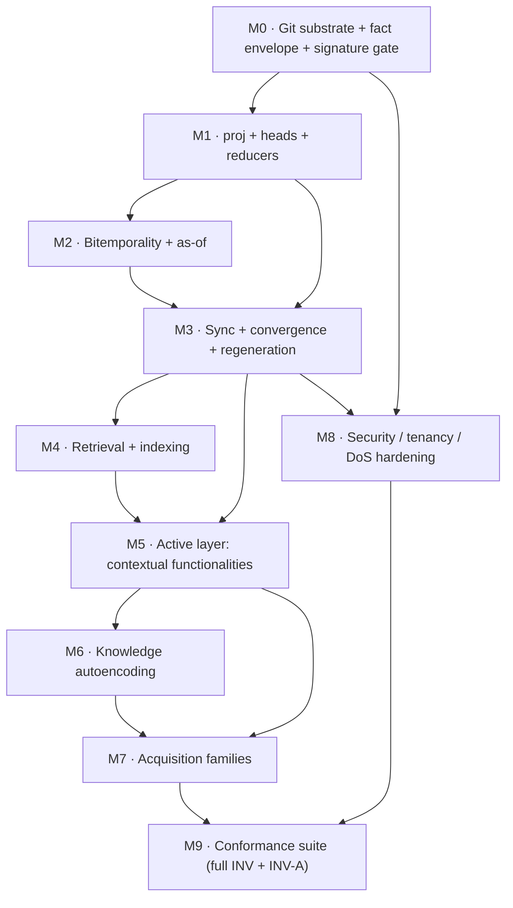

# Roadmap & milestones

> A dependency-ordered, pre-development implementation roadmap (M0 → M9): what each milestone delivers, which docs/§ it implements, what it depends on, and the exit criteria (the conformance INVs that must pass).

**Source:** SPEC synthesis (architecture §2/§3/§4/§4b/§5/§5b/§6 + requirements + the §8.4 conformance catalog). This is a **DERIVED PLANNING VIEW**, faithful to scope.

> [!IMPORTANT]
> **This document is a DERIVED planning view, not a new specification.** It introduces **no** new scope, requirements, or guarantees. Every milestone implements pre-existing spec sections, and every exit criterion is an INV the spec already defines (§8.4 / [conformance](./60-conformance-and-testability.md)). Where a milestone says "deliver X," X is the spec's X. The milestone *ordering* is a synthesized dependency claim; it does not change what is built, only a plausible build sequence. Sequence may be adjusted; the **dependency edges** (what must exist before what) are the load-bearing part.

> [!TIP]
> **Looking for the detailed work-breakdown?** This page is the **high-level milestone view** (M0 → M9). The full **epic / task / subtask / dependency WBS** — 13 epics → 76 tasks → 193 subtasks, each task carrying its `Implements` (FR/NFR), `Exit criteria` (INV-\*/INV-A\*), and `Depends on` (task ids), plus a task-level mermaid dependency graph — lives in **[81-roadmap-epics-and-tasks.md](./81-roadmap-epics-and-tasks.md)**. Each milestone below maps to one or more epics in that document; see the [milestone → epic map](#milestone--epic-map).

### Milestone → epic map

Each milestone M0–M9 is realized by the epic(s) below in the detailed WBS ([81-roadmap-epics-and-tasks.md](./81-roadmap-epics-and-tasks.md)). The dependency ordering is consistent between the two views.

| Milestone | Realizing epic(s) in [81](./81-roadmap-epics-and-tasks.md) |
|---|---|
| **M0** substrate + envelope + gate | E1 |
| **M1** proj + heads + reducers | E2 |
| **M2** bitemporality + as-of | E3 |
| **M3** sync + convergence + regeneration | E4 |
| **M4** retrieval + indexing | E5 |
| **M5** contextual functionalities | E6 |
| **M6** knowledge autoencoding | E7 |
| **M7** acquisition families | E8 |
| **M8** security / tenancy / DoS hardening | E9, E10 |
| **M9** conformance suite | E12 |
| *(cross-cutting / operational)* | E11 (SDK surface), E13 (tooling & ops) |

> E11 (the public SDK surface) and E13 (CLI / fsck / packing-GC / observability) thread across the milestones rather than mapping to a single one: E11 assembles the capabilities each milestone delivers into the normative API shapes, and E13 packages operational tooling over them.

---

## Dependency graph

The spine is **M0 → M1 → M3** (substrate → projection → convergence); everything else hangs off a converging substrate. Security (M8) threads through from M0 (genesis root in the manifest) but only fully closes after M3 (the set-pure trust overlay needs the converged set + author-HLC machinery).

---

## M0 — Git substrate, fact envelope, signature-only gate

**Goal.** A signed, content-addressed, append-only fact log over git with the bright-line membership gate.

**Key deliverables.**
- Object & ref layout: `/facts/**`, `refs/kip/replicas/*`, `refs/kip/sessions/*`, `manifest.json` (genesis root key set pinned, frozen).
- The **fact envelope** (§4.1): author-stamped signed `hlc`, `provenance.signedFields`, canonical payload, `validFrom`/`validTo`, `factCID`.
- The **signature-only INGEST-GATE** — the sole membership predicate; spelled out canonically in [§3.2](./22-git-substrate.md) (the [FR group A admission rule](./10-functional-requirements.md#fr-group-a--write--transaction-operations)).
- Batched commit granularity (`txn` → one commit) with `{factId, status}` durability (m-9).
- Dual-id scheme stubs: CID (git object id) + namespaced EID structure (§3.6).

**Implements.** [22-git-substrate](./22-git-substrate.md) (§3.1–§3.3, §3.6), [21-data-model](./21-data-model.md) (§2, envelope), the gate half of [24-convergence](./24-synchronization-and-convergence.md) (§3.2/§4b.2).

**Dependencies.** None (foundation).

**Exit criteria.** [INV-7](./60-conformance-and-testability.md), and the gate behavior of [INV-6](./60-conformance-and-testability.md) / [INV-13](./60-conformance-and-testability.md) (canonical titles + bodies in [60](./60-conformance-and-testability.md)).

---

## M1 — `proj`, `/heads`, reducers

**Goal.** The deterministic projection: `proj(S)` materializes byte-identical `/heads`.

**Key deliverables.**
- `orderKey`: the total order over set-resident fields — see the canonical [`OrderKey` type](./22-git-substrate.md#orderkey).
- `proj`: sort → group by cell → upcast → reduce; **set-pure, whole-set fold**, no pairwise merge.
- Cell reducers: `lww-hlc`, `max`, `min`, `gset`, `pncounter`, `custom` — deterministic, total, pure (INV-3).
- Versioned **upcasters** (§2.2): typed `value | quarantine`, never throw, never invent (M-8).
- Interval geometry: non-overlapping segments, **gaps as first-class `unknown`** (M-9); existence-gates-properties (no ghost nodes, m2-2).
- Conflict surfacing: `kip:conflict` for non-commutative contradictions, per the §3.4 resolution table (no silent hash tiebreak, N5).

**Implements.** [data model](./21-data-model.md) (§2.2 schema/upcasters), the projection half of [convergence](./24-synchronization-and-convergence.md) (§3.4, §4b.3), [decision ADR-002/ADR-005/ADR-013](./70-decision-records-adr.md).

**Dependencies.** M0 (the fact set + envelope).

**Exit criteria.** [INV-1](./60-conformance-and-testability.md), [INV-3](./60-conformance-and-testability.md), [INV-4](./60-conformance-and-testability.md), [INV-8](./60-conformance-and-testability.md) (canonical titles + bodies in [60](./60-conformance-and-testability.md)).

---

## M2 — Bitemporality & as-of

**Goal.** Valid-time/transaction-time geometry and as-of reads.

**Key deliverables.**
- Bitemporal envelope: valid time (`validFrom`/`validTo`, gaps legal) vs transaction time (`rxFrom`, **audit-only, excluded from `proj`**).
- `asOf({txTime, validTime, believer})` reads; the per-replica belief axis vs the convergent valid-time axis.
- Decay/salience/consolidation as operations over time (§4.4).
- Forgetting: tombstone (logical) defined; excise hooks staged (full excision lands with M3's DAG regeneration).
- Pins / `SnapshotRef` content-addressing the `factSetDigest` + author-HLC frontier (`dagTips` dropped).

**Implements.** [temporality & bitemporality](./23-temporality-and-bitemporality.md) (§4), the pin/as-of seams of [context-enablement seams](./25-context-enablement-seams.md) (§4c).

**Dependencies.** M1 (`proj` computes the valid-time geometry).

**Exit criteria.** [INV-4](./60-conformance-and-testability.md), [INV-11](./60-conformance-and-testability.md), [INV-14](./60-conformance-and-testability.md) (canonical titles + bodies in [60](./60-conformance-and-testability.md)).

---

## M3 — Sync, convergence & deterministic regeneration

**Goal.** The correctness core: HLC, set-union sync, the SEC guarantee, concurrent excision confluence.

**Key deliverables.**
- HLC fully wired (§4b.1): counter overflow → carry, never wrap (M-2).
- `sync` = content-addressed `git fetch`/`push` of missing fact blobs; **set-union** merge; **`/heads` regenerated, not merged**.
- Branch-per-agent topology (§4b.5): replica branches + trunk + session pins; any merge topology converges.
- Two-layer reconciliation (§4b.3): substrate G-Set vs recorded semantic supersession; `supersede` keyed by input CIDs.
- **Excision** (§4.5): authorized history rewrite + **deterministic DAG regeneration** (set-derived commit boundaries/timestamp/sentinel committer/unsigned), incremental from the excision point.
- Concurrency detection via the commit DAG (best-effort, safe-default-concurrent), never an input to `proj`'s value.

**Implements.** [synchronization & convergence](./24-synchronization-and-convergence.md) (§4b + §7), the regeneration parts of [git substrate](./22-git-substrate.md) (§3.5/§4.5), [decision ADR-003/ADR-004/ADR-006/ADR-011](./70-decision-records-adr.md).

**Dependencies.** M1 (`proj` is half the SEC theorem) + M2 (as-of/pins address the fact set, needed for excision-survivable pins).

**Exit criteria.** [INV-2](./60-conformance-and-testability.md), [INV-12](./60-conformance-and-testability.md), [INV-13](./60-conformance-and-testability.md), [INV-9](./60-conformance-and-testability.md) (canonical titles + bodies in [60](./60-conformance-and-testability.md)).

---

## M4 — Retrieval & indexing

**Goal.** Hybrid recall over the converged graph, with rebuildable indexes.

**Key deliverables.**
- Hybrid pipeline (§5.1): vector candidates → bounded graph expansion → RRF fusion.
- Typed graph traversal (§5.2), as-of aware, bounded fanout.
- Derived, content-addressed, **incremental** indexing keyed off git object hashes (§5.3) — never a monolithic rebuild.
- Salience projection (§5.4) with fixed weights (a **deterministic** projection); the model id recorded as a fact.
- The **accelerator boundary** (§5.3): ANN/embeddings are best-effort, recall-equivalent, **NOT** byte-identical — explicitly outside the convergence guarantee.

**Implements.** [retrieval](./26-retrieval.md) (§5), the `recall`/`subscribe`/`salience` seams of [context-enablement seams](./25-context-enablement-seams.md) (§4c).

**Dependencies.** M3 (recall reads a converged graph; pins/as-of from M2/M3).

**Exit criteria.** [INV-5](./60-conformance-and-testability.md) (canonical title + body in [60](./60-conformance-and-testability.md)).

---

## M5 — Active layer: contextual-relation functionalities

**Goal.** EdgeKinds carrying microagents; `ContextualQuery → Segment(DAG) → signed-fact execution`.

**Key deliverables.**
- `FunctionalityBinding` on EdgeKinds; microagent manifests; `registerFunctionality` (additive, N realizers as `Segment.alternatives`).
- `ContextualQuery` compile → `Segment` (steps + `deps` DAG), a **pure read over `proj`**; deterministic topological execution order.
- Execution dispatches microagents (clients only); the **orchestrator** commits `assert` + `derived_from` facts (INV-A1).
- The three patent facets orthogonal: constraint (claim-8) / conditional (claim-12) / relation-type (claim-7).
- Weighted/conditional relations as `/ontology` facts (deterministic ordering/gating).
- Composition-discovery (cross-relation chain) as a compile-time `proj`-search; `same_as` equivalence-closure + canonical-EID; the answer graph (keyed back to the seed).

**Implements.** [active-knowledge overview](./30-active-knowledge-overview.md) (§5b intro), [contextual functionalities](./31-contextual-functionalities.md) (§5b.1), [decision ADR-014..ADR-020](./70-decision-records-adr.md).

**Dependencies.** M3 (signed-fact execution rides the converged substrate) + M4 (Discoverer/composition uses recall + bounded traversal).

**Exit criteria.** **INV-A1** (microagents are clients, never the substrate), **INV-A2** (compile-determinism + dependency-DAG topological order), **INV-A3** (dispatch no-fallback incl. constraint-violation), **INV-A6** (hop idempotence/node-merge), **INV-A7** (multi-segment/multi-realizer typed choice), **INV-A8** (answer-graph projection), **INV-A11** (`same_as` closure totality + disputed-merge conflict).

---

## M6 — Knowledge autoencoding

**Goal.** The `encode → decode → reconstruction-loss → learner` loop, recorded as facts.

**Key deliverables.**
- The learner loop running **outside `proj`** under a hard **total disjunctive budget** — see [FR-J1](./10-functional-requirements.md) and [§5b.2](./32-knowledge-autoencoding.md).
- `kip:learn` (correction-class, accept) and `kip:learn-exhausted` (gset marker) facts; achieved loss recorded but **excluded from `orderKey`/reducers** (audit-only, like `rxFrom`).
- `LearnOptions` ↔ `LearnerLoopState` budget-agreement; accept-if-improved monotonicity.
- The accelerator-vs-substrate boundary honored: `proj` never re-runs the loop.

**Implements.** [knowledge autoencoding](./32-knowledge-autoencoding.md) (§5b.2), [decision ADR-021](./70-decision-records-adr.md).

**Dependencies.** M5 (the learner is a grow-the-map microagent family; uses the registration + signed-fact path).

**Exit criteria.** **INV-A4** (learner replica-fold), **INV-A5** (budget-cap termination over all three disjunctive axes + exhausted marker), **INV-A9** (proj-totality + loss-exclusion), **INV-A12** (accept-if-improved + budget-agreement), **INV-A13/A14** (explicit encode/decode/learner manifest selection; once-declared `rawKind` threaded into every decode).

---

## M7 — Acquisition families (Miner / Discoverer / Ingestor)

**Goal.** The `data-resource → objects-of-interest → query → acquire` pipeline as privilege-equal clients.

**Key deliverables.**
- Miner / Discoverer / Ingestor + RDF (Ingestor specialization); all emit **signed, source-provenanced** facts, dedup by EID, none mutate the graph.
- `runAcquisition` seam for sourceless families; edge-bound members via `runContextualQuery`.
- `AcquisitionResult → facts` mapping (kind-preserving `assert`/`retract`, `sameAs` → `same_as`, source on every fact, ordered `FactId[]`).
- Open-set extensibility (any manifest validating as `AcquisitionResult`/binding `outputSchema` is a family member).

**Implements.** [mining, discovery & ingestion](./33-mining-discovery-ingestion.md) (§5b.3), [decision ADR-022/ADR-023](./70-decision-records-adr.md).

**Dependencies.** M5 (contextual dispatch path) + M6 (Learner is a peer grow-the-map family; consolidation is a learner pass).

**Exit criteria.** **INV-A10** (acquisition family lifecycle + `AcquisitionResult→facts` mapping + divergent-registration conflict), reuse of **INV-A1** (orchestrator-only `assertFact`).

---

## M8 — Security / tenancy / DoS hardening

**Goal.** The full set-pure trust overlay, tenancy scoping, and the storage bound.

**Key deliverables.**
- `KeyAuthorization` / `KeyRevocation` interfaces; genesis-root chaining at author-HLC; rotation/delegation.
- Revocation modes: `ordinary-cutoff` (default) vs `causal-cutoff`; `kip:revoked-concurrent` surfacing; `re-attest` restoration.
- Set-resident anti-backdating: per-key author-HLC monotonicity gated on chain completeness (`pending` on gap); `causedBy` secondary + well-formedness.
- Tenancy: `withScope` (advisory client guard) + set-pure `proj` demotion (authoritative); `grant`/`allow`/`deny` policy facts.
- Privacy: secret-redaction-on-export; tombstone vs excise (from M3).
- **Admission control & retention** (§3.5a): `RetentionClass`; `quarantined-ttl` per-key cap + TTL + **global `quarantinePoolBytes` budget**; `key-chain-durable` cap + on-demand re-fetch.
- Auditability: `provenanceOf`, `fsck` (local integrity, not convergence).

**Implements.** [security, trust & tenancy](./50-security-trust-tenancy.md) (§8.1–§8.3b), the retention parts of [git substrate](./22-git-substrate.md) (§3.5a), [decision ADR-001/ADR-007/ADR-008/ADR-009/ADR-010](./70-decision-records-adr.md).

**Dependencies.** M0 (genesis root in manifest; the gate) + M3 (the set-pure overlay needs the converged set + author-HLC + regeneration; revocation/excision are author-HLC comparisons over `S`).

**Exit criteria.** [INV-6](./60-conformance-and-testability.md), [INV-10](./60-conformance-and-testability.md), [INV-15](./60-conformance-and-testability.md), [INV-16](./60-conformance-and-testability.md), [INV-17](./60-conformance-and-testability.md), [INV-18](./60-conformance-and-testability.md), [INV-19](./60-conformance-and-testability.md) (canonical titles + bodies in [60](./60-conformance-and-testability.md)).

---

## M9 — Conformance suite (the suite kip ships)

**Goal.** Determinism-as-test-strategy: the full INV-1..19 + INV-A1..A14 catalog, green, as the gating proof.

**Key deliverables.**
- Random-order / random-partition replay equality harness (INV-2).
- Adversarial recipes per INV (clock skew, long offline partitions, data-before-key-registration, eviction-route backdates, cross-OS/cross-TZ regeneration, `N`-key floods).
- Accelerator tests are recall-threshold, not byte-equality (INV-5).
- The active-layer INV-A recipes mirroring INV-1..19.

**Implements.** [conformance & testability](./60-conformance-and-testability.md) (§8.4) — every INV across all prior milestones, assembled as one shippable suite.

**Dependencies.** All of M0–M8 (the suite asserts each milestone's exit criteria; the active-layer INV-A set needs M5–M7).

**Exit criteria.** The **entire** INV-1..19 and INV-A1..A14 catalog passes, with the bounded excision-propagation window and the accepted residuals ([R1–R6](./90-open-questions.md)) explicitly accounted for (never hiding a CRITICAL).

---

## Milestone → docs/§ → exit-INV summary

| Milestone | Implements (docs / §) | Exit INVs |
|---|---|---|
| **M0** substrate + envelope + gate | [22](./22-git-substrate.md) §3.1–3.3/3.6, [21](./21-data-model.md) §2, §3.2 | INV-7; gate of INV-6/13 |
| **M1** proj + heads + reducers | [21](./21-data-model.md) §2.2, [24](./24-synchronization-and-convergence.md) §3.4/§4b.3 | INV-1, 3, 4, 8 |
| **M2** bitemporality + as-of | [23](./23-temporality-and-bitemporality.md) §4, [25](./25-context-enablement-seams.md) §4c | INV-4, 11, 14 |
| **M3** sync + convergence + regen | [24](./24-synchronization-and-convergence.md) §4b/§7, §4.5 | INV-2, 9, 12, 13 |
| **M4** retrieval + indexing | [26](./26-retrieval.md) §5 | INV-5 |
| **M5** contextual functionalities | [30](./30-active-knowledge-overview.md)/[31](./31-contextual-functionalities.md) §5b.1 | INV-A1, A2, A3, A6, A7, A8, A11 |
| **M6** autoencoding | [32](./32-knowledge-autoencoding.md) §5b.2 | INV-A4, A5, A9, A12, A13, A14 |
| **M7** acquisition families | [33](./33-mining-discovery-ingestion.md) §5b.3 | INV-A10 (+ A1) |
| **M8** security / tenancy / DoS | [50](./50-security-trust-tenancy.md) §8.1–8.3b, §3.5a | INV-6, 10, 15, 16, 17, 18, 19 |
| **M9** conformance suite | [60](./60-conformance-and-testability.md) §8.4 | all INV-1..19 + INV-A1..A14 |
