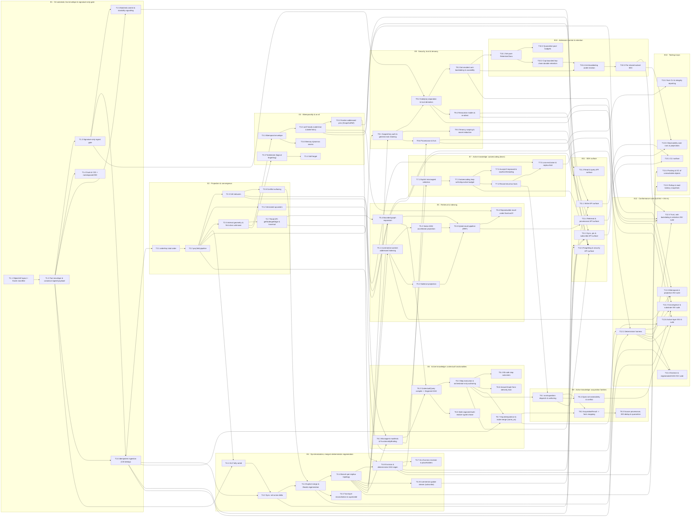

# Roadmap epics, tasks & dependency WBS

> The detailed, dependency-ordered work-breakdown structure (WBS) behind the milestone view in [80-roadmap-and-milestones.md](./80-roadmap-and-milestones.md): 13 epics → 76 tasks → 193 subtasks, with every dependency edge drawn explicitly.

**Source:** SPEC + docs/10,11,60,80.

> [!IMPORTANT]
> This is a **DEPENDENCY-ORDERED** work-breakdown structure. It contains **NO timelines, durations, dates, sprints, or effort estimates** — sequencing here is determined **by dependency only** (a task may begin once the tasks it `Depends on` exist). Reading order within an epic follows the dependency edges, not any calendar. The words *timeline*, *estimate*, and *duration* appear in this document **only** in this disclaimer; no time unit is ever attached to any epic, task, or subtask.

---

## Legend

**Id scheme.**

- **`E#`** — an **epic** (a coherent subsystem of work), e.g. `E4`.
- **`T#.#`** — a **task** inside an epic, e.g. `T4.3` (the third task of epic `E4`).
- **`T#.#.#`** — a **subtask** inside a task, e.g. `T4.3.1` (the first subtask of `T4.3`).

**Each task records three things.**

- **Implements:** the functional / non-functional requirement ids it realizes — **FR-\*** and **NFR-\***. The id text names the exact requirement; the link resolves to the requirements **doc** ([./10-functional-requirements.md](./10-functional-requirements.md) for FR, [./11-non-functional-requirements.md](./11-non-functional-requirements.md) for NFR), where the id is found as a bold inline label (these docs do not carry per-id `#anchor` slugs, so the link lands at the doc, not the id).
- **Exit criteria:** the conformance invariant ids that must pass for the task to be done — **INV-\*** / **INV-A\***, found as bold inline labels in [./60-conformance-and-testability.md](./60-conformance-and-testability.md) (the link resolves to the doc, not a per-id anchor). A blank exit-criteria line means the task has no *direct* gating INV; it is exercised through the tasks that depend on it.
- **Depends on:** the task ids that must exist first (the load-bearing ordering). These are rendered as **in-page** links to the task anchors below.

**Dependency-respecting epic order.** Epics appear in an order consistent with the edges: `E1 → E2 → E3 → E4 → E5 → E6 → E7 → E8 → E9 → E10 → E11 → E12 → E13`. Within an epic, tasks are listed in their own dependency-respecting order.

> [!NOTE]
> **Maintenance — task anchors are hand-authored.** Each `[T#.#](#T#.#)` in-page dependency link resolves through an explicit `` tag on the task heading (not a GitHub auto-generated heading slug). Adding, renumbering, or removing a task means hand-editing both the anchor tag and every link that targets it; a dropped or mistyped `<a id>` silently breaks the link with no build-time error. Until a CI link-checker (e.g. `markdown-link-check` / `remark-validate-links`) is wired over `packages/kip-sdk/docs`, contributors MUST verify task-anchor links by hand when editing this WBS — that CI check is the documented mitigation for this fragility.

---

## Dependency graph (task-level)

Nodes are tasks (`id` + short title); edges are the `Depends on` relation (an arrow `A --> B` means **B depends on A** — A must exist first). Subgraphs group tasks by epic. The edges below mirror the skeleton exactly.

---

## E1: Git substrate, fact envelope & signature-only gate

**Goal.** A signed, content-addressed, append-only fact log over git with the bright-line signature-only membership gate and batched-commit durability (M0).

**Detailed doc:** [./22-git-substrate.md](./22-git-substrate.md)

### T1.1 Object & ref layout + frozen manifest

Define the git object/ref layout (`/facts/**`, `refs/kip/replicas/*`, `refs/kip/sessions/*`) and the immutable `manifest.json` pinning the tenant genesis root key set.

- **Implements:** [FR-D4](./10-functional-requirements.md) · [NFR-A1](./11-non-functional-requirements.md), [NFR-D1](./11-non-functional-requirements.md)
- **Exit criteria:** —
- **Depends on:** — (root)
- **Subtasks:**
  - [ ] T1.1.1 Define /facts/** and refs/kip/replicas/* layout
  - [ ] T1.1.2 Define refs/kip/sessions/* short-lived read pins
  - [ ] T1.1.3 Define frozen manifest.json with pinned genesis root key set

### T1.2 Fact envelope & canonical signed payload

Implement the fact envelope: author-stamped signed HLC, schema version `v`, `provenance.signedFields`, canonical payload, `validFrom`/`validTo`, and the `factCID` (CID over the canonical payload).

- **Implements:** [FR-A1](./10-functional-requirements.md) · [NFR-A6](./11-non-functional-requirements.md), [NFR-G1](./11-non-functional-requirements.md)
- **Exit criteria:** —
- **Depends on:** [T1.1](#T1.1)
- **Subtasks:**
  - [ ] T1.2.1 Canonical payload encoding covering pubkeyFpr, replicaId, v
  - [ ] T1.2.2 Author-stamped signed HLC + signedFields provenance
  - [ ] T1.2.3 factCID derivation including signed author-HLC
  - [ ] T1.2.4 Post-hoc audit-only fields (id, rxFrom) annotation

### T1.3 Signature-only ingest gate

Implement the signature-only ingest gate — the sole membership predicate, spelled out canonically in [§3.2](./22-git-substrate.md).

- **Implements:** — · [NFR-A2](./11-non-functional-requirements.md), [NFR-D5](./11-non-functional-requirements.md), [NFR-I1](./11-non-functional-requirements.md)
- **Exit criteria:** —
- **Depends on:** [T1.2](#T1.2)
- **Subtasks:**
  - [ ] T1.3.1 Ed25519 verify over canonical payload
  - [ ] T1.3.2 Well-formedness validation; reject malformed/invalid-signature only
  - [ ] T1.3.3 Identical gate behavior across replicas (membership convergence)

### T1.4 Dual-id scheme: CID + namespaced EID

Implement the dual-id structure: git-object CID for content addressing and a namespaced, cryptographically anchored stable EID decoupled from content so identity survives key rotation/revocation.

- **Implements:** — · [NFR-F1](./11-non-functional-requirements.md)
- **Exit criteria:** —
- **Depends on:** [T1.2](#T1.2)
- **Subtasks:**
  - [ ] T1.4.1 Namespaced EID structure (namespaceId, localId)
  - [ ] T1.4.2 EID/CID decoupling and identity-survival under rotation

### T1.5 Batched commit granularity & durability signalling

Implement one-commit-per-transaction batching with `{factId, status}` durability so a buffered fact is pending until commit and no durable ack precedes the commit.

- **Implements:** [FR-A3](./10-functional-requirements.md), [FR-A4](./10-functional-requirements.md), [FR-A5](./10-functional-requirements.md) · [NFR-F3](./11-non-functional-requirements.md)
- **Exit criteria:** —
- **Depends on:** [T1.2](#T1.2), [T1.3](#T1.3)
- **Subtasks:**
  - [ ] T1.5.1 Auto-batched buffer with pending/durable status
  - [ ] T1.5.2 txn(fn) -> one commit as the publish point
  - [ ] T1.5.3 commit(message?) flush of buffered facts

### T1.6 Idempotent ingestion (CID dedup)

Ensure re-ingesting an already-held fact is a strict no-op via CID dedup (CID includes the signed author-HLC), with no double-count and no duplicate valid-time intervals.

- **Implements:** [FR-D7](./10-functional-requirements.md) · [NFR-A8](./11-non-functional-requirements.md)
- **Exit criteria:** [INV-7](./60-conformance-and-testability.md)
- **Depends on:** [T1.2](#T1.2), [T1.3](#T1.3)
- **Subtasks:**
  - [ ] T1.6.1 CID-keyed dedup on ingest
  - [ ] T1.6.2 No double-count under pncounter; no duplicate intervals

---

## E2: Projection & convergence: proj, /heads, reducers

**Goal.** The deterministic, set-pure whole-set projection `proj(S)` materializing byte-identical `/heads` via orderKey ordering, reducers, upcasters, interval geometry, and conflict surfacing (M1).

**Detailed doc:** [./24-synchronization-and-convergence.md](./24-synchronization-and-convergence.md)

### T2.1 orderKey total order

Implement `orderKey` as the total order over set-resident fields (the canonical [`OrderKey` type](./22-git-substrate.md#orderkey)) with guaranteed totality across distinct admitted facts.

- **Implements:** — · [NFR-A5](./11-non-functional-requirements.md), [NFR-A6](./11-non-functional-requirements.md)
- **Exit criteria:** [INV-3](./60-conformance-and-testability.md)
- **Depends on:** [T1.6](#T1.6)
- **Subtasks:**
  - [ ] T2.1.1 orderKey field composition over set-resident fields
  - [ ] T2.1.2 factCID final tiebreak; assert orderKey totality

### T2.2 proj fold pipeline (sort -> group -> upcast -> reduce)

Implement `proj(S)` as a single total, pure, whole-set fold producing byte-identical `/heads`, reading only author-stamped set-resident fields and never `rxFrom` or any receiver clock.

- **Implements:** — · [NFR-A3](./11-non-functional-requirements.md), [NFR-A4](./11-non-functional-requirements.md), [NFR-A5](./11-non-functional-requirements.md)
- **Exit criteria:** [INV-1](./60-conformance-and-testability.md)
- **Depends on:** [T2.1](#T2.1)
- **Subtasks:**
  - [ ] T2.2.1 Sort by orderKey, group by cell
  - [ ] T2.2.2 Whole-set fold (no pairwise merge)
  - [ ] T2.2.3 Replica-local-input independence (no rxFrom/clock leak)

### T2.3 Cell reducers (lww-hlc, max, min, gset, pncounter, custom)

Implement the registered `CellReducers` as deterministic, total, pure folds whose final tiebreak terminates in `orderKey`.

- **Implements:** — · [NFR-A3](./11-non-functional-requirements.md), [NFR-A6](./11-non-functional-requirements.md)
- **Exit criteria:** [INV-3](./60-conformance-and-testability.md)
- **Depends on:** [T2.2](#T2.2)
- **Subtasks:**
  - [ ] T2.3.1 lww-hlc, max, min reducers
  - [ ] T2.3.2 gset, pncounter reducers
  - [ ] T2.3.3 custom reducer registration; final tiebreak terminates in orderKey

### T2.4 Versioned upcasters

Implement versioned upcasters applied in `proj` keyed to each fact's `validFrom`/version, yielding a typed `value | quarantine` result that terminates, never throws, and never invents data.

- **Implements:** [FR-G1](./10-functional-requirements.md), [FR-G2](./10-functional-requirements.md), [FR-G3](./10-functional-requirements.md) · [NFR-H1](./11-non-functional-requirements.md)
- **Exit criteria:** [INV-8](./60-conformance-and-testability.md)
- **Depends on:** [T2.2](#T2.2)
- **Subtasks:**
  - [ ] T2.4.1 Per-tenant /ontology versioned schema as facts
  - [ ] T2.4.2 Upcast keyed to fact validFrom/version; typed value|quarantine
  - [ ] T2.4.3 Unknown-version passthrough-as-opaque; never invent data
  - [ ] T2.4.4 Projected cardinality/inverse (not gated)

### T2.5 Interval geometry & first-class unknown

Implement non-overlapping valid-time segments with gaps projecting as first-class `unknown` (distinct from asserted null) and existence-gates-properties (no ghost nodes).

- **Implements:** [FR-A2](./10-functional-requirements.md), [FR-B1](./10-functional-requirements.md) · [NFR-H2](./11-non-functional-requirements.md)
- **Exit criteria:** [INV-4](./60-conformance-and-testability.md)
- **Depends on:** [T2.2](#T2.2)
- **Subtasks:**
  - [ ] T2.5.1 Non-overlapping segment geometry per cell
  - [ ] T2.5.2 Gap-as-unknown; retract mid-interval leaves unknown gap
  - [ ] T2.5.3 Existence-gates-properties (no ghost nodes)

### T2.6 Conflict surfacing (kip:conflict)

Surface non-commutative contradictions and tied/ambiguous resolutions as explicit `kip:conflict` cells per the resolution table, never silently auto-picked.

- **Implements:** [FR-B5](./10-functional-requirements.md) · [NFR-H1](./11-non-functional-requirements.md)
- **Exit criteria:** [INV-3](./60-conformance-and-testability.md)
- **Depends on:** [T2.3](#T2.3)
- **Subtasks:**
  - [ ] T2.6.1 Resolution table for non-commutative contradictions
  - [ ] T2.6.2 kip:conflict cell surfacing (no silent hash tiebreak)

### T2.7 Read API: getNode/getEdge & typed traversal

Implement `getNode`/`getEdge` returning projected `NodeView`/`EdgeView` with per-property `PropCell` provenance/temporality, and `query(spec)` typed directional as-of BFS/DFS crossing only valid/known edges.

- **Implements:** [FR-B1](./10-functional-requirements.md), [FR-B2](./10-functional-requirements.md) · [NFR-H2](./11-non-functional-requirements.md)
- **Exit criteria:** [INV-1](./60-conformance-and-testability.md)
- **Depends on:** [T2.5](#T2.5)
- **Subtasks:**
  - [ ] T2.7.1 getNode/getEdge projecting PropCell views
  - [ ] T2.7.2 query(TraversalSpec) typed directional as-of BFS/DFS
  - [ ] T2.7.3 Quarantine/untrusted/schema-violation segments visible on read

---

## E3: Bitemporality & as-of

**Goal.** Valid-time / transaction-time geometry, the convergent valid-time lens vs the per-replica belief lens, tombstone definition, and frontier-addressed pins (M2).

**Detailed doc:** [./23-temporality-and-bitemporality.md](./23-temporality-and-bitemporality.md)

### T3.1 Bitemporal envelope (valid time vs transaction time)

Wire the two independent temporal axes: valid time (`validFrom`/`validTo`, gaps legal) vs transaction time (`rxFrom`, audit-only, excluded from `proj`).

- **Implements:** [FR-E4](./10-functional-requirements.md) · [NFR-A5](./11-non-functional-requirements.md)
- **Exit criteria:** [INV-11](./60-conformance-and-testability.md)
- **Depends on:** [T2.5](#T2.5)
- **Subtasks:**
  - [ ] T3.1.1 Valid-time axis with legal gaps
  - [ ] T3.1.2 Transaction-time axis (rxFrom) excluded from proj

### T3.2 asOf reads (valid-time lens & belief lens)

Implement `asOf(asOf)`: the proj-pure convergent valid-time world-truth lens and the per-replica, explicitly non-convergent belief-audit txTime lens resolved against the believer's rxFrom-ordered frontier.

- **Implements:** [FR-B3](./10-functional-requirements.md), [FR-E4](./10-functional-requirements.md) · [NFR-A5](./11-non-functional-requirements.md)
- **Exit criteria:** [INV-4](./60-conformance-and-testability.md), [INV-11](./60-conformance-and-testability.md)
- **Depends on:** [T3.1](#T3.1)
- **Subtasks:**
  - [ ] T3.2.1 asOf({validTime}) convergent valid-time lens
  - [ ] T3.2.2 asOf({txTime, believer}) per-replica belief-audit lens
  - [ ] T3.2.3 Belief oracle agreement at every rxTime slice

### T3.3 Tombstone (logical forgetting)

Implement `tombstone(eid, reason)`: append a signed tombstone/retract fact closing/splitting valid-time and removing from default reads while keeping bytes and signatures (auditable, reversible).

- **Implements:** [FR-F1](./10-functional-requirements.md) · [NFR-E1](./11-non-functional-requirements.md)
- **Exit criteria:** —
- **Depends on:** [T2.5](#T2.5)
- **Subtasks:**
  - [ ] T3.3.1 Signed tombstone/retract fact closing/splitting valid-time
  - [ ] T3.3.2 Default-read removal; bytes & signatures preserved

### T3.4 Soft-forget (decay/eviction from hot projections)

Implement reversible soft-forget that drops entities from hot projections without touching git.

- **Implements:** [FR-F5](./10-functional-requirements.md) · —
- **Exit criteria:** —
- **Depends on:** [T3.3](#T3.3)
- **Subtasks:**
  - [ ] T3.4.1 Reversible hot-projection eviction (no git write)

### T3.5 Frontier-addressed pins (SnapshotRef)

Implement `pin(scope, asOf?)` returning a `SnapshotRef` that content-addresses the author-HLC frontier + `factSetDigest` with no commit CIDs, reporting pin-incomplete until every sub-frontier fact is present.

- **Implements:** [FR-D5](./10-functional-requirements.md) · [NFR-A5](./11-non-functional-requirements.md)
- **Exit criteria:** [INV-14](./60-conformance-and-testability.md)
- **Depends on:** [T3.2](#T3.2)
- **Subtasks:**
  - [ ] T3.5.1 SnapshotRef over author-HLC frontier + factSetDigest
  - [ ] T3.5.2 No commit CIDs; re-resolvable after excision
  - [ ] T3.5.3 pin-incomplete via per-(replicaId,key) contiguity rule

### T3.6 Memory dynamics over time (decay/salience/consolidation seams)

Stage decay, salience recomputation, and consolidation as time-discounted recomputations / fact-emitting operations, with read events as facts so the salience input is auditable.

- **Implements:** [FR-H1](./10-functional-requirements.md), [FR-H2](./10-functional-requirements.md), [FR-H3](./10-functional-requirements.md) · [NFR-G3](./11-non-functional-requirements.md)
- **Exit criteria:** —
- **Depends on:** [T3.1](#T3.1)
- **Subtasks:**
  - [ ] T3.6.1 Co-resident episodic/semantic layers (memoryClass facet)
  - [ ] T3.6.2 consolidate control fact + derived_from provenance edge
  - [ ] T3.6.3 Decay as scheduled salience recomputation (writes no facts)

---

## E4: Synchronization, merge & deterministic regeneration

**Goal.** The correctness core: HLC, content-addressed set-union sync, regenerated `/heads`, SEC over the signature-valid admitted set, and concurrent-excision confluence with a byte-identical regenerated DAG (M3).

**Detailed doc:** [./24-synchronization-and-convergence.md](./24-synchronization-and-convergence.md)

### T4.1 HLC fully wired

Implement the Hybrid Logical Clock: counter overflow carries (never wraps), author-stamped, feeding `orderKey` and the per-replica frontier.

- **Implements:** — · [NFR-A5](./11-non-functional-requirements.md), [NFR-D5](./11-non-functional-requirements.md)
- **Exit criteria:** [INV-2](./60-conformance-and-testability.md)
- **Depends on:** [T2.2](#T2.2), [T1.2](#T1.2)
- **Subtasks:**
  - [ ] T4.1.1 HLC (wall, counter) advance rules
  - [ ] T4.1.2 Counter overflow -> carry, never wrap

### T4.2 Sync: content-addressed set-union delta

Implement `sync(remote, opts?)` exchanging only missing fact objects (git content-addressed delta), applying set-union merge, and returning a typed `SyncReport`.

- **Implements:** [FR-D1](./10-functional-requirements.md), [FR-D7](./10-functional-requirements.md) · [NFR-A8](./11-non-functional-requirements.md)
- **Exit criteria:** [INV-13](./60-conformance-and-testability.md)
- **Depends on:** [T4.1](#T4.1), [T1.6](#T1.6)
- **Subtasks:**
  - [ ] T4.2.1 Missing-blob fetch/push (git content-addressed delta)
  - [ ] T4.2.2 Set-union merge; typed SyncReport
  - [ ] T4.2.3 Idempotent re-ingestion on sync

### T4.3 Explicit merge & /heads regeneration

Implement `merge(from, opts?)` as a typed set-union merge where `/heads` is regenerated (never text-merged), convergent under any topology, returning typed conflicts never auto-picked.

- **Implements:** [FR-D2](./10-functional-requirements.md), [FR-D3](./10-functional-requirements.md) · [NFR-A3](./11-non-functional-requirements.md), [NFR-A4](./11-non-functional-requirements.md), [NFR-H1](./11-non-functional-requirements.md)
- **Exit criteria:** [INV-2](./60-conformance-and-testability.md)
- **Depends on:** [T4.2](#T4.2), [T2.6](#T2.6)
- **Subtasks:**
  - [ ] T4.3.1 Set-union merge with /heads regenerated, not merged
  - [ ] T4.3.2 Typed Conflict[] surfacing (no silent auto-resolve)

### T4.4 Branch-per-replica topology

Implement branch-per-agent writes (`refs/kip/replicas/<id>`), a convenience main trunk, and session pins, so any merge topology (star or peer mesh) converges coordinator-free.

- **Implements:** [FR-D4](./10-functional-requirements.md) · [NFR-A4](./11-non-functional-requirements.md)
- **Exit criteria:** [INV-2](./60-conformance-and-testability.md)
- **Depends on:** [T4.3](#T4.3)
- **Subtasks:**
  - [ ] T4.4.1 Per-replica branch writes (no cross-agent serialization)
  - [ ] T4.4.2 Trunk anchor + session read-pins
  - [ ] T4.4.3 Topology-independent convergence

### T4.5 Two-layer reconciliation & supersede

Implement the two-layer reconciliation: substrate G-Set vs recorded semantic supersession, with `supersede` keyed by input CIDs.

- **Implements:** [FR-D3](./10-functional-requirements.md) · [NFR-A3](./11-non-functional-requirements.md)
- **Exit criteria:** [INV-2](./60-conformance-and-testability.md)
- **Depends on:** [T4.3](#T4.3)
- **Subtasks:**
  - [ ] T4.5.1 G-Set substrate layer vs semantic supersession layer
  - [ ] T4.5.2 supersede keyed by input CIDs

### T4.6 Excision & deterministic DAG regeneration

Implement `excise(factId, reason)` as an authorized history rewrite re-folding `/heads` with no residue, and the deterministic, set-derived, byte-identical commit-DAG regeneration (incremental from the excision point).

- **Implements:** [FR-F2](./10-functional-requirements.md), [FR-F3](./10-functional-requirements.md), [FR-F4](./10-functional-requirements.md) · [NFR-A9](./11-non-functional-requirements.md), [NFR-E2](./11-non-functional-requirements.md), [NFR-F5](./11-non-functional-requirements.md)
- **Exit criteria:** [INV-9](./60-conformance-and-testability.md), [INV-12](./60-conformance-and-testability.md)
- **Depends on:** [T4.4](#T4.4), [T3.5](#T3.5)
- **Subtasks:**
  - [ ] T4.6.1 Authorized excision marker (privacy-safe nonce, re-fold set)
  - [ ] T4.6.2 Set-derived commit boundaries/timestamp/sentinel/unsigned DAG
  - [ ] T4.6.3 Cross-OS/cross-TZ byte-identity (LF-only, +0000, no gpgsig)
  - [ ] T4.6.4 Incremental regeneration from earliest excised orderKey
  - [ ] T4.6.5 kip:excised-input aggregate flagging

### T4.7 As-of across excision & excised placeholders

Ensure reads resolving through an excised fact return a typed excised placeholder segment (or error if `excised:error`), never silently fabricated data.

- **Implements:** [FR-B4](./10-functional-requirements.md) · [NFR-E2](./11-non-functional-requirements.md), [NFR-H1](./11-non-functional-requirements.md)
- **Exit criteria:** [INV-9](./60-conformance-and-testability.md), [INV-12](./60-conformance-and-testability.md)
- **Depends on:** [T4.6](#T4.6)
- **Subtasks:**
  - [ ] T4.7.1 Typed excised placeholder segment on resolve-through
  - [ ] T4.7.2 excised:error mode

### T4.8 Incremental update stream (subscribe)

Implement `subscribe(scope, since?)` yielding an `AsyncIterable<FactDelta>` keyed by a per-replica author-HLC frontier cursor, whose `affected` lists every entity whose head changed (including revocation/excision re-folds).

- **Implements:** [FR-D6](./10-functional-requirements.md) · [NFR-A5](./11-non-functional-requirements.md)
- **Exit criteria:** [INV-2](./60-conformance-and-testability.md)
- **Depends on:** [T4.4](#T4.4)
- **Subtasks:**
  - [ ] T4.8.1 Frontier-cursor keyed delta stream (never a scalar HLC)
  - [ ] T4.8.2 affected lists every changed entity incl. re-folds

---

## E5: Retrieval & indexing

**Goal.** Hybrid salience-ranked recall (vector ANN → bounded graph expansion → RRF) over the converged graph, with incrementally rebuildable indexes and the explicit accelerator boundary (M4).

**Detailed doc:** [./26-retrieval.md](./26-retrieval.md)

### T5.1 Incremental, content-addressed indexing

Implement derived projections that rebuild incrementally keyed off git object hashes (subtree-hash skip; embeddings recompute only for changed content), droppable and rebuildable from git alone.

- **Implements:** [FR-C3](./10-functional-requirements.md) · [NFR-A1](./11-non-functional-requirements.md), [NFR-F2](./11-non-functional-requirements.md), [NFR-B3](./11-non-functional-requirements.md)
- **Exit criteria:** [INV-5](./60-conformance-and-testability.md)
- **Depends on:** [T4.4](#T4.4)
- **Subtasks:**
  - [ ] T5.1.1 Subtree-hash-keyed incremental rebuild
  - [ ] T5.1.2 Embedding recompute only for changed content
  - [ ] T5.1.3 Cache key covers embedding-model identity

### T5.2 Vector ANN accelerator projection

Implement the pluggable vector index as an accelerator projection consuming caller-supplied embeddings, explicitly outside byte-identity (recall-equivalent only).

- **Implements:** [FR-C3](./10-functional-requirements.md) · [NFR-B1](./11-non-functional-requirements.md), [NFR-B2](./11-non-functional-requirements.md)
- **Exit criteria:** [INV-5](./60-conformance-and-testability.md)
- **Depends on:** [T5.1](#T5.1)
- **Subtasks:**
  - [ ] T5.2.1 Pluggable ANN index over caller embeddings
  - [ ] T5.2.2 Accelerator boundary: recall-equivalent rebuild, not byte-identical

### T5.3 Salience projection (deterministic)

Implement `salience(eid)` as a derived deterministic projection over recency (HLC age), access frequency (read facts), confidence, and graph centrality with declared weights and a half-life, never an authored property.

- **Implements:** [FR-C4](./10-functional-requirements.md) · [NFR-B2](./11-non-functional-requirements.md), [NFR-G3](./11-non-functional-requirements.md)
- **Exit criteria:** [INV-5](./60-conformance-and-testability.md)
- **Depends on:** [T5.1](#T5.1)
- **Subtasks:**
  - [ ] T5.3.1 Recency/frequency/confidence/centrality terms with declared weights
  - [ ] T5.3.2 Half-life discounting; deterministic over exact centrality

### T5.4 Bounded graph expansion

Implement opt-in bounded graph expansion (`hops`, `maxFanout`) over as-of-valid edges, never unbounded, to fight context dilution.

- **Implements:** [FR-C2](./10-functional-requirements.md) · [NFR-F4](./11-non-functional-requirements.md)
- **Exit criteria:** —
- **Depends on:** [T2.7](#T2.7), [T4.4](#T4.4)
- **Subtasks:**
  - [ ] T5.4.1 hops / maxFanout caps over as-of-valid edges

### T5.5 Hybrid recall pipeline (RRF)

Implement `recall(q)`: vector ANN candidates → bounded graph expansion → RRF over vector/graph-proximity/salience ranks with final salience/recency reweight, returning top-k with provenance and surfaced conflicts.

- **Implements:** [FR-C1](./10-functional-requirements.md) · [NFR-B2](./11-non-functional-requirements.md), [NFR-F4](./11-non-functional-requirements.md)
- **Exit criteria:** [INV-5](./60-conformance-and-testability.md)
- **Depends on:** [T5.2](#T5.2), [T5.3](#T5.3), [T5.4](#T5.4)
- **Subtasks:**
  - [ ] T5.5.1 Vector candidates -> bounded expansion -> RRF fusion
  - [ ] T5.5.2 Final salience/recency reweight; provenance + conflict surfacing

### T5.6 Reproducible recall under fixed asOf

Ensure recall at a fixed `asOf` is a pure function of the as-of fact-set: salience inputs bounded by `asOf.txTime` (only read facts with `rxFrom <= asOf.txTime` count) so recall cannot observer-effect its ranking.

- **Implements:** [FR-C5](./10-functional-requirements.md) · [NFR-F6](./11-non-functional-requirements.md)
- **Exit criteria:** [INV-5](./60-conformance-and-testability.md)
- **Depends on:** [T5.5](#T5.5), [T3.2](#T3.2)
- **Subtasks:**
  - [ ] T5.6.1 Bound salience read-event inputs by asOf.txTime
  - [ ] T5.6.2 Pure recall under fixed asOf (no self-observer-effect)

---

## E6: Active knowledge: contextual functionalities

**Goal.** EdgeKinds carrying microagents: `registerFunctionality`, `ContextualQuery` compile to a Segment DAG (pure proj read), deterministic topological execution dispatching client microagents while the orchestrator commits signed `assert` + `derived_from` facts (M5).

**Detailed doc:** [./31-contextual-functionalities.md](./31-contextual-functionalities.md)

### T6.1 Microagent manifests & FunctionalityBinding

Implement signed microagent-registration + `FunctionalityBinding` facts binding a microagent to an EdgeKind, additively (N realizers enumerated as alternatives, never silently picked), as advisory selection metadata only.

- **Implements:** [FR-I1](./10-functional-requirements.md) · [NFR-H1](./11-non-functional-requirements.md)
- **Exit criteria:** [INV-A7](./60-conformance-and-testability.md)
- **Depends on:** [T4.4](#T4.4), [T2.4](#T2.4)
- **Subtasks:**
  - [ ] T6.1.1 registerFunctionality emits signed registration + binding facts
  - [ ] T6.1.2 Additive N-realizer binding; reject NaN/Inf weight/comparand at registration
  - [ ] T6.1.3 Descriptor is advisory; does not gate fact membership

### T6.2 ContextualQuery compile -> Segment DAG

Implement the compile+match phase: a pure read over `proj` at `q.asOf` producing a `Segment` (steps + deps DAG) with byte-identical topological order, rejecting cyclic/out-of-range deps at compile.

- **Implements:** [FR-I2](./10-functional-requirements.md) · [NFR-A3](./11-non-functional-requirements.md)
- **Exit criteria:** [INV-A2](./60-conformance-and-testability.md)
- **Depends on:** [T6.1](#T6.1), [T5.4](#T5.4)
- **Subtasks:**
  - [ ] T6.2.1 Pure proj read at q.asOf -> Segment(steps + deps)
  - [ ] T6.2.2 Byte-identical topological order (steps-index then §3.4 tiebreak)
  - [ ] T6.2.3 Reject cyclic/out-of-range deps at compile

### T6.3 Step execution & orchestrator-only authoring (INV-A1)

Implement the execute phase: walk steps in topological order, dispatch the bound microagent (client only), validate output against the manifest `outputSchema`, and have the orchestrator author signed `assert` + `derived_from` facts.

- **Implements:** [FR-I2](./10-functional-requirements.md) · [NFR-G1](./11-non-functional-requirements.md)
- **Exit criteria:** [INV-A1](./60-conformance-and-testability.md), [INV-A8](./60-conformance-and-testability.md)
- **Depends on:** [T6.2](#T6.2)
- **Subtasks:**
  - [ ] T6.3.1 Topological-order microagent dispatch (clients only)
  - [ ] T6.3.2 outputSchema validation before authoring
  - [ ] T6.3.3 Orchestrator-only assert + derived_from authoring

### T6.4 N5-safe step outcomes & pure-proj guards

Implement the five N5-safe step outcomes (success / dispatch-failure / constraint-violation / pending-guard / upstream-stop) leaving the cell Unknown and emitting no fact on failure, with guards/inheritance as pure proj reads.

- **Implements:** [FR-I4](./10-functional-requirements.md), [FR-I5](./10-functional-requirements.md) · [NFR-H3](./11-non-functional-requirements.md), [NFR-H2](./11-non-functional-requirements.md)
- **Exit criteria:** [INV-A3](./60-conformance-and-testability.md)
- **Depends on:** [T6.3](#T6.3)
- **Subtasks:**
  - [ ] T6.4.1 Five N5-safe outcomes; zero facts + Unknown on failure
  - [ ] T6.4.2 requires/constraint/condition + is_a as pure proj reads
  - [ ] T6.4.3 Unknown PropCells propagate Unknown, never defaulted

### T6.5 Multi-segment / multi-realizer typed choice

Surface all satisfying segments and all realizers binding a hop as a typed choice (alternatives), where declared weight/tags may order presentation but never collapse to a silent winner.

- **Implements:** [FR-I3](./10-functional-requirements.md) · [NFR-H1](./11-non-functional-requirements.md)
- **Exit criteria:** [INV-A7](./60-conformance-and-testability.md)
- **Depends on:** [T6.2](#T6.2)
- **Subtasks:**
  - [ ] T6.5.1 Segment.alternatives ordered by weight then §3.4 tiebreak
  - [ ] T6.5.2 Execute nothing until caller chooses

### T6.6 AnswerGraph from derived_from projection

Return an `AnswerGraph` read back from the `derived_from` subgraph at the recorded `asOf`, byte-identical to `proj`'s projection and with every result/intermediate EID reachable from the seed.

- **Implements:** [FR-I2](./10-functional-requirements.md) · [NFR-A3](./11-non-functional-requirements.md)
- **Exit criteria:** [INV-A8](./60-conformance-and-testability.md)
- **Depends on:** [T6.3](#T6.3)
- **Subtasks:**
  - [ ] T6.6.1 Project derived_from subgraph at recorded asOf
  - [ ] T6.6.2 Every result/intermediate reachable from seed

### T6.7 Hop idempotence & node-merge (same_as closure)

Ensure an identical hop on identical input is a factCID-dedup no-op resolving to the same namespaced EID, and implement `same_as` equivalence-closure with canonical-EID selection and disputed-merge conflicts.

- **Implements:** [FR-I1](./10-functional-requirements.md) · [NFR-A8](./11-non-functional-requirements.md), [NFR-H1](./11-non-functional-requirements.md)
- **Exit criteria:** [INV-A6](./60-conformance-and-testability.md), [INV-A11](./60-conformance-and-testability.md)
- **Depends on:** [T6.3](#T6.3), [T1.6](#T1.6)
- **Subtasks:**
  - [ ] T6.7.1 Identical-hop factCID-dedup no-op; same EID node-merge
  - [ ] T6.7.2 same_as closure + canonical EID (min by namespaceId,localId)
  - [ ] T6.7.3 not_same_as contradiction -> kip:conflict on (min,max) cell

---

## E7: Active knowledge: autoencoding (learn)

**Goal.** The encode → decode → reconstruction-loss → learner loop run outside `proj` under a total disjunctive budget, recorded as signed `kip:learn` / `kip:learn-exhausted` facts with loss excluded from `orderKey`/reducers (M6).

**Detailed doc:** [./32-knowledge-autoencoding.md](./32-knowledge-autoencoding.md)

### T7.1 Explicit microagent selection (encode/decode/learner/loss)

Implement explicit selection of encode/decode/learner/loss microagents from `LearnOptions` by `(name, version)`, rejecting an unregistered/unsigned named manifest, never heuristically picking by `rawKind`.

- **Implements:** [FR-J2](./10-functional-requirements.md) · [NFR-H1](./11-non-functional-requirements.md)
- **Exit criteria:** [INV-A13](./60-conformance-and-testability.md)
- **Depends on:** [T6.1](#T6.1)
- **Subtasks:**
  - [ ] T7.1.1 Select named (name,version) manifests from LearnOptions
  - [ ] T7.1.2 Reject unregistered/unsigned named manifest before the loop

### T7.2 Autoencoding loop with total disjunctive budget

Implement `learn(rawRef, opts)` running encode→decode→reconstruction-loss→learner outside `proj` under the total disjunctive budget so the first axis to cap trips exhausted — budget semantics per [FR-J1](./10-functional-requirements.md) / [§5b.2](./32-knowledge-autoencoding.md).

- **Implements:** [FR-J1](./10-functional-requirements.md) · [NFR-B4](./11-non-functional-requirements.md), [NFR-H4](./11-non-functional-requirements.md)
- **Exit criteria:** [INV-A5](./60-conformance-and-testability.md)
- **Depends on:** [T7.1](#T7.1)
- **Subtasks:**
  - [ ] T7.2.1 encode/decode/loss/learner loop outside proj
  - [ ] T7.2.2 Total disjunctive budget; first-cap trips exhausted

### T7.3 Accept-if-improved monotonicity & rawKind threading

Implement accept-if-improved learner state (monotone non-increasing `bestLoss`, candidate = best proposal, options↔state agreement) and thread the once-declared `rawKind` unchanged into every `DecodeAgent` invocation.

- **Implements:** [FR-J2](./10-functional-requirements.md) · [NFR-B4](./11-non-functional-requirements.md)
- **Exit criteria:** [INV-A12](./60-conformance-and-testability.md), [INV-A14](./60-conformance-and-testability.md)
- **Depends on:** [T7.2](#T7.2)
- **Subtasks:**
  - [ ] T7.3.1 Monotone bestLoss; candidate never regresses
  - [ ] T7.3.2 LearnerLoopState budget/threshold == LearnOptions
  - [ ] T7.3.3 rawKind sourced once, threaded byte-identical into every decode

### T7.4 Record result as facts (kip:learn / kip:learn-exhausted)

On accept, commit a signed `kip:learn` fact (inputs + selected `(name,version)`s + achieved loss + accepted `AssertInput[]`); on exhaustion, commit a signed `kip:learn-exhausted` marker and no accept fact.

- **Implements:** [FR-J3](./10-functional-requirements.md) · [NFR-H4](./11-non-functional-requirements.md), [NFR-G1](./11-non-functional-requirements.md)
- **Exit criteria:** [INV-A5](./60-conformance-and-testability.md)
- **Depends on:** [T7.2](#T7.2)
- **Subtasks:**
  - [ ] T7.4.1 Signed kip:learn accept fact naming inputs + loss + AssertInput[]
  - [ ] T7.4.2 Signed kip:learn-exhausted marker; no accept on exhaustion

### T7.5 Loss-exclusion & replica-fold (proj never re-runs)

Ensure achieved loss is excluded from `orderKey` and every reducer/trust decision (the `kip:learn` winner is chosen by author-HLC `orderKey`), and that replicas fold the recorded result without re-running the loop.

- **Implements:** [FR-J3](./10-functional-requirements.md), [FR-J4](./10-functional-requirements.md) · [NFR-B4](./11-non-functional-requirements.md), [NFR-A5](./11-non-functional-requirements.md)
- **Exit criteria:** [INV-A4](./60-conformance-and-testability.md), [INV-A9](./60-conformance-and-testability.md)
- **Depends on:** [T7.4](#T7.4), [T2.3](#T2.3)
- **Subtasks:**
  - [ ] T7.5.1 Loss excluded from orderKey/reducers/trust (like rxFrom)
  - [ ] T7.5.2 Replica fold of recorded result; proj never re-runs loop
  - [ ] T7.5.3 Same-set/different-loss dedup as one no-op (not conflict)

---

## E8: Active knowledge: acquisition families (miner / discoverer / ingestor)

**Goal.** The data-resource → objects-of-interest → query → acquire pipeline as privilege-equal clients via `runAcquisition`, emitting signed source-provenanced facts that dedup by EID, with open-set extensibility (M7).

**Detailed doc:** [./33-mining-discovery-ingestion.md](./33-mining-discovery-ingestion.md)

### T8.1 runAcquisition dispatch & orchestrator-only authoring

Implement `runAcquisition(manifest, input, opts?)` dispatching a standalone Miner/Discoverer/Ingestor/RDF family microagent and committing `AcquisitionResult.proposed` as signed facts via the orchestrator-only `assertFact` path.

- **Implements:** [FR-K1](./10-functional-requirements.md) · [NFR-G1](./11-non-functional-requirements.md)
- **Exit criteria:** [INV-A1](./60-conformance-and-testability.md), [INV-A10](./60-conformance-and-testability.md)
- **Depends on:** [T6.3](#T6.3), [T7.4](#T7.4)
- **Subtasks:**
  - [ ] T8.1.1 Dispatch sourceless family microagent
  - [ ] T8.1.2 Orchestrator-only signed authoring of proposed facts

### T8.2 AcquisitionResult -> facts mapping (kind-preserving)

Map `AcquisitionResult.proposed` to signed facts preserving kind (`AssertInput`→assert, `RetractInput`→retract, no coercion), `sameAs` → exactly one signed `same_as` fact, with returned `FactId[]` exactly proposed-order then sameAs-order.

- **Implements:** [FR-K1](./10-functional-requirements.md), [FR-K2](./10-functional-requirements.md) · [NFR-H1](./11-non-functional-requirements.md)
- **Exit criteria:** [INV-A10](./60-conformance-and-testability.md)
- **Depends on:** [T8.1](#T8.1), [T6.7](#T6.7)
- **Subtasks:**
  - [ ] T8.2.1 Kind-preserving assert/retract mapping (no coercion)
  - [ ] T8.2.2 Each sameAs -> one signed same_as fact
  - [ ] T8.2.3 Returned FactId[] = proposed order then sameAs order

### T8.3 Source provenance, EID dedup & quarantine-until-trusted

Ensure all acquisition-family facts carry source provenance, dedup by EID (node-merge), and land quarantined-until-trusted (trusted only via the ordinary §8.1 path, never trusted-on-import).

- **Implements:** [FR-K2](./10-functional-requirements.md) · [NFR-G1](./11-non-functional-requirements.md)
- **Exit criteria:** [INV-A10](./60-conformance-and-testability.md)
- **Depends on:** [T8.2](#T8.2)
- **Subtasks:**
  - [ ] T8.3.1 Source provenance on every emitted fact
  - [ ] T8.3.2 EID dedup (patent node-merge)
  - [ ] T8.3.3 Quarantined-until-trusted landing

### T8.4 Open-set extensibility & divergent-registration conflict

Make the family set open (any manifest validating as `AcquisitionResult`/binding `outputSchema` is a member) and surface two registrations of the same `(name,version)` with divergent manifests as CONFLICTED, not LWW-overwrite.

- **Implements:** [FR-K3](./10-functional-requirements.md) · [NFR-H1](./11-non-functional-requirements.md)
- **Exit criteria:** [INV-A10](./60-conformance-and-testability.md)
- **Depends on:** [T8.1](#T8.1)
- **Subtasks:**
  - [ ] T8.4.1 Open-set membership via outputSchema validation
  - [ ] T8.4.2 Divergent same-(name,version) registration -> CONFLICTED
  - [ ] T8.4.3 Discoverer traversal terminates within declared bound

---

## E9: Security, trust & tenancy

**Goal.** The full set-pure trust overlay: genesis-root authority chaining at author-HLC, revocation modes + re-attest, set-resident anti-backdating, tenancy scoping, secret redaction, provenance and fsck (M8).

**Detailed doc:** [./50-security-trust-tenancy.md](./50-security-trust-tenancy.md)

### T9.1 Signed scoped key authorization & genesis-root chaining

Implement signed key-authorization facts binding `key -> {namespaces, ops}` with author-HLC `effectiveFrom`, trusted by `proj` only if the authorizing key chains to the tenant genesis root at the key-add's author-HLC.

- **Implements:** [FR-L1](./10-functional-requirements.md) · [NFR-D1](./11-non-functional-requirements.md), [NFR-D2](./11-non-functional-requirements.md), [NFR-A7](./11-non-functional-requirements.md)
- **Exit criteria:** [INV-10](./60-conformance-and-testability.md)
- **Depends on:** [T4.4](#T4.4), [T2.2](#T2.2)
- **Subtasks:**
  - [ ] T9.1.1 target.kind:key authorization facts (namespaces, ops)
  - [ ] T9.1.2 Genesis-root chaining at key-add author-HLC
  - [ ] T9.1.3 Separately-scoped excise/revoke/resolve capabilities

### T9.2 Gate/proj separation & set-pure trust demotion

Confirm the ingest gate rejects only signature-invalid/malformed facts while unregistered/out-of-namespace/revoked/anachronistic facts are demoted-untrusted/quarantined inside `proj` keyed on author-HLC, re-evaluated monotonically.

- **Implements:** — · [NFR-A7](./11-non-functional-requirements.md), [NFR-D6](./11-non-functional-requirements.md)
- **Exit criteria:** [INV-6](./60-conformance-and-testability.md)
- **Depends on:** [T9.1](#T9.1), [T1.3](#T1.3)
- **Subtasks:**
  - [ ] T9.2.1 Demote-not-reject for unregistered/out-of-namespace facts
  - [ ] T9.2.2 Monotone re-fold to trusted on key-registration arrival
  - [ ] T9.2.3 Commit signatures not a trust anchor (not checked)

### T9.3 Set-resident anti-backdating & causedBy well-formedness

Implement set-pure anti-backdating via per-key author-HLC monotonicity gated on chain completeness (pending on gap) plus `causedBy` well-formedness (forward edge / cycle → demoted-malformed, dangling → pending).

- **Implements:** — · [NFR-D4](./11-non-functional-requirements.md), [NFR-C6](./11-non-functional-requirements.md)
- **Exit criteria:** [INV-15](./60-conformance-and-testability.md), [INV-16](./60-conformance-and-testability.md)
- **Depends on:** [T9.2](#T9.2)
- **Subtasks:**
  - [ ] T9.3.1 Per-key author-HLC monotonicity gated on chain completeness
  - [ ] T9.3.2 pending on (wall,counter) gap; demote once higher same-key fact in chain
  - [ ] T9.3.3 causedBy forward/cycle -> malformed; dangling -> pending

### T9.4 Revocation modes & re-attest

Implement `revokeKey(keyFpr, effectiveFrom, reason, mode?)` comparing author-HLC to `effectiveFrom` (never `rxFrom`), ordinary-cutoff vs causal-cutoff with `kip:revoked-concurrent` surfacing, and re-attest restoration.

- **Implements:** [FR-L2](./10-functional-requirements.md), [FR-L3](./10-functional-requirements.md), [FR-L5](./10-functional-requirements.md) · [NFR-D3](./11-non-functional-requirements.md), [NFR-D7](./11-non-functional-requirements.md)
- **Exit criteria:** [INV-17](./60-conformance-and-testability.md)
- **Depends on:** [T9.2](#T9.2)
- **Subtasks:**
  - [ ] T9.4.1 revoke-key fact; author-HLC effectiveFrom comparison
  - [ ] T9.4.2 ordinary-cutoff vs causal-cutoff; kip:revoked-concurrent surfacing
  - [ ] T9.4.3 re-attest restoration; resolve-scoped supersede adjudication

### T9.5 Tenancy scoping (withScope) & secret redaction

Implement `withScope(scope)` returning a tenant/namespace-scoped `Repo` lens with structural isolation (advisory client write-guard + authoritative set-pure proj demotion) and read-time secret redaction for unprivileged scopes.

- **Implements:** [FR-L4](./10-functional-requirements.md), [FR-L6](./10-functional-requirements.md) · [NFR-D2](./11-non-functional-requirements.md), [NFR-E3](./11-non-functional-requirements.md)
- **Exit criteria:** [INV-10](./60-conformance-and-testability.md)
- **Depends on:** [T9.1](#T9.1)
- **Subtasks:**
  - [ ] T9.5.1 Scoped Repo lens; structural tenant isolation
  - [ ] T9.5.2 Advisory client write-guard + authoritative proj demotion
  - [ ] T9.5.3 Read-time secret-named cell redaction

### T9.6 Provenance & fsck (local integrity)

Implement `provenanceOf(ref)` tracing any value to its asserting fact/actor/authority-chain/source, and `fsck()` proving `heads==proj(facts)`, verifying all fact signatures and author-key chaining at author-HLC (not commit signatures).

- **Implements:** [FR-E1](./10-functional-requirements.md), [FR-E2](./10-functional-requirements.md) · [NFR-G1](./11-non-functional-requirements.md), [NFR-G2](./11-non-functional-requirements.md)
- **Exit criteria:** [INV-6](./60-conformance-and-testability.md)
- **Depends on:** [T9.1](#T9.1), [T4.6](#T4.6)
- **Subtasks:**
  - [ ] T9.6.1 provenanceOf trace (actor/signature/authority/source)
  - [ ] T9.6.2 fsck: heads==proj(facts), all fact signatures, author-HLC chaining
  - [ ] T9.6.3 No-residue check post-excision; commit signatures not checked

---

## E10: Admission control & retention

**Goal.** Transport-layer admission control and the storage bound: set-pure `RetentionClass`, per-key + global quarantine budgets, cap-bounded key-chain-durable retention with on-demand re-fetch, and per-shared-subset SEC under partial replication.

**Detailed doc:** [./22-git-substrate.md](./22-git-substrate.md)

### T10.1 Set-pure RetentionClass

Compute `RetentionClass ∈ {durable, key-chain-durable, quarantined-ttl, evicted}` as a pure function of `S`, identical on every replica, that the transport layer reads to decide eviction.

- **Implements:** — · [NFR-C2](./11-non-functional-requirements.md), [NFR-C3](./11-non-functional-requirements.md)
- **Exit criteria:** [INV-18](./60-conformance-and-testability.md)
- **Depends on:** [T9.3](#T9.3)
- **Subtasks:**
  - [ ] T10.1.1 Per-fact RetentionClass computation (set-pure)
  - [ ] T10.1.2 durable (trusted-author) never evicted

### T10.2 Quarantine pool budgets (per-key + global)

Bound unregistered-key facts as quarantined-ttl under a per-key byte-cap, a TTL, and a manifest-pinned global `quarantinePoolBytes` aggregate budget (LRU/TTL) so an N-fresh-key flood cannot exceed the global ceiling.

- **Implements:** — · [NFR-C4](./11-non-functional-requirements.md), [NFR-I2](./11-non-functional-requirements.md)
- **Exit criteria:** [INV-18](./60-conformance-and-testability.md)
- **Depends on:** [T10.1](#T10.1)
- **Subtasks:**
  - [ ] T10.2.1 Per-key quarantineKeyCapBytes + quarantineTtlMs
  - [ ] T10.2.2 Global quarantinePoolBytes aggregate budget (LRU/TTL)

### T10.3 Cap-bounded key-chain-durable retention

Implement cap-bounded key-chain-durable retention up to `keyChainDurableCapBytes` with on-demand re-fetch of evicted oldest non-load-bearing links, so a registered/compromised key cannot force unbounded durable bytes.

- **Implements:** — · [NFR-C5](./11-non-functional-requirements.md), [NFR-I3](./11-non-functional-requirements.md)
- **Exit criteria:** [INV-18](./60-conformance-and-testability.md)
- **Depends on:** [T10.1](#T10.1)
- **Subtasks:**
  - [ ] T10.3.1 Preferential retention up to keyChainDurableCapBytes
  - [ ] T10.3.2 Evict oldest non-load-bearing links + on-demand re-fetch

### T10.4 Anti-backdating under eviction (C5-1 closure)

Ensure eviction/partial replication never flips a same-key backdate to trusted: an absent chain link yields a `(wall,counter)` gap projecting pending, with pending→trusted/demoted transitions at most once and never reversing (completed-chain frontier pinned).

- **Implements:** — · [NFR-C6](./11-non-functional-requirements.md), [NFR-I4](./11-non-functional-requirements.md), [NFR-I6](./11-non-functional-requirements.md)
- **Exit criteria:** [INV-19](./60-conformance-and-testability.md)
- **Depends on:** [T10.3](#T10.3), [T9.3](#T9.3)
- **Subtasks:**
  - [ ] T10.4.1 Chain gap -> pending (never silently trusted)
  - [ ] T10.4.2 Monotone transition; completed-chain frontier pinning

### T10.5 Per-shared-subset SEC under partial replication

Ensure SEC holds per-shared-subset when replicas hold different evicted subsets: on `S_A ∩ S_B` restricted to chain-complete cells, `proj` agrees byte-identically; divergence surfaces as pending, never two trusted heads.

- **Implements:** — · [NFR-C7](./11-non-functional-requirements.md), [NFR-I5](./11-non-functional-requirements.md)
- **Exit criteria:** [INV-18](./60-conformance-and-testability.md)
- **Depends on:** [T10.4](#T10.4)
- **Subtasks:**
  - [ ] T10.5.1 Byte-identical proj over complete-durable S_A ∩ S_B
  - [ ] T10.5.2 Divergence surfaces as pending, not two trusted heads

---

## E11: SDK surface

**Goal.** The minimal, composable public API surface (write/read/sync/retrieval/provenance/forgetting/active-layer/security) assembling the subsystem capabilities into the normative SDK shapes.

**Detailed doc:** [./40-sdk-api-surface.md](./40-sdk-api-surface.md)

### T11.1 Write API surface (assert/retract/putNode/putEdge)

Assemble the accretion-only write surface: `assertFact`/`retractFact` returning `{factId, status}`, `txn`/`commit`, and `putNode`/`putEdge` convenience folds, with no delete/update path.

- **Implements:** [FR-A1](./10-functional-requirements.md), [FR-A2](./10-functional-requirements.md), [FR-A4](./10-functional-requirements.md), [FR-A5](./10-functional-requirements.md), [FR-A6](./10-functional-requirements.md), [FR-A7](./10-functional-requirements.md) · [NFR-A2](./11-non-functional-requirements.md)
- **Exit criteria:** —
- **Depends on:** [T1.5](#T1.5), [T1.6](#T1.6)
- **Subtasks:**
  - [ ] T11.1.1 assertFact/retractFact compiling to signed facts
  - [ ] T11.1.2 txn/commit transaction surface
  - [ ] T11.1.3 putNode/putEdge sugar; no delete/update exposed

### T11.2 Read & query API surface

Assemble the read surface: `getNode`/`getEdge`, `query(TraversalSpec)`, and `asOf` into the normative SDK shapes from §6.

- **Implements:** [FR-B1](./10-functional-requirements.md), [FR-B2](./10-functional-requirements.md), [FR-B3](./10-functional-requirements.md) · [NFR-H2](./11-non-functional-requirements.md)
- **Exit criteria:** —
- **Depends on:** [T2.7](#T2.7), [T3.2](#T3.2)
- **Subtasks:**
  - [ ] T11.2.1 getNode/getEdge/query SDK shapes
  - [ ] T11.2.2 asOf read-view SDK shape

### T11.3 Sync, pin & subscribe API surface

Assemble the distribution surface: `sync`/`merge` returning typed reports/conflicts, `pin` returning a `SnapshotRef`, and `subscribe` yielding the `FactDelta` stream.

- **Implements:** [FR-D1](./10-functional-requirements.md), [FR-D2](./10-functional-requirements.md), [FR-D5](./10-functional-requirements.md), [FR-D6](./10-functional-requirements.md) · [NFR-H1](./11-non-functional-requirements.md)
- **Exit criteria:** —
- **Depends on:** [T4.2](#T4.2), [T4.8](#T4.8), [T3.5](#T3.5)
- **Subtasks:**
  - [ ] T11.3.1 sync/merge SDK shapes (SyncReport, Conflict[])
  - [ ] T11.3.2 pin/subscribe SDK shapes

### T11.4 Retrieval & provenance API surface

Assemble the retrieval/provenance surface: `recall`, `salience`, `provenanceOf`, `rollup` into the normative SDK shapes.

- **Implements:** [FR-C1](./10-functional-requirements.md), [FR-C4](./10-functional-requirements.md), [FR-E1](./10-functional-requirements.md), [FR-E3](./10-functional-requirements.md) · [NFR-F6](./11-non-functional-requirements.md)
- **Exit criteria:** —
- **Depends on:** [T5.5](#T5.5), [T9.6](#T9.6)
- **Subtasks:**
  - [ ] T11.4.1 recall/salience SDK shapes
  - [ ] T11.4.2 provenanceOf/rollup SDK shapes

### T11.5 Forgetting & security API surface

Assemble the forgetting and security surface: `tombstone`/`excise`, `registerFunctionality`/`runContextualQuery`/`learn`/`runAcquisition`, `revokeKey`/`withScope` into the SDK shapes.

- **Implements:** [FR-F1](./10-functional-requirements.md), [FR-F2](./10-functional-requirements.md), [FR-I1](./10-functional-requirements.md), [FR-I2](./10-functional-requirements.md), [FR-J1](./10-functional-requirements.md), [FR-K1](./10-functional-requirements.md), [FR-L2](./10-functional-requirements.md), [FR-L4](./10-functional-requirements.md) · [NFR-E1](./11-non-functional-requirements.md)
- **Exit criteria:** —
- **Depends on:** [T4.6](#T4.6), [T6.3](#T6.3), [T7.2](#T7.2), [T8.1](#T8.1), [T9.4](#T9.4), [T9.5](#T9.5)
- **Subtasks:**
  - [ ] T11.5.1 tombstone/excise SDK shapes
  - [ ] T11.5.2 Active-layer SDK shapes (registerFunctionality/runContextualQuery/learn/runAcquisition)
  - [ ] T11.5.3 Security SDK shapes (revokeKey/withScope)

---

## E12: Conformance suite (full INV + INV-A)

**Goal.** Determinism-as-test-strategy: the full INV-1..19 + INV-A1..A14 catalog as a shippable, gating suite with random-permutation folds, adversarial perturbation recipes, and the accelerator recall-threshold boundary (M9).

**Detailed doc:** [./60-conformance-and-testability.md](./60-conformance-and-testability.md)

### T12.1 Determinism harness (random-permutation/partition replay)

Build the random-permutation fold and random-order/random-partition replay equality harness plus the adversarial-perturbation rig (`rxFrom`, commit grouping, simulated receiver clock, key-registration arrival order).

- **Implements:** — · [NFR-A3](./11-non-functional-requirements.md), [NFR-A4](./11-non-functional-requirements.md)
- **Exit criteria:** [INV-1](./60-conformance-and-testability.md), [INV-2](./60-conformance-and-testability.md), [INV-3](./60-conformance-and-testability.md)
- **Depends on:** [T2.2](#T2.2), [T2.3](#T2.3), [T4.3](#T4.3)
- **Subtasks:**
  - [ ] T12.1.1 Random-permutation fold byte-identity assertions
  - [ ] T12.1.2 Random-order/partition replay equality
  - [ ] T12.1.3 Adversarial perturbation rig (rxFrom/clock/key-order)

### T12.2 Convergence & substrate INV suite (INV-2/6/7/13)

Assert the convergence/substrate invariants: SEC over the signature-valid admitted set, gate/proj separation, idempotent ingestion, and signature-valid-eventually-admitted-on-receipt under skew/partition/key-ordering.

- **Implements:** — · [NFR-A2](./11-non-functional-requirements.md), [NFR-A7](./11-non-functional-requirements.md), [NFR-A8](./11-non-functional-requirements.md), [NFR-D5](./11-non-functional-requirements.md)
- **Exit criteria:** [INV-2](./60-conformance-and-testability.md), [INV-6](./60-conformance-and-testability.md), [INV-7](./60-conformance-and-testability.md), [INV-13](./60-conformance-and-testability.md)
- **Depends on:** [T12.1](#T12.1), [T1.6](#T1.6), [T9.2](#T9.2)
- **Subtasks:**
  - [ ] T12.2.1 INV-2 SEC partition/permutation equality
  - [ ] T12.2.2 INV-6/INV-13 gate + eventual-admission recipes
  - [ ] T12.2.3 INV-7 idempotent re-ingest

### T12.3 Bitemporal & projection INV suite (INV-4/5/8/11)

Assert belief-consistency, validTime convergence, projection rebuildability (deterministic byte-identical / accelerator recall-equivalent), and upcaster soundness.

- **Implements:** — · [NFR-B2](./11-non-functional-requirements.md), [NFR-H1](./11-non-functional-requirements.md)
- **Exit criteria:** [INV-4](./60-conformance-and-testability.md), [INV-5](./60-conformance-and-testability.md), [INV-8](./60-conformance-and-testability.md), [INV-11](./60-conformance-and-testability.md)
- **Depends on:** [T12.1](#T12.1), [T3.2](#T3.2), [T5.1](#T5.1)
- **Subtasks:**
  - [ ] T12.3.1 INV-4/INV-11 belief + validTime convergence
  - [ ] T12.3.2 INV-5 deterministic byte-identity vs accelerator recall-equivalence
  - [ ] T12.3.3 INV-8 upcaster termination/typed-result

### T12.4 Excision & regenerated-DAG INV suite (INV-9/12)

Assert gc/excision safety and concurrent-excision pin/as-of convergence with a byte-identical regenerated DAG, including the cross-OS/cross-TZ byte recipe.

- **Implements:** — · [NFR-A9](./11-non-functional-requirements.md), [NFR-E2](./11-non-functional-requirements.md), [NFR-F5](./11-non-functional-requirements.md)
- **Exit criteria:** [INV-9](./60-conformance-and-testability.md), [INV-12](./60-conformance-and-testability.md)
- **Depends on:** [T12.1](#T12.1), [T4.6](#T4.6)
- **Subtasks:**
  - [ ] T12.4.1 INV-9 gc/excision result-stability
  - [ ] T12.4.2 INV-12 concurrent excision + cross-OS/TZ byte recipe

### T12.5 Trust, anti-backdating & retention INV suite (INV-10/15/16/17/18/19)

Assert authority chaining, `causedBy` well-formedness, per-key chain-completeness-gated anti-backdating, revocation intent + re-attest, and admission-control/retention + partial-replication SEC.

- **Implements:** — · [NFR-C7](./11-non-functional-requirements.md), [NFR-D3](./11-non-functional-requirements.md), [NFR-D4](./11-non-functional-requirements.md), [NFR-I2](./11-non-functional-requirements.md), [NFR-I3](./11-non-functional-requirements.md)
- **Exit criteria:** [INV-10](./60-conformance-and-testability.md), [INV-15](./60-conformance-and-testability.md), [INV-16](./60-conformance-and-testability.md), [INV-17](./60-conformance-and-testability.md), [INV-18](./60-conformance-and-testability.md), [INV-19](./60-conformance-and-testability.md)
- **Depends on:** [T12.1](#T12.1), [T9.4](#T9.4), [T9.3](#T9.3), [T10.5](#T10.5)
- **Subtasks:**
  - [ ] T12.5.1 INV-10/15/16 authority + anti-backdating recipes
  - [ ] T12.5.2 INV-17 revocation intent + re-attest
  - [ ] T12.5.3 INV-18/19 retention bound + eviction-route backdate

### T12.6 Active-layer INV-A suite (INV-A1..A14)

Assert the active-layer invariants mirroring the core: microagents-are-clients, compile-determinism, dispatch no-fallback, learner replica-fold/budget/selection/rawKind, multi-realizer choice, answer-graph projection, `same_as` closure, acquisition lifecycle.

- **Implements:** — · [NFR-H1](./11-non-functional-requirements.md), [NFR-H3](./11-non-functional-requirements.md), [NFR-H4](./11-non-functional-requirements.md)
- **Exit criteria:** [INV-A1](./60-conformance-and-testability.md), [INV-A2](./60-conformance-and-testability.md), [INV-A3](./60-conformance-and-testability.md), [INV-A4](./60-conformance-and-testability.md), [INV-A5](./60-conformance-and-testability.md), [INV-A6](./60-conformance-and-testability.md), [INV-A7](./60-conformance-and-testability.md), [INV-A8](./60-conformance-and-testability.md), [INV-A9](./60-conformance-and-testability.md), [INV-A10](./60-conformance-and-testability.md), [INV-A11](./60-conformance-and-testability.md), [INV-A12](./60-conformance-and-testability.md), [INV-A13](./60-conformance-and-testability.md), [INV-A14](./60-conformance-and-testability.md)
- **Depends on:** [T12.1](#T12.1), [T6.7](#T6.7), [T7.5](#T7.5), [T8.4](#T8.4)
- **Subtasks:**
  - [ ] T12.6.1 INV-A1/A2/A3/A6/A7/A8/A11 contextual-layer recipes
  - [ ] T12.6.2 INV-A4/A5/A9/A12/A13/A14 autoencoding recipes
  - [ ] T12.6.3 INV-A10 acquisition lifecycle + divergent-registration

---

## E13: Tooling & ops (CLI, fsck, packing/GC, observability)

**Goal.** Operational tooling around the substrate: a CLI surface, fsck integrity checks, rollup, packing/GC of unreachable objects, and observability over runs and projections.

**Detailed doc:** [./22-git-substrate.md](./22-git-substrate.md)

### T13.1 CLI surface

Build a CLI exposing the core operations (write/sync/recall/pin/provenance/forget) over the SDK surface for operators.

- **Implements:** [FR-A1](./10-functional-requirements.md), [FR-D1](./10-functional-requirements.md) · —
- **Exit criteria:** —
- **Depends on:** [T11.1](#T11.1), [T11.3](#T11.3)
- **Subtasks:**
  - [ ] T13.1.1 Core command set over the SDK surface
  - [ ] T13.1.2 Scoped/tenant CLI flags

### T13.2 fsck CLI & integrity reporting

Expose `fsck` as a CLI integrity check reporting `heads==proj(facts)`, fact-signature verification, author-HLC chaining, and post-excision no-residue, clearly labeled local-not-convergence.

- **Implements:** [FR-E2](./10-functional-requirements.md) · [NFR-G2](./11-non-functional-requirements.md)
- **Exit criteria:** [INV-6](./60-conformance-and-testability.md)
- **Depends on:** [T9.6](#T9.6)
- **Subtasks:**
  - [ ] T13.2.1 fsck CLI command + structured report
  - [ ] T13.2.2 Local-integrity (not convergence) labeling

### T13.3 Rollup & read-latency snapshots

Implement `rollup(opts)` writing a `kip:rollup` marker (covered HLC range + pre-rollup tip CID) and materializing a `/heads` snapshot to bound traversal cost, without freeing bytes.

- **Implements:** [FR-E3](./10-functional-requirements.md) · [NFR-C1](./11-non-functional-requirements.md), [NFR-F4](./11-non-functional-requirements.md)
- **Exit criteria:** [INV-9](./60-conformance-and-testability.md)
- **Depends on:** [T4.4](#T4.4)
- **Subtasks:**
  - [ ] T13.3.1 kip:rollup marker + /heads snapshot materialization
  - [ ] T13.3.2 Bytes remain reachable/auditable (no byte free)

### T13.4 Packing & GC of unreachable objects

Implement packing/gc that reclaims bytes only for unreachable objects (post-excision), never altering query results for any non-excised `asOf`.

- **Implements:** — · [NFR-C1](./11-non-functional-requirements.md)
- **Exit criteria:** [INV-9](./60-conformance-and-testability.md)
- **Depends on:** [T4.6](#T4.6)
- **Subtasks:**
  - [ ] T13.4.1 GC of unreachable post-excision objects
  - [ ] T13.4.2 Result-stability for non-excised asOf

### T13.5 Observability over runs & projections

Build observability surfaces (metrics/logs over admitted-set size, projection rebuilds, retention/eviction, conflict/quarantine counts) for operating a kip deployment.

- **Implements:** — · [NFR-F2](./11-non-functional-requirements.md)
- **Exit criteria:** —
- **Depends on:** [T11.4](#T11.4), [T10.5](#T10.5)
- **Subtasks:**
  - [ ] T13.5.1 Admitted-set/projection-rebuild metrics
  - [ ] T13.5.2 Retention/eviction + conflict/quarantine observability

---

## Dependency roots

The starting points — tasks with **no** `Depends on` edges, from which the entire WBS unfolds:

- [T1.1](#T1.1) — Object & ref layout + frozen manifest (the single foundation task; every other task transitively depends on it).
